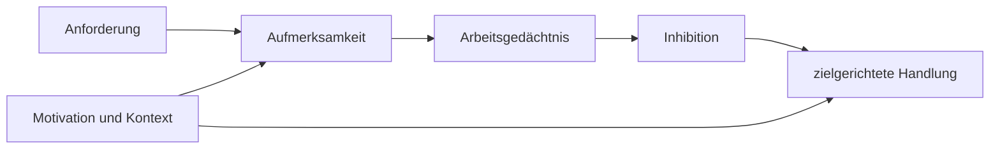

# Einheit 1 – Was ist ADHS?

## Lernziel

Du kannst ADHS als neuroentwicklungsbedingte Störung der Regulation von Aufmerksamkeit, Aktivität und Impulsen beschreiben.

## Erklärung

ADHS ist eine Neuroentwicklungsstörung. Die diagnostischen Kernbereiche sind Unaufmerksamkeit sowie Hyperaktivität und Impulsivität. Die konkrete Ausprägung variiert stark nach Person, Alter, Umgebung und Anforderungen.

Der Name kann irreführen: Viele Betroffene können sich unter passenden Bedingungen intensiv konzentrieren. Schwieriger ist häufig die **verlässliche, situationsangemessene Steuerung** von Fokus, Handlungsbeginn, Wechsel und Impulsen.

> [!evidence] Evidenz: Konsens / hoch
> ADHS ist weder mangelnde Intelligenz noch ein Beweis fehlender Anstrengung. Exekutive Schwierigkeiten sind häufig, aber weder bei allen Personen gleich noch diagnostisch spezifisch.

## Modell

## Verbindung zu Autismus und Parkinson

Querverbindungen werden nur dort gezogen, wo gemeinsame Funktionen oder Netzwerke das Verständnis verbessern. ADHS und Autismus sind Neuroentwicklungsstörungen; Parkinson ist neurodegenerativ. Ähnliche beteiligte Systeme bedeuten keine Gleichsetzung.

## Review-Frage

**Warum ist „Menschen mit ADHS können sich nicht konzentrieren“ ungenau?**

Antwort

Weil Konzentration möglich sein kann, ihre zuverlässige Steuerung aber stark von Aufgabe, Motivation, Reizlage und Kontext abhängt.

## Merksatz

> Komplexes Verhalten entsteht aus dem Zusammenspiel mehrerer Systeme – nicht aus einem einzelnen „Defekt“.

## Quelle

[[references/Faraone2021|Studienkarte Faraone2021]]

## Navigation

- Zurück: [[README|vorherige Einheit]]
- Weiter: [[01-Grundlagen/02-Inhibition-und-Handlungssteuerung|nächste Einheit]]
- [[Glossar]] · [[Literatur]] · [[knowledge-graph/README|Wissensgraph]]
