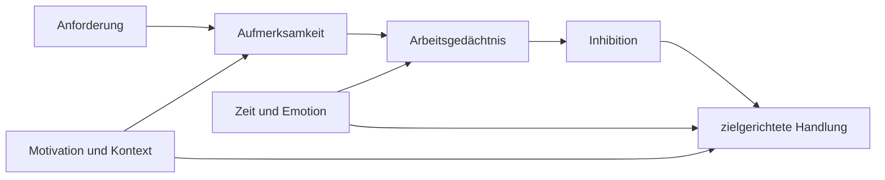

# Einheit 1 – Was ist ADHS?

## Lernziel

Du kannst ADHS als Neuroentwicklungsstörung beschreiben und zwischen diagnostischen Kernsymptomen, häufigen exekutiven Schwierigkeiten und individuellen Profilen unterscheiden. Außerdem verstehst du, warum „kann sich nicht konzentrieren“ keine ausreichende Definition ist.

## 1. Warum der Name leicht in die Irre führt

ADHS bedeutet Aufmerksamkeitsdefizit-/Hyperaktivitätsstörung. Der Name klingt, als fehle betroffenen Menschen Aufmerksamkeit grundsätzlich. Das trifft die klinische Realität nur schlecht. Viele Menschen mit ADHS können sich unter bestimmten Bedingungen sehr lange und intensiv konzentrieren – etwa bei Neuheit, starkem Interesse, unmittelbarer Rückmeldung oder hohem Zeitdruck. Schwieriger ist häufig die **zuverlässige, situationsangemessene Steuerung** der Aufmerksamkeit.

Dabei geht es gleichzeitig um mehrere Fragen:

- Kann ich den Fokus auf eine wenig interessante, aber wichtige Aufgabe richten?
- Kann ich ihn trotz konkurrierender Reize halten?
- Kann ich rechtzeitig aufhören und kontrolliert zu etwas anderem wechseln?
- Bleibt das aktuelle Ziel im Kopf, wenn eine Unterbrechung auftritt?
- Beginne ich eine Aufgabe, obwohl ihre Belohnung erst später eintritt?

ADHS ist daher nicht bloß „zu wenig Konzentration“. Es ist eine heterogene Neuroentwicklungsstörung mit den diagnostischen Kernbereichen Unaufmerksamkeit sowie Hyperaktivität und Impulsivität. Die Ausprägung verändert sich über die Lebensspanne und hängt stark von Anforderungen und Umgebung ab.

> [!evidence] Evidenz: Konsens / hoch
> ADHS wird anhand von Entwicklungsgeschichte, Symptomen und relevanter Beeinträchtigung in mehreren Lebensbereichen diagnostiziert. Ein einzelner Test, Laborwert oder Gehirnscan reicht dafür nicht aus.

## 2. Kernsymptome sind nicht dasselbe wie Erklärungsmodelle

Diagnostische Systeme beschreiben beobachtbare Verhaltensmuster. Forschung versucht zusätzlich zu erklären, welche kognitiven und neuronalen Mechanismen daran beteiligt sein könnten. Häufig untersucht werden:

- Inhibition,
- Arbeitsgedächtnis,
- Aufmerksamkeitsstabilität,
- Belohnungsverarbeitung,
- Zeitverarbeitung,
- Emotionsregulation.

Keiner dieser Bereiche erklärt ADHS allein. Manche Betroffene zeigen in Labortests deutliche Schwierigkeiten, andere nicht. Umgekehrt kommen ähnliche Schwierigkeiten auch bei Depression, Angst, Schlafmangel, Autismus, Traumafolgestörungen oder neurologischen Erkrankungen vor. Ein Mechanismus kann also relevant sein, ohne diagnostisch spezifisch zu sein.

Das ist methodisch wichtig: Ein durchschnittlicher Gruppenunterschied bedeutet nicht, dass jede einzelne Person mit ADHS dieses Merkmal besitzt. Ebenso kann eine Person erhebliche Alltagsprobleme haben, obwohl ein kurzer, gut strukturierter Test unauffällig ausfällt.

## 3. Neurobiologie ohne Märchenstunde

Die Forschung findet bei ADHS im Gruppenmittel Unterschiede in verteilten Hirnnetzwerken. Besonders häufig diskutiert werden frontostriatale, frontoparietale und Default-Mode-Netzwerke sowie die Regulation durch Dopamin und Noradrenalin.

Daraus folgt nicht:

- dass ein einzelner Bereich „defekt“ ist,
- dass ADHS einfach Dopaminmangel bedeutet,
- dass ein MRT die Diagnose stellen kann,
- dass Verhalten direkt aus einem Hirnbild ablesbar wäre.

Die Überlappung zwischen Personen mit und ohne ADHS ist groß. Bildgebung liefert wichtige Forschungshinweise, ist derzeit aber kein individueller Routinediagnosetest.

## 4. Warum Leistung so stark schwanken kann

Ein Mensch mit ADHS kann an einem Tag sehr leistungsfähig und am nächsten bei derselben Aufgabe blockiert sein. Das wirkt von außen widersprüchlich, ist aber mit einem Regulationsmodell vereinbar. Leistung hängt nicht nur vom Können ab, sondern auch von Interesse, Klarheit des nächsten Schrittes, Schlaf, emotionaler Belastung, Reizumgebung, unmittelbarer Rückmeldung und Zeitdruck.

Daraus folgt nicht, dass jede Schwierigkeit automatisch ADHS ist. Es erklärt aber, weshalb „Du konntest es gestern doch auch“ wissenschaftlich kein gutes Gegenargument ist. Die maximale Fähigkeit und ihre zuverlässige Verfügbarkeit sind zwei verschiedene Dinge.

## 5. Verbindung zu Autismus

ADHS und Autismus können gemeinsam auftreten. Überschneidungen bestehen unter anderem bei exekutiven Funktionen, Reizverarbeitung, Alltagsorganisation und emotionaler Regulation. Gleichzeitig bleiben die diagnostischen Kernbereiche verschieden.

Bei gemeinsamem Auftreten kann eine Person beispielsweise gleichzeitig Neuheit suchen und starke Vorhersagbarkeit benötigen. Das ist kein logischer Widerspruch, sondern kann aus mehreren Bedürfnissen entstehen, die je nach Situation unterschiedlich dominieren. Ein einzelnes neuropsychologisches Profil kann ADHS und Autismus nicht zuverlässig trennen.

## 6. Verbindung zu Parkinson

Parkinson ist eine neurodegenerative Erkrankung, ADHS eine Neuroentwicklungsstörung. Beide betreffen teilweise Systeme, in denen Dopamin, Basalganglien und Handlungssteuerung eine Rolle spielen. Der Vergleich kann Mechanismen verständlicher machen, darf aber nicht zu einer Gleichsetzung führen. Aus gemeinsamen beteiligten Botenstoffen folgt weder eine gemeinsame Ursache noch ein direkter Krankheitsverlauf.

## 7. Mini-Übung: Fähigkeit oder Regulation?

Wähle eine Aufgabe, die manchmal gut und manchmal schlecht funktioniert. Notiere zwei konkrete Situationen:

1. Wann gelang sie gut?
2. Wann gelang sie schlecht?

Vergleiche nicht nur Motivation oder vermeintliche „Disziplin“, sondern auch Schlaf, Reizlage, Interesse, Zeitdruck, Klarheit des nächsten Schrittes und emotionale Belastung. Ziel ist keine Selbstdiagnose, sondern ein präziseres Modell der Bedingungen, unter denen deine Leistung verfügbar ist.

## Review-Frage

**Warum ist „ADHS bedeutet, dass man sich nicht konzentrieren kann“ wissenschaftlich ungenau?**

Antwort

Weil Konzentrationsfähigkeit vorhanden sein kann, ihre zuverlässige Steuerung jedoch stark von Aufgabe, Kontext, Motivation, Zeit, Emotion und konkurrierenden Reizen abhängt. Außerdem zeigt sich ADHS nicht bei jeder Person gleich.

## Wissenschaftliche Quelle

[[references/Faraone2021|Faraone et al. 2021]] – internationales Konsensuspapier mit 208 evidenzbasierten Schlussfolgerungen zu ADHS.

## Merksatz

> ADHS beschreibt kein einheitlich schwaches Gehirn, sondern ein heterogenes Regulationsproblem in wechselnden Kontexten.

## Navigation

- Zurück: [[README|Übersicht]]
- Weiter: [[01-Grundlagen/02-Inhibition-und-Handlungssteuerung|Inhibition und Handlungssteuerung]]
- [[Glossar]] · [[Literatur]] · [[knowledge-graph/README|Wissensgraph]]
