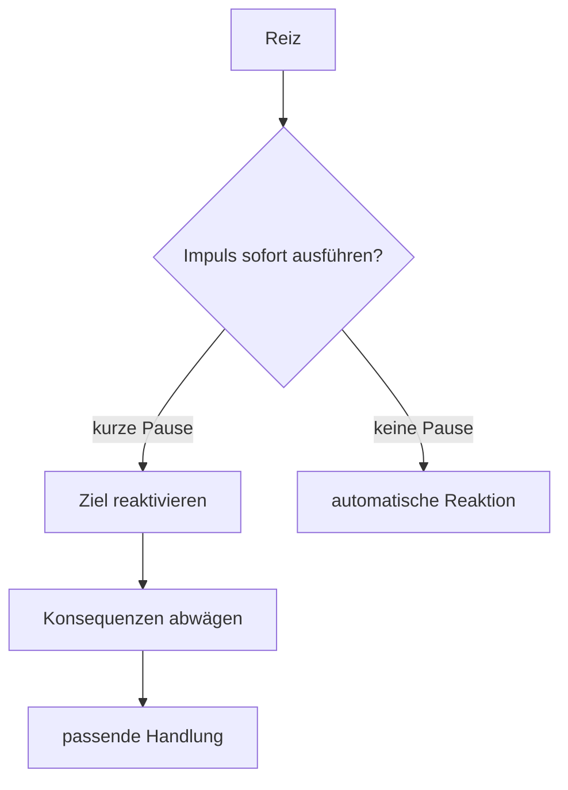

# Einheit 2 – Inhibition und Handlungssteuerung

## Lernziel

Du verstehst Inhibition als Teil eines verteilten Steuerungssystems. Du kannst erklären, warum Wissen nicht automatisch in Verhalten umgesetzt wird und weshalb eine gut gestaltete Umgebung häufig wirksamer ist als die Forderung nach „mehr Selbstkontrolle“.

## 1. Was Inhibition tatsächlich bedeutet

Inhibition wird gern als „innere Bremse“ bezeichnet. Die Metapher ist nützlich, solange man sie nicht zu wörtlich nimmt. Es gibt nicht eine einzelne Bremse im Gehirn. Inhibition umfasst mehrere Prozesse:

- eine bereits begonnene Reaktion stoppen,
- eine dominante Antwort unterdrücken,
- irrelevante Reize oder Gedanken abwehren,
- eine unmittelbare Reaktion zugunsten eines späteren Ziels verzögern,
- einen Aufgabenwechsel verhindern, der gerade nicht sinnvoll ist.

Bei ADHS zeigen Gruppenstudien häufig Schwierigkeiten in inhibitorischen Aufgaben. Die Befunde sind aber heterogen: Nicht jede betroffene Person ist in jedem Test auffällig, und Laboraufgaben bilden den Alltag nur teilweise ab.

> [!evidence] Evidenz: hoch, aber nicht diagnostisch spezifisch
> Inhibitorische Schwierigkeiten sind bei ADHS häufig. Sie kommen jedoch auch bei anderen psychischen und neurologischen Bedingungen vor und reichen allein nicht für eine Diagnose.

## 2. Warum Wissen nicht automatisch Verhalten wird

Eine Person kann genau wissen, was sie tun sollte, und es trotzdem im entscheidenden Moment nicht umsetzen. Zwischen Wissen und Verhalten liegen mehrere Schritte:

1. Die relevante Regel muss rechtzeitig erinnert werden.
2. Sie muss im Arbeitsgedächtnis aktiv bleiben.
3. Ein konkurrierender Impuls muss gehemmt werden.
4. Die spätere Konsequenz muss ausreichend Gewicht bekommen.
5. Die passende Handlung muss gestartet werden.

Ein Fehler kann an jeder Stelle auftreten. Deshalb ist „Du weißt es doch besser“ häufig eine richtige, aber praktisch nutzlose Feststellung.

## 3. Inhibition und Aufmerksamkeit

Ablenkung ist nicht nur ein Aufmerksamkeitsproblem. Damit der Fokus auf einer Aufgabe bleibt, müssen konkurrierende Reize regelmäßig an Einfluss verlieren. Das kann ein Geräusch sein, eine Nachricht, ein eigener Gedanke oder der Impuls, „nur kurz“ etwas anderes zu prüfen.

Je häufiger und stärker konkurrierende Reize auftreten, desto mehr Steuerungsarbeit ist nötig. Eine gute Umgebung reduziert diese Arbeit. Benachrichtigungen auszuschalten, den nächsten Schritt sichtbar zu machen oder ein störendes Gerät außer Reichweite zu legen ist kein Schummeln, sondern vernünftiges Systemdesign.

## 4. Inhibition und Motivation

Das unmittelbar Interessante besitzt oft einen Vorteil gegenüber dem langfristig Wichtigen. Je weiter eine Konsequenz in der Zukunft liegt, desto schwächer kann ihr Einfluss auf den aktuellen Moment werden. Inhibition arbeitet daher nicht unabhängig von Belohnungsverarbeitung.

Ein Beispiel:

- Die Aufgabe ist wichtig, aber langweilig.
- Das Handy bietet sofort Neuheit.
- Die spätere Erleichterung nach der Aufgabe ist abstrakt.
- Der Impuls zum Wechseln besitzt das stärkere Jetzt-Signal.

Die Lösung ist nicht immer „mehr bremsen“. Oft ist es wirksamer, die Aufgabe klarer, kürzer und rückmeldungsreicher zu gestalten.

## 5. Mini-Werkzeug: die kleinste Pause

Wenn du einen starken Wechsel-, Sende- oder Unterbrechungsimpuls bemerkst, stelle nur eine Frage:

> **Was war die eine nächste Handlung?**

Nicht: „Was ist mein gesamter Plan?“ Nicht: „Warum bin ich schon wieder so?“ Nur die nächste sichtbare Handlung.

Beispiele:

- Absatz zu Ende lesen,
- Datei speichern,
- Nachricht als Entwurf liegen lassen,
- Wasser holen und zurückkehren,
- Timer auf fünf Minuten stellen.

Die Pause schafft keine perfekte Kontrolle. Sie erhöht lediglich die Chance, dass das aktuelle Ziel wieder Einfluss erhält.

## 6. Verbindung zu Autismus

Auch bei Autismus werden exekutive Funktionen untersucht. Die Profile sind jedoch nicht sauber genug getrennt, um aus einem Inhibitionstest eine Diagnose abzuleiten. Bei gemeinsamem ADHS und Autismus können impulsiver Wechsel, starkes Festhalten an einem Fokus, Überlastung bei unerwarteten Veränderungen und Schwierigkeiten beim Filtern konkurrierender Reize zusammenwirken.

## 7. Verbindung zu Parkinson

Basalganglien sind an Handlungswahl, Initiierung und Hemmung beteiligt. Parkinson zeigt deutlich, dass diese Systeme nicht nur Bewegung, sondern auch kognitive Kontrolle beeinflussen. Die Ursache ist jedoch neurodegenerativ und damit grundsätzlich anders als bei ADHS.

## 8. Beobachtungsaufgabe

Beobachte heute einen einzigen Impuls, ohne ihn moralisch zu bewerten. Notiere:

- Auslöser,
- sofortiger Impuls,
- ursprüngliches Ziel,
- gewählte Handlung,
- was die Pause erleichtert oder verhindert hat.

Der Lerngewinn besteht im Erkennen der Prozesskette, nicht im perfekten Verhalten.

## Review-Frage

**Warum kann eine Person eine Regel kennen und sie trotzdem nicht rechtzeitig umsetzen?**

Antwort

Weil Wissen nur dann Verhalten steuert, wenn es rechtzeitig aktiviert wird, im Arbeitsgedächtnis bleibt, konkurrierende Impulse gehemmt werden und die passende Handlung genügend Gewicht erhält.

## Wissenschaftliche Quelle

[[references/Kofler2024|Kofler et al. 2024]] – aktueller Review zu exekutiven Funktionen bei ADHS und Autismus.

## Merksatz

> Inhibition ist keine Moralinstanz, sondern Teil eines verteilten Steuerungssystems.

## Navigation

- Zurück: [[01-Grundlagen/01-Was-ist-ADHS|Was ist ADHS?]]
- Weiter: [[01-Grundlagen/03-Dopamin-Belohnung-und-Motivation|Dopamin, Belohnung und Motivation]]
- [[Glossar]] · [[Literatur]] · [[knowledge-graph/README|Wissensgraph]]
