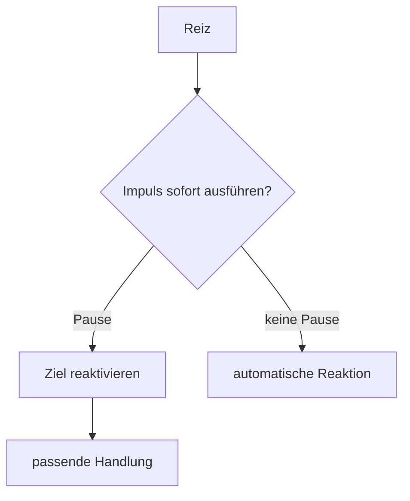

# Einheit 2 – Inhibition und Handlungssteuerung

## Lernziel

Du verstehst Inhibition als Hemmung konkurrierender Reaktionen zugunsten eines aktuellen Ziels.

## Erklärung

Inhibition umfasst das Stoppen begonnener Reaktionen, das Unterdrücken dominanter Antworten und das Abwehren irrelevanter Reize. Gruppenstudien finden bei ADHS häufig Schwierigkeiten, die Befunde sind aber heterogen.

Eine Regel kann verstanden sein und im entscheidenden Moment dennoch nicht handlungsleitend werden. Dafür muss sie aktiv bleiben, konkurrierende Reaktionen müssen gehemmt und die passende Handlung ausreichend aktiviert werden.

> [!note] Mini-Werkzeug
> **Stopp. Was war die eine nächste Handlung?**

## Modell

## Verbindung zu Autismus und Parkinson

Querverbindungen werden nur dort gezogen, wo gemeinsame Funktionen oder Netzwerke das Verständnis verbessern. ADHS und Autismus sind Neuroentwicklungsstörungen; Parkinson ist neurodegenerativ. Ähnliche beteiligte Systeme bedeuten keine Gleichsetzung.

## Review-Frage

**Warum kann eine Person eine Regel kennen und sie trotzdem nicht rechtzeitig umsetzen?**

Antwort

Weil Wissen nur dann Verhalten steuert, wenn es im Moment aktiv bleibt und konkurrierende Reaktionen gehemmt werden.

## Merksatz

> Komplexes Verhalten entsteht aus dem Zusammenspiel mehrerer Systeme – nicht aus einem einzelnen „Defekt“.

## Quelle

[[references/Kofler2024|Studienkarte Kofler2024]]

## Navigation

- Zurück: [[01-Grundlagen/01-Was-ist-ADHS|vorherige Einheit]]
- Weiter: [[01-Grundlagen/03-Dopamin-Belohnung-und-Motivation|nächste Einheit]]
- [[Glossar]] · [[Literatur]] · [[knowledge-graph/README|Wissensgraph]]
