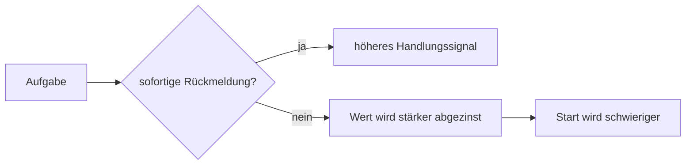

# Einheit 3 – Dopamin, Belohnung und Motivation

## Lernziel

Du kannst erklären, warum Dopamin kein Glückshormon ist und verzögerte Belohnungen anders gewichtet werden können.

## Erklärung

Dopamin ist an Lernen, Motivation, Anstrengungsbewertung, Bewegung und Handlungswahl beteiligt. „ADHS ist Dopaminmangel“ ist wissenschaftlich zu grob.

Beim **Delay Discounting** sinkt der subjektive Wert einer Belohnung mit ihrer Verzögerung. Bei ADHS wird im Gruppenmittel häufig stärkere Abwertung späterer Belohnungen beobachtet.

> [!note] Mini-Werkzeug
> Mache Fortschritt unmittelbar sichtbar: Häkchen, kurzer Log, definierter Mini-Abschluss oder gemessene Arbeitszeit.

## Modell

## Verbindung zu Autismus und Parkinson

Querverbindungen werden nur dort gezogen, wo gemeinsame Funktionen oder Netzwerke das Verständnis verbessern. ADHS und Autismus sind Neuroentwicklungsstörungen; Parkinson ist neurodegenerativ. Ähnliche beteiligte Systeme bedeuten keine Gleichsetzung.

## Review-Frage

**Warum reicht die langfristige Wichtigkeit einer Aufgabe oft nicht zum Start?**

Antwort

Weil Wissen über spätere Folgen nicht automatisch ein starkes gegenwärtiges Handlungssignal erzeugt.

## Merksatz

> Komplexes Verhalten entsteht aus dem Zusammenspiel mehrerer Systeme – nicht aus einem einzelnen „Defekt“.

## Quelle

[[references/Volkow2011|Studienkarte Volkow2011]]

## Navigation

- Zurück: [[01-Grundlagen/02-Inhibition-und-Handlungssteuerung|vorherige Einheit]]
- Weiter: [[01-Grundlagen/04-Arbeitsgedaechtnis|nächste Einheit]]
- [[Glossar]] · [[Literatur]] · [[knowledge-graph/README|Wissensgraph]]
