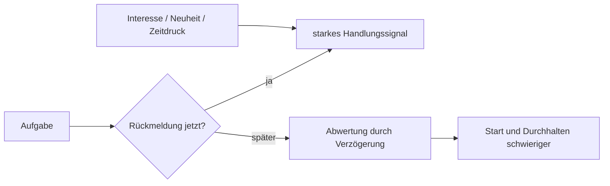

# Einheit 3 – Dopamin, Belohnung und Motivation

## Lernziel

Du kannst Dopamin wissenschaftlich korrekt einordnen und erklären, wie Verzögerung, Aufwand, Neuheit und Rückmeldung die Handlungsbereitschaft beeinflussen. Du verstehst außerdem, weshalb „ADHS ist Dopaminmangel“ keine ausreichende Erklärung ist.

## 1. Dopamin ist kein Glückshormon

Dopamin wird populär oft als „Glückshormon“ bezeichnet. Das ist zu simpel. Dopamin ist ein Neuromodulator, der unter anderem an Lernen aus Vorhersagefehlern, Erwartung und Bewertung von Belohnungen, Anstrengungsbereitschaft, Handlungswahl, Bewegung und Aktualisierung von Information beteiligt ist.

Die Aussage „ADHS ist Dopaminmangel“ ist ebenfalls zu grob. ADHS betrifft die Entwicklung und Regulation komplexer Netzwerke. Medikamente, Genetik, Rezeptoren, Transporter, Aufgabenbedingungen und verschiedene dopaminerge Bahnen lassen sich nicht auf einen einzigen Füllstand reduzieren.

> [!evidence] Evidenz: Modell gut gestützt, einfache Mangelthese unzureichend
> Dopaminerge Systeme sind für ADHS und seine Behandlung relevant. Daraus folgt keine einfache Formel „zu wenig Dopamin“.

## 2. Delay Discounting

Beim **Delay Discounting** sinkt der subjektive Wert einer Belohnung mit zunehmender Verzögerung. Zehn Euro heute können psychologisch attraktiver sein als fünfzehn Euro in einem Monat. Meta-analytisch findet man bei ADHS im Durchschnitt häufig eine stärkere Abwertung späterer Belohnungen.

Das bedeutet nicht, dass Menschen mit ADHS grundsätzlich kurzsichtig oder unreif sind. Es beschreibt eine statistische Tendenz unter bestimmten Aufgabenbedingungen. Individuelle Unterschiede sind groß, und Kontext kann die Entscheidung erheblich verändern.

## 3. Warum Wichtigkeit allein nicht genügt

Eine Aufgabe kann objektiv sehr wichtig sein und trotzdem kaum Handlungsenergie erzeugen. Typisch schwierig sind Aufgaben mit unklarem Anfang, langer Dauer, verzögerter Belohnung, wenig sichtbarem Fortschritt, hoher Fehlerunsicherheit oder monotoner Wiederholung.

Der Satz „Denk an die langfristigen Folgen“ setzt voraus, dass die Zukunft im aktuellen Moment stark genug repräsentiert wird. Genau das kann schwanken. Die Aufgabe ist bekannt, ihre Bedeutung ist verstanden – aber sie erhält im Wettbewerb mit unmittelbarer Neuheit nicht genügend Gewicht.

## 4. Motivation ist kontextabhängig

Motivation ist kein fester Charaktervorrat. Sie entsteht aus dem Zusammenspiel von Person, Aufgabe und Situation. Dass jemand bei einem interessanten Projekt stundenlang arbeitet, widerlegt Schwierigkeiten bei langweiligen oder unklaren Aufgaben nicht.

Auch Hyperfokus ist kein offizielles diagnostisches Kernkriterium und kein einheitlich definierter Mechanismus. Der Begriff beschreibt im Alltag häufig eine schwer unterbrechbare, stark gebundene Aufmerksamkeit. Wissenschaftlich sollte man vorsichtig bleiben und nicht jede intensive Beschäftigung als „Dopamin-Hyperfokus“ erklären.

## 5. Mini-Werkzeug: unmittelbare Rückmeldung

Verkürze die Schleife zwischen Handlung und Rückmeldung:

- fünf Minuten arbeiten statt „alles erledigen“,
- einen sichtbaren Fortschrittsbalken verwenden,
- nach jedem Abschnitt einen Stichpunkt notieren,
- Aufgaben in überprüfbare Endpunkte teilen,
- tatsächliche Arbeitszeit messen,
- einen klaren Abschluss definieren.

Die Rückmeldung muss nicht groß sein. Sie soll dem Gehirn zeigen, dass die Handlung **jetzt** Bedeutung besitzt. Das ist keine Bestechung, sondern eine Veränderung der Informationsstruktur der Aufgabe.

## 6. Verbindung zu Autismus

Bei Autismus wird ebenfalls Belohnungsverarbeitung untersucht. Die Befunde hängen stark davon ab, ob soziale, materielle, sensorische oder interessenbezogene Belohnungen verwendet werden. Bei gemeinsamem ADHS und Autismus können Neuheitssuche und ein starkes Bedürfnis nach Vorhersagbarkeit gleichzeitig auftreten. Ein einziges Motivationsmodell reicht deshalb selten aus.

## 7. Verbindung zu Parkinson

Bei Parkinson gehen dopaminproduzierende Nervenzellen vor allem in nigrostriatalen Bahnen verloren. Neben Bewegung können auch Motivation, Lernen und Impulskontrolle betroffen sein. Dopaminerge Medikamente können bestimmte Verhaltensweisen verbessern, aber auch Impulskontrollstörungen begünstigen.

Der Vergleich zeigt: Dopamin ist an Auswahl und Gewichtung von Handlungen beteiligt. Er zeigt nicht, dass ADHS eine frühe Parkinsonform wäre.

## 8. Beobachtungsaufgabe

Wähle eine aufgeschobene Aufgabe und notiere:

- Wie klar ist der erste Schritt?
- Wann kommt die erste Rückmeldung?
- Ist Fortschritt sichtbar?
- Welche unmittelbare Alternative konkurriert?
- Was würde die Rückmeldung zeitlich näher bringen?

Verändere nur einen Faktor und beobachte den Effekt. So lernst du mehr als durch das pauschale Urteil „Ich hatte keine Motivation“.

## Review-Frage

**Warum reicht die langfristige Wichtigkeit einer Aufgabe häufig nicht aus, um sie zu beginnen?**

Antwort

Weil langfristige Folgen nicht automatisch ein starkes gegenwärtiges Handlungssignal erzeugen. Verzögerung, Aufwand, Unsicherheit, Interesse und Rückmeldung beeinflussen den subjektiven Wert einer Handlung.

## Wissenschaftliche Quelle

[[references/Volkow2011|Volkow et al. 2011]] – Primärstudie zur Verbindung motivationaler Maße mit dopaminerger Belohnungsverarbeitung bei Erwachsenen mit ADHS; wichtig, aber keine Bestätigung einer simplen Dopaminmangelthese.

## Merksatz

> Motivation ist ein Zustand aus Gehirn, Aufgabe und Kontext – kein moralischer Besitz.

## Navigation

- Zurück: [[01-Grundlagen/02-Inhibition-und-Handlungssteuerung|Inhibition und Handlungssteuerung]]
- Weiter: [[01-Grundlagen/04-Arbeitsgedaechtnis|Arbeitsgedächtnis]]
- [[Glossar]] · [[Literatur]] · [[knowledge-graph/README|Wissensgraph]]
