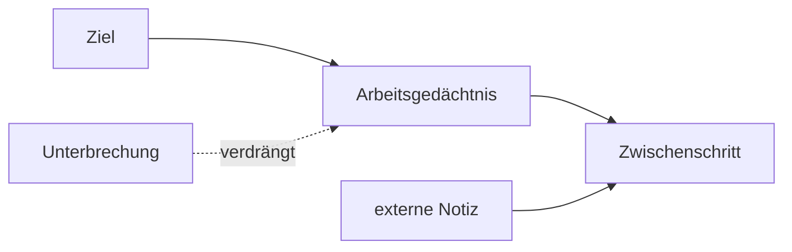

# Einheit 4 – Arbeitsgedächtnis

## Lernziel

Du kannst Kurzzeit- und Arbeitsgedächtnis unterscheiden und den Preis von Unterbrechungen erklären.

## Erklärung

Das Arbeitsgedächtnis hält Information aktiv und verarbeitet sie gleichzeitig: Ziel, nächsten Schritt, Zwischenresultate und Regeln.

Eine Unterbrechung kann den Fokus verschieben, Ziele verdrängen und den Wiedereinstieg zu einer neuen unklaren Aufgabe machen.

> [!note] Mini-Werkzeug
> Vor einer Unterbrechung genau einen Satz notieren: **Als Nächstes: …**

## Modell

## Verbindung zu Autismus und Parkinson

Querverbindungen werden nur dort gezogen, wo gemeinsame Funktionen oder Netzwerke das Verständnis verbessern. ADHS und Autismus sind Neuroentwicklungsstörungen; Parkinson ist neurodegenerativ. Ähnliche beteiligte Systeme bedeuten keine Gleichsetzung.

## Review-Frage

**Warum kann eine bekannte Aufgabe nach einer Unterbrechung plötzlich schwer fortzusetzen sein?**

Antwort

Weil Ziel und Zwischenschritt aus dem aktiven Arbeitsgedächtnis verschwunden sein können.

## Merksatz

> Komplexes Verhalten entsteht aus dem Zusammenspiel mehrerer Systeme – nicht aus einem einzelnen „Defekt“.

## Quelle

[[references/Kofler2020|Studienkarte Kofler2020]]

## Navigation

- Zurück: [[01-Grundlagen/03-Dopamin-Belohnung-und-Motivation|vorherige Einheit]]
- Weiter: [[01-Grundlagen/05-Aufmerksamkeit-und-Stabilitaet|nächste Einheit]]
- [[Glossar]] · [[Literatur]] · [[knowledge-graph/README|Wissensgraph]]
