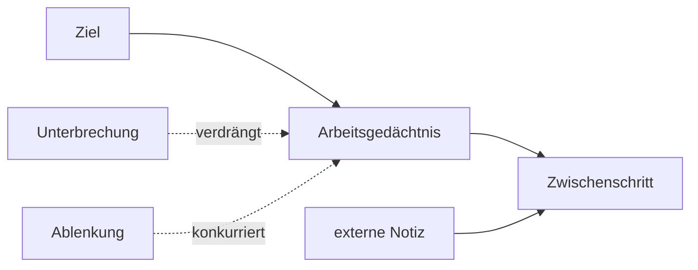

# Einheit 4 – Arbeitsgedächtnis

## Lernziel

Du kannst Kurzzeit- und Arbeitsgedächtnis unterscheiden und nachvollziehen, warum Unterbrechungen bei ADHS besonders teuer sein können. Du lernst außerdem, wie externe Zustandsinformationen den Wiedereinstieg erleichtern.

## 1. Kurzzeitgedächtnis und Arbeitsgedächtnis

Das Kurzzeitgedächtnis hält Information für kurze Zeit verfügbar. Das Arbeitsgedächtnis hält Information aktiv **und bearbeitet sie gleichzeitig**.

Beispiel Kurzzeitgedächtnis:

> „Der Code lautet 824917.“

Beispiel Arbeitsgedächtnis:

> „Merke 47, ziehe 9 ab und verwende das Ergebnis im nächsten Schritt.“

Im Alltag hält das Arbeitsgedächtnis das aktuelle Ziel, den nächsten Handlungsschritt, Zwischenergebnisse, relevante Regeln und Information darüber, was gerade ignoriert werden soll.

> [!evidence] Evidenz: gut gestützter Gruppenbefund
> Arbeitsgedächtnisschwächen werden bei ADHS häufig gefunden. Sie sind jedoch heterogen, nicht bei jeder Person vorhanden und nicht diagnostisch spezifisch.

## 2. Der geistige Schreibtisch

Eine hilfreiche Metapher ist ein kleiner Schreibtisch. Darauf liegen die Dinge, die gerade benötigt werden. Wird der Tisch überladen oder plötzlich abgeräumt, ist das Wissen nicht unbedingt verschwunden. Es ist nur nicht mehr aktiv verfügbar.

Diese Metapher erklärt, warum eine Person grundsätzlich genau wissen kann, wie eine Aufgabe funktioniert, und nach einer Unterbrechung trotzdem nicht mehr weiß, wo sie weitermachen sollte.

## 3. Warum Unterbrechungen teuer sind

Eine Unterbrechung kann mehrere Prozesse zugleich stören:

1. Die Aufmerksamkeit wechselt.
2. Das aktuelle Ziel verliert Aktivierung.
3. Ein Zwischenergebnis wird verdrängt.
4. Die ursprüngliche Aufgabe verliert ihren Wiedereinstiegspunkt.
5. Der Rückweg fühlt sich wie eine neue, unklare Aufgabe an.

Das erklärt die Erfahrung: „Ich weiß, wie es geht, aber ich weiß nicht mehr, wo ich war.“ Je komplexer die Aufgabe und je weniger sichtbare Zustandsinformation vorhanden ist, desto teurer wird der Wechsel.

## 4. Arbeitsgedächtnis und Unaufmerksamkeit

Wenn eine Information nicht aktiv bleibt, kann es von außen wie fehlende Aufmerksamkeit aussehen. Die Ursache kann aber unterschiedlich sein:

- Die Information wurde gar nicht aufgenommen.
- Sie wurde aufgenommen, aber verdrängt.
- Das Ziel blieb aktiv, doch ein Impuls gewann.
- Die Aufgabe war klar, aber der Handlungsstart gelang nicht.

Im Alltag treten diese Prozesse häufig gemeinsam auf. Eine einzige Erklärung reicht selten. Deshalb sollte man bei Fehlern nicht vorschnell unterstellen, jemand habe „nicht zugehört“.

## 5. Kapazität ist nicht der einzige begrenzende Faktor

Arbeitsgedächtnis wird häufig wie ein Behälter beschrieben, der bei manchen Menschen kleiner sei. Diese Vorstellung ist nur teilweise hilfreich. Leistung hängt nicht allein von einer festen Kapazität ab, sondern auch davon, wie gut Information strukturiert, geschützt und aktualisiert wird.

Drei Aufgaben mit derselben Wortzahl können sehr unterschiedlich schwer sein:

- Eine bekannte Reihenfolge lässt sich zu größeren Einheiten bündeln.
- Unverbundene Informationen müssen einzeln aktiv gehalten werden.
- Ähnliche Elemente können sich gegenseitig stärker stören.
- Emotionale Belastung oder parallele Gedanken beanspruchen zusätzliche Ressourcen.
- Unklare Anweisungen zwingen dazu, gleichzeitig die Aufgabe und ihre Bedeutung zu rekonstruieren.

Fachwissen entlastet das Arbeitsgedächtnis, weil einzelne Details zu sinnvollen „Paketen“ zusammengefasst werden können. Ein erfahrener Schachspieler erinnert keine zufälligen Figuren besser als andere Menschen, erkennt aber in realistischen Stellungen vertraute Muster. Im Alltag bedeutet das: Eine komplizierte Aufgabe wird nicht nur durch mehr Konzentration leichter, sondern auch durch bessere Struktur und Übung.

## 6. Zwischen Speicherung, Aktualisierung und Schutz unterscheiden

Ein Fehler kann entstehen, obwohl genügend Information aufgenommen wurde. Vielleicht wurde sie nicht rechtzeitig aktualisiert. Vielleicht blieb eine alte Regel aktiv, obwohl sich die Situation geändert hatte. Oder ein irrelevanter Gedanke verdrängte das aktuelle Ziel.

Diese Unterschiede sind praktisch relevant:

- Bei Aufnahmeproblemen hilft eine klarere oder langsamere Information.
- Bei Aktualisierungsproblemen helfen sichtbare Zwischenstände.
- Bei Interferenz helfen Reizreduktion und weniger parallele Aufgaben.
- Bei Wiedereinstiegsproblemen hilft ein konkreter Checkpoint.

Darum ist „Gedächtnis verbessern“ als Ziel zu unspezifisch. Besser ist die Frage: **An welcher Stelle verliert die Information ihre Funktion?**

Auch Arbeitsgedächtnistraining sollte vorsichtig bewertet werden. Menschen können in geübten Aufgaben besser werden, doch Verbesserungen übertragen sich nicht automatisch breit auf Schule, Beruf oder Alltag. Externe Hilfen und veränderte Aufgabenstrukturen sind deshalb keine zweitklassige Lösung, sondern häufig die direktere Intervention für das reale Problem.

## 7. Externes Arbeitsgedächtnis

Notizen, Checklisten, sichtbare Zwischenstände und vorbereitete Wiedereinstiege entlasten das Arbeitsgedächtnis. Das ist kein Zeichen kognitiver Schwäche. Komplexe technische Systeme verwenden ebenfalls Logs, Zustandsanzeigen und Checkpoints.

Das wirksamste Mini-Werkzeug ist ein einziger Satz:

> **Als Nächstes: [eine konkrete Handlung].**

Beispiel:

> Als Nächstes: Absatz 3 lesen und einen Stichpunkt notieren.

Nicht die gesamte Aufgabenplanung. Nur der exakte Wiedereinstieg. Eine lange Liste kann den Schreibtisch erneut überladen.

## 8. Verbindung zu Autismus

Auch bei Autismus können Arbeitsgedächtnis und andere exekutive Funktionen belastet sein. Die Ergebnisse hängen unter anderem von Sprache, Aufgabenart, Alter, Begleiterkrankungen und Messmethode ab. Bei gemeinsamem ADHS und Autismus können Ablenkbarkeit, Reizüberlastung und Schwierigkeiten beim Aufgabenwechsel zusammenwirken.

## 9. Verbindung zu Parkinson

Parkinson kann frontostriatale Funktionen und damit Arbeitsgedächtnis und kognitive Flexibilität beeinflussen. Die Beziehung zwischen Dopamin und Arbeitsgedächtnis ist wahrscheinlich nicht linear. „Mehr Dopamin“ bedeutet daher nicht automatisch „mehr Arbeitsgedächtnis“.

## 10. Mini-Experiment

Bevor du eine Aufgabe für fünf Minuten verlässt:

1. Notiere den letzten abgeschlossenen Schritt.
2. Notiere genau den nächsten Schritt.
3. Schließe unnötige Tabs oder Fenster.
4. Kehre später zurück und miss, wie lange der Wiedereinstieg dauert.

Vergleiche das mit einem Wiedereinstieg ohne Notiz. Das Ergebnis muss nicht spektakulär sein; es reicht, wenn der Zustandsverlust etwas kleiner wird.

## Review-Frage

**Warum kann eine bekannte Aufgabe nach einer Unterbrechung plötzlich schwer fortzusetzen sein?**

Antwort

Weil Ziel, Zwischenergebnis und nächster Schritt aus dem aktiven Arbeitsgedächtnis verschwunden sein können, obwohl das langfristig gespeicherte Wissen erhalten bleibt.

## Wissenschaftliche Quelle

[[references/Kofler2020|Kofler et al. 2020]] – Studie zur Differenzierung von Arbeitsgedächtnis- und Kurzzeitgedächtnisleistungen bei ADHS; ein relevanter Gruppenbefund, aber kein individueller Diagnosetest.

## Merksatz

> Vergessen bedeutet im Alltag häufig nicht „nicht gespeichert“, sondern „gerade nicht aktiv verfügbar“.

## Navigation

- Zurück: [[01-Grundlagen/03-Dopamin-Belohnung-und-Motivation|Dopamin, Belohnung und Motivation]]
- Weiter: [[01-Grundlagen/05-Aufmerksamkeit-und-Stabilitaet|Aufmerksamkeit und Stabilität]]
- [[Glossar]] · [[Literatur]] · [[knowledge-graph/README|Wissensgraph]]
