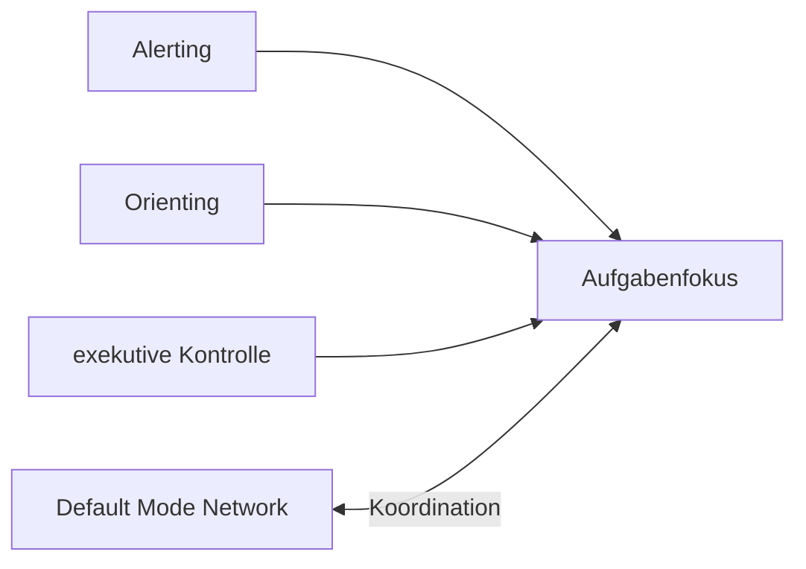

# Einheit 5 – Aufmerksamkeit und Stabilität

## Lernziel

Du kannst mehrere Aufmerksamkeitsfunktionen und die Bedeutung von Leistungsschwankungen unterscheiden.

## Erklärung

Aufmerksamkeit umfasst unter anderem Aktivierung, Orientierung und exekutive Kontrolle. ADHS erzeugt kein einheitliches Defizitprofil.

Häufig ist nicht nur die mittlere Leistung auffällig, sondern die **Reaktionszeitvariabilität**: gute Phasen und kurze Aussetzer liegen nebeneinander.

Das Default Mode Network ist kein Störnetzwerk; relevant ist seine zeitgerechte Koordination mit aufgabenbezogenen Netzwerken.

## Modell

## Verbindung zu Autismus und Parkinson

Querverbindungen werden nur dort gezogen, wo gemeinsame Funktionen oder Netzwerke das Verständnis verbessern. ADHS und Autismus sind Neuroentwicklungsstörungen; Parkinson ist neurodegenerativ. Ähnliche beteiligte Systeme bedeuten keine Gleichsetzung.

## Review-Frage

**Wie kann eine Person zeitweise ausgezeichnete Leistung und dennoch relevante Aufmerksamkeitsprobleme haben?**

Antwort

Weil die Schwierigkeit in Stabilität und Koordination liegen kann, nicht in einer konstanten Unfähigkeit.

## Merksatz

> Komplexes Verhalten entsteht aus dem Zusammenspiel mehrerer Systeme – nicht aus einem einzelnen „Defekt“.

## Quelle

[[references/Castellanos2006|Studienkarte Castellanos2006]]

## Navigation

- Zurück: [[01-Grundlagen/04-Arbeitsgedaechtnis|vorherige Einheit]]
- Weiter: [[01-Grundlagen/06-Zeitverarbeitung|nächste Einheit]]
- [[Glossar]] · [[Literatur]] · [[knowledge-graph/README|Wissensgraph]]
