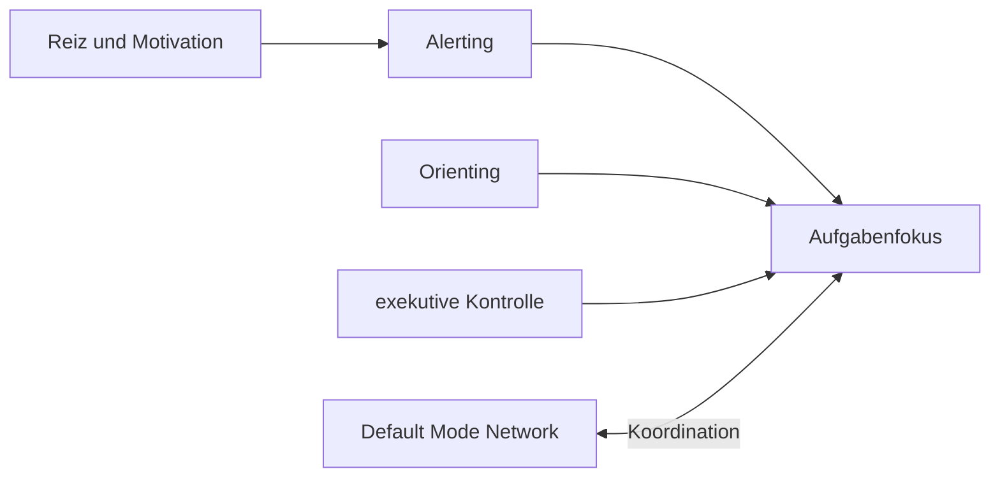

# Einheit 5 – Aufmerksamkeit und Stabilität

## Lernziel

Du kannst verschiedene Aufmerksamkeitsfunktionen unterscheiden und erklären, weshalb Schwankungen häufig wichtiger sind als ein einfacher Leistungsdurchschnitt. Außerdem verstehst du die Rolle des Default Mode Network, ohne es fälschlich als bloßes Störnetzwerk zu behandeln.

## 1. Aufmerksamkeit besteht aus mehreren Funktionen

Aufmerksamkeit ist kein einzelner Scheinwerfer. Ein verbreitetes Modell unterscheidet:

- **Alerting:** Wachheit und Bereitschaft,
- **Orienting:** Ausrichtung auf einen relevanten Reiz,
- **exekutive Kontrolle:** Durchsetzen wichtiger Information gegen Konflikt und Ablenkung.

ADHS kann diese Funktionen unterschiedlich beeinflussen. Es gibt kein einheitliches neuropsychologisches Profil, das bei allen Betroffenen auftritt.

> [!evidence] Evidenz: gut gestützt, aber stark heterogen
> Schwierigkeiten anhaltender und exekutiver Aufmerksamkeit werden bei ADHS häufig gefunden. Einzelne Aufmerksamkeitstests können ADHS jedoch weder beweisen noch ausschließen.

## 2. Schwankung statt dauerhafter Ausfall

Ein häufig berichteter Forschungsbefund ist eine erhöhte **intraindividuelle Reaktionszeitvariabilität**. Das bedeutet: Eine Person reagiert mehrfach normal oder schnell, dann tritt eine deutlich langsamere Reaktion oder ein kurzer Aussetzer auf.

Der Durchschnitt kann diese Dynamik verstecken. Zwei Personen können dieselbe mittlere Reaktionszeit besitzen, obwohl eine sehr gleichmäßig und die andere stark schwankend reagiert.

Das erklärt das scheinbare Paradox:

> „Ich konnte mich gestern zwei Stunden konzentrieren. Warum heute keine zehn Minuten?“

Weil die entscheidende Größe nicht nur Fähigkeit, sondern Stabilität unter den aktuellen Bedingungen ist.

## 3. Das Default Mode Network

Das Default Mode Network, kurz DMN, ist unter anderem beteiligt an innerlich gerichteten Gedanken, autobiografischer Verarbeitung, Zukunftsvorstellung und spontanem Gedankenschweifen.

Es ist kein schlechtes Netzwerk. Ohne inneres Denken wären Planung, Kreativität und Selbstreflexion kaum möglich. Problematisch kann lediglich das Timing seiner Aktivität in einer äußeren Aufgabe sein. Forschung untersucht, ob die Koordination zwischen DMN und aufgabenbezogenen Netzwerken bei ADHS verändert ist.

Bildgebungsbefunde sind Gruppenbefunde. Sie sind nicht präzise genug, um aus einem Scan eine individuelle Diagnose abzuleiten.

## 4. Aufmerksamkeit und Arbeitsgedächtnis

Eine kurze Aufmerksamkeitslücke kann genügen, damit das aktuelle Ziel aus dem Arbeitsgedächtnis fällt. Danach entsteht eine Kette:

1. Der Fokus schwankt.
2. Das Ziel verliert Aktivierung.
3. Ein anderer Reiz übernimmt.
4. Beim Zurückkehren fehlt der Einstiegspunkt.
5. Die ursprüngliche Aufgabe fühlt sich plötzlich unklar an.

Deshalb wirken Aufmerksamkeits- und Arbeitsgedächtnisprobleme im Alltag oft ähnlich. Die Ursachen sind dennoch nicht identisch.

## 5. Aufmerksamkeit und Motivation

Langweilige, vorhersehbare oder sehr lang laufende Aufgaben stellen andere Anforderungen als interessante, neue oder zeitkritische Tätigkeiten. Das bedeutet nicht, dass Aufmerksamkeit beliebig oder vollständig willentlich steuerbar ist. Es zeigt, dass Aktivierungsniveau, Reizwert und Rückmeldung die Leistung beeinflussen.

Ein sehr stimulierender Kontext kann die Aufmerksamkeit vorübergehend stabilisieren. Ein reizarmes Umfeld kann helfen, wenn Ablenkung das Hauptproblem ist. Bei manchen Aufgaben ist aber nicht weniger Reiz, sondern ein klareres und stärkeres Signal nötig.

## 6. Nicht jeder Aufmerksamkeitsfehler ist derselbe

Im Alltag wird vieles unter „unkonzentriert“ zusammengefasst, obwohl unterschiedliche Fehlerarten dahinterstehen können:

- Eine wichtige Information wurde gar nicht ausgewählt.
- Der Fokus war zunächst korrekt, brach aber später ab.
- Eine konkurrierende Information erhielt zu viel Gewicht.
- Die Person bemerkte das Abschweifen, fand aber nicht zurück.
- Die Aufgabe war verstanden, doch der Start blieb aus.
- Eine schnelle Reaktion führte zu einem Flüchtigkeitsfehler.

Diese Unterschiede verändern, welche Hilfe sinnvoll ist. Mehr Ruhe kann Ablenkung reduzieren, aber bei zu niedrigem Aktivierungsniveau sogar nachteilig sein. Ein Timer kann an den Fokus erinnern, hilft jedoch wenig, wenn der nächste Schritt unklar ist. Eine Checkliste verhindert Auslassungen, löst aber nicht automatisch Probleme beim Wechseln oder Beginnen.

## 7. Meta-Aufmerksamkeit: das Abschweifen bemerken

Aufmerksamkeit umfasst nicht nur den Fokus selbst, sondern auch das Bemerken, dass er verloren gegangen ist. Dieser metakognitive Schritt ist praktisch entscheidend. Wer eine Abweichung früh erkennt, kann mit geringem Aufwand zurückkehren. Wird sie erst nach zwanzig Minuten bemerkt, ist der ursprüngliche Aufgabenzustand möglicherweise vollständig verloren.

Daraus folgt ein realistischerer Trainingsgedanke: Das Ziel muss nicht „niemals abschweifen“ lauten. Sinnvoller sind drei getrennte Fähigkeiten:

1. Abschweifen möglichst früh bemerken.
2. Ohne lange Selbstkritik zum Ziel zurückkehren.
3. Einen sichtbaren Wiedereinstiegspunkt nutzen.

Selbstvorwürfe können den Rückweg verlängern, weil sie zusätzliche Gedanken und Emotionen aktivieren. Eine neutrale Markierung wie „abgewichen – zurück“ ist daher oft funktionaler als eine moralische Bewertung. Das macht Abschweifen nicht bedeutungslos; es behandelt es als regulierbaren Prozess statt als Charakterurteil.

## 8. Mini-Experiment: Stabilität messen

Wähle eine Aufgabe von fünf bis zehn Minuten. Notiere vorher genau ein Ziel. Mache jedes Mal einen kleinen Strich, wenn du merkst, dass dein Fokus abgewichen ist. Kehre dann ohne Bewertung zurück.

Am Ende fragst du:

- Wie oft ist der Fokus abgewichen?
- Wie schnell habe ich es bemerkt?
- Wie leicht war der Wiedereinstieg?
- Welche Reize waren besonders wirksam?
- War das Ziel eindeutig genug?

Der Erfolg besteht nicht darin, nie abzuschweifen. Der Erfolg besteht darin, den Prozess sichtbar zu machen und das Zurückkehren zu erleichtern.

## 9. Verbindung zu Autismus

Bei Autismus können Orientierung, Wechsel und Priorisierung von Reizen ebenfalls verändert sein. Gleichzeitig können bestimmte Interessen sehr stabilen Fokus erzeugen. Bei gemeinsamem ADHS und Autismus können leichte Ablenkbarkeit, sensorische Überlastung und starkes Festhalten an einem Fokus nebeneinander auftreten.

Ein einzelner Aufmerksamkeitstest kann diese komplexen Profile nicht ausreichend abbilden.

## 10. Verbindung zu Parkinson

Parkinson kann neben motorischen Symptomen Aufmerksamkeit und exekutive Kontrolle beeinflussen. Frontostriatale und dopaminerge Systeme spielen dabei eine Rolle. Die Ursachen und der Krankheitsverlauf unterscheiden sich jedoch grundlegend von ADHS.

## Review-Frage

**Wie kann eine Person zeitweise ausgezeichnete Leistung zeigen und dennoch relevante Aufmerksamkeitsprobleme haben?**

Antwort

Weil die Schwierigkeit in Stabilität und Koordination liegen kann. Gute Phasen und kurze Aussetzer können direkt nebeneinander auftreten, und Leistung hängt stark von Aufgabe, Aktivierung, Motivation und Umgebung ab.

## Wissenschaftliche Quelle

[[references/Castellanos2006|Castellanos et al. 2006]] – ein einflussreicher Review, der ADHS-Kognition über ein einzelnes Exekutivdefizit hinaus betrachtet; für aktuelle Detailfragen sollten neuere Reviews ergänzt werden.

## Merksatz

> Die entscheidende Frage lautet oft nicht „Kann ich aufpassen?“, sondern „Wie stabil bleibt mein Aufmerksamkeitssystem und wie gut finde ich zurück?“

## Navigation

- Zurück: [[01-Grundlagen/04-Arbeitsgedaechtnis|Arbeitsgedächtnis]]
- Weiter: [[01-Grundlagen/06-Zeitverarbeitung|Zeitverarbeitung]]
- [[Glossar]] · [[Literatur]] · [[knowledge-graph/README|Wissensgraph]]
