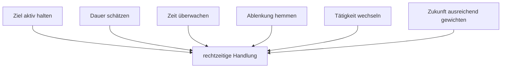

# Einheit 6 – Zeitverarbeitung

## Lernziel

Du kannst verschiedene Formen der Zeitverarbeitung unterscheiden und erklären, warum zeitgerechtes Verhalten mehr als eine „innere Uhr“ benötigt. Du lernst außerdem, Zeitprobleme als Zusammenspiel von Wahrnehmung, Gedächtnis, Motivation und Handlungssteuerung zu betrachten.

## 1. Es gibt nicht das eine Zeitgefühl

„Zeit wahrnehmen“ klingt wie eine einzelne Fähigkeit. Forschung unterscheidet jedoch mehrere Prozesse:

- **Zeitdiskrimination:** Welcher Zeitraum war länger?
- **Zeitschätzung:** Wie lange dauerte etwas?
- **Zeitproduktion:** Kannst du eine bestimmte Dauer erzeugen?
- **Zeitreproduktion:** Kannst du einen erlebten Zeitraum nachbilden?
- **prospektives Erinnern:** Erinnerst du dich während einer Tätigkeit daran, zu einem bestimmten Zeitpunkt etwas zu tun?
- **zeitliche Handlungsorganisation:** Beginnen, wechseln und beenden Handlungen rechtzeitig?

Diese Aufgaben belasten Aufmerksamkeit, Arbeitsgedächtnis, Entscheidung und motorische Reaktion unterschiedlich.

> [!evidence] Evidenz: Meta-Analyse / hoch
> Im Gruppenmittel zeigen Menschen mit ADHS relevante Unterschiede in verschiedenen Zeitverarbeitungsaufgaben. Die Stärke hängt unter anderem von Alter, Aufgabe und Arbeitsgedächtnis ab.

## 2. Warum „schlechte innere Uhr“ zu einfach ist

Eine einzige defekte Uhr wäre eine elegante Erklärung, aber wahrscheinlich zu grob. Um in zehn Minuten das Haus zu verlassen, muss das Gehirn gleichzeitig:

1. das Ziel aktiv halten,
2. die Dauer einzelner Schritte abschätzen,
3. den Zeitverlauf überwachen,
4. Ablenkungen hemmen,
5. eine interessante Tätigkeit abbrechen,
6. eine spätere Konsequenz rechtzeitig gewichten,
7. den Wechsel tatsächlich ausführen.

Ein Problem in einem oder mehreren dieser Bereiche kann im Alltag wie ein reines Zeitproblem erscheinen.

## 3. Unsichtbare Zeit

Zeit besitzt keinen natürlichen Fortschrittsbalken. Bei einer interessanten Tätigkeit liefert die Umwelt möglicherweise kaum Signale, dass bereits zwanzig Minuten vergangen sind.

Darum ist „Achte besser auf die Zeit“ oft ein schwacher Plan. Er verlangt ausgerechnet von dem System, das den Verlauf überwachen soll, sich selbst zuverlässig daran zu erinnern.

Hilfreicher sind externe Signale:

- Countdown statt bloßer Uhrzeit,
- Zwischenalarm statt nur Endalarm,
- sichtbarer Zeitbalken,
- klarer Start- und Endpunkt,
- gemessene statt gefühlte Aufgabendauer.

## 4. Zeit und Belohnung

Zeitverarbeitung ist eng mit Motivation verbunden. Je später eine Belohnung oder Konsequenz eintritt, desto schwächer kann ihr Einfluss auf den aktuellen Moment sein. Deshalb kann eine Person wissen, dass sie in einer Stunde losmuss, und trotzdem eine Tätigkeit beginnen, die schwer zu unterbrechen ist.

Das ist nicht bloß eine Fehleinschätzung der Minuten. Es kann auch eine Fehleinschätzung des Handlungswechsels und der späteren Konsequenz sein.

## 5. Zeit und Arbeitsgedächtnis

Ein Termin muss während anderer Tätigkeiten aktiv bleiben. Wird er aus dem Arbeitsgedächtnis verdrängt, ist die Uhrzeit zwar grundsätzlich bekannt, aber im aktuellen Moment nicht handlungsleitend.

Das erklärt, warum ein Kalendertermin allein nicht immer genügt. Ein Alarm kurz vor dem Termin kann die Information wieder aktivieren, aber wenn der Übergang mehrere Schritte benötigt, muss das Signal früh genug kommen.

## 6. Übergänge sind eigene Aufgaben

Menschen planen häufig nur die sichtbare Haupttätigkeit ein: duschen, fahren, telefonieren oder einen Bericht schreiben. Übersehen werden die Übergänge davor und danach. Doch „das Haus verlassen“ besteht beispielsweise aus Tätigkeit beenden, Material sichern, Kleidung wechseln, Dinge suchen, Weg prüfen und tatsächlich losgehen.

Wenn jeder Teilschritt nur wenige Minuten benötigt, kann die Summe trotzdem erheblich sein. Besonders problematisch ist ein Schritt mit unsicherer Dauer, etwa einen Schlüssel suchen oder eine interessante Tätigkeit sauber beenden. Die Verzögerung entsteht dann nicht zwingend durch eine falsche Schätzung des Weges, sondern durch nicht eingeplante Übergangsarbeit.

Ein hilfreiches Modell unterscheidet:

- **Arbeitszeit:** die eigentliche Tätigkeit,
- **Rüstzeit:** alles, was zum Start benötigt wird,
- **Wechselzeit:** das Beenden und mentale Umschalten,
- **Pufferzeit:** unvorhersehbare kleine Störungen.

Diese Kategorien machen Planung realistischer. Sie erklären auch, warum zwei scheinbar gleich lange Termine unterschiedlich belastend sein können. Ein Onlinegespräch benötigt vielleicht wenig Wegzeit, aber Vorbereitung, Technikprüfung und Erholung danach.

## 7. Schätzfehler werden durch Erinnerung verzerrt

Bei der Planung erinnern Menschen oft den idealen oder schnellsten Ablauf: „Wenn alles bereitliegt, dauert es fünf Minuten.“ Vergessen werden Unterbrechungen, Suchzeiten und die Tatsache, dass die Aufgabe selten unter Idealbedingungen startet.

Deshalb sollte die persönliche Referenz nicht aus dem besten Durchlauf stammen, sondern aus mehreren gemessenen Wiederholungen. Sinnvoll sind Median oder typischer Bereich statt einer einzigen Zahl. So entsteht aus einer moralischen Bewertung ein kalibrierbares Modell.

Ein weiterer Unterschied ist wichtig: **Dauer schätzen** und **rechtzeitig beginnen** sind getrennte Leistungen. Selbst eine korrekte Schätzung hilft nicht, wenn das Startsignal zu spät Einfluss erhält. Umgekehrt kann ein früher externer Startpunkt ungenaue Schätzungen teilweise abfangen.

## 8. Mini-Experiment: kalibrieren statt urteilen

Wähle eine kleine Alltagshandlung:

- Tee zubereiten,
- Geschirr einräumen,
- eine kurze Nachricht beantworten,
- den Schreibtisch grob freiräumen.

Dann:

1. Schätze die Dauer.
2. Miss die tatsächliche Dauer.
3. Notiere die Abweichung.
4. Wiederhole das einige Male.

Aus „Ich bin schlecht mit Zeit“ wird so eine konkrete persönliche Datenbasis:

> „Diese Aufgabe fühlt sich nach fünf Minuten an, dauert bei mir meistens zwölf.“

## 9. Verbindung zu Autismus

Bei Autismus sind Befunde zur Zeitverarbeitung gemischt. Unterschiede zeigen sich teils stärker in komplexen oder multisensorischen Aufgaben. Bei gemeinsamem ADHS und Autismus können Zeitverlust, Schwierigkeiten beim Wechsel und Belastung durch unerwartete Übergänge zusammenkommen.

## 10. Verbindung zu Parkinson

Basalganglien und Dopamin sind an motorischem und wahrnehmungsbezogenem Timing beteiligt. Bei Parkinson können bestimmte Timing-Aufgaben beeinträchtigt sein. Medikamenteneffekte sind jedoch nicht einheitlich und hängen von Aufgabe und Ausgangszustand ab.

## Review-Frage

**Warum lässt sich ein ADHS-bezogenes Zeitproblem nicht ausreichend mit einer „schlechten inneren Uhr“ erklären?**

Antwort

Weil zeitgerechtes Verhalten aus Zeitwahrnehmung, Aufmerksamkeit, Arbeitsgedächtnis, Inhibition, Motivation und Handlungswechsel entsteht. Eine Störung in mehreren dieser Prozesse kann gemeinsam auftreten.

## Wissenschaftliche Quelle

[[references/Metcalfe2024|Metcalfe et al. 2024]] – systematische Übersichtsarbeit und Meta-Analyse verschiedener Zeitverarbeitungsaufgaben über Altersgruppen hinweg.

## Merksatz

> Zeitmanagement beginnt nicht mit mehr Disziplin, sondern mit besserer Rückmeldung über tatsächliche Dauer und Übergänge.

## Navigation

- Zurück: [[01-Grundlagen/05-Aufmerksamkeit-und-Stabilitaet|Aufmerksamkeit und Stabilität]]
- Weiter: [[01-Grundlagen/07-Emotionsregulation|Emotionsregulation]]
- [[Glossar]] · [[Literatur]] · [[knowledge-graph/README|Wissensgraph]]
