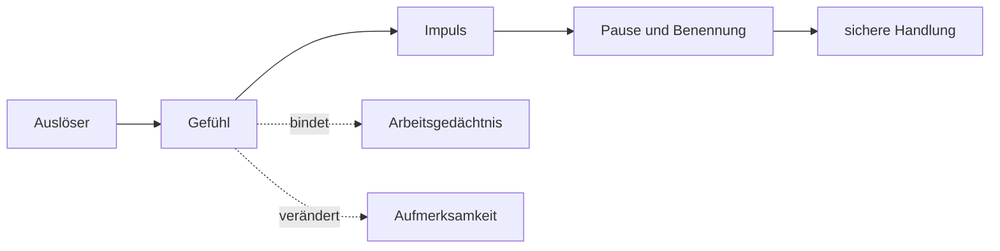

# Einheit 7 – Emotionsregulation

## Lernziel

Du kannst emotionale Reaktivität von Emotionsregulation unterscheiden und erklären, wie Gefühle Aufmerksamkeit, Arbeitsgedächtnis, Inhibition und Handlungswahl beeinflussen. Du verstehst außerdem, warum emotionale Dysregulation klinisch bedeutsam, aber kein exklusives ADHS-Merkmal ist.

## 1. Starke Gefühle sind nicht automatisch Dysregulation

Eine Emotion umfasst körperliche Aktivierung, subjektives Erleben, Gedanken, Handlungsimpulse und sichtbaren Ausdruck.

**Emotionale Reaktivität** beschreibt, wie schnell und stark dieses System anspringt.

**Emotionsregulation** beschreibt, wie Entstehung, Intensität, Dauer, Aufmerksamkeit, Ausdruck und Verhalten beeinflusst werden.

Ein Mensch kann starke Gefühle haben und sie gut regulieren. Umgekehrt kann eine mäßige Emotion problematisch werden, wenn sie sehr lange anhält oder unmittelbar das Verhalten übernimmt.

> [!evidence] Evidenz: Meta-Analyse / hoch
> Erwachsene mit ADHS zeigen im Gruppenmittel deutlich mehr Schwierigkeiten mit emotionaler Reaktivität und Regulation. Das Merkmal ist jedoch nicht spezifisch für ADHS.

## 2. Warum Gefühle Exekutivfunktionen verändern

Nehmen wir eine Nachricht, die als ungerecht oder abweisend erlebt wird:

1. Die Nachricht bindet Aufmerksamkeit.
2. Das Gehirn bewertet sie als Bedrohung oder Ablehnung.
3. Ärger, Angst oder Scham steigen.
4. Das Ziel „sachlich antworten“ wird schwerer zugänglich.
5. Der Impuls zur sofortigen Reaktion gewinnt.
6. Die unmittelbare Entlastung wirkt stärker als spätere Folgen.

Emotionen stehen also nicht außerhalb exekutiver Funktionen. Sie verändern die Bedingungen, unter denen diese Systeme arbeiten.

## 3. Zwei unterschiedliche Probleme

Es hilft, zwei Muster zu unterscheiden:

### Starke Reaktivität

Das Gefühl entsteht sehr schnell und intensiv.

> „Die Kritik fühlt sich sofort wie eine Katastrophe an.“

### Langsame Erholung

Die erste Reaktion ist verständlich, aber das System findet nur langsam zurück.

> „Ich weiß längst, dass die Sache klein war, aber mein Körper ist noch im Alarmzustand.“

Beide Muster können gemeinsam auftreten, müssen es aber nicht. Die Unterscheidung beeinflusst, welche Unterstützung sinnvoll ist.

## 4. Emotionen sind Daten, keine fertigen Urteile

Eine Emotion kann wichtige Information liefern:

- Ärger kann auf eine verletzte Grenze hinweisen.
- Angst kann Unsicherheit oder Gefahr anzeigen.
- Scham kann Zugehörigkeit oder Selbstbild betreffen.
- Traurigkeit kann Verlust signalisieren.

Aber eine Emotion ist keine vollständig geprüfte Tatsachenanalyse. Sie sagt eher „Bitte untersuchen“ als „Das Urteil ist rechtskräftig“.

## 5. Regulation beginnt vor dem Höhepunkt

Viele Regulationsversuche setzen erst ein, wenn die emotionale Aktivierung bereits sehr hoch ist. Dann sind Arbeitsgedächtnis, Perspektivwechsel und Inhibition oft besonders belastet. Es ist deshalb hilfreich, frühere Signale zu erkennen.

Mögliche Vorzeichen sind:

- beschleunigtes Sprechen,
- Muskelanspannung,
- enger werdender Aufmerksamkeitsfokus,
- wiederholtes Lesen derselben Nachricht,
- der Drang, sofort Klarheit oder Entlastung herzustellen,
- zunehmende Schwarz-Weiß-Bewertungen.

Keines dieser Zeichen ist spezifisch für ADHS. Sie können aber persönliche Marker dafür sein, dass der Handlungsspielraum kleiner wird.

Frühe Regulation bedeutet nicht, Gefühle zu unterdrücken. Sie kann darin bestehen, Zeit zu gewinnen, Reizlast zu senken, den Zustand zu benennen oder eine irreversible Handlung zu verschieben. Ein gespeicherter Entwurf, ein Ortswechsel oder eine vereinbarte Gesprächspause kann wirksamer sein als der Versuch, im Höhepunkt besonders vernünftig zu argumentieren.

## 6. Strategien wirken an unterschiedlichen Stellen

Regulationsstrategien sind nicht austauschbar. Sie greifen an verschiedenen Punkten des Prozesses an:

- **Situationswahl:** eine unnötig eskalierende Situation vermeiden,
- **Situationsveränderung:** Lärm reduzieren oder Gesprächsregeln vereinbaren,
- **Aufmerksamkeitslenkung:** den Fokus kurz auf Atmung oder Körperkontakt richten,
- **Neubewertung:** eine erste Interpretation als Hypothese statt Tatsache behandeln,
- **Reaktionsmodulation:** Senden, Schreien oder impulsives Handeln verzögern.

Nicht jede Strategie passt zu jeder Situation. Neubewertung ist wenig hilfreich, wenn eine reale Grenze verletzt wird. Rückzug kann sinnvoll sein, aber auch Probleme verlängern, wenn er jede notwendige Klärung verhindert. Regulation bedeutet daher nicht maximale Ruhe um jeden Preis, sondern flexibles Handeln passend zu Ziel, Sicherheit und Kontext.

Auch die zeitliche Reihenfolge ist wichtig. Zuerst kann körperliche Entlastung nötig sein, später erst eine kognitive Analyse. Die Forderung „Denk doch rational“ überspringt häufig diesen Zwischenschritt.

## 7. Mini-Werkzeug: Gefühl, Impuls und Handlung trennen

Notiere vier Zeilen:

1. **Auslöser**
2. **Gefühl und Stärke**
3. **Sofortiger Impuls**
4. **Kleinste sichere Handlung**

Beispiel:

> Auslöser: Die Nachricht klang abweisend.  
> Gefühl: Ärger 7/10, Unsicherheit 5/10.  
> Impuls: Sofort scharf antworten.  
> Handlung: Entwurf speichern und zehn Minuten nicht senden.

Der Trick ist nicht, das Gefühl wegzudiskutieren. Der Impuls wird beobachtbar, ohne sofort ausgeführt zu werden.

## 8. Andere mögliche Ursachen mitdenken

Emotionale Dysregulation kann durch viele Faktoren verstärkt werden:

- Depression,
- Angststörungen,
- Trauma,
- Schlafmangel,
- chronischer Stress,
- Substanzgebrauch,
- sensorische Überlastung,
- zwischenmenschliche Konflikte.

Deshalb sollte sie nicht automatisch vollständig ADHS zugeschrieben werden. Klinisch ist eine differenzierte Betrachtung nötig. Auch körperliche Faktoren wie Schmerz, Infekte, Unterzuckerung oder Medikamentennebenwirkungen können die Regulationsfähigkeit vorübergehend verschlechtern und sollten bei auffälligen Veränderungen mitbedacht werden.

## 9. Verbindung zu Autismus

Bei Autismus können sensorische Überlastung, unerwartete Veränderungen, kommunikative Missverständnisse und Schwierigkeiten beim frühen Erkennen des eigenen Zustands zur Dysregulation beitragen.

Bei gemeinsamem ADHS und Autismus sollte deshalb gefragt werden:

- Ist das Gefühl selbst das Hauptproblem?
- Oder zuerst Lärm, Hunger, Erschöpfung, Unklarheit oder ein unerwarteter Wechsel?

## 10. Verbindung zu Parkinson

Parkinson kann mit nichtmotorischen Symptomen wie Depression, Apathie, Impulskontrollstörungen und veränderter Emotionsverarbeitung einhergehen. Dopaminerge Medikamente können einige dieser Bereiche beeinflussen. Das verdeutlicht die Verbindung zwischen Motivation, Emotion und frontostriatalen Systemen, ohne Parkinson und ADHS gleichzusetzen.

## Review-Frage

**Warum ist emotionale Dysregulation nicht dasselbe wie „starke Gefühle haben“?**

Antwort

Weil nicht nur die Intensität zählt, sondern auch Geschwindigkeit, Dauer, Erholung und die Fähigkeit, unter emotionaler Belastung zielgerecht zu handeln.

## Wissenschaftliche Quelle

[[references/Beheshti2020|Beheshti et al. 2020]] – Meta-Analyse zur emotionalen Dysregulation bei Erwachsenen mit ADHS.

## Merksatz

> Das Gefühl ist real, der erste Impuls verständlich – die Handlung bleibt verhandelbar.

## Navigation

- Zurück: [[01-Grundlagen/06-Zeitverarbeitung|Zeitverarbeitung]]
- Weiter: [[README|Übersicht]]
- [[Glossar]] · [[Literatur]] · [[knowledge-graph/README|Wissensgraph]]
