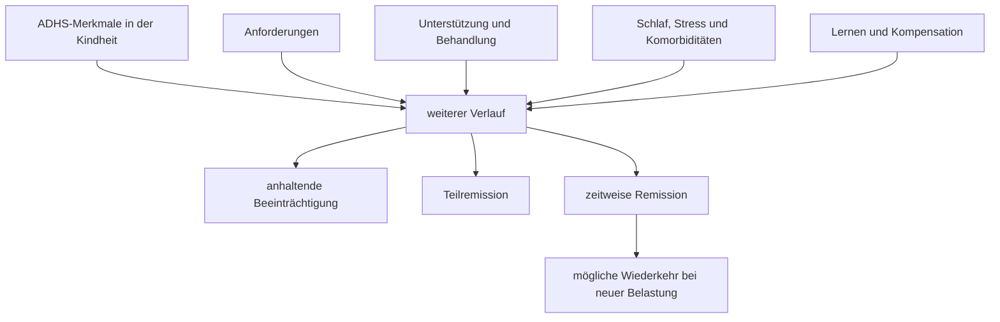

# Einheit 8 – Neuroentwicklung und Lebensspanne

## Lernziel

Du kannst erklären, was die Bezeichnung **Neuroentwicklungsstörung** bei ADHS bedeutet und was sie ausdrücklich nicht bedeutet. Du unterscheidest Symptomstärke, funktionelle Beeinträchtigung und Unterstützungsbedarf, ordnest Persistenz und Remission als veränderliche Verläufe ein und verstehst, warum eine späte Diagnose nicht automatisch einen Beginn im Erwachsenenalter belegt.

## 1. Neuroentwicklung ist ein Prozess, kein eingefrorener Zustand

ADHS wird als Neuroentwicklungsstörung eingeordnet. Damit ist gemeint, dass sich das zugrunde liegende Muster im Verlauf der Entwicklung ausbildet und frühe Lebensphasen betrifft. Der Begriff behauptet weder, dass das Gehirn irgendwann „fertig“ und unveränderlich wäre, noch dass jede Schwierigkeit von Geburt an sichtbar sein muss. Entwicklung entsteht aus dem Zusammenspiel biologischer Voraussetzungen, Lernen, Beziehungen, Umwelt, Anforderungen, Unterstützung und eigenen Strategien.

Bei ADHS müssen diagnostisch relevante Merkmale in der Kindheit begonnen haben. Sie können damals jedoch anders ausgesehen haben, geringer aufgefallen oder durch Struktur kompensiert worden sein. Ein Kind mit guter Unterstützung kann seine Materialien zuverlässig dabeihaben, weil Erwachsene jeden Übergang organisieren. Fällt diese äußere Struktur später weg, wird ein bereits vorhandenes Regulationsproblem deutlicher. Das ist kein sicherer Beweis für ADHS, aber ein Beispiel dafür, warum **sichtbarer Beginn** und **tatsächlicher Entwicklungsbeginn** nicht dasselbe sein müssen.

> [!evidence] Evidenz: Konsens / hoch
> ADHS ist eine heterogene Neuroentwicklungsstörung. Verlauf und sichtbare Ausprägung verändern sich, doch eine spätere Diagnose allein bedeutet nicht, dass die Störung erst im Erwachsenenalter entstanden ist.

## 2. Dieselben Kernbereiche können anders aussehen

Die diagnostischen Kernbereiche bleiben Unaufmerksamkeit sowie Hyperaktivität und Impulsivität. Ihre Erscheinungsform hängt jedoch von Alter, Lebensrolle und Umgebung ab.

Bei einem Kind kann Hyperaktivität als häufiges Aufstehen, Rennen oder lautes Dazwischenreden sichtbar werden. Im Erwachsenenalter kann dieselbe Dimension eher als innere Unruhe, dauerndes Beschäftigtsein, riskantes Schnellentscheiden oder Schwierigkeit erscheinen, in ruhigen Situationen abzuschalten. Unaufmerksamkeit zeigt sich in der Schule vielleicht durch vergessene Arbeitsblätter, später durch übersehene Fristen, verlorene Gesprächsfäden oder einen hohen organisatorischen Preis für scheinbar normale Ergebnisse.

Das bedeutet nicht, dass jedes kindliche Merkmal lediglich seine Form wechselt. Manche Symptome nehmen ab, andere bleiben, und neue Anforderungen können zuvor wenig bedeutsame Schwierigkeiten verstärken. Deshalb ist der Verlauf weder eine einfache Gerade noch bei allen Menschen gleich.

## 3. Symptome, Beeinträchtigung und Unterstützung sind drei verschiedene Größen

Für den Lebensverlauf müssen mindestens drei Ebenen getrennt werden:

- **Symptome:** Wie häufig treten unaufmerksame, hyperaktive oder impulsive Merkmale auf?
- **Beeinträchtigung:** Welche Folgen entstehen in Alltag, Bildung, Arbeit, Beziehungen, Gesundheit oder Selbstorganisation?
- **Unterstützung und Kompensation:** Welche äußeren Strukturen, Strategien oder Behandlungen fangen Schwierigkeiten ab?

Eine Person kann noch Symptome besitzen, aber in einer passenden Umgebung wenig beeinträchtigt sein. Eine andere Person erfüllt möglicherweise knapp weniger diagnostische Symptome, erlebt aber wegen hoher Anforderungen erhebliche Funktionsprobleme. Gute Kompensation kann außerdem unsichtbare Kosten erzeugen: übermäßige Arbeitszeit, Schlafverlust, ständige Angst vor Fehlern oder die Abhängigkeit von sehr strengen Routinen.

Darum ist die Frage „Ist ADHS noch da?“ oft zu grob. Präziser sind Fragen wie:

- Welche Merkmale bestehen fort?
- In welchen Lebensbereichen entstehen Folgen?
- Welche Unterstützung hält das System stabil?
- Wie hoch ist der Aufwand dieser Stabilität?
- Was geschieht bei Übergängen oder Belastung?

## 4. Verläufe sind häufig schwankend statt binär

Ältere Darstellungen behandelten den Verlauf oft wie einen Schalter: ADHS bleibt bestehen oder wird „ausgewachsen“. Langzeitdaten sprechen für ein beweglicheres Bild. Menschen können zeitweise deutlich unter diagnostischen Schwellen liegen und später erneut relevante Symptome oder Beeinträchtigungen zeigen. Vollständige, über viele Jahre stabile Remission kommt vor, scheint aber deutlich seltener zu sein als wechselnde Phasen.

Das Diagramm ist kein Schicksalsmodell. Es zeigt, warum ein einzelner Messzeitpunkt den langfristigen Verlauf nur unvollständig beschreibt. Eine gute Phase ist real und bedeutsam, beweist aber nicht zwingend dauerhafte Remission. Eine schlechte Phase bedeutet umgekehrt nicht automatisch, dass jede frühere Verbesserung „nur eingebildet“ war.

## 5. Remission muss genau definiert werden

**Remission** bedeutet, dass Symptome oder Beeinträchtigungen so weit zurückgegangen sind, dass festgelegte Kriterien nicht mehr erfüllt werden. Studien verwenden dafür unterschiedliche Definitionen. Das verändert ihre Ergebnisse.

Wichtige Unterscheidungen sind:

- **symptomatische Remission:** Die Zahl oder Stärke der Symptome liegt unter einer Schwelle.
- **funktionelle Remission:** Im Alltag bestehen keine klinisch relevanten Beeinträchtigungen.
- **Teilremission:** Ein Teil der Kriterien oder Probleme bleibt bestehen.
- **vollständige Remission:** Symptome und Beeinträchtigungen sind weitgehend zurückgegangen.
- **zeitweise Remission:** Kriterien werden in einer Phase nicht erfüllt.
- **anhaltende Remission:** Der Zustand bleibt über mehrere Messzeitpunkte stabil.

Eine Person kann symptomatisch gebessert sein und trotzdem erhebliche organisatorische Folgen erleben. Umgekehrt können vorhandene Symptome durch passende Arbeit, zuverlässige Hilfen und Behandlung so gut abgefangen werden, dass die funktionelle Belastung klein ist. Gute Forschung sollte daher nicht nur Symptome zählen, sondern auch Funktionsniveau, Kontext und Dauer berücksichtigen.

## 6. Warum Übergänge Schwierigkeiten sichtbar machen können

Lebensübergänge verändern gleichzeitig mehrere Bedingungen. Beim Wechsel von Schule zu Ausbildung oder Studium entfallen vielleicht feste Stundenpläne, tägliche Kontrolle und kurze Rückmeldeschleifen. Der Beruf verlangt möglicherweise langfristige Planung, parallele Projekte und selbstständige Priorisierung. Elternschaft, Pflegeaufgaben, Krankheit oder Schichtarbeit können Schlaf und verfügbare Kompensationszeit verändern.

Solche Übergänge „erzeugen“ nicht automatisch ADHS. Sie können aber die Differenz zwischen vorhandener Regulationsfähigkeit und neuen Anforderungen vergrößern. Dass Schwierigkeiten erst dann klinisch auffallen, ist daher mit einer frühen Neuroentwicklung vereinbar.

Gleichzeitig darf nicht jede neue Konzentrationsstörung rückwirkend zu ADHS erklärt werden. Depression, Angst, Trauma, Schlafstörungen, Substanzgebrauch, Medikamenteneffekte, hormonelle Veränderungen und körperliche oder neurologische Erkrankungen können ähnliche Beschwerden verursachen oder bestehende ADHS-Symptome verstärken. Die Entwicklungsgeschichte bleibt deshalb zentral.

## 7. Späte Diagnose ist nicht dasselbe wie später Beginn

Viele Erwachsene erhalten ihre erste Diagnose erst spät. Dafür gibt es plausible Gründe:

- Symptome wurden als Charaktereigenschaft missverstanden.
- Gute Leistungen verdeckten den hohen Aufwand.
- Familiäre oder schulische Struktur kompensierte Schwierigkeiten.
- Vorwiegend unaufmerksame Merkmale waren wenig störend für andere.
- Andere Probleme standen diagnostisch im Vordergrund.
- Wissen über ADHS bei Erwachsenen oder Frauen war begrenzt.

Der Begriff **Adult-onset ADHS** behauptet etwas Stärkeres: dass ein ADHS-ähnliches Syndrom erstmals im Erwachsenenalter entsteht, ohne relevante Vorgeschichte in der Kindheit. Diese Möglichkeit ist wissenschaftlich umstritten. In sorgfältigen wiederholten Untersuchungen ließen sich viele scheinbar spät beginnende Fälle durch zuvor übersehene oder unterschwellige Symptome, andere psychische Störungen, Substanzgebrauch oder unvollständige Einzelmessungen erklären.

Daraus folgt keine Regel, Erwachsenen ohne perfekte Schulzeugnisse oder Elternberichte eine Abklärung zu verweigern. Erinnerungen und Akten sind lückenhaft. Es folgt aber, dass eine neue Symptomatik besonders sorgfältig differentialdiagnostisch untersucht werden muss. **Spät erkannt** ist häufig; **sicher erst spät entstanden** ist wesentlich schwerer zu belegen.

## 8. Was sich für eine einzelne Person nicht vorhersagen lässt

Gruppenstudien beschreiben Wahrscheinlichkeiten, keine persönlichen Fahrpläne. Weder ein Gehirnscan noch ein einzelner Gentest, Aufmerksamkeitstest oder Kindheitssymptomwert kann heute zuverlässig sagen, ob eine bestimmte Person in zehn Jahren vollständige Remission, Teilremission oder anhaltende Beeinträchtigung erleben wird.

Auch Behandlungserfolg und günstige Umgebung dürfen nicht mit „Heilung bewiesen“ oder „ADHS war nie vorhanden“ verwechselt werden. Wenn eine Brille gutes Sehen ermöglicht, widerlegt das nicht die Sehschwäche. Die Analogie ist begrenzt, macht aber einen wichtigen Punkt sichtbar: Funktion entsteht aus Person **und** Hilfsmitteln **und** Anforderungen.

Besonders für höheres Erwachsenenalter ist die Datenlage dünner als für Kindheit, Jugend und frühes Erwachsenenalter. Bei neu auftretenden Gedächtnis-, Aufmerksamkeits- oder Antriebsproblemen im späteren Leben müssen daher auch körperliche, medikamentöse, depressive und neurologische Ursachen berücksichtigt werden.

## 9. Wissenschaftliche Einordnung

**Konsens:** ADHS beginnt entwicklungsbezogen früh, kann bis ins Erwachsenenalter fortbestehen und verändert seine sichtbare Form mit Alter und Kontext. Diagnose und Verlaufsbeurteilung benötigen Symptome, Beeinträchtigung und Entwicklungsgeschichte.

**Wahrscheinlich:** Viele Verläufe sind fluktuierend. Teilweise oder zeitweise Remission ist häufiger als ein dauerhaftes, vollständiges Verschwinden sämtlicher Symptome und Folgen.

**Umstritten:** Ein echtes erstmaliges Entstehen des klassischen ADHS-Syndroms im Erwachsenenalter. Späte Diagnose, fehlende frühe Dokumente und verspätete Beeinträchtigung reichen dafür allein nicht aus.

**Offen:** Welche Kombination biologischer, sozialer und klinischer Faktoren den individuellen Verlauf präzise vorhersagt. Vor allem ältere Erwachsene und vielfältige Lebenskontexte sind noch unzureichend untersucht.

## 10. Mini-Übung: zwei Lebensphasen vergleichen

Wähle zwei Lebensphasen, zum Beispiel Schulzeit und heutiger Alltag. Notiere für beide:

1. Welche Anforderungen bestanden an Planung, Aufmerksamkeit und Impulskontrolle?
2. Welche äußere Struktur war vorhanden?
3. Welche Person erinnerte, ordnete oder kontrollierte Abläufe?
4. Welche Schwierigkeiten waren sichtbar?
5. Welche Kosten blieben unsichtbar, etwa Überstunden, Schlafverlust oder ständige Anspannung?
6. Was änderte sich bei einem Übergang?

Die Übung stellt keine Diagnose. Sie hilft, Verlauf nicht nur als Liste von Fehlern, sondern als Beziehung zwischen Merkmalen, Anforderungen und Unterstützung zu betrachten.

## 11. Verbindung zu Autismus

ADHS und Autismus sind beide Neuroentwicklungsstörungen und können gemeinsam auftreten. Bei beiden können Anforderungen und Unterstützung bestimmen, wie sichtbar Beeinträchtigungen werden. Die Entwicklungsverläufe, diagnostischen Kernbereiche und individuellen Profile bleiben jedoch verschieden. Ein später Zusammenbruch von Kompensation beweist weder bei ADHS noch bei Autismus einen späten Beginn.

## 12. Verbindung zu Parkinson

Parkinson ist im Unterschied zu ADHS eine neurodegenerative Erkrankung. Symptome entstehen durch fortschreitende krankhafte Veränderungen, nicht durch denselben neuroentwicklungsbezogenen Verlauf. Im höheren Lebensalter können Aufmerksamkeit, Antrieb oder Exekutivfunktionen bei beiden Themen eine Rolle spielen; gerade deshalb ist die Unterscheidung wichtig. Neu auftretende Beschwerden dürfen nicht automatisch einer früheren ADHS-Diagnose zugeschrieben werden.

## Review-Frage

**Warum ist die Frage „Hat jemand ADHS ausgewachsen – ja oder nein?“ wissenschaftlich zu grob?**

Antwort

Weil Symptome, funktionelle Beeinträchtigung, Unterstützung und Anforderungen getrennte Größen sind und sich über die Zeit unterschiedlich verändern können. Verläufe können anhaltend, teilweise gebessert, zeitweise remittiert oder schwankend sein.

## Wissenschaftliche Quelle

[[references/Sibley2022|Sibley et al. 2022]] – longitudinale Auswertung der Multimodal Treatment Study of ADHD zu wechselnden Remissionsmustern über viele Jahre.

[[references/Sibley2018|Sibley et al. 2018]] – wiederholte, sorgfältige Prüfung scheinbar spät beginnender ADHS-Verläufe zwischen Jugend und frühem Erwachsenenalter.

[[references/Faraone2021|Faraone et al. 2021]] – internationales Konsensuspapier zur Einordnung von ADHS als Neuroentwicklungsstörung über die Lebensspanne.

## Merksatz

> ADHS entwickelt sich über die Lebensspanne: Nicht nur Merkmale verändern sich, sondern auch Anforderungen, Unterstützung und der Preis der Kompensation.

## Navigation

- Zurück: [[01-Grundlagen/07-Emotionsregulation|Emotionsregulation]]
- Weiter: [[01-Grundlagen/09-Diagnostische-Kriterien-und-Differentialdiagnostik|Diagnostische Kriterien und Differentialdiagnostik]]
- [[Glossar]] · [[Literatur]] · [[knowledge-graph/README|Wissensgraph]]
