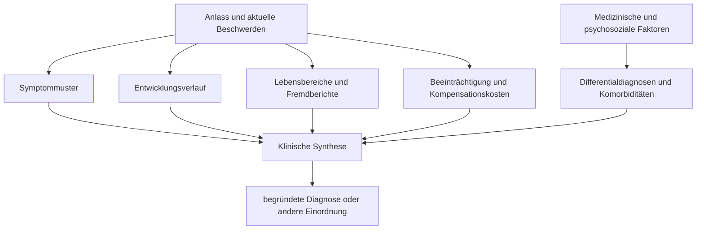

# Einheit 9 – Diagnostische Kriterien und Differentialdiagnostik

## Lernziel

Du kannst erklären, warum eine ADHS-Diagnose aus mehreren Informationsquellen und nicht aus einem einzelnen Test entsteht. Du unterscheidest Screening, diagnostische Kriterien, klinisch relevante Beeinträchtigung, Differentialdiagnostik und Komorbidität. Außerdem kannst du beschreiben, welche Befunde für ADHS sprechen, welche Alternativerklärungen geprüft werden müssen und weshalb widersprüchliche Angaben nicht einfach als „falsch“ aussortiert werden dürfen.

## 1. Eine Diagnose ist eine begründete klinische Synthese

ADHS wird klinisch diagnostiziert. Das bedeutet nicht, dass die Entscheidung beliebig oder bloß ein „Bauchgefühl“ wäre. Fachleute prüfen ein festgelegtes Muster aus Unaufmerksamkeit und/oder Hyperaktivität-Impulsivität, dessen Entwicklungsverlauf, Auftreten in wichtigen Lebensbereichen und funktionelle Folgen. Gleichzeitig untersuchen sie, ob andere Bedingungen die Beschwerden besser erklären oder zusätzlich vorliegen.

Ein einzelner Fragebogen, Aufmerksamkeitstest, Gehirnscan oder Gentest kann diese Synthese derzeit nicht ersetzen. Fragebögen können Symptome systematisch erfassen, Tests können bestimmte Leistungen unter standardisierten Bedingungen zeigen und medizinische Untersuchungen können Alternativerklärungen aufdecken. Keines dieser Werkzeuge beantwortet allein die gesamte Frage: **Besteht über die Entwicklung hinweg ein situationsübergreifendes, beeinträchtigendes ADHS-Muster, das nicht besser anders erklärt wird?**

> [!evidence] Evidenz: Leitlinien und internationaler Konsens / hoch
> Die Diagnose beruht auf klinischer und psychosozialer Beurteilung, Entwicklungsgeschichte, mehreren Lebensbereichen, Beeinträchtigung und der Prüfung koexistierender oder alternativer Erklärungen. Ratingskalen sind hilfreiche Zusatzinstrumente, aber keine alleinige Diagnosegrundlage.

## 2. Vier Säulen tragen die diagnostische Beurteilung

Die genaue Formulierung unterscheidet sich zwischen Klassifikationssystemen und Versorgungskontexten. Der gemeinsame Kern lässt sich in vier Säulen ordnen.

### Symptommuster

Es müssen ausreichend häufige und ausgeprägte Merkmale aus den Bereichen Unaufmerksamkeit und/oder Hyperaktivität-Impulsivität bestehen. Dabei zählt nicht nur, **ob** ein Verhalten vorkommt, sondern ob es im Verhältnis zu Alter, Entwicklungsstand und Situation auffällig ist. Fast alle Menschen vergessen gelegentlich Termine oder schieben unangenehme Aufgaben auf. Diagnostisch relevant wird ein Muster erst durch Häufigkeit, Dauer, Breite und Folgen.

### Entwicklungsverlauf

ADHS ist eine Neuroentwicklungsstörung. Deshalb wird nach frühen Hinweisen und einem nachvollziehbaren Verlauf gefragt. Kindheitsberichte, Zeugnisse oder Angaben von Angehörigen können nützlich sein, sind aber nicht immer verfügbar oder eindeutig. Fehlende Dokumente beweisen weder das Vorhandensein noch das Fehlen von ADHS. Entscheidend ist eine sorgfältige Rekonstruktion, die Erinnerungsfehler und spätere Umdeutungen mitbedenkt.

### Mehrere Lebensbereiche

Ein ADHS-typisches Muster soll nicht nur in einer einzigen, ungewöhnlich belastenden Situation auftreten. Untersucht werden etwa Familie, Schule, Ausbildung, Beruf, Beziehungen, Selbstorganisation oder Freizeit. Die sichtbare Form kann zwischen Bereichen stark variieren. Eine eng strukturierte Arbeit kann Schwierigkeiten verdecken, während unstrukturierte Hausarbeit sie deutlich macht. „Nicht überall gleich“ bedeutet daher nicht automatisch „nicht vorhanden“.

### Klinisch relevante Beeinträchtigung

Symptome und Beeinträchtigung sind nicht dasselbe. Eine Person kann viele Merkmale berichten, aber kaum funktionelle Nachteile erleben. Eine andere Person hält nach außen ein gutes Ergebnis, zahlt dafür jedoch einen hohen Preis durch Schlafmangel, Überstunden, Konflikte oder dauernde Krisenvermeidung. Diagnostik fragt deshalb nach konkreten Folgen, Unterstützungsbedarf und Kompensationskosten, nicht nur nach einer Punktzahl.

## 3. Screening ist eine Eingangstür, kein Richterspruch

Ein **Screening** soll mit vertretbarem Aufwand erkennen, bei wem eine ausführliche Abklärung sinnvoll sein könnte. Dafür werden häufig kurze Selbst- oder Fremdbeurteilungsbögen verwendet. Ein positives Screening erhöht den Verdacht, bestätigt aber keine Diagnose. Ein negatives Ergebnis senkt den Verdacht, kann ADHS jedoch nicht in jeder Person sicher ausschließen.

Warum? Die Antwort hängt unter anderem von Verständnis der Fragen, Vergleichsmaßstab, aktueller Belastung, Erinnerung und Selbstwahrnehmung ab. Depression kann Konzentrationsprobleme verstärken; eine stark strukturierte Umgebung kann Schwierigkeiten verdecken. Manche Menschen unterschätzen Probleme, andere suchen nach langer Überforderung besonders aufmerksam nach Erklärungen. Ein guter diagnostischer Prozess behandelt den Fragebogen deshalb als **Datenquelle**, nicht als Urteil.

Auch computergestützte Aufmerksamkeits- oder Aktivitätstests bilden nur einen Ausschnitt ab. Leistung in einer kurzen, neuartigen Testsituation kann vom Alltag abweichen. Umgekehrt können objektiv messbare Schwankungen wichtige Zusatzinformationen liefern. Der Sinn liegt in der Ergänzung der Gesamtbeurteilung, nicht in einer magischen Ja-Nein-Maschine.

## 4. Mehrperspektivität: Unterschiede zwischen Berichten sind Information

Bei Kindern stammen Angaben oft von Kind, Eltern und Schule; bei Erwachsenen können Partnerinnen, Partner, Angehörige, alte Dokumente oder frühere Behandelnde einbezogen werden, sofern Einwilligung und Verfügbarkeit gegeben sind. Verschiedene Perspektiven stimmen häufig nicht vollständig überein.

Das ist erwartbar. Lehrkräfte sehen Verhalten unter Gruppenregeln, Eltern eher Übergänge, Morgenroutinen und Hausaufgaben. Erwachsene kennen ihre innere Anstrengung besser als Außenstehende, während andere wiederkehrende Unterbrechungen oder organisatorische Folgen möglicherweise klarer beobachten. Statt einen Bericht vorschnell zum „richtigen“ zu erklären, wird gefragt:

- In welchem Kontext wurde das Verhalten beobachtet?
- Welche Anforderungen und Hilfen bestanden dort?
- Wie lange kennt die berichtende Person den Verlauf?
- Geht es um sichtbares Verhalten, inneres Erleben oder konkrete Folgen?
- Lassen sich Widersprüche durch Situation, Kompensation oder unterschiedliche Maßstäbe erklären?

Mehrperspektivität erhöht nicht automatisch die Wahrheit jeder einzelnen Angabe. Sie macht aber blinde Flecken und Kontextabhängigkeit sichtbar.

## 5. Differentialdiagnostik fragt nach besseren und zusätzlichen Erklärungen

**Differentialdiagnostik** bedeutet, systematisch andere Ursachen oder Störungsbilder zu prüfen, die ähnliche Beschwerden erzeugen können. Dabei gibt es zwei unterschiedliche Fragen:

1. Erklärt eine andere Bedingung das gesamte Muster besser als ADHS?
2. Besteht sie zusätzlich zu ADHS als Komorbidität?

Die zweite Möglichkeit ist häufig. Depression, Angst, Autismus, Lernstörungen, Schlafprobleme oder Substanzgebrauch schließen ADHS nicht automatisch aus. Umgekehrt darf nicht jedes Konzentrationsproblem als weiteres ADHS-Symptom verbucht werden. Entscheidend sind zeitlicher Verlauf, auslösende Bedingungen, spezifische Merkmale und funktionelle Zusammenhänge.

Typische Prüfbereiche sind:

- **Schlaf und körperliche Gesundheit:** Schlafmangel, Schlafapnoe, Schmerzen, Schilddrüsenerkrankungen, Anämie, Epilepsie oder Nebenwirkungen von Medikamenten können Aufmerksamkeit und Antrieb verändern.
- **Stimmung, Angst und Trauma:** Depression kann Tempo und Konzentration senken; Angst kann Aufmerksamkeit an Bedrohungen binden; Traumafolgen können Übererregung, Vermeidung oder Dissoziation verursachen.
- **Substanzen und Medikamente:** Intoxikation, Entzug, Selbstmedikation oder verschriebene Wirkstoffe können Symptome erzeugen, verstärken oder verdecken.
- **Andere Neuroentwicklungsprofile:** Autismus, Lernstörungen, intellektuelle Beeinträchtigung, Sprachentwicklungsstörungen und Ticstörungen können gemeinsam mit ADHS vorkommen und benötigen eigene Beurteilung.
- **Akute oder späte Veränderungen:** Neu auftretende Beschwerden nach zuvor stabilem Verlauf verlangen besondere Aufmerksamkeit für psychische, körperliche oder neurologische Ursachen.

Diese Liste ist keine Anleitung zur Selbstdiagnose und kein vollständiger medizinischer Katalog. Sie zeigt, weshalb eine seriöse Abklärung breiter sein muss als das Abhaken von ADHS-Merkmalen.

## 6. Zeitlicher Verlauf trennt ähnliche Momentaufnahmen

Viele Zustände können an einem einzelnen Tag ähnlich aussehen. Der Verlauf hilft bei der Unterscheidung. ADHS-Merkmale sind entwicklungsbezogen und typischerweise über längere Zeit erkennbar, auch wenn ihre Sichtbarkeit schwankt. Eine depressive Episode kann dagegen einen klareren Beginn und eine Veränderung gegenüber dem früheren Funktionsniveau zeigen. Schlafentzug kann Beschwerden mit Dienstplänen oder nächtlichen Atemproblemen verbinden. Eine manische Episode umfasst nicht bloß Ablenkbarkeit, sondern ein episodisches Gesamtbild mit deutlich veränderter Stimmung, Aktivität und Schlafbedürfnis.

Solche Muster sind keine einfachen Heimtests. Menschen können mehrere Bedingungen zugleich haben, und rückblickende Verläufe bleiben unsicher. Trotzdem verhindert die Zeitachse einen häufigen Fehler: ähnliche Oberflächenmerkmale automatisch als dieselbe Ursache zu behandeln.

## 7. Diagnostische Verzerrungen wirken in beide Richtungen

Untererkennung und Überzuschreibung können gleichzeitig vorkommen. Mädchen und Frauen werden nach Leitlinien häufiger übersehen oder zunächst anders eingeordnet. Ruhigere unaufmerksame Präsentationen, starke Anpassung, gute Leistungen oder internalisierte Probleme fallen Außenstehenden weniger auf als störendes Verhalten. Auch kulturelle Erwartungen, Sprachbarrieren, Armut und ungleicher Zugang zu Spezialversorgung beeinflussen, wer eine Abklärung erhält und wie Verhalten bewertet wird.

Gleichzeitig können populäre Darstellungen sehr unspezifische Erfahrungen als beweisend erscheinen lassen. Prokrastination, Vergesslichkeit oder gedankliches Abschweifen kommen bei ADHS vor, aber auch bei Stress, Schlafmangel und vielen anderen Bedingungen. Gute Diagnostik begegnet beiden Risiken mit derselben Methode: konkrete Beispiele, Entwicklung, mehrere Kontexte, Beeinträchtigung und Alternativerklärungen prüfen.

## 8. Wissenschaftliche Einordnung und Grenzen

**Konsens:** ADHS-Diagnostik ist eine fachlich geführte, mehrperspektivische klinische Beurteilung. Diagnostische Kriterien, Entwicklungsgeschichte, mehrere Lebensbereiche, relevante Beeinträchtigung und Differentialdiagnostik gehören zusammen. Fragebögen oder Beobachtungen dürfen nicht allein entscheiden.

**Wahrscheinlich:** Strukturierte Interviews, validierte Skalen und gezielt eingesetzte Leistungstests können Vollständigkeit und Nachvollziehbarkeit verbessern, wenn sie in eine gute klinische Beurteilung eingebettet sind.

**Umstritten:** Wie selten ein tatsächlicher erstmaliger ADHS-Beginn im Erwachsenenalter ist und wie frühe Hinweise bei fehlenden Dokumenten am zuverlässigsten rekonstruiert werden. Eine späte Diagnose ist jedenfalls nicht mit einem späten Beginn gleichzusetzen.

**Experimentell und offen:** Bildgebung, Genetik, digitale Verhaltensmessung und maschinelles Lernen werden als Zusatzhilfen erforscht. Derzeit liefern sie keine allgemein anerkannte individualdiagnostische Abkürzung, die Anamnese und Differentialdiagnostik ersetzt.

## 9. Mini-Übung: Aus einer Beschwerde prüfbare Fragen machen

Wähle eine neutrale Beobachtung, zum Beispiel „Ich vergesse Termine“. Teile ein Blatt in vier Spalten:

1. **Konkretes Verhalten:** Welche Termine, wie häufig, seit wann?
2. **Kontext:** Wo tritt es auf, wo nicht, welche Hilfen verändern es?
3. **Folgen:** Welche tatsächlichen Nachteile oder Kompensationskosten entstehen?
4. **Mögliche Einflüsse:** Schlaf, Stimmung, Stress, Substanzen, Medikamente oder körperliche Veränderungen.

Die Übung ergibt keine Diagnose. Sie zeigt, wie aus einem unspezifischen Etikett Informationen werden, die eine fachliche Abklärung präziser machen können.

## 10. Verbindung zu Autismus

ADHS und Autismus können gemeinsam diagnostiziert werden. Überschneidungen bestehen etwa bei Exekutivfunktionen, Reizregulation und Alltagsorganisation. Für Autismus werden jedoch zusätzlich entwicklungsbezogene Besonderheiten sozialer Kommunikation sowie eingeschränkte oder repetitive Verhaltens- und Interessenmuster geprüft. Dasselbe Verhalten kann unterschiedliche Funktionen haben: Ein Gesprächsabbruch kann aus Ablenkbarkeit, sensorischer Überlastung, Missverständnissen, Angst oder mehreren Faktoren entstehen. Differentialdiagnostik sucht daher nicht nur nach dem sichtbaren Verhalten, sondern nach Verlauf, Kontext und Funktion.

## 11. Verbindung zu Parkinson

Parkinson ist eine neurodegenerative Erkrankung und keine Variante von ADHS. Bei neu auftretender Verlangsamung, Antriebsänderung, Aufmerksamkeitsstörung oder motorischen Zeichen im späteren Leben müssen neurologische, medikamentöse und andere medizinische Ursachen geprüft werden. Eine frühere ADHS-Diagnose darf solche Veränderungen nicht automatisch erklären. Umgekehrt sagt eine oberflächliche Ähnlichkeit einzelner exekutiver Schwierigkeiten nichts über denselben Krankheitsmechanismus aus.

## Review-Frage

**Warum kann ein deutlich erhöhter ADHS-Fragebogenwert weder die Diagnose beweisen noch bedeutungslos sein?**

Antwort

Weil er ein relevantes Symptommuster anzeigen und eine ausführliche Abklärung begründen kann, aber Entwicklung, Lebensbereiche, Beeinträchtigung, Beobachterberichte, Komorbiditäten und Alternativerklärungen nicht allein prüft.

## Wissenschaftliche Quelle

[[references/WHO2024|World Health Organization 2024]] – aktuelles globales ICD-11-Handbuch mit klinischen Beschreibungen und diagnostischen Anforderungen.

[[references/NICE2018|NICE 2018, fortlaufend aktualisiert]] – Leitlinie zur fachlich geführten Diagnostik, Mehrperspektivität, Beeinträchtigung und Rolle von Ratingskalen.

[[references/Faraone2021|Faraone et al. 2021]] – internationales Konsensuspapier zur Evidenzbasis, Heterogenität und klinischen Einordnung von ADHS.

## Merksatz

> ADHS-Diagnostik zählt nicht nur Symptome: Sie verbindet Entwicklung, Kontexte, Folgen und Alternativerklärungen zu einer überprüfbaren Gesamteinschätzung.

## Navigation

- Zurück: [[01-Grundlagen/08-Neuroentwicklung-und-Lebensspanne|Neuroentwicklung und Lebensspanne]]
- Weiter: [[README|Übersicht]]
- [[Glossar]] · [[Literatur]] · [[knowledge-graph/README|Wissensgraph]]
