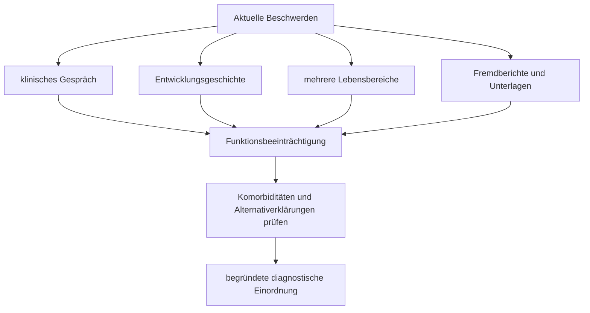

# Einheit 9 – Diagnostische Kriterien und Differentialdiagnostik

## Lernziel

Du kannst erklären, warum eine ADHS-Diagnose aus mehreren Informationsquellen entsteht und nicht aus einem einzelnen Fragebogen, Konzentrationstest oder Gehirnscan. Du unterscheidest diagnostische Kriterien, funktionelle Beeinträchtigung, Differentialdiagnosen und Komorbiditäten. Außerdem kannst du beschreiben, welche Verlaufsmerkmale dafür sprechen, ähnliche Beschwerden genauer auf andere oder zusätzliche Ursachen zu prüfen.

## 1. Eine Diagnose ist eine begründete klinische Einordnung

Viele Menschen kennen einzelne ADHS-Merkmale: Dinge werden verlegt, Aufgaben bleiben liegen, Gespräche reißen ab, Entscheidungen fallen vorschnell oder innere Unruhe erschwert ruhige Tätigkeiten. Solche Erfahrungen sind jedoch nicht automatisch eine Störung. Aufmerksamkeit, Aktivitätsniveau und Impulskontrolle sind dimensionale Eigenschaften: Sie unterscheiden sich zwischen Menschen und schwanken bei derselben Person mit Schlaf, Stress, Interesse, Umgebung und Gesundheit.

Eine Diagnose beantwortet deshalb nicht bloß die Frage, ob bestimmte Merkmale vorkommen. Sie prüft ein **anhaltendes Muster**, dessen Ausprägung zum Entwicklungsstand passen muss, in wichtigen Lebensbereichen auftritt und relevante Beeinträchtigungen verursacht. Hinzu kommt die Entwicklungsgeschichte: Das Muster muss in der Kindheit begonnen haben, auch wenn es damals anders aussah, kompensiert wurde oder erst rückblickend erkennbar ist. Schließlich muss geprüft werden, ob eine andere Erklärung die Beschwerden besser erfasst.

> [!evidence] Evidenz: Leitlinienkonsens / hoch
> Eine fachgerechte ADHS-Diagnostik verbindet klinisches und psychosoziales Gespräch, Entwicklungs- und psychiatrische Anamnese, Informationen aus mehreren Lebensbereichen, Fremdberichte soweit verfügbar sowie die Prüfung körperlicher und psychischer Alternativerklärungen.

Die Diagnose ist damit weder ein Charakterurteil noch eine mathematische Summe ohne Kontext. Sie ist eine überprüfbare klinische Hypothese: Passt das gesamte zeitliche, funktionelle und situative Muster besser zu ADHS als zu konkurrierenden Erklärungen?

## 2. Vier Säulen der diagnostischen Kriterien

Die Klassifikationssysteme DSM-5 beziehungsweise DSM-5-TR und ICD-11 unterscheiden sich in Einzelheiten, teilen aber vier Grundgedanken.

### Kernmerkmale

Es müssen ausreichend ausgeprägte Merkmale aus den Bereichen **Unaufmerksamkeit** und/oder **Hyperaktivität-Impulsivität** vorliegen. Die sichtbare Form verändert sich mit dem Alter. Rennen und häufiges Aufstehen können im Erwachsenenalter eher als innere Getriebenheit, ständiges Beschäftigtsein oder Schwierigkeit erscheinen, Ruhe auszuhalten. Deshalb zählt nicht nur die wörtliche Kindheitsform eines Symptoms, sondern seine altersangemessene Erscheinung.

### Entwicklungsgeschichte

ADHS ist eine Neuroentwicklungsstörung. Relevante Merkmale beginnen daher entwicklungsbezogen früh. Eine späte Diagnose ist möglich, aber ein plötzliches erstmaliges Auftreten im Erwachsenenalter verlangt besondere Vorsicht. Fehlende Zeugnisse oder ungenaue Erinnerungen widerlegen ADHS nicht; sie erhöhen jedoch die Bedeutung einer sorgfältigen Rekonstruktion mit Beispielen, Lebensübergängen und verfügbaren Fremdinformationen.

### Mehrere Lebensbereiche

Das Muster soll in mehr als einem bedeutsamen Kontext erkennbar sein, etwa Familie, Schule, Ausbildung, Beruf oder soziale Beziehungen. Das bedeutet nicht, dass die Schwierigkeiten überall gleich stark sein müssen. Eine hoch strukturierte Umgebung kann viel kompensieren, während ein offener, reizreicher oder selbstorganisierter Kontext Probleme sichtbar macht. Ein einziges Konfliktfeld spricht dagegen eher dafür, auch lokale Ursachen dieses Feldes zu untersuchen.

### Klinisch relevante Beeinträchtigung

Symptome und Beeinträchtigung sind nicht identisch. Eine Person kann zahlreiche Merkmale berichten, aber durch passende Strukturen kaum eingeschränkt sein. Eine andere kann mit weniger sichtbaren Symptomen hohe Kosten tragen: extreme Arbeitszeit, Schlafverlust, dauernde Angst vor Fehlern, wiederholte Beziehungsprobleme oder Verlust von Ausbildungs- und Arbeitschancen. Diagnostisch zählt daher nicht nur Häufigkeit, sondern auch die Wirkung auf Funktion, Teilhabe und Lebensqualität.

## 3. Warum mehrere Informationsquellen gebraucht werden

Selbstberichte sind unverzichtbar, aber nicht vollkommen. Menschen können Schwierigkeiten unterschätzen, weil sie sie für normal halten, oder überschätzen, weil eine aktuelle Krise den Rückblick färbt. Eltern, Partnerinnen, Partner, Lehrkräfte, Schulzeugnisse und frühere Befunde liefern zusätzliche Perspektiven. Auch diese Quellen können sich irren oder nur einen bestimmten Kontext sehen.

Gute Diagnostik sucht deshalb nicht nach einer einzigen „wahren“ Stimme. Sie prüft, **warum** Angaben übereinstimmen oder voneinander abweichen. Ein Jugendlicher kann in der Schule ruhig wirken, zu Hause aber nach stundenlanger Selbstkontrolle zusammenbrechen. Eine Erwachsene kann im Beruf zuverlässig sein, weil sie jede Aufgabe doppelt kontrolliert, während Haushalt und Erholung kollabieren. Unterschiedliche Berichte können dadurch selbst diagnostische Information enthalten.

Standardisierte Fragebögen können Symptome systematisch erfassen und den Vergleich mit Normgruppen unterstützen. Sie sind jedoch **Screening- oder Zusatzinstrumente**, keine eigenständige Diagnose. Ein hoher Wert kann auch bei Depression, Angst, Schlafmangel oder anderen Belastungen entstehen. Ein niedriger Wert kann bei Kompensation, Missverständnissen, unpassenden Normen oder schwankender Symptomatik vorkommen.

## 4. Konzentrationstests und Gehirnscans beantworten andere Fragen

Neuropsychologische Tests messen unter kontrollierten Bedingungen beispielsweise Aufmerksamkeit, Arbeitsgedächtnis, Reaktionshemmung oder Reaktionszeitvariabilität. Solche Tests können bei bestimmten Fragestellungen nützlich sein, etwa zur Abklärung von Lernstörungen, intellektuellen Beeinträchtigungen oder anderen kognitiven Problemen. Für die ADHS-Diagnose sind sie aber weder notwendig noch allein ausreichend.

Eine Person mit ADHS kann in einer kurzen, neuen, klar strukturierten Testsituation unauffällig abschneiden. Umgekehrt kann eine Person ohne ADHS wegen Müdigkeit, Depression, Schmerzen, Angst oder Medikamenten schlechter abschneiden. Der Test bildet eine Leistungssituation ab, nicht automatisch den lebenslangen Alltag.

Auch Bildgebung, EEG, genetische Tests oder Laborwerte liefern derzeit keinen klinisch validierten Einzeltest, der ADHS bei einer Person zuverlässig bestätigt oder ausschließt. Gruppenunterschiede in Forschung bedeuten nicht, dass die Verteilungen einzelner Menschen sauber getrennt sind. Medizinische Untersuchungen können dennoch wichtig sein, wenn Hinweise auf körperliche Ursachen, Begleiterkrankungen oder Risiken bestehen.

## 5. Differentialdiagnose und Komorbidität sind nicht dasselbe

Eine **Differentialdiagnose** ist eine alternative Erklärung für ähnliche Beschwerden. Eine **Komorbidität** ist eine zusätzliche Erkrankung, die gleichzeitig mit ADHS vorliegt. Beides kann dieselbe Diagnose betreffen. Konzentrationsprobleme können beispielsweise vollständig durch eine depressive Episode erklärt werden, oder Depression kann zusätzlich zu einer seit Kindheit bestehenden ADHS auftreten.

Hilfreich sind fünf Vergleichsfragen:

1. **Beginn:** Seit wann besteht das Muster?
2. **Verlauf:** Ist es dauerhaft, schwankend oder klar episodisch?
3. **Kontext:** Tritt es breit oder nur in bestimmten Situationen auf?
4. **Begleitsymptome:** Welche Merkmale passen nicht zu ADHS?
5. **Funktionsprofil:** Welche Schwierigkeiten erklären die Folgen am besten?

Eine Depression kann Aufmerksamkeit, Gedächtnis, Antrieb und Entscheidungsgeschwindigkeit beeinträchtigen. Für eine depressive Episode sprechen zusätzlich eine zeitlich begrenzte deutliche Veränderung von Stimmung oder Interesse und weitere depressive Merkmale. Angst kann durch Sorgen und Bedrohungsfokus ablenken. Trauma kann Übererregung, Vermeidung, Schlafprobleme und intrusive Erinnerungen erzeugen. Bipolare Episoden unterscheiden sich durch episodische Veränderungen von Stimmung, Energie und Aktivität; chronische Impulsivität allein belegt keine bipolare Störung.

Schlafmangel und Schlafstörungen können Aufmerksamkeit und Emotionsregulation massiv verschlechtern. Substanzen, Entzug, bestimmte Medikamente, Schmerzen, Schilddrüsenerkrankungen, Hör- oder Sehprobleme und neurologische Erkrankungen können ebenfalls beitragen. Bei Kindern sind Lern-, Sprach- und Entwicklungsstörungen wichtig; bei Erwachsenen kommen zusätzlich berufliche Überlastung, Substanzgebrauch und andere psychische Erkrankungen häufig ins Bild.

Diese Liste ist kein Selbstdiagnosewerkzeug. Der entscheidende Punkt lautet: Ähnliche Oberfläche bedeutet nicht gleiche Ursache.

## 6. Überlappung darf nicht zum Entweder-oder werden

Frühere diagnostische Regeln stellten manche Störungen unnötig gegeneinander. Heute ist klarer, dass ADHS zusammen mit Autismus, Angst, Depression, Tic-Störungen, Lernstörungen oder Substanzgebrauchsstörungen auftreten kann. Wird jede Schwierigkeit vorschnell einer bereits bekannten Diagnose zugeschrieben, entsteht **diagnostisches Überschatten**: Eine zusätzliche behandelbare Belastung bleibt unentdeckt.

Das Gegenteil ist ebenfalls möglich. Eine Depression kann so auffällig sein, dass eine langjährige ADHS-Geschichte übersehen wird. Autistische Reizüberlastung oder Bedürfnis nach Vorhersagbarkeit kann fälschlich vollständig als Unaufmerksamkeit oder Impulsivität gedeutet werden. Differentialdiagnostik fragt daher nicht nur „ADHS oder etwas anderes?“, sondern auch „ADHS und was noch?“.

Bei widersprüchlichen Informationen ist Unsicherheit kein Versagen. Eine vorläufige Einordnung, zusätzliche Beobachtung, Behandlung einer akuten Störung oder erneute Beurteilung nach besserem Schlaf kann wissenschaftlich sauberer sein als eine erzwungene schnelle Gewissheit.

## 7. Häufige diagnostische Denkfehler

**„Der Fragebogen ist positiv, also ist es ADHS.“**  
Ein Screening erhöht oder senkt eine Wahrscheinlichkeit; es ersetzt keine klinische Beurteilung.

**„Der Test war gut, also kann es keine ADHS sein.“**  
Alltagssteuerung über Monate und Jahre ist nicht dasselbe wie Leistung in einer kurzen Testsituation.

**„Gute Noten schließen ADHS aus.“**  
Leistung kann durch Begabung, Interesse, Unterstützung oder extremen Aufwand aufrechterhalten werden. Entscheidend sind Gesamtmuster und Kosten.

**„Alle Beschwerden gehören zur bekannten ADHS.“**  
Neue, plötzlich stärkere oder qualitativ andere Symptome verlangen eine erneute Prüfung.

**„Keine Erinnerung vor zwölf bedeutet kein ADHS.“**  
Erinnerungen sind unvollständig. Trotzdem muss die frühe Entwicklung sorgfältig und ohne erfundene Sicherheit rekonstruiert werden.

## 8. Wissenschaftliche Einordnung und Grenzen

**Konsens:** ADHS wird klinisch diagnostiziert. Erforderlich sind Entwicklungsbezug, Symptome in mehreren wichtigen Kontexten, funktionelle Beeinträchtigung und die Prüfung anderer sowie zusätzlicher Erkrankungen. Fragebögen unterstützen, entscheiden aber nicht allein.

**Wahrscheinlich:** Strukturierte Interviews, mehrere Informanten und konkrete Beispiele über Lebensphasen hinweg reduzieren typische Fehleinschätzungen. Ihre Qualität hängt jedoch von Ausbildung, Zeit, verfügbaren Unterlagen und kulturell passenden Instrumenten ab.

**Umstritten:** Wie genau Grenzfälle, stark kompensierte Verläufe und unvollständige Kindheitsinformationen gewichtet werden sollen. Klassifikationsschwellen sind nützlich, schneiden aber eine dimensionale Verteilung künstlich in Kategorien.

**Experimentell:** Digitale Tests, Aktivitätsmessung, Sprachdaten, Bildgebung oder maschinelles Lernen als diagnostische Zusatzverfahren. Einzelne Ansätze können künftig unterstützen; sie ersetzen derzeit keine umfassende klinische Diagnostik.

Untererkennung und Fehldiagnosen können bestimmte Gruppen besonders betreffen, etwa Mädchen und Frauen, Menschen mit vorwiegend unaufmerksamen Merkmalen oder Personen, deren Umfeld Schwierigkeiten lange kompensiert. Gleichzeitig darf bessere Aufmerksamkeit für diese Gruppen nicht zu einer Abkürzung der diagnostischen Prüfung führen. Sorgfalt schützt sowohl vor Übersehen als auch vor vorschneller Zuschreibung.

## 9. Mini-Übung: Eine Beschwerde zeitlich einordnen

Wähle eine konkrete Schwierigkeit, zum Beispiel „Ich verliere bei längeren Aufgaben den Faden“. Notiere ohne diagnostische Schlussfolgerung:

1. erstes erinnerbares Auftreten,
2. Situationen, in denen sie stark ist,
3. Situationen, in denen sie kaum auftritt,
4. Folgen für Alltag und Teilhabe,
5. Faktoren wie Schlaf, Stimmung, Stress, Substanzen oder Medikamente,
6. Personen oder Unterlagen, die eine weitere Perspektive liefern könnten.

Die Übung zeigt, warum ein Symptomwort allein wenig erklärt. Verlauf, Kontext und Folgen machen die Information klinisch brauchbarer.

## 10. Verbindung zu Autismus und Parkinson

Bei Autismus und ADHS können Exekutivprobleme, Reizoffenheit und soziale Schwierigkeiten ähnlich wirken. Autistische Kernmerkmale betreffen jedoch unter anderem soziale Kommunikation sowie eingeschränkte oder repetitive Verhaltens- und Interessenmuster. Beide Diagnosen können gemeinsam vorliegen; eine sollte die andere nicht automatisch ausschließen.

Parkinson ist eine neurodegenerative Erkrankung und keine spät beginnende Form von ADHS. Neu auftretende Verlangsamung, Aufmerksamkeitsprobleme, Antriebsveränderungen oder Impulskontrollprobleme im höheren Lebensalter müssen neurologisch, körperlich und medikamentös eingeordnet werden. Eine frühere ADHS-Diagnose darf neue Symptome nicht automatisch erklären.

## Review-Frage

**Warum kann weder ein positiver Fragebogen noch ein unauffälliger Konzentrationstest eine ADHS-Diagnose allein entscheiden?**

Antwort

Weil beide nur einen begrenzten Ausschnitt erfassen. Die Diagnose benötigt ein entwicklungsbezogenes, situationsübergreifendes Muster mit funktioneller Beeinträchtigung sowie die Prüfung von Komorbiditäten und Alternativerklärungen.

## Wissenschaftliche Quelle

[[references/AADPA2022|AADPA 2022]] – evidenzbasierte klinische Leitlinie mit Empfehlungen zu umfassender Diagnostik, mehreren Informationsquellen und Differentialdiagnosen.

[[references/NICE2018|NICE NG87]] – Leitlinie zur spezialisierten klinischen und psychosozialen Diagnostik; Rating-Skalen dürfen die Diagnose nicht allein begründen.

[[references/Faraone2021|Faraone et al. 2021]] – internationales Konsensuspapier zur evidenzbasierten Einordnung von ADHS und zur Grenze individualdiagnostischer Tests.

## Merksatz

> ADHS wird nicht durch einen einzelnen Test gefunden, sondern durch ein stimmiges Entwicklungs-, Kontext- und Beeinträchtigungsmuster bei sorgfältig geprüften Alternativerklärungen.

## Navigation

- Zurück: [[01-Grundlagen/08-Neuroentwicklung-und-Lebensspanne|Neuroentwicklung und Lebensspanne]]
- Weiter: [[README|Übersicht]]
- [[Glossar]] · [[Literatur]] · [[knowledge-graph/README|Wissensgraph]]
