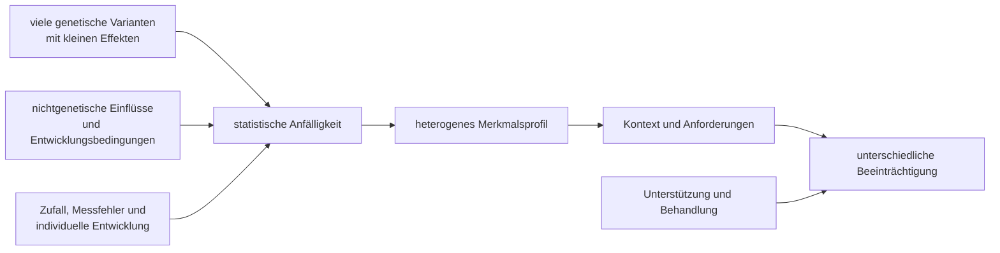

# Einheit 10 – Genetik und Umwelt

## Lernziel

Du kannst erklären, warum ADHS deutlich familiär und genetisch beeinflusst ist, ohne genetisch vorherbestimmt zu sein. Du unterscheidest **Heritabilität**, **Polygenität**, Umweltassoziation und Kausalität. Außerdem verstehst du, warum Gene und Umwelt nicht wie zwei getrennte Prozentanteile einer einzelnen Person behandelt werden dürfen und weshalb weder ein Gentest noch die Suche nach einem einzelnen „Auslöser“ eine ADHS-Diagnose ersetzen kann.

## 1. Die falsche Frage lautet: Gene oder Umwelt?

Bei komplexen menschlichen Merkmalen ist die Gegenüberstellung „angeboren oder erworben“ meist zu grob. Gene liefern keine fertige Verhaltensanweisung. Sie beeinflussen biologische Entwicklungsprozesse, die sich in einer bestimmten Umwelt entfalten. Gleichzeitig wirkt Umwelt nicht auf einen neutralen Organismus, sondern auf Menschen mit unterschiedlichen biologischen Voraussetzungen, Entwicklungsverläufen und bisherigen Erfahrungen.

ADHS entsteht in den meisten Fällen daher nicht durch **ein Gen**, **ein Erziehungsereignis** oder **eine einzelne Belastung**. Die aktuelle Lehrmeinung beschreibt ein multifaktorielles neuroentwicklungsbezogenes Modell: Viele genetische Varianten tragen jeweils einen sehr kleinen Teil zur statistischen Anfälligkeit bei. Hinzu kommen nichtgenetische Einflüsse, Entwicklungszufälle und Wechselwirkungen. Welche Kombination bei einer bestimmten Person bedeutsam war, lässt sich gewöhnlich nicht rückblickend eindeutig bestimmen.

> [!evidence] Evidenz: Konsens / hoch
> ADHS ist stark familiär und genetisch beeinflusst, zugleich aber heterogen und multifaktoriell. Eine hohe genetische Heritabilität bedeutet weder Unveränderlichkeit noch eine sichere Vorhersage für einzelne Menschen.

Diese Einordnung entlastet von zwei verbreiteten Schuldzuweisungen. Eltern „verursachen“ ADHS nicht durch gewöhnliche Erziehungsfehler. Umgekehrt bedeutet eine biologische Beteiligung nicht, dass Unterstützung, Lernen, Schlaf, Behandlung oder Lebensbedingungen wirkungslos wären. Ursachen eines Entwicklungsrisikos und Bedingungen, die den späteren Alltag erleichtern oder erschweren, sind nicht dasselbe.

## 2. Was Heritabilität wirklich bedeutet

Familien-, Adoptions- und besonders Zwillingsstudien vergleichen, wie ähnlich sich Menschen mit unterschiedlichem genetischem Verwandtschaftsgrad sind. Meta-Analysen solcher Studien finden für ADHS-Merkmale im Durchschnitt eine hohe **Heritabilität**, häufig in einer Größenordnung um 70 bis 80 Prozent. Dieser Wert wird leicht missverstanden.

Heritabilität beschreibt den Anteil beobachteter Unterschiede **in einer bestimmten Population und Umwelt**, der statistisch mit genetischen Unterschieden zusammenhängt. Sie sagt nicht:

- dass 70 bis 80 Prozent der ADHS einer einzelnen Person „genetisch“ seien,
- dass die übrigen Prozent automatisch auf Erziehung zurückgingen,
- dass ein Merkmal unveränderbar sei,
- oder dass die Schätzung in jeder Gesellschaft, Altersgruppe und Messmethode gleich ausfallen müsse.

Ein anschauliches Gegenbeispiel ist die Körpergröße. Sie ist stark heritabel und wird trotzdem von Ernährung, Erkrankungen und Lebensbedingungen beeinflusst. Wenn eine Umwelt für alle Menschen sehr ähnlich ist, können genetische Unterschiede relativ mehr beobachtete Variation erklären. Verändert sich die Umwelt, kann sich auch die Heritabilitätsschätzung verändern, ohne dass sich die DNA der Population geändert hat.

Zwillingsstudien zerlegen Variation modellhaft in genetische, gemeinsam geteilte und nicht gemeinsam geteilte Umweltanteile. Diese Kategorien sind keine direkt gemessenen Stoffe. Sie beruhen auf Annahmen, etwa darüber, wie vergleichbar die Umwelten eineiiger und zweieiiger Zwillinge sind. Messfehler und zufällige Entwicklungsereignisse können außerdem im nicht geteilten Umweltanteil landen. Hohe Heritabilität ist daher ein robuster Gruppenbefund, aber keine vollständige Ursachenkarte.

## 3. Polygenität: sehr viele kleine Beiträge

Seltene genetische Veränderungen können bei einzelnen Menschen einen größeren Beitrag zu einem breiteren Entwicklungsprofil leisten. Für die große Mehrheit der ADHS-Fälle ist jedoch eine **polygenetische** Architektur zentral. Das bedeutet: Tausende häufige DNA-Varianten sind beteiligt, jede mit einem winzigen durchschnittlichen Effekt. Keine einzelne davon ist notwendig oder ausreichend für ADHS.

Genomweite Assoziationsstudien, kurz GWAS, vergleichen Millionen Varianten bei sehr großen Gruppen. Die bislang großen Analysen identifizierten mehrere statistisch abgesicherte Risikoloci. Ein **Locus** ist zunächst eine Region im Genom, kein fertiger Beweis für ein bestimmtes Gen oder einen bekannten biologischen Pfad. Die betroffene Variante kann Genregulation beeinflussen, mit anderen Varianten gekoppelt sein oder in einem Gewebe wirken, das erst weiter untersucht werden muss.

Aus GWAS-Daten lassen sich **polygenetische Scores** berechnen. Sie addieren gewichtete Risikovarianten und können in Forschungsgruppen einen kleinen Teil von Unterschieden erklären. Für die klinische Einzelperson sind sie derzeit nicht diagnostisch: Die Verteilungen von Menschen mit und ohne ADHS überlappen stark, die Vorhersage hängt von der untersuchten Herkunftspopulation ab, und ein Score erfasst weder die gesamte Genetik noch Entwicklung, Umwelt und Beeinträchtigung.

## 4. Genetische Überlappung ist keine Gleichsetzung

ADHS teilt einen Teil seiner genetischen Einflüsse mit anderen Merkmalen und Diagnosen, darunter Autismus, Depression, Substanzgebrauch oder Bildungsmerkmale. Eine **genetische Korrelation** bedeutet, dass Varianten, die statistisch mit einem Merkmal zusammenhängen, teilweise auch mit einem anderen zusammenhängen. Sie bedeutet nicht, dass beide Diagnosen dasselbe seien oder dass eine Person mit dem einen Merkmal zwangsläufig das andere entwickelt.

Gerade bei ADHS und Autismus ist die Überlappung fachlich relevant: Beide sind heterogene Neuroentwicklungsstörungen, können gemeinsam auftreten und teilen manche genetische Einflüsse. Ihre diagnostischen Kernmerkmale bleiben verschieden. Genetische Korrelationen erklären außerdem keine einzelne Person; sie beschreiben Kovariation in großen Datensätzen.

Auch der Vergleich mit Parkinson braucht klare Grenzen. Dopaminerge Signalwege und bestimmte genetische oder zelluläre Begriffe können in beiden Forschungsfeldern vorkommen. Parkinson ist jedoch eine neurodegenerative Erkrankung mit anderen krankheitsbestimmenden Prozessen. Eine gemeinsame biologische Vokabel macht ADHS nicht zu einer Vorstufe von Parkinson.

## 5. Umweltfaktor ist nicht gleich Umweltursache

Forschung findet Zusammenhänge zwischen ADHS und verschiedenen prä-, peri- oder postnatalen Bedingungen, etwa Frühgeburtlichkeit, sehr niedrigem Geburtsgewicht, bestimmten Schadstoffexpositionen, psychosozialer Belastung oder mütterlichem Rauchen in der Schwangerschaft. Ein beobachteter Zusammenhang beweist jedoch noch keine Kausalität.

Mehrere alternative Erklärungen sind möglich:

- **Konfundierung:** Ein dritter Faktor beeinflusst sowohl die Exposition als auch ADHS-Merkmale.
- **Familiäre Weitergabe:** Genetische oder soziale Familienmerkmale hängen mit beidem zusammen.
- **Umgekehrte Richtung:** Frühe kindliche Eigenschaften verändern Reaktionen und Umweltbedingungen.
- **Messfehler und Auswahl:** Exposition oder Symptome werden ungenau erfasst, oder die Stichprobe ist nicht repräsentativ.
- **Echte kausale Wirkung:** Die Umweltbedingung verändert tatsächlich das Risiko oder den Verlauf.

Stärkere kausale Evidenz entsteht, wenn verschiedene Designs zum gleichen Ergebnis kommen: Geschwistervergleiche, natürliche Experimente, prospektive Messungen, genetisch informierte Designs und nachvollziehbare Dosis-Wirkungs-Beziehungen. Manche Risikofaktoren, besonders extreme Frühgeburtlichkeit und bestimmte toxische Expositionen, sind biologisch plausibel und durch mehrere Befundlinien gestützt. Bei anderen, beispielsweise mütterlichem Rauchen, wird ein beträchtlicher Teil der beobachteten Verbindung durch familiäre und genetische Faktoren erklärt. Vorsichtige Sprache ist deshalb keine Ausrede, sondern wissenschaftliche Genauigkeit.

## 6. Gene und Umwelt können miteinander korreliert sein

Eine **Gen-Umwelt-Korrelation** entsteht, wenn genetisch beeinflusste Eigenschaften mitbestimmen, welche Umwelt jemand erlebt. Eltern geben beispielsweise nicht nur DNA weiter, sondern gestalten auch eine Umgebung, die mit eigenen Eigenschaften zusammenhängt. Kinder wählen später Aktivitäten aus oder rufen Reaktionen hervor, die teilweise zu ihrem Temperament und Verhalten passen. Dadurch kann ein scheinbar reiner Umwelteffekt zugleich genetische Einflüsse enthalten.

Eine **Gen-Umwelt-Interaktion** bedeutet etwas anderes: Die Wirkung einer Umweltbedingung unterscheidet sich je nach genetischer Konstellation oder die Wirkung genetischer Varianten je nach Umwelt. Solche Interaktionen sind theoretisch plausibel, aber schwer robust nachzuweisen. Viele frühe Kandidatengen-Studien waren klein, testeten zahlreiche Kombinationen und ließen sich schlecht replizieren. Große, präregistrierte Analysen sind zuverlässiger, finden aber meist keine einfachen „Risiko-Gen plus Stress gleich ADHS“-Regeln.

Auch **Epigenetik** wird häufig überdehnt. Epigenetische Mechanismen regulieren, wann und wie Gene abgelesen werden, ohne die DNA-Sequenz zu ändern. Sie sind wichtig für Entwicklung. Ein Unterschied in Blut- oder Speichelproben beweist jedoch weder, dass eine Erfahrung ADHS verursacht hat, noch dass sich eine relevante Veränderung im Gehirn ebenso findet. Ursache, Folge, Zellzusammensetzung und Begleitfaktoren müssen getrennt werden.

## 7. Was bedeutet das für Familien und Einzelpersonen?

Wenn ADHS in einer Familie vorkommt, ist die Wahrscheinlichkeit für ähnliche Merkmale bei biologischen Verwandten erhöht. Das rechtfertigt Aufmerksamkeit für mögliche Merkmale, aber keine automatische Diagnose. Ebenso schließt eine unauffällige Familiengeschichte ADHS nicht aus: Diagnosen können übersehen worden sein, Merkmale können unterschiedlich ausgeprägt sein, und neue genetische oder nichtgenetische Einflüsse sind möglich.

Kommerzielle Gentests können derzeit nicht zuverlässig beantworten, ob jemand ADHS hat, es später entwickeln wird oder welches Medikament sicher am besten wirkt. Eine klinische Diagnose bleibt eine Gesamtbeurteilung von Entwicklungsgeschichte, Symptomen, Lebensbereichen, Beeinträchtigung und Alternativerklärungen. Genetische Beratung kann bei auffälligen körperlichen Befunden, Entwicklungsverzögerungen, angeborenen Besonderheiten oder einer bekannten familiären genetischen Erkrankung sinnvoll sein; das ist eine andere Fragestellung als ein allgemeiner ADHS-Gentest.

Die wichtigste praktische Konsequenz ist weder Fatalismus noch Ursachenjagd. Selbst wenn genetische Einflüsse stark sind, bleiben Funktionsniveau und Lebensqualität veränderbar. Passende Anforderungen, Unterstützung, Behandlung, Schlaf, körperliche Gesundheit und der Umgang mit Komorbiditäten können den Alltag deutlich beeinflussen. Eine Ursache muss nicht vollständig bekannt sein, damit wirksame Hilfe möglich ist.

## 8. Wissenschaftliche Einordnung und Grenzen

**Konsens:** ADHS ist stark erblich und polygen. Viele häufige Varianten mit kleinen Effekten sowie seltenere genetische Veränderungen tragen zur Anfälligkeit bei. Umweltassoziationen existieren, doch ihre Kausalität ist je nach Faktor unterschiedlich gut belegt.

**Wahrscheinlich:** Genetische und nichtgenetische Einflüsse wirken über Entwicklungspfade zusammen. Ein Teil scheinbarer Umweltzusammenhänge wird durch familiäre, genetische oder soziale Drittvariablen erklärt.

**Umstritten:** Welche konkreten Gen-Umwelt-Interaktionen robust und klinisch bedeutsam sind. Viele kleine Studien und Kandidatengen-Ergebnisse sind nicht zuverlässig repliziert.

**Experimentell:** Polygenetische Scores, epigenetische Profile und kombinierte Risikoalgorithmen zur individuellen Vorhersage. Sie sind für Forschung interessant, derzeit aber kein Ersatz für Diagnostik und keine verlässliche persönliche Prognose.

Die genetischen Datensätze stammen weiterhin überproportional von Menschen europäischer Abstammung. Dadurch können Ergebnisse und Scores andere Bevölkerungsgruppen schlechter abbilden. Außerdem erklären statistische Assoziationen nicht automatisch den biologischen Mechanismus. Selbst ein sicher identifiziertes Risikolocus kann mehrere Gene oder Regulationsprozesse betreffen.

## 9. Mini-Übung: Ursachenbehauptungen prüfen

Nimm eine Aussage wie „X verursacht ADHS“ und prüfe sie mit fünf Fragen:

1. Wurde nur ein Zusammenhang beobachtet oder ein kausales Design verwendet?
2. Wurden familiäre genetische und soziale Faktoren berücksichtigt?
3. Wie groß war die Stichprobe, und wurde der Befund unabhängig repliziert?
4. Bezieht sich das Ergebnis auf eine Gruppe oder erlaubt es wirklich eine Vorhersage für Einzelpersonen?
5. Wird zwischen Entstehungsrisiko, Symptomverstärkung und funktioneller Beeinträchtigung unterschieden?

Die Übung ist kein Werkzeug, um Gesundheitsrisiken kleinzureden. Sie hilft, starke Kausalbehauptungen von vorsichtiger Evidenzbewertung zu trennen.

## Review-Frage

**Warum bedeutet eine Heritabilität von ungefähr 70 bis 80 Prozent nicht, dass die ADHS einer einzelnen Person zu diesem Anteil genetisch festgelegt ist?**

Antwort

Weil Heritabilität Unterschiede innerhalb einer bestimmten Population unter bestimmten Umweltbedingungen beschreibt. Sie zerlegt nicht die Ursache einer einzelnen Person, sagt nichts über Unveränderlichkeit aus und kann sich zwischen Populationen und Umwelten unterscheiden.

## Wissenschaftliche Quelle

[[references/Demontis2023|Demontis et al. 2023]] – große genomweite Analyse, die 27 unabhängige ADHS-Risikoloci identifizierte und die stark polygenetische Architektur präzisierte.

[[references/Nikolas2010|Nikolas und Burt 2010]] – Meta-Analyse von Zwillingsstudien zu genetischen und Umweltbeiträgen bei Unaufmerksamkeit und Hyperaktivität-Impulsivität.

[[references/Thapar2013|Thapar et al. 2013]] – kritischer Review zu genetischen, prä- und perinatalen sowie psychosozialen Risikofaktoren und zur Grenze kausaler Schlussfolgerungen.

[[references/Faraone2021|Faraone et al. 2021]] – internationales Konsensuspapier zur hohen Heritabilität, Polygenität und fehlenden individualdiagnostischen Eignung genetischer Befunde.

## Merksatz

> Gene verändern Wahrscheinlichkeiten, nicht Schicksale; Umwelt wirkt in Entwicklungsprozessen, nicht als einfacher Restprozentsatz.

## Navigation

- Zurück: [[01-Grundlagen/09-Diagnostische-Kriterien-und-Differentialdiagnostik|Diagnostische Kriterien und Differentialdiagnostik]]
- Weiter: [[01-Grundlagen/11-Schlaf-Bewegung-und-koerperliche-Gesundheit|Schlaf, Bewegung und körperliche Gesundheit]]
- [[Glossar]] · [[Literatur]] · [[knowledge-graph/README|Wissensgraph]]
