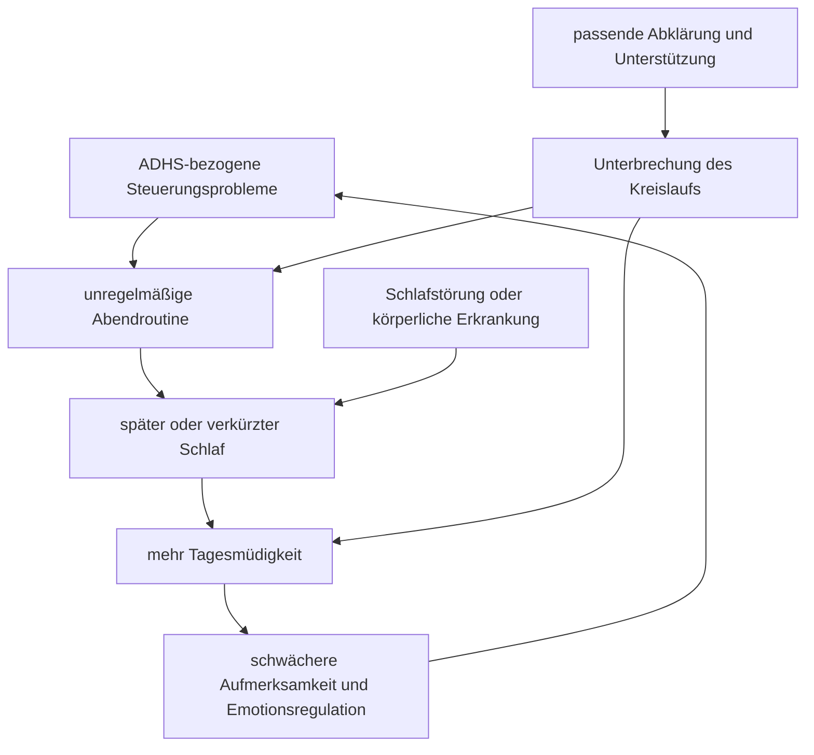

# Einheit 11 – Schlaf, Bewegung und körperliche Gesundheit

## Lernziel

Du kannst erklären, warum Schlaf, Bewegung und körperliche Gesundheit bei ADHS systematisch berücksichtigt werden sollten, ohne sie zu einer einfachen Ursache oder zu einem Ersatz für Diagnostik und Behandlung zu erklären. Du unterscheidest Schlafmangel, Schlafstörungen, zirkadiane Verschiebungen und medikamentenbezogene Einflüsse. Außerdem kannst du die Evidenz zu körperlicher Aktivität als ergänzende Maßnahme einordnen und erkennst Warnzeichen, die medizinisch abgeklärt werden sollten.

## 1. Körperliche Bedingungen verändern die sichtbare Symptomatik

Aufmerksamkeit, Impulskontrolle, Motivation und Emotionsregulation hängen nicht nur von einer Diagnose ab. Sie schwanken auch mit Schlafdauer, Schlafqualität, körperlicher Belastbarkeit, Schmerzen, Infekten, Ernährung, Substanzen, Medikamenten und Tageszeit. Deshalb kann dieselbe Person an einem ausgeschlafenen, gut strukturierten Tag deutlich anders funktionieren als nach mehreren kurzen Nächten oder während einer Erkrankung.

Das führt leicht zu zwei gegensätzlichen Fehlern. Der erste lautet: „Es ist nur Schlafmangel, also kann es keine ADHS sein.“ Der zweite lautet: „Es ist alles ADHS, deshalb muss man Schlaf und körperliche Ursachen nicht prüfen.“ Beides ist zu grob. Eine seit der Kindheit bestehende ADHS kann mit einer zusätzlichen Schlafstörung zusammenkommen. Umgekehrt können chronischer Schlafmangel, Schlafapnoe, Restless-Legs-Symptome, Depression, Schilddrüsenerkrankungen oder Nebenwirkungen ähnliche Beschwerden verstärken oder teilweise erklären.

> [!evidence] Evidenz: Konsens / hoch
> Schlaf und körperliche Gesundheit gehören zur klinischen Gesamtbeurteilung von ADHS. Sie beeinflussen Symptome und Beeinträchtigung, sind aber weder ein universeller Auslöser noch ein einfacher diagnostischer Test.

Die praktische Frage lautet daher nicht „ADHS oder Körper?“, sondern: Welche Faktoren bestehen seit wann, wie verändern sie sich, und welcher Anteil der aktuellen Beeinträchtigung lässt sich durch gezielte Abklärung oder Unterstützung beeinflussen?

## 2. Schlafprobleme sind häufig, aber nicht einheitlich

Menschen mit ADHS berichten im Durchschnitt häufiger Einschlafprobleme, unruhigen Schlaf, Schwierigkeiten beim morgendlichen Aufstehen und Tagesmüdigkeit. Besonders bei Jugendlichen können spätere Schlafzeiten mit frühen Schul- oder Arbeitszeiten kollidieren. Solche Gruppenbefunde bedeuten jedoch nicht, dass jede Person mit ADHS eine Schlafstörung hat oder dass alle Schlafprobleme denselben Mechanismus besitzen.

Mindestens vier Ebenen müssen getrennt werden:

1. **Zu wenig Schlaf:** Die verfügbare Schlafzeit ist durch Termine, Mediennutzung, Schichtarbeit, Betreuungspflichten oder Aufschieben verkürzt.
2. **Insomnie:** Trotz ausreichender Gelegenheit bestehen anhaltende Ein- oder Durchschlafprobleme mit Folgen am Tag.
3. **Zirkadiane Verschiebung:** Die innere zeitliche Tendenz liegt deutlich später als die sozialen Anforderungen.
4. **Andere Schlafstörungen:** Dazu gehören beispielsweise obstruktive Schlafapnoe, periodische Beinbewegungen, Restless-Legs-Syndrom oder Parasomnien.

Diese Unterscheidung ist wichtig, weil verschiedene Probleme unterschiedliche Untersuchungen und Maßnahmen benötigen. Schnarchen mit Atempausen, morgendliche Kopfschmerzen oder ausgeprägte Tagesmüdigkeit verlangen eine andere Abklärung als ein unregelmäßiger Schlafrhythmus. Ein allgemeiner Rat wie „früher ins Bett gehen“ reicht dann nicht.

Subjektive und objektive Schlafmessungen können außerdem voneinander abweichen. Meta-Analysen finden bei Kindern und Jugendlichen mit ADHS konsistente Berichte über mehr Schlafprobleme, während Unterschiede in Aktigrafie oder Polysomnografie kleiner und uneinheitlicher ausfallen. Das macht subjektive Beschwerden nicht bedeutungslos. Es zeigt, dass „Schlafqualität“ mehrere Aspekte umfasst und weder ein Fragebogen noch eine einzelne Nacht im Schlaflabor das vollständige Alltagsmuster erfasst.

## 3. Schlaf und ADHS können sich gegenseitig verstärken

Schlafmangel beeinträchtigt bei fast allen Menschen Aufmerksamkeit, Reaktionshemmung, Arbeitsgedächtnis und Emotionsregulation. Bei einer bereits vorhandenen ADHS kann dadurch die funktionelle Reserve kleiner werden: Aufgabenabbrüche, Reizbarkeit und Zeitprobleme nehmen zu. Umgekehrt können ADHS-bezogene Schwierigkeiten das Schlafen erschweren. Dazu gehören Aufschieben des Zubettgehens, intensive Beschäftigung mit interessanten Inhalten, schwache Zeitwahrnehmung, unregelmäßige Routinen und Probleme beim Wechsel von Aktivität zu Ruhe.

Auch Medikamente können in beide Richtungen wirken. Stimulanzien können bei ungünstiger Dosierung oder zu später Einnahme das Einschlafen erschweren. Bei manchen Menschen verbessert eine wirksame Behandlung aber die Tagesstruktur und reduziert abendliches Chaos. Müdigkeit kann zudem fälschlich als „beruhigende Wirkung“ interpretiert werden. Deshalb sollten Einnahmezeit, Wirkdauer, Rebound, Koffein, Nikotin, andere Medikamente und das tatsächliche Schlafmuster gemeinsam betrachtet werden. Änderungen an Medikamenten gehören in fachliche Begleitung, nicht in ein Selbstexperiment.

Eine hilfreiche Einordnung fragt deshalb nach dem zeitlichen Verlauf. Wenn Konzentrationsprobleme ausschließlich nach einer akuten Schlafverschlechterung auftreten, ist das etwas anderes als ein lebenslanges, situationsübergreifendes Muster, das durch schlechten Schlaf zusätzlich verstärkt wird.

## 4. Bewegung ist gesund – und bei ADHS eine Ergänzung, kein Ersatz

Regelmäßige körperliche Aktivität unterstützt Herz-Kreislauf-Gesundheit, Stoffwechsel, Knochen, Schlaf und psychisches Wohlbefinden. Diese allgemeinen Gesundheitswirkungen gelten auch für Menschen mit ADHS. Darüber hinaus untersuchen Studien, ob strukturierte Bewegung ADHS-Symptome oder exekutive Funktionen verbessert.

Systematische Reviews und Meta-Analysen bei Kindern und Jugendlichen berichten im Mittel günstige Effekte auf einzelne Bereiche wie Inhibition, Aufmerksamkeit, exekutive Funktionen, motorische Kompetenz und teils berichtete ADHS-Symptome. Die Studien sind jedoch sehr verschieden: Manche prüfen eine einzelne Bewegungseinheit, andere Programme über Wochen; Sportart, Intensität, Vergleichsgruppe, Medikation und Messinstrumente unterscheiden sich stark. Kleine Stichproben und fehlende Verblindung können Effekte überschätzen.

Daraus folgt eine vorsichtige Aussage: Bewegung ist eine sinnvolle gesundheitsfördernde Ergänzung und kann bei manchen Menschen kurzfristig Aktivierung, Stimmung oder kognitive Kontrolle verbessern. Die Evidenz rechtfertigt aber nicht die Behauptung, Sport „heile“ ADHS oder ersetze eine indizierte Behandlung. Für Erwachsene ist die spezifische ADHS-Evidenz dünner als für Kinder und Jugendliche. Auch die optimale Art, Dosis und Dauer eines Programms ist nicht abschließend geklärt.

Besonders problematisch ist moralischer Druck. Schwierigkeiten, eine Bewegungsroutine zu beginnen und beizubehalten, können gerade Teil der ADHS-bezogenen Funktionsprobleme sein. „Du musst dich nur mehr bewegen“ ignoriert Barrieren wie Planung, Kosten, Schmerzen, Scham, Reizüberlastung, fehlende sichere Räume oder wechselnde Energie. Hilfreicher sind konkrete, kleine und zugängliche Formen: ein kurzer Weg zu Fuß, gemeinsames Training, feste Termine, bewegte Pausen oder eine Aktivität, die tatsächlich Interesse weckt.

## 5. Körperliche Gesundheit braucht reguläre Versorgung

ADHS betrifft nicht nur die Leistung in Schule oder Beruf. Im Alltag können vergessene Termine, unregelmäßige Mahlzeiten, impulsives Risikoverhalten, Substanzgebrauch, Bewegungsmangel oder Schwierigkeiten bei langfristiger Selbstorganisation die Gesundheit beeinflussen. Gleichzeitig können körperliche Erkrankungen und Schmerzen die ADHS-bezogene Beeinträchtigung verstärken.

Eine gute Versorgung umfasst deshalb allgemeine Prävention und keine exotische „ADHS-Spezialmedizin“: altersgerechte Vorsorge, Impfungen, Zahngesundheit, Blutdruck und Puls bei entsprechender Medikation, Schlafanamnese, Bewegung, Ernährung, Substanzkonsum sowie die Behandlung bestehender Erkrankungen. Bei Kindern gehören Wachstum und Appetitverlauf zur Verlaufskontrolle. Welche Untersuchungen nötig sind, hängt von Alter, Beschwerden, Familiengeschichte und Behandlung ab.

Warnzeichen sollten nicht als bloße ADHS abgetan werden. Dazu gehören Atempausen im Schlaf, Ohnmacht, Brustschmerz bei Belastung, neue neurologische Symptome, deutlicher unbeabsichtigter Gewichtsverlust, anhaltende schwere Erschöpfung oder plötzlich veränderte Leistungsfähigkeit. Solche Zeichen erfordern zeitnahe fachliche Abklärung. Auch ohne Warnzeichen gilt: Ein Symptom, das neu, fortschreitend oder qualitativ anders ist als das bekannte Muster, verdient eine erneute Prüfung.

## 6. Mini-Übung: Sieben Tage beobachten, nicht diagnostizieren

Erstelle für sieben Tage eine sehr einfache Tabelle mit fünf Einträgen:

- ungefähre Zeit des Zubettgehens und Aufstehens,
- geschätzte Einschlafdauer und nächtliche Wachphasen,
- Tagesmüdigkeit von 0 bis 10,
- Bewegung oder körperliche Aktivität in groben Minuten,
- ein Satz zu Aufmerksamkeit, Stimmung und besonderen Einflüssen.

Notiere zusätzlich Koffein, Alkohol, Schichtarbeit, Schmerzen oder eine abweichende Medikamenteneinnahme. Ziel ist nicht, aus sieben Tagen eine Diagnose abzuleiten. Die Aufzeichnung soll Muster sichtbar machen und ein Gespräch mit behandelnden Fachpersonen konkretisieren. Bei starkem Schnarchen, Atempausen, ausgeprägter Tagesmüdigkeit oder anderen Warnzeichen sollte die Übung keine Abklärung verzögern.

## 7. Wissenschaftliche Einordnung und Grenzen

**Konsens:** Schlafprobleme und körperliche Gesundheit sollen bei ADHS regelmäßig erfragt und behandelt werden. Schlafmangel kann ADHS-ähnliche Beschwerden erzeugen und bestehende Symptome verstärken. Körperliche Aktivität ist für die allgemeine Gesundheit empfehlenswert.

**Wahrscheinlich:** Strukturierte Bewegung kann bei Kindern und Jugendlichen einzelne exekutive Funktionen und berichtete Symptome verbessern. Verhaltensbezogene Schlafinterventionen helfen bei manchen Schlafproblemen; bei klar definierten Störungen können weitere gezielte Maßnahmen wirksam sein.

**Umstritten:** Welche Bewegungsart und Intensität für welche Person optimal ist und wie stark langfristige Effekte auf Kernsymptome ausfallen. Auch die Richtung vieler Zusammenhänge zwischen ADHS, Schlaf, Gewicht und körperlicher Gesundheit bleibt teilweise offen.

**Experimentell:** Digitale Schlaf- und Aktivitätssensoren, personalisierte zirkadiane Interventionen und kombinierte Vorhersagemodelle. Verbrauchergeräte können Muster anregen, ersetzen aber keine validierte Diagnostik und sind bei einzelnen Schlafstadien oft ungenau.

## 8. Verbindung zu Autismus und Parkinson

Bei Autismus sind Schlafprobleme ebenfalls häufig, können aber durch andere sensorische, kommunikative oder medizinische Faktoren geprägt sein. Eine gemeinsame Schlafbeschwerde macht Autismus und ADHS nicht gleich. Bei beiden Diagnosen sind individuelle Routinen, Reizbedingungen und Begleiterkrankungen wichtig.

Bei Parkinson gehören Schlafstörungen, Tagesmüdigkeit und Bewegungsveränderungen häufig zum Krankheitsbild oder zu seinen Behandlungen. Parkinson ist jedoch eine neurodegenerative Erkrankung. Neu auftretende Bewegungsverlangsamung, Tremor oder REM-Schlaf-Verhaltensstörung dürfen nicht als Variante von ADHS erklärt werden.

## Review-Frage

**Warum sollte Schlaf bei ADHS sorgfältig untersucht werden, ohne daraus zu schließen, dass ADHS lediglich durch schlechten Schlaf verursacht wird?**

Antwort

Weil Schlafmangel und Schlafstörungen Aufmerksamkeit, Impulskontrolle und Emotionen beeinflussen und eine vorhandene ADHS verstärken oder teilweise nachahmen können. Eine ADHS-Diagnose beruht jedoch auf einem früh beginnenden, situationsübergreifenden Entwicklungs- und Beeinträchtigungsmuster. Schlaf und ADHS können gleichzeitig bestehen und sich gegenseitig beeinflussen.

## Wissenschaftliche Quelle

[[references/Cortese2024|Cortese et al. 2024]] – aktueller Review randomisierter Studien zur Behandlung von Schlafstörungen bei Kindern mit ADHS; unterstützt verhaltensbezogene Ansätze und zeigt erhebliche Forschungslücken.

[[references/Liang2023|Liang et al. 2023]] – systematische Übersichtsarbeit und Meta-Analyse objektiv gemessener Schlafkontinuität; verdeutlicht die Unterschiede zwischen subjektiven Beschwerden und objektiven Messungen.

[[references/Sun2024|Sun et al. 2024]] – systematische Übersichtsarbeit und Meta-Analyse strukturierter Bewegungsinterventionen bei Kindern und Jugendlichen mit ADHS.

[[references/AADPA2022|AADPA 2022]] – Leitlinie zur umfassenden klinischen Beurteilung, Verlaufskontrolle und Berücksichtigung von Schlaf und körperlicher Gesundheit.

## Merksatz

> Schlaf und Bewegung verändern Funktionsfähigkeit und Gesundheit; sie gehören zur ADHS-Versorgung, sind aber weder einfache Ursache noch Ersatz für eine sorgfältige Diagnostik und individuell passende Behandlung.

## Navigation

- Zurück: [[01-Grundlagen/10-Genetik-und-Umwelt|Genetik und Umwelt]]
- Weiter: [[README|Übersicht]]
- [[Glossar]] · [[Literatur]] · [[knowledge-graph/README|Wissensgraph]]
