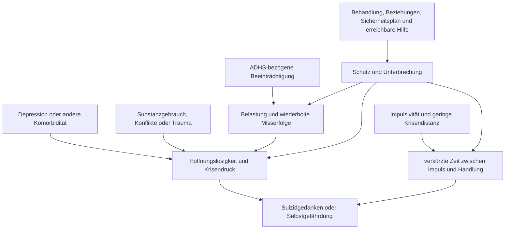

# Einheit 12 – Komorbidität, Depression und Suizidalität

## Lernziel

Du kannst ADHS und Depression als unterscheidbare, aber häufig gemeinsam auftretende Störungen einordnen. Du erkennst, warum ein erhöhtes Suizidalitätsrisiko auf Gruppenebene keine Vorhersage für eine einzelne Person erlaubt, weshalb Selbstverletzung und Suizidabsicht getrennt erfragt werden müssen und wann unmittelbare Hilfe wichtiger ist als weitere Selbstbeobachtung. Außerdem verstehst du, warum Behandlung und Sicherheitsplanung beide Störungsbilder sowie die konkrete Lebenssituation berücksichtigen müssen.

## 1. Komorbidität bedeutet gleichzeitig, nicht identisch

**[[Glossar#Komorbidität|Komorbidität]]** bedeutet, dass bei einer Person mehrere klinisch relevante Störungen oder Erkrankungen gleichzeitig vorliegen. ADHS erhöht nicht automatisch die Wahrscheinlichkeit, dass jede betroffene Person eine Depression entwickelt. Umgekehrt erklären depressive Symptome nicht rückwirkend jedes seit der Kindheit bestehende Aufmerksamkeits- oder Impulsivitätsproblem.

Systematische Übersichten finden bei Erwachsenen mit ADHS häufiger affektive Störungen als in Vergleichsgruppen. Bei Kindern und Jugendlichen zeigte eine aktuelle Meta-Analyse ungefähr ein verdoppeltes Risiko für depressive Störungen. Solche Zahlen beschreiben Gruppen. Sie sagen nicht, ob eine konkrete Person depressiv ist, wann eine Episode beginnt oder wie schwer sie verläuft.

> [!evidence] Evidenz: Konsens / hoch
> Depression und Suizidalität gehören nicht zu den diagnostischen Kernmerkmalen der ADHS. Sie treten jedoch häufiger gemeinsam mit ADHS auf und müssen bei Diagnostik, Verlaufskontrolle und Krisenbeurteilung ausdrücklich berücksichtigt werden.

Mehrere Wege können zur Überschneidung beitragen: genetische Gemeinsamkeiten, wiederholte Misserfolge und soziale Ausgrenzung, chronische Überforderung, Schlafprobleme, Substanzgebrauch, traumatische Erfahrungen oder weitere psychische Störungen. Diese Faktoren sind weder bei allen Menschen vorhanden noch beweisen sie eine einfache Ursache-Wirkungs-Kette.

## 2. Ähnliche Oberfläche, unterschiedliche Zeitgeschichte

Unaufmerksamkeit, geringe Aktivierung, Schlafstörungen, Reizbarkeit und Schwierigkeiten beim Beginnen von Aufgaben können sowohl bei ADHS als auch bei Depression auftreten. Für die Einordnung sind deshalb **Verlauf und Veränderung gegenüber dem persönlichen Ausgangsniveau** zentral.

ADHS beginnt definitionsgemäß in der Entwicklung und zeigt sich typischerweise über längere Zeit in mehreren Situationen. Eine [[Glossar#Depressive Episode|depressive Episode]] ist dagegen ein zeitlich abgrenzbares Syndrom. Zu ihr können anhaltend gedrückte Stimmung, deutliche [[Glossar#Anhedonie|Anhedonie]], Hoffnungslosigkeit, Schuldgefühle, psychomotorische Veränderungen, ausgeprägte Erschöpfung und Suizidgedanken gehören. Bei Kindern und Jugendlichen kann Reizbarkeit stärker im Vordergrund stehen.

Ein Beispiel: Eine Person hat seit der Schulzeit Probleme mit Zeitplanung und Arbeitsbeginn. Seit sechs Wochen verliert sie zusätzlich nahezu jedes Interesse, zieht sich zurück, erlebt sich als wertlos und sieht keine Zukunft. Die neuen Veränderungen sollten nicht als „nur mehr ADHS“ erklärt werden. Umgekehrt reicht eine vorübergehende Frustration nach einem chaotischen Tag nicht für die Diagnose einer Depression.

Die Trennung ist klinisch wichtig, aber nicht immer einfach. ADHS kann den Alltag so unregelmäßig machen, dass Beginn und Dauer depressiver Symptome schwer zu erinnern sind. Depression kann wiederum Gedächtnis, Konzentration und Selbstbeurteilung beeinflussen. Fremdanamnese, zeitliche Verläufe und wiederholte Gespräche können deshalb hilfreicher sein als ein einzelner Fragebogenwert.

## 3. Erhöhtes Risiko ist kein individuelles Schicksal

Meta-Analysen und Registerstudien zeigen konsistent einen statistischen Zusammenhang zwischen ADHS und Suizidgedanken, Suizidversuchen sowie Suizidtod. Eine aktuelle Meta-Analyse longitudinaler Studien bei jungen Menschen fand im Mittel etwa dreifach erhöhte Chancen für verschiedene suizidale Verläufe. Die eingeschlossenen Studien unterschieden sich jedoch stark nach Alter, Geschlecht, ADHS-Ausprägung, Begleiterkrankungen, sozialer Situation und Messmethode.

Das bedeutet zweierlei gleichzeitig:

1. Das Thema darf in Versorgung und Prävention nicht übersehen werden.
2. Aus der Diagnose ADHS lässt sich nicht ableiten, ob eine bestimmte Person suizidal ist.

Ein großes dänisches Register zeigte, dass zusätzliche psychische Erkrankungen das Risiko deutlich weiter erhöhten. Besonders wichtig sind daher aktuelle Depression, frühere Suizidversuche, Substanzkonsum, akute Verluste oder Konflikte, Gewalt- und Traumaerfahrungen, starke Hoffnungslosigkeit, fehlende Unterstützung sowie der unmittelbare Zugang zu Hilfe. Auch Schutzfaktoren zählen: tragfähige Beziehungen, erreichbare Behandlung, ein konkreter Sicherheitsplan und die Bereitschaft, Warnzeichen mitzuteilen.

Das Diagramm ist kein Vorhersagemodell. Es zeigt, warum eine einzelne Risikozahl die konkrete Situation nicht ersetzt.

## 4. Suizidgedanken, Suizidversuch und Selbstverletzung unterscheiden

**[[Glossar#Suizidalität|Suizidalität]]** umfasst Gedanken an den Tod oder Suizid, Absichten, Planungen und suizidale Handlungen. Diese Bereiche unterscheiden sich in Dringlichkeit und Bedeutung. Sie müssen direkt, respektvoll und ohne moralische Bewertung erfragt werden.

**[[Glossar#Nichtsuizidales selbstverletzendes Verhalten|Nichtsuizidales selbstverletzendes Verhalten]]** bezeichnet absichtliche Selbstverletzung ohne die Absicht zu sterben. In der Praxis ist die Absicht jedoch nicht immer eindeutig oder stabil. Ein Mensch kann ambivalente Motive haben, und Selbstverletzung ist mit einem erhöhten späteren Suizidrisiko verbunden. Deshalb darf weder automatisch Suizidabsicht unterstellt noch eine Selbstverletzung als „nur Aufmerksamkeit“ abgewertet werden.

Leitlinien raten davon ab, Menschen mit einer einfachen Skala als „niedriges“, „mittleres“ oder „hohes“ Risiko einzusortieren und daraus Behandlung oder Entlassung abzuleiten. Sinnvoller ist eine individuelle Formulierung: Was ist gerade geschehen? Welche Gedanken, Absichten und Vorbereitungen bestehen? Was hat sich verändert? Welche Mittel und Hilfen sind erreichbar? Was hilft, die nächste Zeit sicher zu überstehen?

> [!important] Bei akuter Gefahr
> Bei konkreter Suizidabsicht, unmittelbar drohender Selbstgefährdung oder wenn eine Person sich nicht bis zum Erreichen von Hilfe sicher halten kann: nicht allein bleiben, gefährliche Mittel soweit ohne Eigengefährdung entfernen und sofort den örtlichen Notruf, einen psychiatrischen Krisendienst oder eine Notaufnahme kontaktieren. In Deutschland ist der Notruf **112**. Eine Lernübung oder Onlineinformation darf akute Hilfe nicht verzögern.

## 5. Sicherheitsplanung ist konkret, nicht nur ein Versprechen

Ein **[[Glossar#Sicherheitsplan|Sicherheitsplan]]** ist eine kurze, gemeinsam erarbeitete Reihenfolge konkreter Schritte für eine Krise. Er ist mehr als die Zusage „Ich tue mir nichts an“. Er kann enthalten:

- persönliche Warnzeichen,
- Aktivitäten, die kurzfristig Distanz schaffen,
- erreichbare Personen und sichere Orte,
- professionelle Anlaufstellen,
- Maßnahmen, die den Zugang zu gefährlichen Mitteln verringern,
- die Vereinbarung, wann sofort Notfallhilfe eingeschaltet wird.

Der Plan muss realistisch sein. Eine Kontaktperson, die nachts nicht erreichbar ist, reicht nicht als einzige Option. Bei ADHS helfen kurze Formulierungen, sichtbare Speicherung, wenige Prioritäten und ein leicht auffindbarer Zugang. Ein Sicherheitsplan ersetzt keine Behandlung und keine akute fachliche Beurteilung.

## 6. Behandlung muss beide Störungsbilder und die Dringlichkeit berücksichtigen

Bei gleichzeitig bestehender ADHS und Depression wird nicht nach einer starren Reihenfolge behandelt. Akute Suizidalität oder eine schwere depressive Episode haben zunächst hohe Priorität. In stabileren Situationen kann eine wirksame ADHS-Behandlung Funktionsprobleme, Konflikte und Überforderung reduzieren; eine spezifische Depressionsbehandlung bleibt dennoch erforderlich, wenn eine depressive Störung vorliegt.

Beobachtungsdaten sprechen nicht dafür, dass eine leitliniengerechte medikamentöse ADHS-Behandlung das Suizidalitätsrisiko generell erhöht. Eine große schwedische Target-Trial-Emulation fand bei Behandlungsbeginn niedrigere Raten suizidalen Verhaltens. Auch eine Meta-Analyse bei jungen Menschen fand eine Assoziation von Stimulanzien mit geringerem Depressionsrisiko. Beide Befunde sind wichtig, beweisen aber keine schützende Wirkung für jede Person: Indikation, Auswahl, Begleiterkrankungen, Behandlungskontakt und nicht gemessene Unterschiede können Ergebnisse beeinflussen.

Medikamente dürfen deshalb weder pauschal als Gefahr noch als Suizidprävention dargestellt werden. Neue oder zunehmende Suizidgedanken, starke Stimmungsschwankungen, Aktivierungszustände oder andere auffällige Veränderungen gehören unabhängig von der vermuteten Ursache rasch in fachliche Beurteilung.

## 7. Mini-Übung: Hilfekette vor der Krise festlegen

Diese Übung ist für stabile Situationen gedacht. Bei aktueller Suizidabsicht gilt stattdessen der Notfallhinweis oben.

Schreibe auf eine gut erreichbare Karte:

1. zwei persönliche Warnzeichen, bei denen du nicht mehr allein weiterprobierst,
2. eine Person, die du direkt informieren kannst,
3. eine professionelle Anlaufstelle,
4. den örtlichen Notruf,
5. einen Satz, mit dem du das Gespräch beginnst, zum Beispiel: „Mir geht es psychisch deutlich schlechter und ich brauche heute Unterstützung.“

Prüfe, ob Telefonnummern und Wege aktuell sind. Für Menschen mit ADHS kann es helfen, die Karte zusätzlich auf dem Sperrbildschirm, im Portemonnaie oder bei einer vertrauten Person zu hinterlegen.

## 8. Wissenschaftliche Einordnung und Grenzen

**Konsens:** Depressionen und suizidale Verläufe treten bei Menschen mit ADHS häufiger auf als in Vergleichsgruppen. Suizidalität soll direkt und individuell erfragt werden. Depression, Substanzgebrauch und weitere Komorbiditäten sind wichtige, aber nicht alleinige Risikofaktoren.

**Wahrscheinlich:** Mehrere Pfade verbinden ADHS mit Krisen, darunter funktionelle Beeinträchtigung, soziale Belastung, Impulsivität, Emotionsregulation und Komorbiditäten. Gute Behandlung und erreichbare Unterstützung können einzelne Pfade unterbrechen.

**Umstritten:** Wie stark einzelne ADHS-Merkmale unabhängig von Depression und anderen Faktoren zum Risiko beitragen. Studien verwenden unterschiedliche Definitionen und Populationen; seltene Ereignisse erzeugen breite Unsicherheiten.

**Experimentell:** Individuelle Vorhersagemodelle aus klinischen, digitalen oder biologischen Daten. Derzeit kann kein Algorithmus zuverlässig entscheiden, wer einen Suizidversuch unternehmen wird. Klinische Aufmerksamkeit und konkrete Sicherheitsunterstützung bleiben unverzichtbar.

## 9. Verbindung zu Autismus und Parkinson

Auch bei Autismus können Depression, Selbstverletzung und Suizidalität auftreten. Kommunikationsunterschiede, soziale Ausgrenzung, sensorische Belastung und Masking können die Erfassung verändern. Eine gemeinsame Krise macht ADHS und Autismus nicht identisch; Fragen und Hilfen müssen verständlich und individuell angepasst werden.

Bei Parkinson können Depression und Suizidgedanken ebenfalls vorkommen, etwa im Zusammenhang mit Erkrankungsbelastung, neurobiologischen Veränderungen oder Behandlung. Parkinson ist eine neurodegenerative Erkrankung und verlangt eine andere medizinische Einordnung. Neu auftretende Depression oder Suizidalität darf in keiner Diagnosegruppe als „typisch und deshalb harmlos“ abgetan werden.

## Review-Frage

**Warum reicht die Feststellung „ADHS erhöht das Suizidrisiko“ weder für eine individuelle Vorhersage noch für eine gute Krisenbeurteilung aus?**

Antwort

Weil der Zusammenhang ein Gruppenbefund mit großer Heterogenität ist. Die konkrete Beurteilung muss aktuelle Suizidgedanken und Absichten, frühere Handlungen, Depression und weitere Komorbiditäten, Substanzgebrauch, Belastungen, erreichbare Mittel, Schutzfaktoren und verfügbare Hilfe berücksichtigen. Risikoskalen oder die ADHS-Diagnose allein dürfen weder Behandlung noch Entlassung entscheiden.

## Wissenschaftliche Quelle

[[references/Zhang2025Depression|Zhang et al. 2025]] – systematische Übersichtsarbeit und Meta-Analyse zu Depression und Angst bei Kindern und Jugendlichen mit ADHS.

[[references/Septier2019|Septier et al. 2019]] – präregistrierte systematische Übersichtsarbeit und Meta-Analyse zum Zusammenhang zwischen ADHS und suizidalen Verläufen.

[[references/Garas2025|Garas et al. 2025]] – Meta-Analyse longitudinaler Studien zu Suizidalität bei Kindern und Jugendlichen mit ADHS.

[[references/Fitzgerald2019|Fitzgerald et al. 2019]] – nationale dänische Registerkohorte zur Bedeutung zusätzlicher psychischer Störungen.

[[references/NVLDepression2022|NVL Unipolare Depression 2022]] und [[references/NICE2022SelfHarm|NICE NG225]] – Leitlinien zur Erfassung und zum Management von Depression, Suizidalität und Selbstverletzung.

## Merksatz

> ADHS kann mit Depression und erhöhtem Suizidalitätsrisiko verbunden sein; gute Versorgung trennt Diagnosen, fragt Krisen direkt und ersetzt Gruppenstatistik durch eine konkrete, respektvolle Sicherheitsbeurteilung.

## Navigation

- Zurück: [[01-Grundlagen/11-Schlaf-Bewegung-und-koerperliche-Gesundheit|Schlaf, Bewegung und körperliche Gesundheit]]
- Weiter: [[README|Übersicht]]
- [[Glossar]] · [[Literatur]] · [[knowledge-graph/README|Wissensgraph]]
