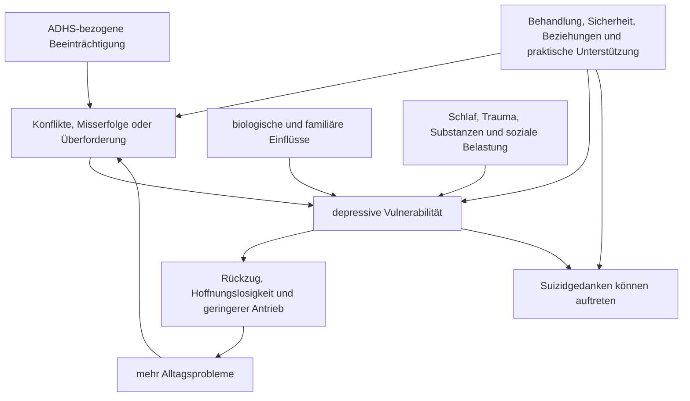

# Einheit 12 – Komorbidität, Depression und Suizidalität

## Lernziel

Du kannst ADHS, depressive Störungen und Suizidalität voneinander unterscheiden und zugleich erklären, warum sie häufiger gemeinsam auftreten. Du erkennst, weshalb ein statistisch erhöhtes Gruppenrisiko keine Vorhersage für eine einzelne Person ist, warum direkte Fragen nach Suizidgedanken fachlich sinnvoll sind und welche Warnzeichen eine sofortige Krisenhilfe erfordern. Außerdem kannst du erklären, warum Diagnostik und Behandlung mehrere Probleme gleichzeitig berücksichtigen müssen, ohne jede Krise vorschnell der ADHS zuzuschreiben.

## 1. Komorbidität bedeutet gleichzeitig, nicht identisch

**Komorbidität** bezeichnet das gleichzeitige Vorliegen mehrerer diagnostisch unterscheidbarer Erkrankungen oder Störungen. Eine Person kann daher ADHS und eine depressive Störung haben. Das bedeutet weder, dass Depression ein Bestandteil jeder ADHS ist, noch dass ADHS nur eine Variante von Depression wäre. Beide können ähnliche sichtbare Folgen haben, etwa Konzentrationsprobleme, Aufschieben, Rückzug, Schlafstörungen oder Leistungsabfall. Ihre zeitliche Entwicklung, innere Qualität und Behandlung können sich jedoch deutlich unterscheiden.

ADHS beginnt definitionsgemäß in der Entwicklung und zeigt ein über Situationen hinweg relevantes Muster von Unaufmerksamkeit und/oder Hyperaktivität-Impulsivität. Eine depressive Episode ist dagegen eine zeitlich abgrenzbare Veränderung mit anhaltend gedrückter Stimmung oder deutlich vermindertem Interesse und Freude. Hinzukommen können Hoffnungslosigkeit, Schuldgefühle, verminderter Antrieb, Schlaf- und Appetitveränderungen oder Todesgedanken. Bei Kindern und Jugendlichen kann Reizbarkeit stärker im Vordergrund stehen als offen erkennbare Traurigkeit.

> [!evidence] Evidenz: Konsens / hoch
> Depressive Störungen kommen bei Menschen mit ADHS häufiger vor als in Vergleichsgruppen. Trotzdem muss jede depressive Symptomatik eigenständig nach Verlauf, Dauer, Schwere, Funktionsbeeinträchtigung und möglichen Alternativerklärungen beurteilt werden.

Die Unterscheidung ist praktisch wichtig. Wer seit Jahren Schwierigkeiten mit Organisation hat, kann während einer Depression zusätzlich fast jedes Interesse, jede Hoffnung und Energie verlieren. Umgekehrt kann wiederholtes Scheitern bei unbehandelter oder unzureichend unterstützter ADHS zu Entmutigung führen, ohne dass bereits alle Kriterien einer depressiven Episode erfüllt sind. Eine gute Beurteilung fragt deshalb nicht nur, **welches Symptom** vorhanden ist, sondern auch: Seit wann? Gegenüber welchem früheren Zustand? In welchen Lebensbereichen? Mit welchem inneren Erleben?

## 2. Warum Depression häufiger hinzukommen kann

Aktuelle Reviews bestätigen bei Kindern und Jugendlichen mit ADHS ein erhöhtes Risiko für depressive Störungen. Langzeitstudien zeigen außerdem, dass besonders eine fortbestehende ADHS mit späteren depressiven Erkrankungen zusammenhängen kann. Diese Verbindung hat wahrscheinlich mehrere, sich überlagernde Wege und lässt sich nicht auf einen einzelnen Botenstoff oder ein einzelnes Gen reduzieren.

Mögliche Beiträge sind:

- **geteilte biologische und genetische Einflüsse**, ohne dass beide Diagnosen gleich wären;
- **anhaltende Funktionsprobleme**, etwa Konflikte, schulische oder berufliche Misserfolge und chronische Überforderung;
- **soziale Zurückweisung, Mobbing oder Einsamkeit**;
- **Schlafstörungen, Schmerzen, körperliche Erkrankungen oder Substanzkonsum**;
- zusätzliche Angst-, Verhaltens-, Trauma- oder Persönlichkeitsprobleme;
- belastende Lebensereignisse und unzureichende Unterstützung.

Solche Faktoren sind weder bei allen Menschen vorhanden noch eindeutig kausal. Beispielsweise kann eine depressive Entwicklung den Alltag verschlechtern und dadurch ADHS-bezogene Probleme sichtbarer machen. Umgekehrt kann eine schwere, anhaltende Beeinträchtigung das Risiko für Hoffnungslosigkeit erhöhen. Häufig entsteht ein wechselseitiger Verlauf statt einer einfachen Einbahnstraße.

Das Diagramm zeigt mögliche Pfade, keine unvermeidliche Kausalkette. Schutzfaktoren, rechtzeitige Behandlung und veränderte Lebensbedingungen können Verläufe beeinflussen.

## 3. Symptomüberlappung darf nicht zur diagnostischen Abkürzung werden

Konzentrationsprobleme kommen sowohl bei ADHS als auch bei Depression vor. Bei ADHS schwankt die Steuerung häufig stark mit Interesse, Neuheit, Rückmeldung und Struktur. Bei einer Depression kann die Konzentration gegenüber dem persönlichen Ausgangsniveau breiter und zusammen mit Interessenverlust, Erschöpfung oder Grübeln abfallen. Auch **Anhedonie**, also deutlich verminderte Freude oder Interesse, gehört eher zum depressiven Kern als zur ADHS.

Ähnlich vorsichtig ist Antrieb zu beurteilen. Ein Mensch mit ADHS kann eine wichtige, aber wenig unmittelbar belohnende Aufgabe nicht beginnen und dennoch für anderes lebendig und interessiert sein. Bei einer schweren Depression kann selbst früher Angenehmes leer, sinnlos oder unerreichbar wirken. Solche Unterschiede sind hilfreich, aber niemals allein beweisend. Medikamente, Schlafmangel, Angst, Trauer, körperliche Erkrankungen, Autismus, Substanzen und belastende Lebenssituationen können das Bild zusätzlich verändern.

Besonders gefährlich ist **diagnostisches Überschatten**: Neue Hoffnungslosigkeit, Selbstverletzung oder Todeswünsche dürfen nicht als „eben ADHS“ abgetan werden. Ebenso darf eine Depression nicht dazu führen, die seit der Kindheit bestehende ADHS-Anamnese zu ignorieren. Standardisierte Fragebögen können Hinweise liefern, ersetzen aber weder das Gespräch noch die Entwicklungs- und Krisenanamnese.

## 4. Suizidalität ist ein Spektrum und muss direkt erfragt werden

**Suizidalität** umfasst Gedanken an den Tod, passive Wünsche nicht mehr aufzuwachen, konkrete Suizidgedanken, Pläne, Vorbereitungen, Versuche und Suizide. Diese Zustände unterscheiden sich erheblich in Dringlichkeit. Ein flüchtiger Gedanke ist nicht dasselbe wie ein konkreter Plan mit unmittelbarer Absicht. Dennoch verdient jede Form eine ernsthafte, ruhige Abklärung.

Längsschnittliche Meta-Analysen finden bei Kindern und Jugendlichen mit ADHS im Mittel ein erhöhtes Risiko für spätere Suizidgedanken, Versuche und weitere suizidale Ereignisse. Die Studien sind heterogen: Alter, Geschlecht, ADHS-Ausprägung, Komorbiditäten, soziale Belastungen und Messmethoden unterscheiden sich. Ein erhöhtes relatives Risiko sagt zudem nicht, was bei einer bestimmten Person geschehen wird. Die große Mehrheit der Menschen mit ADHS stirbt nicht durch Suizid.

> [!important] Gruppenrisiko ist keine Individualprognose
> Weder die Diagnose ADHS noch ein einzelner Fragebogen erlaubt eine zuverlässige Vorhersage. Entscheidend ist die aktuelle individuelle Situation: konkrete Gedanken und Absicht, Planbarkeit und Zugang zu Mitteln, frühere Versuche, Intoxikation, schwere Agitiertheit oder Hoffnungslosigkeit sowie verfügbare Unterstützung und Schutz.

Direktes Fragen erhöht nicht automatisch die Gefahr. Es kann vielmehr ermöglichen, Verzweiflung auszusprechen und die notwendige Hilfe zu organisieren. Sinnvolle Fragen sind klar und nicht wertend: „Hast du in letzter Zeit gedacht, nicht mehr leben zu wollen?“ – „Gibt es einen konkreten Plan?“ – „Was hält dich im Moment sicher?“ Solche Fragen gehören bei einem Verdacht in professionelle oder verantwortliche Krisenabklärung; sie sind kein Test, den Angehörige allein bewältigen müssen.

## 5. Risikofaktoren erklären Aufmerksamkeit, nicht Schicksal

Systematische Reviews nennen zahlreiche Faktoren, die den Zusammenhang zwischen ADHS und Suizidalität mitprägen können. Dazu gehören depressive Symptome, Angst, Substanzkonsum, Impulsivität, Verhaltensprobleme, Trauma und belastende Lebensereignisse, familiäre Konflikte, Mobbing, Einsamkeit und geringe soziale Unterstützung. Viele Befunde stammen aus Beobachtungsstudien und sind nicht überall repliziert. Sie sollten deshalb als Hinweise für eine umfassende Beurteilung dienen, nicht als Punktesystem zur privaten Vorhersage.

Besonders wichtig sind frühere Suizidversuche und eine aktuelle Eskalation. Impulsivität kann die Zeit zwischen Gedanke und Handlung verkürzen, erklärt Suizidalität aber nicht allein. Depression und Hoffnungslosigkeit können eine zentrale Rolle spielen, sind jedoch ebenfalls nicht in jedem Fall vorhanden. Schutzfaktoren wie verlässliche Beziehungen, erreichbare Behandlung, ein konkreter Sicherheitsplan, reduzierte Verfügbarkeit gefährlicher Mittel und Zukunftsbezüge können relevant sein. Auch Schutz ist keine Garantie, sondern Teil einer dynamischen Einschätzung.

## 6. Nichtsuizidale Selbstverletzung ist zu unterscheiden – und trotzdem ernst

Bei **nichtsuizidaler Selbstverletzung** wird Gewebe absichtlich verletzt, ohne dass die Handlung mit der Absicht zu sterben erfolgt. Mögliche Funktionen sind kurzfristige Spannungsreduktion, Unterbrechung von Leere oder Selbstbestrafung. Sie ist daher begrifflich nicht dasselbe wie ein Suizidversuch.

Die Trennung darf jedoch nicht beruhigend missverstanden werden. Selbstverletzung und Suizidalität können bei derselben Person vorkommen, die Absicht kann wechseln oder unklar sein, und Selbstverletzung ist ein bedeutsames Warnsignal für psychische Belastung. Jede solche Handlung erfordert eine respektvolle fachliche Abklärung von Funktion, Verletzungsschwere, Suizidabsicht, Häufigkeit und Begleiterkrankungen. Beschämung und Strafandrohung verschlechtern meist die Gesprächsbasis.

## 7. Akute Gefahr: Sicherheit geht vor Ursachenanalyse

> [!warning] Bei unmittelbarer Gefahr
> Bei konkreter Suizidabsicht, einem umsetzbaren Plan, bereits begonnenen Vorbereitungen, einem Versuch, schwerer Intoxikation oder wenn die Sicherheit nicht gewährleistet werden kann: die betroffene Person nicht allein lassen, gefährliche Mittel nur ohne Eigengefährdung auf Abstand bringen und **112** beziehungsweise eine psychiatrische Notaufnahme kontaktieren. In Deutschland ist die TelefonSeelsorge kostenlos und rund um die Uhr unter **0800 1110111**, **0800 1110222** oder **116 123** erreichbar. Außerhalb Deutschlands gelten die örtlichen Notruf- und Krisendienste.

In einer akuten Situation ist nicht entscheidend, ob ADHS, Depression, Trauma oder ein Konflikt „die eigentliche Ursache“ ist. Zuerst werden Sicherheit, medizinische Versorgung und verlässliche Begleitung organisiert. Diskussionen über Schuld, Konsequenzen oder langfristige Diagnosefragen können warten.

Bei belastenden Gedanken ohne unmittelbare Gefahr sollte zeitnah professionelle Hilfe einbezogen werden: behandelnde Praxis, Hausarzt- oder kinderärztliche Praxis, Psychotherapie, psychiatrische beziehungsweise kinder- und jugendpsychiatrische Versorgung oder ein regionaler Krisendienst. Eine schriftliche Liste mit Kontaktpersonen, Warnzeichen und konkreten nächsten Schritten kann die Handlungsfähigkeit verbessern.

## 8. Behandlung muss Prioritäten und Wechselwirkungen berücksichtigen

Wenn ADHS und Depression gleichzeitig bestehen, wird nicht automatisch nur eine Diagnose „zuerst“ behandelt. Die Priorität richtet sich nach Sicherheit, Schwere, Funktionsbeeinträchtigung und zeitlichem Verlauf. Akute Suizidalität oder eine schwere depressive Episode verlangt unmittelbare Krisen- und Depressionsbehandlung. Parallel kann es wichtig sein, ADHS-bezogene Barrieren zu berücksichtigen: Termine vergessen, komplexe Pläne nicht umsetzen, Medikamente unregelmäßig einnehmen oder in unstrukturierten Hilfesystemen den Anschluss verlieren.

Eine koordinierte Behandlung kann Psychotherapie, soziale und schulische beziehungsweise berufliche Unterstützung, Behandlung von Schlaf- und Substanzproblemen sowie Medikamente umfassen. Welche Kombination passt, hängt von Alter, Diagnosen, Risiken, bisherigen Reaktionen und Präferenzen ab. Beobachtungsdaten zu ADHS-Medikamenten und Depression oder Suizidalität dürfen nicht als einfache Selbstbehandlungsregel gelesen werden; Indikation, Auswahl und Überwachung gehören in fachliche Hände.

Auch kleine praktische Anpassungen können Behandlung zugänglicher machen: schriftliche nächste Schritte, Erinnerungen, kurze Terminabstände in Krisen, Einbezug einer vertrauten Person mit Zustimmung und ein Plan für den Fall einer Verschlechterung. Solche Hilfen ersetzen keine Therapie, verringern aber vermeidbare Umsetzungsbarrieren.

## 9. Mini-Übung: Ein persönliches Warn- und Hilfenetz skizzieren

Diese Übung ist keine Risikodiagnostik. Notiere in einer ruhigen Situation:

1. zwei persönliche Zeichen, an denen du eine deutliche Verschlechterung bemerkst;
2. zwei Menschen oder Stellen, die du kontaktieren könntest;
3. einen möglichst einfachen Satz, mit dem du Hilfe anforderst;
4. den örtlichen Krisendienst, die Notaufnahme oder den Notruf;
5. eine konkrete Maßnahme, die den Zugang zu gefährlichen Mitteln in einer Krise reduziert.

Ein Beispielsatz lautet: „Mir geht es deutlich schlechter, und ich habe Gedanken, nicht mehr leben zu wollen. Bitte bleib bei mir und hilf mir, professionelle Hilfe zu erreichen.“ Wer aktuell konkret gefährdet ist, sollte diese Übung nicht allein ausarbeiten, sondern sofort Hilfe holen.

## 10. Wissenschaftliche Einordnung und Grenzen

**Konsens:** Depression und weitere psychische Erkrankungen treten bei ADHS häufiger auf. Suizidgedanken und -handlungen müssen direkt, respektvoll und differenziert erfragt werden. Akute Sicherheit hat Vorrang vor langfristiger Ursachenklärung.

**Wahrscheinlich:** Der erhöhte Gruppenbefund entsteht durch mehrere Wege, darunter depressive Symptome, anhaltende Beeinträchtigung, soziale Belastungen, Trauma, Substanzkonsum und teilweise geteilte biologische Einflüsse. Gute Behandlung und soziale Unterstützung können relevante Risiken beeinflussen.

**Umstritten:** Wie stark einzelne Merkmale den Zusammenhang unabhängig erklären und welche Schutzfaktoren bei welchen Gruppen besonders wirksam sind. Unterschiede zwischen Studien verhindern ein einfaches allgemeines Risikomodell.

**Experimentell:** Algorithmen, digitale Verhaltensdaten und kombinierte Vorhersagemodelle sollen akute Risiken besser erkennen. Ihre Fehlerquoten und Übertragbarkeit reichen derzeit nicht aus, um klinische Gespräche oder individuelle Krisenbeurteilung zu ersetzen.

## 11. Verbindung zu Autismus und Parkinson

Bei Autismus kommen Depression, Selbstverletzung und Suizidalität ebenfalls vor; Kommunikationsweise, sensorische Belastung, soziale Ausgrenzung und sogenannte Camouflaging-Erfahrungen können die Beurteilung beeinflussen. Die gemeinsame Belastung macht Autismus und ADHS nicht identisch. Fragen und Hilfen müssen an Kommunikation und Unterstützungsbedarf angepasst werden.

Bei Parkinson sind Depression und Suizidgedanken ebenfalls klinisch relevant, entstehen aber im Kontext einer neurodegenerativen Erkrankung, ihrer körperlichen Folgen und Behandlung. Daraus folgt keine direkte krankheitsbiologische Gleichsetzung mit ADHS.

## Review-Frage

**Warum reicht die Aussage „ADHS erhöht das Suizidrisiko“ weder für eine individuelle Prognose noch für eine gute Krisenbeurteilung aus?**

Antwort

Weil der Befund aus Gruppenvergleichen stammt und die individuelle Situation von aktuellen Gedanken, Absicht und Planung, früheren Versuchen, Depression, Substanzkonsum, Belastungen, Unterstützung und weiteren Faktoren abhängt. Eine gute Beurteilung fragt direkt nach der gegenwärtigen Gefahr, organisiert bei Bedarf sofort Sicherheit und behandelt gleichzeitig bestehende Erkrankungen und praktische Barrieren.

## Wissenschaftliche Quelle

[[references/Garas2025|Garas et al. 2025]] – systematische Übersichtsarbeit und Meta-Analyse longitudinaler Studien zu Suizidalität bei Kindern und Jugendlichen mit ADHS.

[[references/Rother2025|Rother et al. 2025]] – systematischer Review zu moderierenden und vermittelnden Faktoren zwischen ADHS und Suizidalität im Jugendalter.

[[references/Zhang2025|Zhang et al. 2025]] – systematische Übersichtsarbeit und Meta-Analyse zu Depression und Angst bei Kindern und Jugendlichen mit ADHS.

[[references/vanDerPlas2026|van der Plas et al. 2026]] – systematische Übersichtsarbeit und Meta-Analyse langfristiger psychiatrischer Folgen einer ADHS im Kindesalter.

[[references/AADPA2022|AADPA 2022]] – evidenzbasierte Leitlinie zur multimethodalen Beurteilung, Komorbidität und risikoorientierten Versorgung.

## Merksatz

> ADHS, Depression und Suizidalität sind unterscheidbar, können sich aber über mehrere Belastungswege verbinden: Gruppenrisiken verlangen Aufmerksamkeit, während die konkrete aktuelle Gefahr immer individuell und direkt beurteilt werden muss.

## Navigation

- Zurück: [[01-Grundlagen/11-Schlaf-Bewegung-und-koerperliche-Gesundheit|Schlaf, Bewegung und körperliche Gesundheit]]
- Weiter: [[README|Übersicht]]
- [[Glossar]] · [[Literatur]] · [[knowledge-graph/README|Wissensgraph]]
