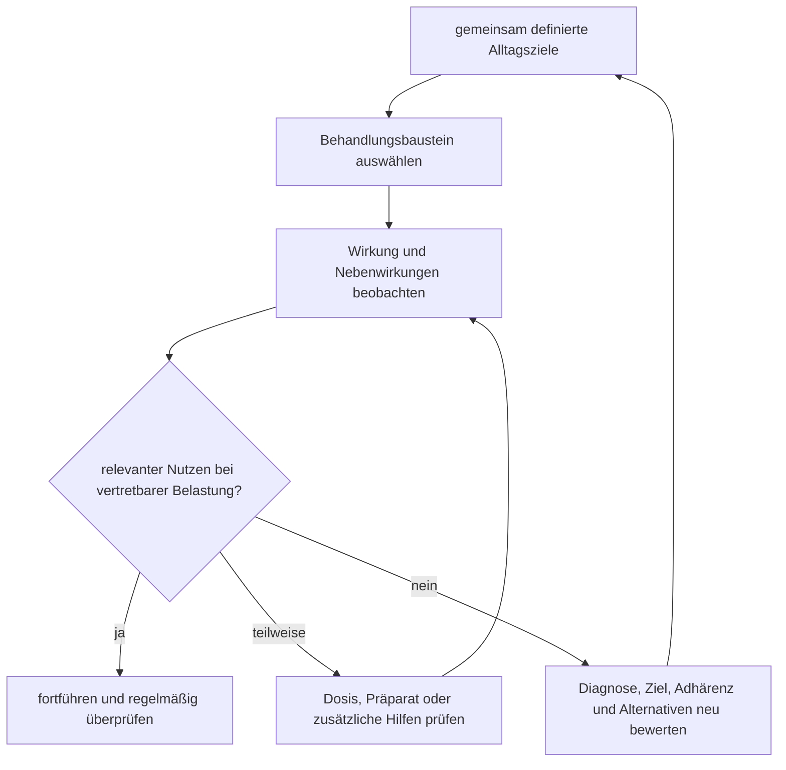

# Einheit 13 – Pharmakotherapie und Psychotherapie

## Lernziel

Du kannst erklären, welche Ziele Medikamente, psychologische Verfahren und Anpassungen des Umfelds bei ADHS verfolgen. Du verstehst, warum Behandlung weder ein Beweis für die Diagnose noch eine „Heilung“ ist, weshalb kurzfristige Symptomwirkung nicht automatisch langfristige Lebensqualität bedeutet und warum Alter, Begleiterkrankungen, Präferenzen, Nebenwirkungen und konkrete Alltagsziele die Auswahl mitbestimmen. Außerdem kannst du zwischen Psychoedukation, Verhaltenstherapie, kognitiver Verhaltenstherapie und allgemeiner Unterstützung unterscheiden.

## 1. Behandlung beginnt mit Zielen, nicht mit einer Lagerentscheidung

Die Frage „Medikamente oder Psychotherapie?“ klingt nach zwei konkurrierenden Weltanschauungen. Wissenschaftlich sinnvoller ist eine andere Reihenfolge: Welche Beeinträchtigung soll sich verändern, welche Bedingungen tragen zu ihr bei, welche Behandlung ist für diese Person zugänglich und wie wird geprüft, ob Nutzen und Belastung tatsächlich in einem guten Verhältnis stehen?

Ein Kind kann vor allem durch Unterrichtsabbrüche, impulsive Konflikte und familiäre Eskalationen beeinträchtigt sein. Eine erwachsene Person kann trotz weniger sichtbarer Hyperaktivität an Zeitmanagement, Arbeitsorganisation, emotionaler Überlastung oder wiederholtem Scheitern komplexer Routinen leiden. Medikamente, Elterntraining, schulische Anpassungen und kognitive Verhaltenstherapie greifen nicht an exakt derselben Stelle an. Deshalb ist eine gemeinsame Behandlungsplanung wichtiger als die Suche nach einer universellen Rangliste.

> [!evidence] Evidenz: Konsens / hoch
> ADHS-Behandlung soll individuell, zielorientiert und regelmäßig überprüft werden. Medikamente können Kernsymptome deutlich reduzieren; psychologische und verhaltensbezogene Verfahren können Strategien, Umfeld, Funktionsbeeinträchtigung und Begleitprobleme bearbeiten. Keine Methode wirkt bei allen Menschen gleich gut.

Eine Behandlung kann wirksam sein, ohne alle Schwierigkeiten zu beseitigen. Umgekehrt beweist eine fehlende Wirkung eines einzelnen Medikaments oder einer einzelnen Therapie nicht, dass keine ADHS vorliegt. Diagnose und Behandlungserfolg sind unterschiedliche Fragen.

## 2. Was Pharmakotherapie im Durchschnitt leisten kann

Für mehrere zugelassene ADHS-Medikamente zeigen randomisierte Studien eine kurzfristige Reduktion von Unaufmerksamkeit, Hyperaktivität und Impulsivität. Zu den häufig verwendeten Gruppen gehören Stimulanzien wie Methylphenidat oder Amphetaminpräparate sowie Nichtstimulanzien wie Atomoxetin und – je nach Alter, Land und Zulassung – weitere Wirkstoffe. Welche Reihenfolge empfohlen wird, unterscheidet sich zwischen Altersgruppen, Leitlinien und Zulassungen.

Bei Erwachsenen fand eine große Netzwerk-Meta-Analyse von 113 randomisierten Studien die robusteste kurzfristige Symptomwirkung für Stimulanzien und Atomoxetin, wenn sowohl Selbst- als auch Fremdbeurteilungen berücksichtigt wurden. Für Kinder und Jugendliche bestätigen systematische Reviews, dass Medikamente im Mittel Kernsymptome reduzieren. Solche Mittelwerte sagen jedoch nicht voraus, welches Präparat einer einzelnen Person hilft, welche Nebenwirkungen auftreten oder ob eine Veränderung im Alltag groß genug ist, um für sie relevant zu sein.

Wichtig ist außerdem die Messdauer. Viele kontrollierte Studien dauern nur einige Wochen oder wenige Monate. Damit lässt sich die kurzfristige Wirksamkeit besser beurteilen als die Frage, wie sich eine Behandlung über Jahre auf Bildung, Beziehungen, körperliche Gesundheit oder Lebensqualität auswirkt. Beobachtungsstudien können längere Verläufe ergänzen, sind aber anfälliger für Unterschiede zwischen behandelten und unbehandelten Gruppen.

Medikamente verändern auch nicht automatisch erlernte Strategien, Schulbedingungen, chronische Konflikte oder fehlende Unterstützung. Wenn jemand nach einer Symptomverbesserung weiterhin keine planbare Arbeitsstruktur besitzt, bleibt ein Teil der Beeinträchtigung bestehen. Das ist kein Widerspruch zur Medikamentenwirkung, sondern zeigt, dass Kernsymptome und Lebensführung nicht identisch sind.

## 3. Dosisfindung bedeutet systematisches Prüfen – nicht „mehr hilft mehr“

Die passende Dosis ist keine aus Körpergewicht, Diagnose oder Schweregrad sicher berechenbare Zahl. Fachlich wird sie schrittweise innerhalb der zugelassenen Grenzen angepasst. Beobachtet werden vorher definierte Zielbereiche, Wirkdauer, Nebenwirkungen und Alltagssituationen. Dabei kann eine zu niedrige Dosis unzureichend wirken, während eine weitere Steigerung irgendwann kaum zusätzlichen Nutzen, aber mehr unerwünschte Wirkungen bringt.

Eine 2026 veröffentlichte Dosis-Wirkungs-Netzwerk-Meta-Analyse beschreibt solche durchschnittlichen Kurven über verschiedene Medikamente und Altersgruppen. Sie unterstützt weder private Dosisexperimente noch eine starre „optimale“ Zahl. Studienmittelwerte können individuelle Unterschiede bei Aufnahme, Wirkdauer, Begleiterkrankungen, anderen Medikamenten und Empfindlichkeit nicht ersetzen. Für die Arbeit ist die korrigierte Fassung zu berücksichtigen, da die Zeitschrift später eine formale Korrektur veröffentlichte.

Typische Beobachtungsbereiche sind Appetit, Gewicht beziehungsweise Wachstum bei Kindern, Schlaf, Puls und Blutdruck, Stimmung, Reizbarkeit, Tics, Wirkung über den Tag sowie Fehlgebrauch oder Weitergabe. Nicht jede Veränderung ist automatisch durch das Medikament verursacht. Deshalb sind Ausgangswerte, zeitlicher Verlauf und kontrollierte Änderungen wichtig. Eine jährliche Gesamtüberprüfung fragt zusätzlich, ob das Mittel weiterhin benötigt wird, ob Ziele erreicht werden und welche Unterstützung trotz optimierter Medikation fehlt.

## 4. Psychotherapie ist nicht einfach „über ADHS reden“

**Psychoedukation** vermittelt ein realistisches Verständnis von ADHS, Behandlung und Selbstbeobachtung. Sie kann Schuldzuweisungen reduzieren und gemeinsame Ziele klären, ist aber allein nicht automatisch eine vollständige Psychotherapie. Verhaltenstherapeutische Elternprogramme arbeiten beispielsweise mit klaren Regeln, unmittelbarer Rückmeldung, positiver Verstärkung, planbaren Konsequenzen und der Veränderung eskalierender Interaktionsmuster. Schulische Interventionen passen Aufgaben, Rückmeldung, Sitzordnung, Pausen und Organisationshilfen an.

Bei Erwachsenen werden häufig strukturierte ADHS-spezifische psychologische Interventionen eingesetzt. Kognitive Verhaltenstherapie kann Fertigkeiten für Planung, Priorisierung, Ablenkungsmanagement, Aufschieben, problematische Gedankenmuster und Emotionsregulation trainieren. Meta-Analysen randomisierter Studien berichten im Mittel Verbesserungen von ADHS-Symptomen und teilweise zusätzlichen Bereichen. Die Befunde sind jedoch schwieriger zu verblinden als Medikamentenstudien: Teilnehmende und Therapeuten wissen meist, welche Behandlung erfolgt, und Beurteilungen durch unblinde Personen können Effekte größer erscheinen lassen.

Für Kinder und Jugendliche zeigen zusammenfassende Reviews sowohl für pharmakologische als auch für psychologische Interventionen durchschnittliche Verbesserungen. Die Effekte psychologischer Verfahren sind oft kleiner und hängen stark davon ab, wer bewertet, welches Ziel gemessen wird und wie gut die Intervention zum Alter passt. Das bedeutet nicht, dass sie „unwirksam“ seien. Ein Elterntraining kann familiäre Abläufe und oppositionelles Verhalten verbessern, ohne jede Aufmerksamkeitsbewertung in der Schule gleich stark zu verändern.

Allgemeine Gesprächstherapie ohne ADHS-spezifische Struktur ist nicht dasselbe wie ein geprüftes Fertigkeitenprogramm. Gleichzeitig darf Therapie nicht zu einem moralischen Training werden, in dem Schwierigkeiten als mangelnde Anstrengung bewertet werden. Gute Interventionen verändern Anforderungen, üben konkrete Schritte und berücksichtigen, dass das Umsetzen einer Strategie selbst exekutive Funktionen benötigt.

## 5. Kombination heißt nicht automatisch doppelte Wirkung

Leitlinien empfehlen je nach Alter, Schwere, Kontext und Präferenz unterschiedliche Einstiege. Bei kleinen Kindern stehen verhaltensbezogene und elternbezogene Maßnahmen besonders im Vordergrund. Bei älteren Kindern, Jugendlichen und Erwachsenen kann eine Medikation bei relevanter Beeinträchtigung angeboten werden; psychologische Behandlung kommt als Alternative, Ergänzung oder gezielte Hilfe bei verbleibenden Funktionsproblemen hinzu.

Die intuitive Annahme „Medikament plus Therapie muss immer besser sein als eines allein“ ist wissenschaftlich zu einfach. Direkte vergleichende Evidenz für jede Kombination und jedes Ziel ist begrenzt. Ein zusätzlicher Baustein ist vor allem dann sinnvoll, wenn er ein noch bestehendes Problem adressiert: etwa Elterntraining bei eskalierenden Familienkonflikten, schulische Unterstützung bei organisatorischen Barrieren oder kognitive Verhaltenstherapie bei fortbestehendem Aufschieben und Selbstabwertung.

Auch praktische Zugänglichkeit zählt. Eine theoretisch geeignete Therapie hilft wenig, wenn Wartezeiten, Kosten, Reizüberlastung, Sprachbarrieren oder komplexe Terminorganisation ihre Nutzung verhindern. Gemeinsame Entscheidungsfindung bedeutet daher nicht bloß, mehrere Optionen aufzuzählen. Fachperson und betroffene Person besprechen erwartbaren Nutzen, Unsicherheit, Belastung, Werte und Umsetzbarkeit und legen fest, woran Erfolg oder ein notwendiger Wechsel erkannt werden.

## 6. Sicherheit und Begleiterkrankungen gehören in denselben Plan

Vor einer Medikation werden Diagnose, Behandlungsbedarf, psychische und soziale Situation, körperliche Vorgeschichte, bestehende Medikamente sowie relevante Herz-Kreislauf-Risiken geprüft. Ein unauffälliges Standard-EKG ist nicht bei jeder Person zwingend erforderlich; auffällige Vorgeschichte, Untersuchung oder andere Risiken verändern jedoch die Abklärung. Im Verlauf gehören Blutdruck, Puls, Appetit, Gewicht, Schlaf und psychische Veränderungen in die Beobachtung.

Komorbiditäten verändern Prioritäten. Bei akuter Suizidalität oder schwerer Depression steht Sicherheit im Vordergrund. Angst, Substanzkonsum, Tics, Autismus, Lernstörungen und körperliche Erkrankungen können Auswahl, Tempo und Zielsetzung beeinflussen. Sie schließen eine ADHS-Behandlung nicht automatisch aus. Zugleich darf eine Verbesserung der Aufmerksamkeit nicht dazu führen, andere Erkrankungen zu übersehen.

Besondere Vorsicht gilt Selbstmedikation und Weitergabe. Verschreibungspflichtige Stimulanzien sind keine allgemeinen Leistungssteigerer. Eine fremde Dosis, ein nicht ärztlich begleitetes Präparat oder eine eigenständige Veränderung kann körperliche und psychische Risiken erhöhen. Sichere Behandlung umfasst Aufbewahrung, Einnahmeplan, kontrollierte Verschreibung und offene Gespräche über Konsum und Fehlgebrauch.

## 7. Mini-Übung: Ziele in beobachtbare Veränderungen übersetzen

Wähle ein konkretes Problem, etwa „Ich verliere bei langen Aufgaben den Faden“. Formuliere dazu drei Ebenen:

1. **Kernsymptom:** Wie oft schweift die Aufmerksamkeit ab oder wird die Aufgabe verlassen?
2. **Funktion:** Welcher konkrete Schritt gelingt oder misslingt, beispielsweise 20 Minuten an einem Abschnitt zu arbeiten?
3. **Lebensziel:** Warum ist die Veränderung wichtig, etwa ein Projekt verlässlich abschließen zu können?

Notiere anschließend, welcher Baustein welche Ebene plausibel adressiert: Medikament, Arbeitsumgebung, Erinnerungssystem, Therapieübung oder Unterstützung durch andere. Diese Tabelle entscheidet keine Behandlung. Sie macht sichtbar, warum ein Symptomfragebogen allein nicht genügt und weshalb verschiedene Maßnahmen unterschiedliche Erfolge haben können.

## 8. Wissenschaftliche Einordnung und Grenzen

**Konsens:** Medikamente und strukturierte psychosoziale beziehungsweise psychologische Interventionen sind evidenzbasierte Behandlungsbausteine. Auswahl und Verlaufskontrolle sollen individuell und gemeinsam erfolgen. Medikamente benötigen fachliche Einleitung und Monitoring.

**Wahrscheinlich:** Stimulanzien und Atomoxetin gehören bei Erwachsenen kurzfristig zu den wirksamsten Optionen für Kernsymptome. Bei Kindern und Jugendlichen wirken mehrere Medikamente; Elterntraining, schulische Maßnahmen und weitere psychologische Interventionen können Symptome, Verhalten oder Funktionsbereiche verbessern. ADHS-spezifische kognitive Verhaltenstherapie kann Erwachsenen zusätzliche Strategien vermitteln.

**Umstritten:** Welche Kombination für welche Person langfristig den größten funktionellen Nutzen bietet, wie stark kurzfristige Symptomverbesserungen Lebensqualität und Teilhabe verändern und welche Merkmale eine individuelle Wirkung zuverlässig vorhersagen.

**Experimentell:** digitale Therapeutika, neurofeedbackbasierte Verfahren, Neurostimulation und algorithmische Auswahlmodelle. Für einige Verfahren gibt es positive Einzelbefunde, aber keine Grundlage, etablierte Behandlung pauschal zu ersetzen.

## 9. Verbindung zu Autismus und Parkinson

Bei gleichzeitigem Autismus können ADHS-Medikamente und psychologische Interventionen grundsätzlich erwogen werden. Kommunikation, sensorische Belastung, Routinen, Ziele und Nebenwirkungsbeobachtung müssen jedoch angepasst werden. Eine gemeinsame Medikamentenwirkung macht Autismus und ADHS nicht zu derselben Diagnose.

Bei Parkinson werden ebenfalls Medikamente eingesetzt, die dopaminerge Systeme beeinflussen. Daraus folgt keine Gleichsetzung: Parkinson ist eine neurodegenerative Erkrankung mit anderen Zielstrukturen, Symptomen und Behandlungsentscheidungen. Der Begriff „Dopamin“ allein erklärt weder eine ADHS-Behandlung noch eine Verbindung beider Erkrankungen.

## Review-Frage

**Warum ist die Frage „Medikament oder Psychotherapie – was ist besser?“ für eine gute ADHS-Behandlung zu grob?**

Antwort

Weil unterschiedliche Behandlungsbausteine unterschiedliche Ziele adressieren. Medikamente können Kernsymptome kurzfristig deutlich reduzieren, während psychologische, familiäre, schulische und organisatorische Interventionen Strategien, Umfeld und verbleibende Funktionsprobleme bearbeiten. Die passende Auswahl hängt von Alter, Beeinträchtigung, Begleiterkrankungen, Präferenzen, Nebenwirkungen, Zugänglichkeit und den vorher festgelegten Alltagszielen ab.

## Wissenschaftliche Quelle

[[references/Ostinelli2025|Ostinelli et al. 2025]] – umfassende Netzwerk-Meta-Analyse randomisierter Behandlungen bei Erwachsenen.

[[references/Peterson2024|Peterson et al. 2024]] – systematische Übersicht kontrollierter Behandlungen bei Kindern und Jugendlichen.

[[references/Tuerk2023|Türk et al. 2023]] – Umbrella-Review und Meta-Meta-Analyse pharmakologischer und psychologischer Interventionen bei jungen Menschen.

[[references/Liu2023|Liu et al. 2023]] – Meta-Analyse randomisierter kognitiv-verhaltenstherapeutischer Interventionen bei Erwachsenen.

[[references/Nourredine2026|Nourredine et al. 2026]] – Dosis-Wirkungs-Netzwerk-Meta-Analyse von ADHS-Medikamenten über Altersgruppen.

[[references/AADPA2022|AADPA 2022]] – evidenzbasierte Leitlinie zu gemeinsamer Planung, Pharmakotherapie, psychologischen Interventionen und Monitoring.

## Merksatz

> Gute ADHS-Behandlung ist kein Wettbewerb zwischen Medikament und Psychotherapie, sondern ein überprüfbarer Plan: Der passende Baustein muss ein relevantes Ziel erreichen, im Alltag umsetzbar sein und mehr Nutzen als Belastung erzeugen.

## Navigation

- Zurück: [[01-Grundlagen/12-Komorbiditaet-Depression-und-Suizidalitaet|Komorbidität, Depression und Suizidalität]]
- Weiter: [[README|Übersicht]]
- [[Glossar]] · [[Literatur]] · [[knowledge-graph/README|Wissensgraph]]
