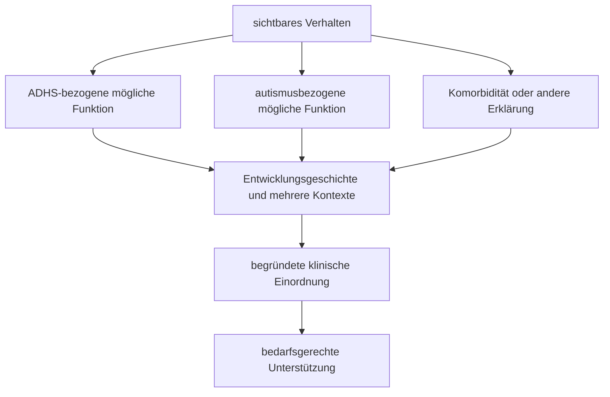

# Einheit 14 – Autismus und ADHS: Koexistenz, Überlappung und Abgrenzung

## Lernziel

Du kannst die diagnostischen Kernbereiche von ADHS und Autismus voneinander unterscheiden und zugleich erklären, warum beide Neuroentwicklungsstörungen häufiger gemeinsam auftreten. Du erkennst, weshalb ähnliche sichtbare Verhaltensweisen unterschiedliche Funktionen oder Entstehungswege haben können, warum Fragebögen und einzelne Tests keine Doppeldiagnose beweisen und wie diagnostisches Überschatten sowie Masking die Beurteilung erschweren. Außerdem verstehst du, warum gemeinsame genetische, kognitive oder neuronale Gruppenbefunde keine Gleichsetzung erlauben und weshalb Unterstützung die Bedürfnisse beider Diagnosen gleichzeitig berücksichtigen muss.

## 1. Zwei unterscheidbare Neuroentwicklungsstörungen können gemeinsam auftreten

ADHS und Autismus werden beide als Neuroentwicklungsstörungen eingeordnet. Das bedeutet, dass ihre relevanten Merkmalsmuster früh in der Entwicklung beginnen und sich über die Lebensspanne in wechselnder Form zeigen können. Daraus folgt jedoch nicht, dass beide dasselbe seien oder lediglich verschiedene Schweregrade eines einzigen Spektrums darstellten.

Bei ADHS liegen die diagnostischen Kernbereiche in einem anhaltenden Muster von **Unaufmerksamkeit** und/oder **Hyperaktivität-Impulsivität**, das in mehreren Lebensbereichen zu relevanter Beeinträchtigung führt. Bei Autismus betreffen die Kernbereiche anhaltende Besonderheiten der **sozialen Kommunikation und sozialen Interaktion** sowie **restriktive oder repetitive Verhaltensweisen, Interessen oder Aktivitäten**; dazu gehören in den Klassifikationssystemen auch sensorische Besonderheiten. Für beide Diagnosen müssen Entwicklungsgeschichte, Kontext und Funktionsbeeinträchtigung betrachtet werden.

> [!evidence] Evidenz: Konsens / hoch
> ADHS und Autismus sind diagnostisch unterscheidbare, heterogene Neuroentwicklungsstörungen. Sie können bei derselben Person gemeinsam vorliegen. Eine Diagnose darf die andere weder automatisch beweisen noch ausschließen.

Bis zur Veröffentlichung des DSM-5 im Jahr 2013 war eine gleichzeitige formale Diagnose in älteren diagnostischen Regeln unnötig eingeschränkt. Diese historische Trennung wirkte lange auf Forschung und Versorgung nach. Heute ist die Koexistenz ausdrücklich anerkannt. Der fachlich passendere Ausgangspunkt lautet daher nicht „ADHS oder Autismus?“, sondern bei begründetem Verdacht: „Welche Kernmerkmale, Entwicklungsverläufe und Beeinträchtigungen sprechen für ADHS, für Autismus, für beides oder für eine andere Erklärung?“

## 2. Ähnliche Oberfläche bedeutet nicht gleiche Funktion

Viele Alltagsbeobachtungen sind diagnostisch mehrdeutig. Eine Person unterbricht Gespräche, verpasst soziale Signale oder wirkt unflexibel. Solche Beschreibungen sagen zunächst, **was sichtbar geschieht**, aber noch nicht zuverlässig, **warum** es geschieht.

Beispiele:

- Ein Gesprächsbeitrag kann wegen impulsiven Antwortens zu früh kommen. Er kann aber auch entstehen, weil unausgesprochene Gesprächsregeln schwer erkennbar sind. Beides kann gleichzeitig vorkommen.
- Soziale Kontakte können wegen vergessener Nachrichten, Zeitproblemen oder wechselnder Aufmerksamkeit abbrechen. Daneben können Schwierigkeiten mit wechselseitiger Kommunikation, impliziten Erwartungen oder sensorisch belastenden Situationen bestehen.
- Eine Routine kann als externe Kompensation für ADHS-Organisation dienen. Sie kann zugleich ein starkes Bedürfnis nach Vorhersagbarkeit abbilden. Die sichtbare Regelmäßigkeit allein trennt beides nicht.
- Intensive Beschäftigung kann durch hohes Interesse, Neuheit oder schwer unterbrechbare Aufmerksamkeit verstärkt werden. Ein starkes oder spezialisiertes Interesse ist trotzdem nicht automatisch ein autistisches Kernmerkmal; entscheidend sind Qualität, Entwicklung, Funktion und Gesamtmuster.
- Reizempfindlichkeit kommt nicht ausschließlich bei Autismus vor. Schlafmangel, Angst, Migräne, Trauma, ADHS und weitere Bedingungen können sensorische Belastbarkeit verändern.

Das Diagramm zeigt keine private Diagnoseroutine. Es verdeutlicht, warum dieselbe Oberfläche über mehrere Informationsquellen und den Verlauf eingeordnet werden muss.

## 3. Koexistenz ist häufig – Prävalenzzahlen sind aber keine persönliche Diagnose

Systematische Übersichten zeigen, dass ADHS zu den häufigen Begleitdiagnosen bei autistischen Menschen gehört. Umgekehrt finden Untersuchungen bei Menschen mit primärer ADHS-Diagnose nicht selten erhöhte autistische Merkmale. Die Größenordnungen schwanken jedoch stark zwischen Studien, weil Alter, Rekrutierung, intellektuelle und sprachliche Voraussetzungen, diagnostische Verfahren und Definitionen unterschiedlich sind.

Eine große Meta-Analyse zu Begleiterkrankungen bei Autismus schloss 340 Publikationen mit insgesamt ungefähr 590.000 Teilnehmenden ein. Sie bestätigt ADHS als häufige koexistierende Bedingung, zeigt aber zugleich deutliche Unterschiede zwischen klinischen und populationsbezogenen Stichproben sowie zwischen Altersgruppen. Eine systematische Übersicht zu autistischen Symptomen bei primärer ADHS fand nur neun passende Studien und sehr variable Raten klinisch auffälliger Screeningwerte. Solche Screeningwerte sind keine Autismusdiagnosen.

Drei Fehlschlüsse sind besonders wichtig:

1. **„Viele Überschneidungen bedeuten, dass beide dasselbe sind.“** Häufige Koexistenz setzt begrifflich voraus, dass unterscheidbare Merkmalsbereiche gemeinsam vorkommen können.
2. **„Ein hoher Autismusfragebogen bei ADHS beweist Autismus.“** Fragebögen können einen Abklärungsbedarf anzeigen; sie erfassen aber auch unspezifische Belastungen und überlappende Verhaltensweisen.
3. **„Eine ADHS-Diagnose erklärt automatisch alle autistischen Merkmale.“** Dadurch kann eine zusätzliche Diagnose und passende Unterstützung übersehen werden.

Gruppenprävalenzen helfen bei der Aufmerksamkeit für mögliche Koexistenz. Sie sagen nicht, ob eine konkrete Person beide Diagnosen erfüllt.

## 4. Gute Diagnostik prüft Kernbereiche, Entwicklung und mehrere Perspektiven

Eine sorgfältige Beurteilung verbindet klinische Gespräche, Entwicklungsgeschichte, konkrete Beispiele aus mehreren Lebensbereichen und Fremdinformationen, soweit sie verfügbar und sinnvoll sind. Standardisierte Interviews, Fragebögen oder Beobachtungsverfahren können unterstützen, dürfen aber nicht isoliert entscheiden.

Für ADHS wird beispielsweise geprüft, ob Unaufmerksamkeit oder Hyperaktivität-Impulsivität früh begonnen haben, situationsübergreifend auftreten und relevante Beeinträchtigungen verursachen. Für Autismus wird unter anderem rekonstruiert, wie soziale Gegenseitigkeit, nonverbale Kommunikation, Beziehungen, repetitive Muster, Interessen, Routinen und sensorische Verarbeitung seit der Entwicklung ausgeprägt waren. Dabei ist nicht jede Besonderheit krankhaft; diagnostisch zählt das gesamte Muster einschließlich Unterstützungsbedarf und Funktion.

Informationen können widersprüchlich sein. Eine Person wirkt in einer strukturierten Untersuchung sehr angepasst, ist danach aber erschöpft. Eltern erinnern frühe Besonderheiten anders als die betroffene Person. Schule oder Beruf sehen nur die kompensierte Außenleistung. Solche Unterschiede sollten erklärt statt einfach gemittelt werden.

**Masking** oder **Camouflaging** beschreibt Strategien, mit denen Menschen sichtbare autistische Merkmale verbergen, soziale Regeln bewusst nachahmen oder Belastung überspielen. Auch Menschen mit ADHS entwickeln Kompensationen, etwa extreme Kontrolle, mehrfaches Prüfen oder rigide Hilfssysteme. Masking ist kein eigener Beweis für Autismus und nicht auf ein Geschlecht beschränkt. Es kann jedoch erklären, warum äußere Unauffälligkeit und innere Belastung auseinanderliegen.

**Diagnostisches Überschatten** wirkt in beide Richtungen. Nach einer Autismusdiagnose können Unaufmerksamkeit und Impulsivität vollständig als Teil des Autismus abgetan werden. Nach einer ADHS-Diagnose können soziale Kommunikationsunterschiede, repetitive Muster oder sensorische Bedürfnisse übersehen werden. Eine bereits bekannte Diagnose ist deshalb eine wichtige Information, aber keine vollständige Erklärung jedes neuen Problems.

## 5. Gemeinsame Gruppenbefunde sind keine Gleichsetzung und kein Biomarker

Genetische Studien zeigen eine teilweise Überlappung statistischer Einflüsse zwischen ADHS und Autismus. Forschung findet außerdem in beiden Gruppen durchschnittliche Unterschiede in Bereichen wie Aufmerksamkeit, exekutiven Funktionen oder sensorischer Verarbeitung. Diese Befunde sind wissenschaftlich relevant, aber leicht zu überdehnen.

Eine genetische Korrelation bedeutet nicht, dass dieselben Varianten bei jeder Person vorliegen oder dass beide Diagnosen identische Ursachen haben. Neuropsychologische Gruppenunterschiede besitzen große Überlappungen. Bildgebung und Labortests können derzeit weder ADHS noch Autismus bei einer Einzelperson zuverlässig bestätigen, geschweige denn beide sauber voneinander trennen.

Eine große, präregistrierte Untersuchung mit mehr als 5.500 Erwachsenen analysierte einzelne autistische und ADHS-bezogene Merkmale als Netzwerke. Die geringe direkte Vernetzung vieler Einzelmerkmale stützte die Trennbarkeit beider Konstrukte. Merkmale der Aufmerksamkeitskontrolle bildeten zwar mögliche Brücken, erklärten die gemeinsame Variation aber nicht vollständig. Das spricht gegen die Behauptung, eine einzige Exekutivfunktion mache beide Diagnosen zu demselben Zustand.

> [!important] Gruppenbefund ≠ Individualtest
> Geteilte Gene, Netzwerke oder Testschwierigkeiten können Forschungsmodelle verbessern. Sie liefern derzeit keinen klinischen Biomarker, der bei einer Person „ADHS“, „Autismus“ oder die Koexistenz sicher abliest.

## 6. Das gemeinsame Profil kann widersprüchliche Bedürfnisse erzeugen

Bei koexistierendem ADHS und Autismus addieren sich nicht einfach zwei Checklisten. Merkmale können sich gegenseitig verstärken, verdecken oder scheinbar widersprechen.

Eine Person kann Neuheit und unmittelbare Rückmeldung benötigen, zugleich aber unerwartete Veränderungen als stark belastend erleben. Sie kann leicht von Reizen abgelenkt werden und gleichzeitig sensorisch überlastet sein. Ein intensiver Fokus kann den Start erleichtern, aber einen Wechsel erschweren. Eine Routine kann Stabilität geben, während die vielen Einzelschritte ihrer Aufrechterhaltung an Planung und Arbeitsgedächtnis scheitern. Soziale Situationen können gleichzeitig durch impulsives Sprechen, vergessene Absprachen, unklare implizite Regeln und Erschöpfung belastet sein.

Dieses Profil ist nicht unlogisch. Es zeigt, dass „mehr Struktur“ oder „mehr Flexibilität“ ohne genaue Zieldefinition zu grobe Empfehlungen sind. Hilfreich kann eine Struktur sein, die vorhersehbar **und** anpassbar ist: klare Absprachen, sichtbare Übergänge, Vorwarnung bei Änderungen, kurze Handlungsschritte, reizärmere Optionen und ausdrücklich erklärte soziale Erwartungen.

Zusätzliche Angst, Depression, Schlafprobleme, Lernstörungen, Tic-Störungen oder körperliche Erkrankungen müssen separat berücksichtigt werden. Koexistenz bedeutet nicht, dass jede Schwierigkeit aus ADHS plus Autismus stammt.

## 7. Unterstützung behandelt Ziele – nicht Etiketten gegeneinander

Unterstützung sollte an konkreten Beeinträchtigungen und Präferenzen ausgerichtet sein. Psychoedukation kann erklären, wie beide Merkmalsbereiche zusammenwirken. Umfeldanpassungen können Reizlast, Unklarheit und exekutive Anforderungen reduzieren. Psychologische Interventionen müssen Kommunikationsstil, sensorische Bedürfnisse, Lerntempo und mögliche Schwierigkeiten bei der Übertragung allgemeiner Regeln berücksichtigen.

Wenn bei einer autistischen Person zusätzlich ADHS diagnostiziert ist, können etablierte ADHS-Medikamente zur Behandlung der ADHS-Kernsymptome erwogen werden. Sie behandeln nicht die autistischen Kernmerkmale. Wirkung und Nebenwirkungen müssen individuell und fachlich überwacht werden; die Evidenz speziell für koexistierende Gruppen ist kleiner und heterogener als die allgemeine ADHS-Evidenz. Eine Autismusdiagnose ist weder pauschaler Ausschlussgrund noch Begründung für eine Medikation ohne ADHS.

Therapie sollte nicht darauf zielen, eine Person möglichst unauffällig wirken zu lassen. Erlernte soziale Strategien können freiwillig nützlich sein, doch erzwungenes dauerhaftes Masking kann hohe Anstrengung und Selbstentfremdung bedeuten. Gemeinsame Entscheidungsfindung fragt deshalb: Welches Problem soll sich verändern? Welche Anpassung respektiert die Person? Wie wird Nutzen im Alltag gemessen? Welche Belastung entsteht durch die Maßnahme selbst?

## 8. Mini-Übung: Beobachtung in Funktion übersetzen

Wähle eine konkrete Situation, zum Beispiel ein Gruppengespräch, einen Aufgabenwechsel oder eine Planänderung. Notiere ohne diagnostisches Urteil:

1. Was war sichtbar?
2. Welche Anforderungen bestanden an Aufmerksamkeit, Impulskontrolle, soziale Interpretation, Reizverarbeitung und Wechsel?
3. Welche Information war unausgesprochen?
4. Was machte die Situation vorhersehbarer oder leichter?
5. Welche alternative Erklärung müsste ebenfalls geprüft werden, etwa Angst, Schlafmangel oder Überforderung?

Die Übung dient nicht zur Selbstdiagnose. Sie verhindert den Kurzschluss, ein sichtbares Verhalten sofort einem einzigen Etikett zuzuordnen.

## 9. Wissenschaftliche Einordnung und Grenzen

**Konsens:** ADHS und Autismus sind unterscheidbare Neuroentwicklungsstörungen, die gemeinsam diagnostiziert werden können. Eine fachgerechte Beurteilung prüft die Kernkriterien beider Störungen, Entwicklung, mehrere Kontexte, Beeinträchtigung, Komorbiditäten und mögliche Alternativerklärungen.

**Wahrscheinlich:** Koexistenz erhöht im Mittel die Komplexität von Funktionsproblemen und Unterstützungsbedarf. Gemeinsame genetische sowie kognitive Einflüsse tragen zur Überlappung bei, erklären aber nicht das gesamte gemeinsame Auftreten.

**Umstritten:** Welche einzelnen kognitiven oder neuronalen Mechanismen die Überlappung am besten erklären und welche Untergruppen langfristig klinisch besonders bedeutsam sind. Ergebnisse hängen stark von Messmethode, Alter, Geschlecht, Sprache, intellektuellen Voraussetzungen und Stichprobenauswahl ab.

**Experimentell:** Biomarker, digitale Verhaltensdaten und maschinelles Lernen zur individuellen Trennung oder Vorhersage. Diese Verfahren sind derzeit kein Ersatz für klinische Diagnostik.

## Review-Frage

**Warum beweist ein sozial auffälliges oder reizempfindliches Verhalten bei einer Person mit ADHS nicht automatisch zusätzlich Autismus?**

Antwort

Weil dieselbe sichtbare Verhaltensweise unterschiedliche Funktionen und Ursachen haben kann. Eine Autismusdiagnose erfordert ein entwicklungsbezogenes Gesamtmuster ihrer eigenen Kernbereiche, nicht nur einzelne überlappende Merkmale oder einen hohen Screeningwert.

## Wissenschaftliche Quelle

[[references/Young2020|Young et al. 2020]] – interdisziplinäres Expert:innen-Konsensuspapier zur Erkennung und Behandlung koexistierender ADHS und Autismus über die Lebensspanne.

[[references/Micai2023|Micai et al. 2023]] – große systematische Übersicht und Meta-Analyse zu Begleiterkrankungen bei autistischen Kindern und Erwachsenen.

[[references/Zhong2026|Zhong & Porter 2026]] – systematische Übersicht zu autistischen Symptomen bei Menschen mit primärer ADHS-Diagnose; online erstmals 2024 veröffentlicht.

[[references/Waldren2024|Waldren et al. 2024]] – große, präregistrierte Erwachsenenstudie zur Überlappung und Trennbarkeit einzelner autistischer und ADHS-bezogener Merkmale.

[[references/Kofler2024|Kofler et al. 2024]] – aktueller Review zu exekutiven Funktionen bei ADHS und Autismus.

## Merksatz

> ADHS und Autismus können sich überlappen und gemeinsam auftreten – ähnliche Oberfläche ersetzt aber nie die Prüfung der jeweils eigenen Kernmerkmale, Entwicklung und Funktion.

## Navigation

- Zurück: [[02-Vertiefung/01-Pharmakologie-und-Psychotherapie|Pharmakotherapie und Psychotherapie]]
- Weiter: [[ROADMAP#Milestone A – Klinische Heterogenität und Lebensspanne|Nächste Themen laut Roadmap]]
- [[Glossar]] · [[Literatur]] · [[knowledge-graph/README|Wissensgraph]]
