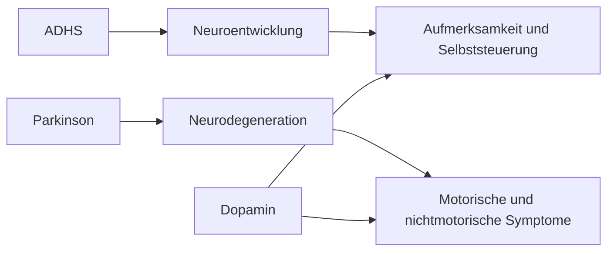

# Einheit 15 – Parkinson, ADHS und mechanistische Vergleiche

## Lernziel

Du kannst erklären, warum ADHS und Parkinson trotz einiger gemeinsamer Forschungsbegriffe nicht dieselbe Art von Erkrankung sind. Du verstehst den Unterschied zwischen einer lebenslangen Neuroentwicklungsstörung und einer neurodegenerativen Erkrankung und kannst einordnen, warum Dopamin in beiden Forschungsfeldern relevant ist, aber unterschiedliche biologische Rollen spielt.

## 1. Ähnliche Wörter bedeuten nicht gleiche Erkrankungen

ADHS und Parkinson werden in populären Darstellungen manchmal miteinander verbunden, weil beide mit Dopamin, Motivation, Bewegung oder exekutiven Funktionen in Verbindung gebracht werden. Diese Gemeinsamkeiten beziehen sich jedoch auf einzelne biologische Systeme und nicht auf identische Krankheitsmechanismen.

ADHS wird heute überwiegend als Neuroentwicklungsstörung verstanden. Die zugrunde liegenden Unterschiede entstehen während der Entwicklung des Nervensystems und beeinflussen unter anderem Aufmerksamkeit, Impulskontrolle, Belohnungsverarbeitung und Selbststeuerung. Parkinson ist dagegen primär eine neurodegenerative Erkrankung, bei der Nervenzellen im Verlauf des Lebens geschädigt werden und bestimmte neuronale Systeme zunehmend ausfallen.

> [!evidence] Evidenz: Konsens / hoch
> ADHS und Parkinson teilen einzelne Forschungsbereiche, sind aber unterschiedliche Erkrankungsgruppen mit verschiedenen zeitlichen Verläufen und biologischen Grundlagen.

## 2. Die Rolle von Dopamin

Dopamin ist weder ein einzelner Schalter für Motivation noch eine einfache Erklärung für komplexe Symptome. In ADHS-Forschung wird Dopamin unter anderem im Zusammenhang mit Belohnungsverarbeitung, Lernsignalen und der Regulation von Aufmerksamkeit untersucht.

Bei Parkinson entsteht ein wesentlicher Teil der motorischen Symptomatik durch den Verlust dopaminerger Nervenzellen in bestimmten Bereichen des Mittelhirns. Dadurch verändert sich die Signalverarbeitung in Netzwerken, die Bewegung steuern.

Der gleiche Botenstoff kann also in unterschiedlichen Systemen und Erkrankungen unterschiedliche Bedeutungen haben. Ein Vergleich über einen einzelnen Neurotransmitter reicht nicht aus, um Krankheiten biologisch gleichzusetzen.

## 3. Entwicklungsverlauf als entscheidender Unterschied

Ein zentraler Unterschied liegt in der Zeitachse. ADHS beginnt typischerweise in der Kindheit und begleitet viele Menschen über verschiedene Lebensphasen. Die Ausprägung kann sich verändern, weil Anforderungen, Strategien und Umweltbedingungen wechseln.

Parkinson tritt überwiegend im höheren Erwachsenenalter auf und ist durch eine fortschreitende Veränderung neuronaler Strukturen gekennzeichnet. Symptome entstehen häufig erst, wenn bestimmte biologische Reserven bereits deutlich reduziert sind.

Diese Unterschiede sind diagnostisch wichtig. Konzentrationsprobleme im Alter können viele Ursachen haben, darunter Depression, Schlafstörungen, Medikamente, neurodegenerative Erkrankungen oder eine seit Kindheit bestehende ADHS. Eine sorgfältige Entwicklungsgeschichte bleibt deshalb entscheidend.

## 4. Gemeinsame Forschungsfragen und klare Grenzen

Trotz der Unterschiede können Vergleiche wissenschaftlich sinnvoll sein. Beide Forschungsfelder untersuchen beispielsweise:

- neuronale Netzwerke der Handlungssteuerung,
- Selbstregulation und Motivation,
- genetische Risikofaktoren,
- Zusammenhänge zwischen Gehirn, Verhalten und Umwelt.

Solche Überschneidungen helfen, allgemeine Prinzipien des Gehirns besser zu verstehen. Sie bedeuten jedoch nicht, dass ADHS eine frühe Form von Parkinson ist oder Parkinson eine spätere Form von ADHS.

## 5. Alltag und klinische Einordnung

Für Betroffene ist besonders wichtig, zwischen Symptomen und Ursachen zu unterscheiden. Vergesslichkeit, Konzentrationsschwierigkeiten oder verlangsamtes Arbeiten können in vielen Situationen auftreten.

Eine Diagnose entsteht nicht aus einem einzelnen Merkmal, sondern aus Verlauf, Kontext, Funktionsbeeinträchtigung und Ausschluss anderer Erklärungen.

## Review-Frage

Warum bedeutet die Beteiligung von Dopamin nicht, dass ADHS und Parkinson dieselbe Erkrankung sind?

Weil Dopamin in unterschiedlichen neuronalen Netzwerken unterschiedliche Funktionen erfüllt. Außerdem unterscheiden sich Ursache, Entwicklungsverlauf und betroffene biologische Prozesse deutlich.

## Merksatz

Gemeinsame biologische Begriffe bedeuten keine gleiche Erkrankung: ADHS ist primär eine Neuroentwicklungsstörung, Parkinson eine neurodegenerative Erkrankung.

## Navigation

- Vorherige Einheit: [[02-Vertiefung/02-Autismus-und-ADHS-Ueberlappung|Autismus und ADHS: Koexistenz, Überlappung und Abgrenzung]]
- Nächste Einheit: [[02-Vertiefung/04-Studienmethodik-Effektgroessen-Bias-und-Kausalitaet|Studienmethodik, Effektgrößen, Bias und Kausalität]]
