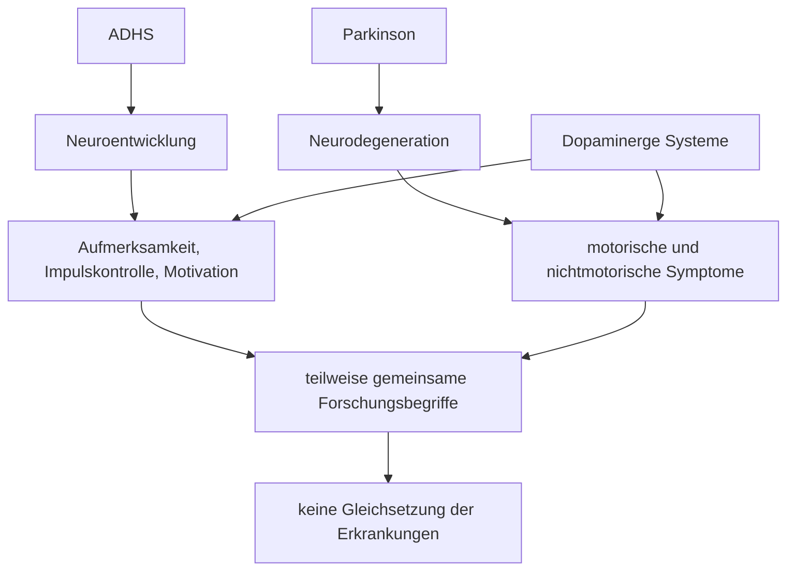

# Einheit 15 – Parkinson, ADHS und mechanistische Vergleiche

## Lernziel

Du kannst erklären, warum ADHS und die Parkinson-Erkrankung trotz gemeinsamer Forschungsbegriffe nicht dieselbe Art von Erkrankung sind. Du unterscheidest Neuroentwicklung von Neurodegeneration, ordnest die unterschiedlichen Rollen dopaminerger Systeme ein und erkennst, welche Vergleiche wissenschaftlich sinnvoll sind. Außerdem kannst du unsichere Beobachtungsbefunde zu einem möglichen späteren Neurodegenerationsrisiko bewerten, ohne daraus eine persönliche Prognose oder die Behauptung abzuleiten, ADHS sei eine Vorstufe von Parkinson.

## 1. Der wichtigste Unterschied: Entwicklungsprofil oder fortschreitender Zellverlust

ADHS wird als heterogene **Neuroentwicklungsstörung** eingeordnet. Die diagnostisch relevanten Muster beginnen in der Entwicklung und betreffen insbesondere Unaufmerksamkeit und/oder Hyperaktivität-Impulsivität. Ihre Sichtbarkeit kann sich über die Lebensspanne verändern: Anforderungen steigen oder sinken, Strategien werden aufgebaut, Unterstützung fällt weg, und Begleiterkrankungen können das Funktionsniveau beeinflussen. Eine Veränderung der Symptome bedeutet deshalb nicht automatisch, dass ein fortschreitender krankhafter Abbau im Gehirn stattfindet.

Die Parkinson-Erkrankung ist dagegen eine **neurodegenerative Erkrankung**. Bei ihr verändern sich im Laufe des Lebens mehrere neuronale Systeme. Besonders bekannt ist der Verlust dopaminerger Nervenzellen in der Substantia nigra mit Folgen für die Signalverarbeitung in den Basalganglien. Parkinson umfasst jedoch mehr als ein motorisches Dopaminproblem: Neben Bradykinese, Rigor und häufig Tremor können Schlaf, autonome Funktionen, Stimmung, Motivation und Kognition betroffen sein. Die Erkrankung beginnt nicht erst am Tag der Diagnose, verläuft aber typischerweise fortschreitend und weist eine andere Pathophysiologie sowie einen anderen klinischen Zeitverlauf als ADHS auf.

> [!evidence] Evidenz: Konsens / hoch
> ADHS ist primär eine Neuroentwicklungsstörung; Parkinson ist eine neurodegenerative Erkrankung. Einzelne gemeinsame Symptome, Hirnnetzwerke oder Botenstoffe heben diesen grundlegenden Unterschied nicht auf.

Die Zeitachse ist diagnostisch entscheidend. Eine seit Kindheit bestehende, situationsübergreifende Unaufmerksamkeit mit wechselnder Ausprägung spricht für einen anderen Verlauf als eine im höheren Lebensalter neu auftretende Verlangsamung, motorische Veränderung oder deutliche kognitive Verschlechterung. Umgekehrt schließt ein höheres Alter ADHS nicht aus: Systematische Übersichten zeigen, dass klinisch relevante ADHS-Symptome auch bei älteren Erwachsenen vorkommen. Die Diagnostik ist dort allerdings anspruchsvoll, weil Erinnerungen an die Kindheit unvollständig sein können und Depression, Schlafstörungen, Medikamente, Hör- oder Sehprobleme sowie neurokognitive Erkrankungen ähnliche Beschwerden erzeugen können.

## 2. Dopamin ist kein einheitlicher Krankheitspegel

Der Satz „Beide haben etwas mit Dopamin zu tun“ klingt zunächst nach einer starken Verbindung, ist aber biologisch viel zu grob. Dopamin wirkt in mehreren Bahnen, Hirnregionen, Zelltypen und Rezeptorsystemen. Es beeinflusst unter anderem Lernen aus Rückmeldung, Anreizbewertung, Handlungswahl, Bewegung und die Anpassung von Verhalten an Ziele. Die Bedeutung eines dopaminergen Signals hängt davon ab, **wo**, **wann** und in welchem Netzwerk es wirkt.

Bei ADHS werden Unterschiede in katecholaminergen Systemen, einschließlich Dopamin und Noradrenalin, als Teil komplexer Modelle untersucht. Diese Modelle erklären nicht die gesamte Störung und bedeuten keinen einfachen, messbaren „Dopaminmangel“. Die Wirkung von Stimulanzien beweist ebenfalls keine einzelne Ursache: Ein Medikament kann ein Netzwerk funktionell beeinflussen, ohne dass die behandelte Störung durch einen simplen Mangel desselben Botenstoffs entstanden sein muss.

Bei Parkinson steht ein klarer beschriebener neurodegenerativer Prozess in nigrostriatalen Systemen im Vordergrund. Der Verlust dopaminerger Projektionen verändert die Aktivität motorischer Regelkreise. Dopaminerge Medikamente können motorische Symptome wirksam lindern, ersetzen aber nicht alle verlorenen Funktionen und stoppen die gesamte Erkrankung nicht. Auch bei Parkinson sind nichtmotorische Symptome nicht auf einen einzigen Botenstoff reduzierbar.

```mermaid
flowchart TD
  A[ADHS] --> B[Neuroentwicklung]
  B --> C[Aufmerksamkeit, Impulskontrolle, Motivation]
  P[Parkinson] --> N[Neurodegeneration]
  N --> M[motorische und nichtmotorische Symptome]
  D[Dopaminerge Systeme] --> C
  D --> M
  C --> G[teilweise gemeinsame Forschungsbegriffe]
  M --> G
  G --> X[keine Gleichsetzung der Erkrankungen]
```

Das Diagramm zeigt die korrekte Logik: Derselbe Oberbegriff kann in zwei verschiedenen Kausalmodellen vorkommen. Aus „Dopamin ist beteiligt“ folgt weder „identische Ursache“ noch „gleiche Behandlung“ noch „gleicher Verlauf“.

## 3. Was mechanistische Vergleiche leisten können

Vergleiche zwischen ADHS- und Parkinson-Forschung sind nicht grundsätzlich falsch. Sie werden dann nützlich, wenn die Frage eng formuliert ist. Forschende können beispielsweise untersuchen, wie Basalganglien und frontostriatale Netzwerke Handlungswahl, Reaktionshemmung, Belohnungslernen oder den Wechsel zwischen Handlungen unterstützen. Auch Motivation, Aufwandsschätzung und zeitliche Organisation hängen von verteilten Netzwerken ab, die in mehreren Erkrankungen untersucht werden.

Solche Vergleiche können allgemeine Prinzipien sichtbar machen:

- Wie verändern dopaminerge Signale die Gewichtung möglicher Handlungen?
- Wie arbeiten kortikale und subkortikale Netzwerke bei Planung und Bewegung zusammen?
- Warum kann dieselbe Testaufgabe durch unterschiedliche Mechanismen beeinträchtigt werden?
- Wie unterscheiden sich stabile Entwicklungsunterschiede von einem erworbenen Funktionsverlust?

Die Antwort auf eine gemeinsame Testauffälligkeit bleibt dabei offen. Langsamere Reaktionen können beispielsweise mit motorischer Verlangsamung, depressiver Symptomatik, Müdigkeit, Medikamentenwirkung, geringer Motivation, Verständnisproblemen oder Aufmerksamkeitsschwankungen zusammenhängen. Ein Testwert benennt deshalb zunächst eine Leistung unter bestimmten Bedingungen, nicht automatisch die zugrunde liegende Krankheit.

Mechanistische Forschung wird problematisch, wenn ein gemeinsamer Begriff ohne Zwischenschritte zu einer Diagnosebehauptung wird. „Frontostriatal“, „exekutiv“ oder „dopaminerg“ sind keine Diagnosen. Sehr viele psychische und neurologische Zustände betreffen überlappende Netzwerke. Die klinische Einordnung benötigt zusätzlich Beginn, Verlauf, Symptomqualität, neurologische Untersuchung, Beeinträchtigung und mögliche Alternativerklärungen.

## 4. Bedeutet ADHS ein erhöhtes Parkinson- oder Demenzrisiko?

Einige Register- und Krankenaktenstudien berichteten Zusammenhänge zwischen einer ADHS-Diagnose und später dokumentierten neurodegenerativen oder neurokognitiven Erkrankungen. Diese Beobachtungen haben verständlicherweise Aufmerksamkeit erzeugt. Sie beweisen aber weder, dass ADHS Parkinson verursacht, noch dass eine betroffene Person wahrscheinlich erkranken wird.

Die systematische Übersicht von Becker und Kolleg:innen aus dem Jahr 2023 identifizierte sieben geeignete Beobachtungsstudien zu ADHS und späteren neurodegenerativen oder neurokognitiven Diagnosen. Die Endpunkte reichten von Demenz insgesamt über Alzheimer- und Lewy-Körper-Erkrankungen bis zu Parkinson, vaskulärer Demenz und leichter kognitiver Beeinträchtigung. Wegen der starken methodischen Heterogenität war keine gemeinsame Meta-Analyse sinnvoll. Diese Übersicht bleibt besonders wichtig für die breite Frage nach verschiedenen Diagnosen, liefert aber keinen belastbaren gepoolten Parkinson-Risikowert.

Eine umfassendere systematische Übersicht von Carr und Kolleg:innen aus dem Jahr 2024 schloss 16 Studien ein. Sieben berichteten positive Zusammenhänge mit mindestens einem neurokognitiven Endpunkt, vier fanden keinen Zusammenhang, und fünf untersuchten mögliche Mechanismen. Die Autor:innen bewerteten die Evidenzbasis weiterhin als begrenzt und die absolute Risikoerhöhung als klein. Auch diese Übersicht bündelte unterschiedliche neurokognitive Endpunkte und erlaubt keine kausale oder Parkinson-spezifische Schlussfolgerung.

Eine 2026 veröffentlichte systematische Übersicht und Meta-Analyse von Baiamonte und Kolleg:innen fokussierte enger auf Demenz. Vier Kohortenstudien mit insgesamt 3.703.877 Personen gingen in die Meta-Analyse zur **Demenz aller Ursachen** ein. Der gepoolte Hazard-Ratio betrug 2,52 bei einem 95-Prozent-Konfidenzintervall von 1,51 bis 4,22. Die statistische Heterogenität war mit I² = 87,7 Prozent jedoch sehr hoch, und eine einzelne Studie beeinflusste den Gesamtschätzer deutlich. Für Alzheimer-Erkrankung, vaskuläre Demenz und Lewy-Körper-Demenz waren zu wenige vergleichbare Studien vorhanden, um belastbare gepoolte Schätzungen zu berechnen.

Diese neuere Meta-Analyse verschiebt die Einordnung, aber nicht bis zu einem Kausalbeweis: Es gibt nun einen quantitativen Gruppenbefund für eine Assoziation mit Demenz aller Ursachen. Der Schätzer ist ein **relatives** Maß und keine absolute persönliche Wahrscheinlichkeit. Er sagt zudem nichts Belastbares über das spätere Auftreten der Parkinson-Erkrankung aus. Parkinson-spezifische Evidenz bleibt deutlich dünner und muss getrennt von Demenz aller Ursachen beurteilt werden.

Mehrere Verzerrungen sind möglich:

1. **Diagnosefehler:** Ältere Krankenakten können ADHS übersehen oder unspezifische Symptome fälschlich als ADHS kodieren.
2. **Überwachungseffekt:** Menschen mit psychiatrischer oder neurologischer Behandlung haben mehr Kontakt zum Gesundheitssystem; dadurch werden weitere Diagnosen eher dokumentiert.
3. **Komorbiditäten:** Depression, Substanzgebrauch, Schlafstörungen, kardiovaskuläre Risiken oder andere Faktoren können mit ADHS und späteren Gesundheitsproblemen zusammenhängen.
4. **Medikamenten- und Indikationsverzerrung:** Ein Zusammenhang mit verschriebenen Stimulanzien kann durch Schweregrad, Behandlungszugang und Begleiterkrankungen beeinflusst sein. Verordnete Stimulanzien dürfen nicht mit hochdosiertem illegalem Stimulanzienkonsum gleichgesetzt werden.
5. **Umgekehrte oder überlappende Erklärung:** Frühe unspezifische Beschwerden einer späteren Erkrankung könnten rückblickend als ADHS interpretiert werden; zugleich kann echtes lebenslanges ADHS im Alter fälschlich als beginnende Neurodegeneration erscheinen.
6. **Unterschiedliche Endpunkte und Basisrisiken:** „Demenz aller Ursachen“, einzelne Demenzformen und Parkinson sind keine austauschbaren Endpunkte. Ein relatives Risiko lässt sich ohne das jeweilige Ausgangsrisiko nicht in eine persönliche Wahrscheinlichkeit übersetzen.

> [!important] Assoziation ist keine persönliche Prognose
> Die aktuelle Literatur unterstützt einen Gruppenbefund für eine Assoziation zwischen ADHS und Demenz aller Ursachen. Sie rechtfertigt weder die Aussage „ADHS führt zu Parkinson“ noch eine individuelle Risikoberechnung. Sie begründet weitere Forschung und eine sorgfältige Differentialdiagnostik, nicht Alarmismus.

Für die Praxis ist deshalb ein ausgewogener Satz angemessen: Ein Zusammenhang mit Demenz aller Ursachen wird inzwischen durch eine Meta-Analyse gestützt, bleibt aber beobachtungsbasiert, heterogen und kausal ungeklärt. Für einzelne Demenzformen und insbesondere für Parkinson sind die Daten wesentlich unsicherer.

## 5. Differentialdiagnostik im höheren Lebensalter

Bei einer älteren Person mit Konzentrationsproblemen sollte nicht automatisch zwischen „ADHS“ und „Demenz oder Parkinson“ gewählt werden, als könnten beide nicht koexistieren. Die sinnvollere Frage lautet: Welche Beschwerden bestehen seit wann, wie haben sie sich verändert, und welche zusätzlichen Merkmale sind vorhanden?

Hinweise, die eine erneute medizinische oder neurologische Abklärung nahelegen, sind beispielsweise:

- eine klar neue oder fortschreitende Verlangsamung,
- neu auftretender Ruhetremor, Rigor oder auffällige Gangveränderungen,
- deutliche Verschlechterung zuvor beherrschter Alltagsfertigkeiten,
- neue visuell-räumliche Probleme, Halluzinationen oder starke kognitive Schwankungen,
- Veränderungen von Geruchssinn, REM-Schlaf-Verhalten oder autonomen Funktionen im passenden Gesamtbild,
- akute oder subakute Veränderungen, die auch durch Medikamente, Infektionen oder Stoffwechselprobleme verursacht sein können.

Keines dieser Merkmale ist allein beweisend. Ebenso wenig beweist eine seit langem bestehende Vergesslichkeit automatisch ADHS. Für eine ADHS-Diagnose bleibt ein entwicklungsbezogenes Muster wichtig, auch wenn der Nachweis im höheren Alter schwieriger sein kann. Schulzeugnisse, frühere Berichte, Fremdanamnese und lebenslange Beispiele können hilfreich sein, sind aber nicht immer verfügbar. Fehlende Dokumente dürfen nicht durch erfundene Sicherheit ersetzt werden.

ADHS kann außerdem die Bewältigung einer später hinzukommenden neurologischen Erkrankung erschweren: komplexe Medikamentenpläne, Terminorganisation oder das Beobachten schwankender Symptome können höhere exekutive Anforderungen stellen. Dann müssen beide Ebenen berücksichtigt werden, statt jede Schwierigkeit nur einer Diagnose zuzuschreiben.

## 6. Behandlung: ähnliche Wirkstoffklassen bedeuten keine Austauschbarkeit

Stimulanzien bei ADHS und dopaminerge Medikamente bei Parkinson haben unterschiedliche Indikationen, Dosierungen, Zielsysteme und Evidenzgrundlagen. Ein Medikament aus dem einen Bereich ist keine allgemeine Behandlung für den anderen. Veränderungen dürfen deshalb nicht eigenständig aus einem mechanistischen Vergleich abgeleitet werden.

Bei ADHS werden Behandlungseffekte an Kernsymptomen und alltagsbezogenen Zielen geprüft; Nutzen, Nebenwirkungen, Wirkdauer und Begleiterkrankungen werden überwacht. Bei Parkinson richtet sich die Therapie nach motorischen und nichtmotorischen Symptomen, Erkrankungsphase, Nebenwirkungen und individuellen Zielen. Dopaminerge Behandlung kann unter anderem Impulskontrollstörungen oder Halluzinationen beeinflussen; auch deshalb ist „mehr Dopamin“ kein sinnvolles universelles Therapieziel.

Forschungsbefunde über mögliche Langzeitrisiken sind kein Grund, eine wirksame verordnete ADHS-Behandlung ohne fachliche Rücksprache abzusetzen. Ebenso darf eine Parkinson-Medikation nicht als Test verwendet werden, ob Konzentrationsprobleme „dopaminbedingt“ sind. Diagnostik und Behandlung folgen klinischen Kriterien, nicht einem Neurotransmitter-Selbstexperiment.

## 7. Mini-Übung: Gleiches Wort, andere Aussageebene

Wähle einen gemeinsamen Begriff, zum Beispiel „Dopamin“, „Basalganglien“, „Motivation“ oder „exekutive Funktionen“. Erstelle vier kurze Spalten:

1. **Beobachtung:** Was wurde tatsächlich gemessen oder beschrieben?
2. **Mechanismus:** Welche biologische Erklärung wird vorgeschlagen?
3. **Diagnose:** Welche zusätzlichen Kriterien wären für eine klinische Zuordnung nötig?
4. **Grenze:** Welche alternative Erklärung oder Unsicherheit bleibt?

Beispiel: „Eine Gruppe zeigt langsamere Reaktionen“ ist eine Beobachtung. Daraus folgt noch nicht, dass dieselbe dopaminerge Störung, dieselbe Diagnose oder dieselbe Behandlung vorliegt. Die Übung trainiert, zwischen Daten, Modell und klinischer Schlussfolgerung zu unterscheiden.

## 8. Wissenschaftliche Einordnung und Grenzen

**Konsens:** ADHS und Parkinson sind unterschiedliche Erkrankungsklassen. ADHS beginnt als Neuroentwicklungsstörung; Parkinson ist neurodegenerativ. Dopamin und frontostriatale Netzwerke sind in beiden Forschungsfeldern relevant, aber nicht auf dieselbe Weise.

**Wahrscheinlich:** Eng formulierte Vergleiche zu Handlungssteuerung, Motivation und Basalganglienfunktionen können allgemeine neurobiologische Prinzipien verdeutlichen. Im höheren Lebensalter ist eine sorgfältige Verlaufserhebung wichtig, weil ADHS-Symptome, Depression, Schlafprobleme, Medikamenteneffekte und neurokognitive Erkrankungen sich teilweise ähneln können. Beobachtungsdaten und eine aktuelle Meta-Analyse stützen eine Assoziation zwischen ADHS und Demenz aller Ursachen auf Gruppenebene.

**Umstritten:** Ob dieser Zusammenhang unabhängig und kausal ist, wie groß die absolute Risikoerhöhung ausfällt und welche Rolle Komorbiditäten oder Behandlung spielen. Für einzelne Demenzformen und die Parkinson-Erkrankung ist die Evidenz wesentlich dünner als für Demenz aller Ursachen. Eine sichere Individualprognose ist nicht möglich.

**Experimentell:** Biomarker oder kombinierte genetische, bildgebende und digitale Modelle, die bei einer Einzelperson zwischen lebenslangem ADHS, normalem Altern und früher Neurodegeneration unterscheiden. Solche Verfahren sind derzeit kein Ersatz für klinische Diagnostik.

## Review-Frage

**Warum ist die Aussage „ADHS ist eine frühe Form von Parkinson, weil beide mit Dopamin zusammenhängen“ wissenschaftlich falsch?**

Antwort

Weil ADHS und Parkinson unterschiedliche Erkrankungsklassen, Zeitverläufe und Pathophysiologien haben. Dopamin wirkt in mehreren Netzwerken und erfüllt unterschiedliche Funktionen. Ein gemeinsamer Botenstoff oder eine ähnliche Testauffälligkeit beweist weder identische Ursache noch gleiche Behandlung oder einen zwangsläufigen Übergang von ADHS zu Parkinson. Auch ein Gruppenbefund zu Demenz aller Ursachen ist kein Nachweis eines Parkinson-Risikos bei einer einzelnen Person.

## Wissenschaftliche Quelle

[[references/Faraone2021|Faraone et al. 2021]] – internationales Konsensuspapier zur evidenzbasierten Einordnung von ADHS als heterogene Neuroentwicklungsstörung.

[[references/Bloem2021|Bloem et al. 2021]] – umfassende Lancet-Übersicht zu Pathophysiologie, klinischem Verlauf und Behandlung der Parkinson-Erkrankung.

[[references/Becker2023|Becker et al. 2023]] – systematische Übersicht zu Beobachtungsstudien über ADHS und spätere neurodegenerative beziehungsweise neurokognitive Diagnosen; betont die begrenzte und heterogene Evidenz.

[[references/Carr2024|Carr et al. 2024]] – systematische Übersicht von 16 Studien zu ADHS als möglichem Risikofaktor für Demenz und andere neurokognitive Störungen; betont begrenzte Evidenz und kleine absolute Risiken.

[[references/Baiamonte2026|Baiamonte et al. 2026]] – systematische Übersicht und Meta-Analyse zur Assoziation zwischen ADHS und Demenz aller Ursachen; keine belastbare quantitative Aussage zur Parkinson-Erkrankung.

[[references/Dobrosavljevic2020|Dobrosavljevic et al. 2020]] – systematische Übersicht und Meta-Analyse zur Prävalenz von ADHS bei älteren Erwachsenen und zu starken Unterschieden zwischen Erhebungsmethoden.

## Merksatz

> Gemeinsame Forschungsbegriffe sind keine gemeinsame Krankheit: ADHS ist neuroentwicklungsbezogen, Parkinson neurodegenerativ, und beobachtete Langzeitassoziationen sind weder ein Kausalbeweis noch eine persönliche Prognose.

## Navigation

- Zurück: [[02-Vertiefung/02-Autismus-und-ADHS-Ueberlappung|Autismus und ADHS: Koexistenz, Überlappung und Abgrenzung]]
- Weiter: [[02-Vertiefung/04-Angststoerungen-und-ADHS|Angststörungen und ADHS: Komorbidität, Abgrenzung und Wechselwirkungen]]
- [[Glossar]] · [[Literatur]] · [[knowledge-graph/README|Wissensgraph]]
