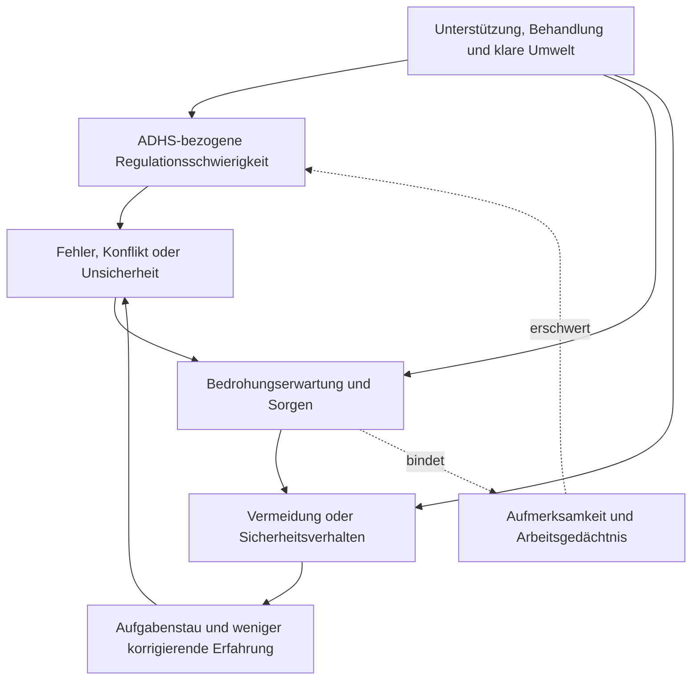

# Einheit 16 – Angststörungen und ADHS: Komorbidität, Abgrenzung und Wechselwirkungen

## Lernziel

Du kannst erklären, warum ADHS und Angststörungen häufig gemeinsam vorkommen, aber weder dieselbe Störung noch automatisch Ursache und Folge sind. Du unterscheidest entwicklungsbezogene Unaufmerksamkeit von angstbedingter Aufmerksamkeitsbindung, erkennst Vermeidung und Sicherheitsverhalten als mögliche Angstdynamiken und kannst Gruppenbefunde einordnen, ohne daraus eine persönliche Diagnose oder Prognose abzuleiten.

## 1. Gemeinsam vorhanden, ähnlich sichtbar oder alternativ erklärend?

**Komorbidität** bedeutet, dass zwei diagnostisch unterscheidbare Störungen gleichzeitig vorliegen. Bei ADHS und Angst ist das klinisch wichtig, weil drei verschiedene Situationen äußerlich ähnlich aussehen können:

1. Eine Person hat ADHS und zusätzlich eine Angststörung.
2. Angst erzeugt Konzentrations-, Schlaf- oder Unruhesymptome, die ADHS ähneln.
3. ADHS-bezogene Schwierigkeiten werden fälschlich nur als Angst interpretiert oder umgekehrt.

Die sichtbare Beobachtung „kann sich nicht konzentrieren“ entscheidet zwischen diesen Möglichkeiten nicht. Aufmerksamkeit kann bei ADHS schwanken, weil Ziele, Rückmeldung, Arbeitsgedächtnis und konkurrierende Reize nicht stabil koordiniert werden. Bei Angst kann Aufmerksamkeit dagegen besonders stark an mögliche Gefahr, Sorgen, Körperempfindungen oder die Überwachung eigener Fehler gebunden sein. Beide Prozesse können gleichzeitig auftreten.

> [!evidence] Evidenz: Meta-Analysen / hoch
> Erwachsene mit ADHS berichten im Gruppenmittel deutlich mehr Angstsymptome als Vergleichspersonen. Bei Kindern und Jugendlichen mit diagnostizierter ADHS sind Angststörungen ebenfalls häufig. Diese Befunde belegen eine relevante Komorbidität, erlauben aber weder eine Diagnose aus einem Fragebogenwert noch die Aussage, ADHS verursache bei einer bestimmten Person Angst.

Eine aktuelle Meta-Analyse von Hoskins und Kolleginnen umfasste 58 Fall-Kontroll-Studien mit insgesamt 18.821 Erwachsenen. Die Angstsymptomwerte lagen in der ADHS-Gruppe im Mittel höher; die standardisierte Differenz betrug Hedges’ g = 0,77. Gegenüber nichtklinischen Kontrollgruppen fiel sie größer aus als gegenüber klinischen Kontrollgruppen. Zugleich fanden die Autorinnen Hinweise auf Publikationsbias. Der Wert beschreibt **Unterschiede in Angstsymptomskalen**, nicht den Anteil diagnostizierter Angststörungen.

Eine andere Meta-Analyse von Njardvik und Kolleg:innen untersuchte 121 Studien mit 39.894 Kindern und Jugendlichen mit ADHS. Für diagnostizierte Angststörungen ergab sich eine gepoolte Prävalenz von 18,4 Prozent. Diese Zahl ist nicht direkt mit dem Effektmaß der Erwachsenenstudie vergleichbar: Alter, Stichproben, Messverfahren und statistische Zielgrößen unterscheiden sich. Genau diese Trennung verhindert Scheingenauigkeit.

## 2. Welche Merkmale eher für Angst sprechen

Angst ist keine einzelne Empfindung. Angststörungen unterscheiden sich darin, worauf Bedrohung erwartet wird und wie Menschen damit umgehen. Häufige Prozesse sind:

- anhaltendes Sorgen über mehrere Lebensbereiche,
- Furcht vor negativer Bewertung oder Beschämung,
- panikartige Fehlinterpretation körperlicher Signale,
- ausgeprägte Furcht vor bestimmten Situationen oder Objekten,
- Vermeidung,
- Rückversicherung und andere Sicherheitsverhalten,
- körperliche Aktivierung wie Herzklopfen, Muskelanspannung oder Übelkeit.

Für die Differentialdiagnostik ist die **Funktion** eines Verhaltens oft aufschlussreicher als seine Oberfläche. Eine Person kann eine Aufgabe nicht beginnen, weil der nächste Schritt unklar und die Belohnung fern ist. Eine andere beginnt nicht, weil sie einen Fehler, eine Bewertung oder Kontrollverlust befürchtet. Eine dritte erlebt beides.

Einige vorsichtige Vergleichsfragen helfen:

| Beobachtung | Eher ADHS-bezogen möglich | Eher angstbezogen möglich |
|---|---|---|
| Aufmerksamkeit bricht ab | Neuheit, Ablenkung, Zielverlust oder geringe Rückmeldung | Sorgen, Gefahrenüberwachung oder Körperempfindungen binden den Fokus |
| Aufgabe wird aufgeschoben | Startproblem, Zeitblindheit, unklare Teilschritte | erwartete Beschämung, Fehler oder Überforderung werden vermieden |
| Unruhe | Bewegungsdrang, Unterstimulation, Impulsivität | Alarmaktivierung, Anspannung, Fluchtbereitschaft |
| viele Kontrollen | Vergessen kompensieren | befürchtete Gefahr neutralisieren oder Sicherheit herstellen |
| gute Leistung unter Druck | Zeitdruck erhöht Aktivierung | Druck kann Angst verstärken und Leistung destabilisieren |

Die rechte oder linke Spalte ist kein Diagnosetest. Entscheidend sind Beginn, Verlauf, Auslöser, Gedankeninhalt, körperliche Reaktion, Verhalten und Folgen. Ein Verhalten kann außerdem seine Funktion verändern: Eine ursprünglich nützliche Erinnerungsliste kann später zu einem starren Sicherheitsritual werden; eine sehr genaue Kontrolle kann echte Vergesslichkeit kompensieren, ohne zwanghaft zu sein.

## 3. Wie sich ADHS und Angst gegenseitig verstärken können

Gemeinsames Auftreten bedeutet nicht automatisch, dass eine Störung die andere verursacht. Dennoch sind **Rückkopplungen** plausibel. Wiederholtes Vergessen, Zuspätkommen, Kritik oder unvorhersehbare Leistung kann die Erwartung weiterer Fehler erhöhen. Angst kann wiederum Arbeitsgedächtnis und flexible Aufmerksamkeit beanspruchen, Vermeidung fördern und wichtige Übung oder Problemlösung verhindern.

Das Diagramm zeigt mehrere mögliche Angriffspunkte. Klare Aufgabenstruktur kann ADHS-bezogene Unsicherheit reduzieren. Eine angstbezogene Intervention kann Vermeidung und Bedrohungsbewertung verändern. Praktische Unterstützung kann reale Fehlerquellen senken. Keine einzelne Maßnahme beweist, welche Diagnose vorliegt.

**Leistungsangst** verdient besondere Aufmerksamkeit. Wenn Ergebnisse stark schwanken, kann eine Person vor Prüfungen oder Gesprächen viel Zeit mit Kontrolle, Grübeln oder Aufschub verbringen. Kurzfristig vermindert Vermeidung die Anspannung; langfristig fehlen korrigierende Erfahrungen, und die Aufgabe wird bedrohlicher. Umgekehrt kann hoher Druck bei manchen ADHS-Aufgaben vorübergehend aktivieren. Deshalb ist „unter Druck besser“ oder „unter Druck schlechter“ allein diagnostisch unbrauchbar.

## 4. Verlauf und Kontext statt Momentaufnahme

ADHS ist entwicklungsbezogen. Angststörungen können ebenfalls früh beginnen, aber auch nach belastenden Ereignissen, Übergängen oder längeren Stressphasen deutlicher werden. Für eine sorgfältige Einordnung werden mehrere Zeitachsen getrennt:

- Wann begannen unaufmerksame, hyperaktive oder impulsive Merkmale?
- Wann traten Sorgen, Furcht, Panik, Vermeidung oder körperliche Angstsymptome auf?
- Gab es Phasen, in denen nur eines der Muster deutlich war?
- In welchen Situationen steigt die Beeinträchtigung?
- Welche Strategien helfen, und welchen Preis haben sie?
- Welche weiteren Erklärungen wie Depression, Trauma, Schlafstörung, Substanzen, Medikamente oder körperliche Erkrankungen müssen geprüft werden?

Bei Kindern können Fremdberichte aus Familie und Schule unterschiedliche Ausschnitte zeigen. Ein Kind wirkt in der Schule still und angepasst, verbringt aber zu Hause Stunden mit Sorgen und Vorbereitung. Ein anderes ist in mehreren Kontexten impulsiv und zusätzlich in Bewertungssituationen ängstlich. Bei Erwachsenen können Berufswahl, Partnerunterstützung oder strenge Routinen Schwierigkeiten lange verdecken.

Rating-Skalen sind nützlich, aber nicht ausreichend. Ein hoher Angstwert kann eine aktuelle Belastung anzeigen, sagt jedoch nicht sicher, welche Angststörung vorliegt. Ein hoher ADHS-Screeningwert kann durch Angst, Schlafmangel oder Depression beeinflusst sein. Leitlinien empfehlen deshalb eine vollständige klinische, entwicklungsbezogene und psychosoziale Beurteilung einschließlich koexistierender und alternativer Erklärungen.

## 5. Behandlung: beide Ebenen planen, keine Pauschalregel

Wenn ADHS und eine Angststörung gemeinsam bestehen, sollten Ziele und Verlauf für **beide** Bedingungen beobachtet werden. Das bedeutet nicht, dass immer alles gleichzeitig oder mit derselben Methode behandelt werden muss. Priorität kann von Schweregrad, Sicherheit, Funktionsbeeinträchtigung, Präferenzen, Alter und verfügbaren Angeboten abhängen.

Für Angststörungen gehören evidenzbasierte psychologische Verfahren, insbesondere störungsspezifische kognitive Verhaltenstherapie mit angemessener Exposition, zu den etablierten Behandlungsansätzen. Bei ADHS können Medikamente, ADHS-spezifische psychologische Verfahren und Umweltanpassungen relevant sein. Eine Therapie muss praktisch zugänglich sein: lange Hausaufgaben, unklare Pläne oder ausschließlich mündliche Anweisungen können bei ADHS zusätzliche Hürden erzeugen. Kürzere Schritte, sichtbare Pläne, Erinnerungen und gemeinsam definierte Ziele verändern nicht den Inhalt einer Angsttherapie, können aber ihre Umsetzbarkeit verbessern.

Ein verbreiteter Fehlschluss lautet, bei jeder Angst müsse grundsätzlich auf ADHS-Medikation verzichtet werden. Die NICE-Leitlinie empfiehlt für Menschen mit ADHS und Angststörung grundsätzlich dieselben Medikamentenoptionen wie für andere Menschen mit ADHS. Gleichzeitig sollen bei psychischen Begleiterkrankungen Dosisfindung langsamer und Überwachung häufiger erfolgen. Das ist keine Selbstbehandlungsregel: Auswahl, Wechsel und Monitoring gehören in fachliche Hände.

Die medikamentenbezogene Evidenz zu Angst ist weniger vollständig, als einfache Aussagen vermuten lassen. Systematische Reviews zeigen, dass Angst- und Depressionsendpunkte in vielen ADHS-Medikamentenstudien unzureichend berichtet wurden und einzelne Untergruppen nur durch wenige Studien vertreten sind. Aus „im Mittel keine Verschlechterung gefunden“ folgt daher weder eine Garantie für jede Person noch die Behauptung, ein ADHS-Medikament behandle automatisch eine Angststörung.

Warnzeichen wie akute Suizidalität, starke funktionelle Verschlechterung, psychotische oder manische Symptome, schwere Panik mit medizinisch unklaren Beschwerden oder eine plötzliche qualitative Veränderung benötigen zeitnahe fachliche Abklärung. Diese Einheit ersetzt keine Diagnose oder individuelle Therapieentscheidung.

## 6. Mini-Übung: Was bindet die Aufmerksamkeit?

Wähle eine Situation, in der Konzentration oder Aufgabenbeginn schwierig war. Notiere ohne Selbstdiagnose:

1. **Ziel:** Was sollte geschehen?
2. **Aufmerksamkeitskonkurrent:** Wurde der Fokus eher von Neuheit, einem anderen Reiz, Sorgen, Körpersignalen oder Fehlerkontrolle gebunden?
3. **Erwartung:** Was wurde als unangenehme Folge vorhergesagt?
4. **Verhalten:** Ablenkung, Aufschub, Vermeidung, Rückversicherung oder wiederholte Kontrolle?
5. **Kurzfristige Folge:** Erleichterung, Aktivierung, weitere Unsicherheit?
6. **Langfristige Folge:** Aufgabenstau, Kritik, weniger Übung oder tatsächliche Problemlösung?
7. **Kleinster Test:** Welche sichere, beobachtbare Veränderung könnte die Hypothesen unterscheiden?

Beispiel: Wenn eine Aufgabe mit klarer Schrittfolge und sichtbarer Rückmeldung leichter wird, spricht das für eine relevante Strukturkomponente. Wenn trotz klarer Struktur die Furcht vor Bewertung den Start verhindert, bleibt eine Angstdynamik plausibel. Beides kann gleichzeitig zutreffen. Die Übung dient der präziseren Beobachtung, nicht der Selbstdiagnose.

## 7. Wissenschaftliche Einordnung und Grenzen

**Konsens:** ADHS und Angststörungen sind unterscheidbare Störungen, können gemeinsam auftreten und sollen in Diagnostik und Behandlungsplanung jeweils berücksichtigt werden. Symptome, Funktionsbeeinträchtigung, Entwicklung und Alternativerklärungen müssen gemeinsam beurteilt werden.

**Wahrscheinlich:** Wiederholte negative Erfahrungen, Unsicherheit, Aufmerksamkeitsbindung durch Sorgen und Vermeidung können sich gegenseitig verstärken. Praktische ADHS-Anpassungen können die Umsetzung einer Angstbehandlung erleichtern, ohne die Angststörung auf ADHS zu reduzieren.

**Umstritten oder begrenzt:** Wie groß die kausalen Beiträge einzelner Mechanismen sind und welche Behandlungsreihenfolge für welche Untergruppe optimal ist. Medikamentenstudien berichten Angstendpunkte nicht durchgehend, und klinisch komplexe Gruppen werden häufig unzureichend abgebildet.

**Experimentell:** Digitale Verlaufsdaten oder kombinierte kognitive und physiologische Marker, die bei einer Einzelperson zuverlässig zwischen ADHS-bedingter Instabilität, angstbezogener Bedrohungsbindung und ihrem Zusammenspiel unterscheiden. Solche Verfahren ersetzen derzeit keine klinische Diagnostik.

## Review-Frage

**Warum kann Aufschieben sowohl bei ADHS als auch bei einer Angststörung auftreten, ohne dass es derselbe Mechanismus sein muss?**

Antwort

Bei ADHS kann der Start durch unklare Schritte, geringe unmittelbare Rückmeldung, Zeitverarbeitung oder instabile Zielaktivierung erschwert sein. Bei Angst kann Aufschub dazu dienen, erwartete Fehler, Bewertung, körperliche Aktivierung oder Kontrollverlust zu vermeiden. Beide Mechanismen können gemeinsam vorkommen; deshalb müssen Funktion, Gedanken, Verlauf und Kontext geprüft werden.

## Wissenschaftliche Quelle

[[references/Hoskins2026|Hoskins et al. 2026]] – aktuelle Meta-Analyse von Angstsymptomwerten bei Erwachsenen mit und ohne ADHS; zeigt einen deutlichen Gruppenunterschied, aber keine Prävalenz diagnostizierter Angststörungen und Hinweise auf Publikationsbias.

[[references/Njardvik2025|Njardvik et al. 2025]] – systematische Übersicht und Meta-Analyse psychiatrischer Komorbiditäten bei Kindern und Jugendlichen mit ADHS; liefert eine alters- und diagnosebezogene Prävalenzschätzung.

[[references/NICE2018|NICE NG87]] und [[references/AADPA2022|AADPA 2022]] – evidenzbasierte Leitlinien zur multimethodalen Diagnostik, Prüfung koexistierender Bedingungen und individualisierten Behandlungsplanung.

[[references/Zhang2025|Zhang et al. 2025]] – Meta-Analyse zu Depression, Angst und medikamentenbezogenen Gruppenbefunden bei Kindern und Jugendlichen; verdeutlicht die Heterogenität und Grenzen einzelner Angstendpunkte.

## Merksatz

> Ähnliches Verhalten ist noch kein gleicher Mechanismus: Bei ADHS und Angst entscheiden Verlauf, Funktion, Bedrohungsbezug und Folgen darüber, welche Erklärungen geprüft werden müssen.

## Navigation

- Zurück: [[02-Vertiefung/03-Parkinson-ADHS-mechanistische-Vergleiche-und-Grenzen|Parkinson, ADHS und mechanistische Vergleiche]]
- Weiter: [[ROADMAP#A2 · Angst, Zwang, Trauma und episodische Störungen — P0|Zwang, Trauma und episodische Veränderungen laut Roadmap]]
- [[Glossar]] · [[Literatur]] · [[knowledge-graph/README|Wissensgraph]]
