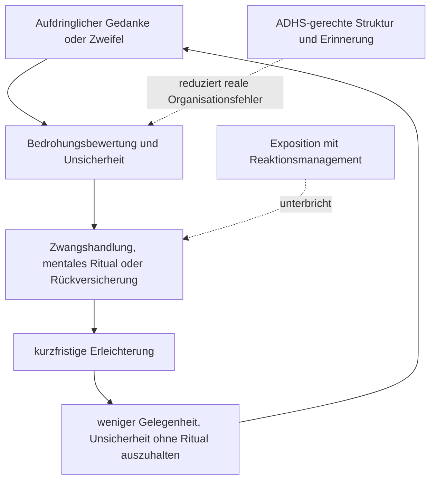

# Einheit 17 – Zwangssymptome, Zwangsstörung und ADHS: Funktion, Abgrenzung und Koexistenz

## Lernziel

Du kannst Zwangsgedanken und Zwangshandlungen von ADHS-bezogener Vergesslichkeit, Impulsivität, Hyperfokus, Perfektionismus und kompensatorischen Routinen unterscheiden. Du verstehst, warum ähnliche sichtbare Handlungen unterschiedliche Funktionen haben können, warum ADHS und Zwangsstörung tatsächlich gemeinsam auftreten können und weshalb die Häufigkeit dieser Koexistenz wissenschaftlich noch nicht präzise bestimmt ist.

## 1. Nicht jede Wiederholung ist ein Zwang

Eine **Zwangsstörung** ist nicht einfach besonders viel Ordnung, Gewissenhaftigkeit oder Perfektionismus. Zu ihren Kernphänomenen gehören Zwangsgedanken und Zwangshandlungen:

- **Zwangsgedanken** sind wiederkehrende, aufdringliche und unerwünschte Gedanken, Bilder oder Impulse, die Belastung auslösen können.
- **Zwangshandlungen** sind wiederholte sichtbare oder mentale Handlungen, zu denen sich eine Person gedrängt fühlt, häufig um Belastung zu vermindern oder ein befürchtetes Ereignis zu verhindern.
- Zwischen Handlung und befürchteter Folge besteht oft kein realistischer oder kein angemessener Zusammenhang, oder die Reaktion ist deutlich übermäßig.
- Entscheidend sind Belastung, Zeitverbrauch, Kontrollverlust und Funktionsbeeinträchtigung – nicht bloß, dass etwas mehrfach geschieht.

Auch Menschen ohne Zwangsstörung erleben gelegentlich aufdringliche Gedanken oder prüfen eine Tür ein zweites Mal. Klinisch relevant wird ein Muster erst durch Häufigkeit, Intensität, Funktion und Folgen.

> [!evidence] Evidenz: S3-Leitlinie / hoch
> Die derzeit gültige deutsche S3-Leitlinie zu Zwangsstörungen, Version 2.0, wurde 2022 veröffentlicht und ist bis Juni 2027 gültig. Sie behandelt Diagnostik und Therapie als eigenständige klinische Aufgaben. Ein einzelnes Verhalten wie Kontrollieren, Ordnen oder Wiederholen reicht nicht für eine Diagnose.

Bei ADHS können äußerlich ähnliche Routinen aus einem anderen Grund entstehen. Kalender, Checklisten, feste Ablageorte und mehrfaches Nachsehen können reale Vergesslichkeit oder instabile Zielaktivierung kompensieren. Eine solche Strategie ist nicht automatisch zwanghaft. Umgekehrt kann eine Person mit Zwangsstörung ihr Kontrollieren als Schutz vor einer befürchteten Katastrophe erleben, obwohl sie die Handlung zugleich als übertrieben erkennt. Das sichtbare „mehrfach prüfen“ beantwortet deshalb noch nicht, welcher Prozess vorliegt.

## 2. Die Funktion einer Handlung ist diagnostisch wichtiger als ihre Oberfläche

Für eine sorgfältige Abgrenzung wird nicht nur gefragt, **was** jemand tut, sondern **wozu**, **wann** und **mit welcher inneren Regel**.

| Beobachtung | ADHS-bezogene Kompensation möglich | Zwangsdynamik möglich |
|---|---|---|
| Tür oder Herd erneut prüfen | Erinnerung an den ersten Prüfvorgang ist unsicher oder wurde durch Ablenkung nicht stabil gespeichert | eine befürchtete Gefahr muss neutralisiert werden; Gewissheit fühlt sich trotz Prüfung nicht ausreichend an |
| Dinge exakt anordnen | visuelle Ordnung entlastet Arbeitsgedächtnis und erleichtert das Wiederfinden | Anordnung muss sich „richtig“ anfühlen oder ein befürchtetes Ereignis verhindern |
| lange an Details arbeiten | Hyperfokus, Zielverlust oder Schwierigkeiten beim Aufgabenwechsel | Fehler, moralische Verantwortung oder Unvollständigkeit lösen ritualisierte Korrekturen aus |
| feste Routine | externe Struktur reduziert Planungsaufwand | Abweichung wird mit Gefahr, Schuld oder unerträglicher Unsicherheit verknüpft |
| wiederholtes Nachfragen | Instruktion wurde nicht sicher behalten | Rückversicherung soll Zweifel kurzfristig beseitigen |

Die Spalten sind keine Selbstdiagnose. Dass eine Handlung kurzfristig beruhigt, beweist ebenfalls keinen Zwang. Auch eine realistische Kontrolle kann Erleichterung bringen. Umgekehrt können Zwangshandlungen vollständig im Kopf stattfinden, etwa Zählen, inneres Wiederholen, gedankliches Neutralisieren oder langes Prüfen der eigenen Erinnerung.

**Perfektionismus** ist ebenfalls kein Synonym für Zwangsstörung. Er kann leistungsbezogen, persönlichkeitsnah, angstbedingt oder kompensatorisch sein. Bei einer Zwangsstörung stehen eher aufdringliche Zweifel, ein innerer Handlungsdruck und ritualisierte Versuche im Vordergrund, Belastung oder eine befürchtete Folge zu kontrollieren. Die Übergänge können im Einzelfall schwierig zu beurteilen sein.

## 3. Wie Zwang die Aufmerksamkeit beeinträchtigen kann

Eine Zwangsstörung kann Konzentrationsprobleme erzeugen, die äußerlich wie ADHS wirken. Aufdringliche Gedanken binden Aufmerksamkeit. Mentale Rituale konkurrieren mit Arbeitsgedächtnis. Sichtbare Rituale kosten Zeit. Schlaf kann leiden, wenn Kontrollen oder Grübeln den Abend verlängern. Eine Aufgabe wird möglicherweise nicht beendet, weil einzelne Schritte wiederholt, überprüft oder gedanklich rückversichert werden.

Dadurch können folgende Beobachtungen entstehen:

- scheinbares Abschweifen während eines Gesprächs,
- langsames Arbeiten trotz hoher Anstrengung,
- häufiges Zurückkehren zu bereits erledigten Schritten,
- Unentschlossenheit,
- verspätetes Beginnen oder Beenden,
- Erschöpfung nach langen inneren Kontrollprozessen.

Diese Merkmale beweisen weder ADHS noch Zwangsstörung. Für ADHS wird ein entwicklungsbezogenes Muster von Unaufmerksamkeit und/oder Hyperaktivität-Impulsivität geprüft, das bereits früh begann, mehrere Kontexte betrifft und nicht besser durch eine andere Störung erklärt wird. Für Zwang werden unter anderem Inhalt, Aufdringlichkeit, Handlungsdruck, Neutralisierung, Zeitverbrauch und Belastung untersucht.

Der systematische kritische Review von Abramovitch und Kolleg:innen fand sehr uneinheitliche Angaben zur gemeinsamen Häufigkeit von ADHS und Zwangsstörung. Die Literatur enthielt nur wenige Gemeindestichproben, unterschiedliche Ausschlussregeln und ein relevantes Risiko, zwangsspezifische Konzentrationsprobleme als ADHS-Symptome zu missdeuten. Tic-Störungen und entwicklungsabhängige Symptome können die Schätzungen zusätzlich beeinflussen. Deshalb wäre eine präzise allgemeine Prozentzahl derzeit Scheingenauigkeit.

> [!evidence] Evidenz: systematischer kritischer Review / moderat
> Eine echte Koexistenz ist möglich. Wie häufig sie vorkommt, ist wegen Stichprobenselektion, Messunterschieden, möglicher Fehlklassifikation und altersabhängiger Effekte jedoch unsicher. Ein hoher Fragebogenwert ersetzt keine getrennte klinische Prüfung beider Störungen.

## 4. Der kurzfristige Nutzen kann das Problem langfristig stabilisieren

Zwangshandlungen sind nicht sinnlos im Sinne von „ohne jede Funktion“. Sie können Belastung kurzfristig deutlich verringern. Gerade dieser kurzfristige Effekt kann aber dazu beitragen, dass das Ritual häufiger oder umfangreicher wird. In der Lernpsychologie spricht man von **negativer Verstärkung**: Eine Handlung wird wahrscheinlicher, weil sie einen unangenehmen Zustand vorübergehend beendet oder reduziert.

Das Modell erklärt nicht jede Zwangsstörung vollständig. Es zeigt aber, warum Rückversicherung durch Angehörige, ständiges Nachprüfen oder digitale Suchschleifen trotz guter Absicht langfristig Teil des Problems werden können. Gleichzeitig darf eine reale Gedächtnisstütze bei ADHS nicht pauschal entfernt werden. Eine hilfreiche Anpassung beantwortet eine praktische Organisationsfrage; ein Ritual zielt häufig auf vollständige emotionale Gewissheit, die sich nicht dauerhaft herstellen lässt.

In der Praxis kann dieselbe Hilfe beide Funktionen mischen. Eine einmalige Checkliste kann sinnvoll sein. Wenn sie zunehmend erweitert, mehrfach abgezeichnet und anschließend noch durch andere Personen bestätigt werden muss, sollte die Funktion erneut geprüft werden. Ziel ist weder maximal wenig Struktur noch maximal viel Kontrolle, sondern eine Unterstützung, die Alltagshandeln ermöglicht, ohne einen ritualisierten Gewissheitszwang zu bedienen.

## 5. Verlauf, Auslöser und Zeitachsen trennen

Eine Momentaufnahme reicht für die Differentialdiagnostik nicht. Hilfreich sind getrennte Zeitachsen:

- Wann begannen unaufmerksame, hyperaktive oder impulsive Merkmale?
- Waren sie bereits vorhanden, bevor Zwangsgedanken oder Rituale deutlich wurden?
- Welche Gedanken, Bilder oder befürchteten Folgen gehen Kontrollen voraus?
- Tritt das Verhalten auch ohne Bedrohungs- oder „Nicht-richtig“-Gefühl auf?
- Wie viel Zeit beanspruchen Rituale, Vermeidung und Rückversicherung?
- Was geschieht, wenn eine Handlung nicht oder nur einmal ausgeführt wird?
- Welche Rolle spielen Tics, Depression, Angst, Autismus, Trauma, Schlaf, Substanzen oder Medikamente?
- Welche Informationen liefern Familie, Schule, Partnerschaft oder Arbeitsplatz über verschiedene Kontexte?

Bei Kindern können entwicklungsübliche Rituale, magisches Denken, Tics und starre Gewohnheiten die Beurteilung erschweren. Bei Erwachsenen können langjährig etablierte Kompensationssysteme ADHS-Probleme verdecken. Manche Personen schämen sich für aufdringliche Gedanken und berichten sie erst bei gezielter, nicht wertender Nachfrage. Der Inhalt eines Gedankens ist dabei nicht mit einer Absicht gleichzusetzen: Gerade Zwangsgedanken werden oft als unerwünscht und unvereinbar mit den eigenen Werten erlebt.

Ein Screening kann Hinweise liefern, entscheidet aber weder über das Vorliegen noch über die Reihenfolge der Diagnosen. Eine fachliche Beurteilung muss beide Störungen eigenständig prüfen und darf keine von ihnen allein aus dem Vorhandensein der anderen ableiten.

## 6. Behandlung: Zwang gezielt behandeln, ADHS praktisch mitdenken

Für Zwangsstörungen empfiehlt die revidierte deutsche S3-Leitlinie kognitive Verhaltenstherapie mit **Exposition und Reaktionsmanagement** als Therapie der ersten Wahl. Dabei werden gefürchtete oder unsicherheitsauslösende Situationen geplant aufgesucht, während die übliche Zwangshandlung oder Neutralisierung unter therapeutischer Begleitung nicht ausgeführt wird. Das Ziel ist nicht, eine Gefahr leichtfertig zu ignorieren, sondern neue Erfahrungen mit Unsicherheit, Belastungsverlauf und Handlungsspielraum zu ermöglichen.

Selektive Serotonin-Wiederaufnahmehemmer gelten in der Leitlinie als Medikamente erster Wahl, wenn eine Expositionsbehandlung nicht verfügbar oder nicht wirksam war, abgelehnt wird, die betroffene Person Medikamente bevorzugt oder die Bereitschaft für Exposition dadurch erhöht werden soll. Auswahl, Dosierung, Kombination und Verlaufskontrolle gehören in fachliche Behandlung. Diese Einheit ist keine Anleitung zum Beginn, Wechsel oder Absetzen von Medikamenten.

Eine 2026 veröffentlichte Umbrella-Review zu Kindern und Jugendlichen bündelte 28 systematische Reviews und Meta-Analysen mit insgesamt 24.762 Teilnehmenden. Auch dort war kognitive Verhaltenstherapie, besonders Exposition mit Reaktionsverhinderung, die am besten gestützte Intervention; SSRI zeigten moderate Wirksamkeit. Der Befund bestätigt die zentrale Therapierichtung für die pädiatrische Population, ersetzt aber keine individuelle Nutzen-Risiko-Abwägung und lässt weiterhin Fragen zu Langzeitverlauf und populationsspezifischen Anpassungen offen.

Bei gleichzeitigem ADHS kann die Umsetzung einer Zwangstherapie zusätzliche Struktur benötigen:

- kurze, sichtbare Schritte statt nur mündlicher Langpläne,
- konkrete Termine und Erinnerungen,
- gemeinsam definierte Messpunkte,
- realistische Hausaufgabenumfänge,
- klare Trennung zwischen organisatorischer Hilfe und zwanghafter Rückversicherung.

Die Anpassung darf das therapeutische Ziel nicht unbeabsichtigt unterlaufen. Eine Erinnerung an eine vereinbarte Übung kann hilfreich sein; wiederholte Bestätigung, dass „wirklich nichts passieren wird“, kann dagegen zur Rückversicherung werden.

Für die Behandlung der ADHS gelten weiterhin ADHS-spezifische Leitlinien. Es gibt keine belastbare Pauschalregel, nach der eine ADHS-Behandlung bei jeder Zwangsstörung grundsätzlich begonnen, beendet oder in einer bestimmten Reihenfolge durchgeführt werden müsste. Priorisierung richtet sich nach Schweregrad, Sicherheit, Funktionsbeeinträchtigung, Alter, Präferenzen, Wechselwirkungen und beobachtbarem Verlauf. Änderungen gehören in fachliche Hände.

## 7. Mini-Übung: Kompensation oder Neutralisierung?

Wähle eine wiederholte Handlung, ohne sie diagnostisch zu etikettieren. Notiere:

1. den konkreten Auslöser,
2. den Gedanken oder Zweifel,
3. die befürchtete Folge,
4. die ausgeführte Handlung,
5. die unmittelbare Veränderung der Belastung,
6. den längerfristigen Preis,
7. ob eine einmalige, klar begrenzte Gedächtnisstütze denselben praktischen Zweck erfüllen würde.

Die Übung dient der Prozessbeobachtung, nicht der Selbstdiagnose und nicht dem eigenständigen Weglassen von Ritualen. Bei starker Belastung sollte Exposition geplant und fachlich begleitet werden.

## Review-Frage

**Warum kann wiederholtes Kontrollieren bei ADHS und bei einer Zwangsstörung ähnlich aussehen, obwohl unterschiedliche Prozesse beteiligt sein können?**

Antwort

Bei ADHS kann Kontrollieren eine begrenzte Kompensation für Ablenkung oder unsichere Erinnerung sein. Bei einer Zwangsstörung kann es als Ritual dienen, aufdringliche Zweifel, befürchtete Verantwortung oder ein „Nicht-richtig“-Gefühl kurzfristig zu neutralisieren. Entscheidend sind Funktion, innerer Handlungsdruck, Verlauf, Zeitverbrauch und Folgen – nicht die sichtbare Handlung allein.

## Wissenschaftliche Quellen

- [[references/Abramovitch2015|Abramovitch et al. 2015]] – systematischer kritischer Review zur uneinheitlichen Evidenz für ADHS-Zwangs-Koexistenz und zu möglichen Fehlklassifikationen.
- [[references/Voderholzer2022|Voderholzer et al. 2022]] – Zusammenfassung der revidierten deutschen S3-Leitlinie mit Exposition und Reaktionsmanagement als psychotherapeutischer Behandlung erster Wahl.
- [[references/SerranoOrtiz2026|Serrano-Ortiz et al. 2026]] – aktuelle Umbrella-Review zur Behandlung von Zwangsstörungen bei Kindern und Jugendlichen.
- [[references/Faraone2021|Faraone et al. 2021]], [[references/NICE2018|NICE NG87]] und [[references/AADPA2022|AADPA-Leitlinie]] – Grundlagen für ADHS, Komorbiditätsprüfung und Differentialdiagnostik.

## Merksatz

> Wiederholung wird nicht durch ihre Form zum Zwang: Entscheidend sind aufdringlicher Zweifel, Funktion, Handlungsdruck, kurzfristige Erleichterung und langfristige Beeinträchtigung.

## Navigation

- Zurück: [[02-Vertiefung/04-Angststoerungen-und-ADHS|Angststörungen und ADHS: Komorbidität, Abgrenzung und Wechselwirkungen]]
- Weiter: [[02-Vertiefung/06-Trauma-PTBS-und-komplexe-Traumafolgen|Trauma, PTBS und komplexe Traumafolgen]]
- [[Glossar]] · [[Literatur]] · [[knowledge-graph/README|Wissensgraph]]
