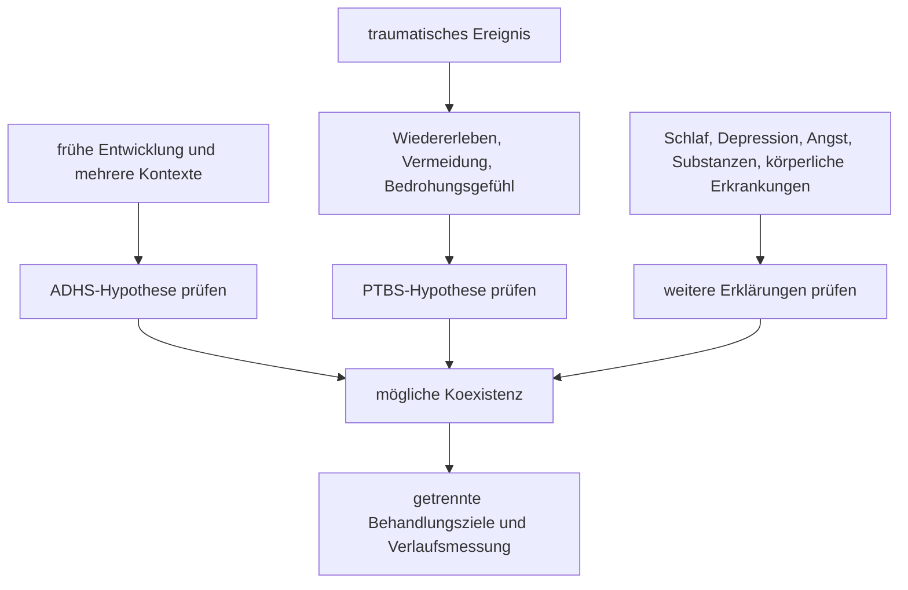

# Einheit 18 – Trauma, PTBS und komplexe Traumafolgen: Zeitachsen, Abgrenzung und Koexistenz mit ADHS

## Lernziel

Du kannst ein belastendes oder potenziell traumatisches Ereignis von einer posttraumatischen Belastungsstörung unterscheiden. Du erkennst, warum Schlafprobleme, Konzentrationsschwierigkeiten, innere Unruhe und emotionale Dysregulation bei ADHS und posttraumatischen Störungen ähnlich aussehen können, obwohl Beginn, Auslöser und Funktion verschieden sind. Außerdem kannst du ADHS, PTBS und komplexe PTBS als unterscheidbare, aber möglicherweise gleichzeitig bestehende Bedingungen einordnen, ohne aus Gruppenbefunden eine persönliche Diagnose abzuleiten.

## 1. Traumaexposition ist nicht dasselbe wie PTBS

Im Alltag wird „Trauma“ teils für jedes stark belastende Erlebnis verwendet. Klinisch muss genauer getrennt werden. Ein potenziell traumatisches Ereignis bezeichnet eine Konfrontation mit außergewöhnlicher Bedrohung, schwerer Gewalt, Verletzung oder Tod. Die Reaktion darauf kann sehr unterschiedlich ausfallen. Viele Menschen erleben zunächst Angst, Schlafprobleme, aufdringliche Erinnerungen oder erhöhte Wachsamkeit, ohne später eine PTBS zu entwickeln.

Eine **posttraumatische Belastungsstörung (PTBS)** ist deshalb weder durch das Ereignis allein noch durch einzelne unspezifische Symptome definiert. Entscheidend ist ein charakteristisches Muster, das mit dem Ereignis verbunden ist, über eine vorübergehende Reaktion hinaus besteht und relevante Beeinträchtigung verursacht. In der ICD-11 gehören dazu insbesondere:

- Wiedererleben des Ereignisses in der Gegenwart, etwa durch lebhafte intrusive Erinnerungen, Flashbacks oder Albträume,
- Vermeidung von Gedanken, Gefühlen, Aktivitäten, Personen oder Situationen, die an das Ereignis erinnern,
- ein anhaltendes Gefühl aktueller Bedrohung mit erhöhter Wachsamkeit oder ausgeprägter Schreckreaktion.

Schlaf-, Konzentrations- und Emotionsprobleme können hinzukommen, sind aber für sich allein nicht spezifisch. Dass eine Person nach einer Belastung zerstreut, reizbar oder unruhig ist, beweist daher weder PTBS noch ADHS.

> [!evidence] Evidenz: aktuelle Leitlinie und ICD-11 / hoch
> Die deutsche S3-Leitlinie zur PTBS wurde 2026 aktualisiert. Die ICD-11-Diagnostik trennt Traumaexposition, PTBS und komplexe PTBS anhand ihrer jeweiligen Symptomstruktur und Funktionsbeeinträchtigung. Ein Ereignis, ein Fragebogenwert oder ein einzelnes Konzentrationssymptom reicht nicht zur Diagnose.

## 2. Ähnliche Oberfläche, unterschiedliche Prozesslogik

ADHS ist eine Neuroentwicklungsstörung. Diagnostisch wird ein früh beginnendes, über Lebensbereiche erkennbares Muster von Unaufmerksamkeit und/oder Hyperaktivität-Impulsivität geprüft. Eine PTBS entsteht dagegen definitionsgemäß im Zusammenhang mit einem oder mehreren traumatischen Ereignissen. Ihre Symptome sind häufig an Erinnerungen, Hinweisreize, Bedrohungsbewertung und Vermeidung gekoppelt.

| Beobachtung | ADHS-bezogener Prozess möglich | Posttraumatischer Prozess möglich |
|---|---|---|
| Konzentration bricht ab | Zielverlust, Ablenkbarkeit, instabile Aufmerksamkeitssteuerung | Intrusion, Gefahrensuche oder traumabezogene Körperreaktion bindet den Fokus |
| innere Unruhe | Unterstimulation, Bewegungsdrang, Impulsivität | Alarmbereitschaft, Schreckhaftigkeit oder Fluchtimpuls |
| Schlafprobleme | verzögerter Rhythmus, schwieriges Abschalten, Komorbidität | Albträume, Sicherheitskontrollen, Angst vor dem Schlaf oder Hyperarousal |
| Vergesslichkeit | Arbeitsgedächtnis und Unterbrechungen | hohe Aktivierung, Intrusionen oder dissoziative Zustände beeinträchtigen Enkodierung und Abruf |
| Vermeidung | Aufgabe ist unklar, langweilig oder schwer zu starten | Handlung, Ort oder Gedanke erinnert an Gefahr oder löst Wiedererleben aus |
| emotionale Reaktion | schnelle Reaktivität und erschwerte Regulation | Hinweisreiz aktiviert ein erlerntes Bedrohungsnetzwerk |

Diese Gegenüberstellung ist kein Selbsttest. Dass ein Symptom nach einem Trauma stärker wurde, löscht eine mögliche frühere ADHS nicht aus. Umgekehrt darf eine neu entstandene qualitative Veränderung nicht rückwirkend automatisch als „schon immer ADHS“ umgedeutet werden.

## 3. Die wichtigste diagnostische Hilfe sind getrennte Zeitachsen

Bei überlappenden Beschwerden ist die Frage „Welches Etikett passt?“ oft weniger hilfreich als eine genaue Rekonstruktion des Verlaufs. Mindestens drei Zeitachsen sollten getrennt werden:

1. **Entwicklungsachse:** Welche unaufmerksamen, hyperaktiven oder impulsiven Merkmale bestanden bereits vor dem traumatischen Ereignis? Zeigten sie sich in mehreren Kontexten?
2. **Traumaachse:** Wann traten Wiedererleben, Vermeidung, Schreckhaftigkeit, anhaltendes Bedrohungsgefühl oder dissoziative Beschwerden auf?
3. **Funktionsachse:** Welche Probleme entstehen heute wodurch, und welche Unterstützung verändert welchen Teil des Musters?

Eine Person kann bereits in der Kindheit breite Organisations- und Aufmerksamkeitsprobleme gehabt haben und nach einem späteren Gewalt- oder Unfallerlebnis zusätzlich Flashbacks und Vermeidung entwickeln. Eine andere Person kann erst nach dem Ereignis deutlich unkonzentriert und schreckhaft werden. Eine dritte besitzt lückenhafte Kindheitsinformationen, sodass die Diagnose zunächst unsicher bleibt. Wissenschaftliche Sorgfalt verlangt, diese Möglichkeiten nicht durch eine schnelle Entweder-oder-Entscheidung zu ersetzen.

## 4. Intrusion, Gedankenschweifen und Dissoziation unterscheiden

**Intrusionen** sind unwillkürlich auftauchende Erinnerungen, Bilder, Körperempfindungen oder Albträume mit Bezug zum traumatischen Ereignis. Sie können die Gegenwart stark überlagern. Das unterscheidet sie von gewöhnlichem Gedankenschweifen, auch wenn beides von außen wie „nicht zuhören“ wirken kann.

**Dissoziation** bezeichnet Veränderungen der Integration von Bewusstsein, Erinnerung, Wahrnehmung, Identität oder Körpererleben. Dazu können Depersonalisation, Derealisation oder Erinnerungslücken gehören. Nicht jedes Abschweifen, jeder „Tunnelblick“ oder jedes Vergessen ist dissoziativ. Ebenso beweist ein dissoziatives Erlebnis keine bestimmte Diagnose.

Für die Abgrenzung sind konkrete Fragen hilfreicher als Schlagwörter:

- Gab es einen erkennbaren Hinweisreiz?
- War die Aufmerksamkeit an eine traumabezogene Erinnerung oder Körperreaktion gebunden?
- Fühlte sich die Umgebung unwirklich oder der eigene Körper fremd an?
- Fehlt Erinnerung an einen Zeitraum, oder wurde nur ein Handlungsschritt vergessen?
- Trat das Muster schon vor dem Ereignis in vergleichbarer Form auf?
- Ist die Reaktion auf bestimmte Situationen begrenzt oder breit über den Alltag verteilt?

PTBS, Depression, Angst, Schlafmangel, Substanzgebrauch, Epilepsie, Medikamenteneffekte und weitere körperliche oder neurologische Bedingungen können ebenfalls Konzentration oder Bewusstsein beeinflussen. Neu auftretende, ausgeprägte Erinnerungslücken oder qualitative Bewusstseinsveränderungen benötigen deshalb fachliche Abklärung.

## 5. Was komplexe PTBS bedeutet – und was nicht

Die ICD-11 führt die **komplexe posttraumatische Belastungsstörung (kPTBS)** als eigene Diagnose. Sie umfasst die Kernmerkmale der PTBS und zusätzlich anhaltende Störungen der Selbstorganisation:

- erhebliche Schwierigkeiten der Emotionsregulation,
- ein anhaltend negatives Selbstkonzept,
- deutliche Schwierigkeiten in Beziehungen.

Diese zusätzlichen Bereiche müssen mit der Traumafolgesymptomatik verbunden sein und relevante Beeinträchtigung verursachen. Komplexe PTBS bedeutet nicht einfach „sehr schwere PTBS“, „schwierige Kindheit“ oder eine beliebige Mischung vieler psychischer Beschwerden. Auch emotionale Dysregulation, Selbstkritik und Beziehungsschwierigkeiten kommen bei Depression, Persönlichkeitsstörungen, Autismus, ADHS und anderen Bedingungen vor.

Klassifikationssysteme sind hier nicht vollständig identisch. Die ICD-11 beschreibt kPTBS als eigene Kategorie; im DSM-5-TR gibt es keine gleichnamige eigenständige Diagnose. Das ist eine Differenz der diagnostischen Modelle, kein Beweis, dass Betroffene in einem System „wirklich“ und im anderen „nicht wirklich“ erkrankt wären. Fachleute müssen die verwendeten Kriterien transparent benennen.

## 6. Was die Forschung zur Koexistenz mit ADHS zeigt

Eine 2025 veröffentlichte systematische Übersichtsarbeit identifizierte 21 Studien zur gemeinsamen Diagnose von ADHS und PTBS bei Erwachsenen. Sie fand Hinweise auf relevante Koexistenz und stärkere klinische Belastung, konnte wegen erheblicher Heterogenität jedoch keine verlässliche gemeinsame Effekt- oder Prävalenzschätzung berechnen. Viele Studien untersuchten Veteran:innen, Militärpersonal oder andere ausgewählte klinische Gruppen. Messinstrumente, Diagnoseverfahren und Stichprobengrößen unterschieden sich deutlich.

Einzelne in der Übersicht berichtete Prozentwerte dürfen deshalb nicht als allgemeine Häufigkeit für die Bevölkerung gelesen werden. Sie vermischen unterschiedliche Richtungen der Fragestellung – PTBS bei Menschen mit ADHS und ADHS bei Menschen mit PTBS – und stammen oft aus hoch belasteten Spezialpopulationen. Die Übersichtsarbeit fand außerdem nur sehr begrenzte Evidenz zur Behandlung der Koexistenz.

Eine Meta-Analyse von 13 Studien mit 13.585 Teilnehmenden berichtete 2025 höhere Chancen einer gemeinsamen ADHS/PTBS-Diagnose bei weiblichen als bei männlichen Teilnehmenden; der gepoolte Odds-Ratio-Wert lag bei 1,32, in der Erwachsenen-Untergruppe bei 1,41. Das ist ein Gruppenbefund. Er beweist weder eine biologische Ursache noch, dass jede Frau häufiger betroffen ist. Unterschiede in Traumaexposition, Hilfesuche, Symptomdarstellung, diagnostischen Erwartungen und Stichprobenauswahl können beitragen. Die Arbeit untersuchte überwiegend binäre Geschlechtskategorien; Aussagen zu trans, nichtbinären und intergeschlechtlichen Menschen bleiben weitgehend offen.

## 7. Behandlung und Unterstützung: Ziele trennen, Umsetzung verbinden

Die aktuelle deutsche S3-Leitlinie behandelt Diagnostik und Versorgung der PTBS über Altersgruppen und besondere Bedarfslagen hinweg. Traumafokussierte Psychotherapie besitzt dabei eine zentrale Rolle. Das genaue Verfahren, die Vorbereitung und die Reihenfolge richten sich nach Sicherheit, Symptomatik, Stabilität, Komorbiditäten, Alter, Präferenzen und Versorgungskontext.

Bei gleichzeitigem ADHS können praktische Anpassungen die Durchführung erleichtern:

- kurze und sichtbare Aufgaben statt langer nur mündlicher Pläne,
- Erinnerungen an Termine und vereinbarte Übungen,
- klare Zwischenziele und Rückmeldung,
- Berücksichtigung von Schlaf, Reizlast und Arbeitsgedächtnis,
- getrennte Messung von ADHS- und PTBS-Zielen.

Solche Anpassungen ersetzen keine traumafokussierte Behandlung. Umgekehrt behandelt eine Traumatherapie nicht automatisch eine seit der Kindheit bestehende ADHS. Medikamente, Dosierungen und Behandlungsreihenfolgen müssen individuell fachlich abgewogen werden; aus der dünnen Komorbiditätsforschung lässt sich keine allgemeine Reihenfolge ableiten.

Unbegleitete Konfrontation mit stark belastenden Erinnerungen ist kein neutrales Selbstexperiment. Akute Suizidalität, anhaltende unmittelbare Gefahr, schwere Selbstvernachlässigung, psychotische oder manische Symptome, ausgeprägte Dissoziation oder eine plötzliche starke Verschlechterung benötigen zeitnahe professionelle beziehungsweise notfallmedizinische Hilfe.

## 8. Mini-Übung: zwei Hypothesen sichtbar machen

Wähle eine konkrete Situation mit Konzentrationsabbruch oder Vermeidung. Notiere, ohne eine Diagnose zu vergeben:

1. Was geschah unmittelbar vorher?
2. Gab es einen äußeren oder inneren Hinweisreiz mit Trauma-Bezug?
3. Welche Gedanken, Bilder, Körperempfindungen oder Erinnerungen traten auf?
4. Bestand dieselbe Schwierigkeit schon vor dem Ereignis?
5. Tritt sie in vielen Kontexten oder vor allem bei bestimmten Erinnerungen und Situationen auf?
6. Was hilft: klarere Struktur, geringere Reizlast, ein sicherer Kontext, Abstand vom Hinweisreiz oder etwas anderes?
7. Welche Folgen hat das Verhalten kurz- und langfristig?

Das Ziel ist nicht, sich selbst zwischen ADHS und PTBS einzusortieren. Die Übung zeigt, welche Informationen eine fachliche Diagnostik benötigt und warum zwei gleichzeitig richtige Hypothesen möglich sind.

## 9. Wissenschaftliche Einordnung und Grenzen

**Konsens:** Traumaexposition ist nicht gleich PTBS. ADHS ist entwicklungsbezogen, während PTBS an traumatische Ereignisse und ein charakteristisches Muster aus Wiedererleben, Vermeidung und anhaltendem Bedrohungsgefühl gebunden ist. Beide Störungen können gleichzeitig bestehen und müssen getrennt geprüft werden.

**Wahrscheinlich:** Aufmerksamkeitsbindung durch Intrusionen, Hyperarousal, Schlafstörungen und Vermeidung kann ADHS-ähnliche Beschwerden erzeugen oder bestehende ADHS-Schwierigkeiten verstärken. ADHS-gerechte Struktur kann die Umsetzbarkeit einer Traumabehandlung verbessern.

**Umstritten oder begrenzt:** Wie häufig ADHS und PTBS in der Allgemeinbevölkerung gemeinsam vorkommen und welche Mechanismen die Verbindung erklären. Die aktuelle Literatur ist durch heterogene Diagnostik, Spezialstichproben und überwiegend beobachtende Designs begrenzt.

**Offen:** Welche Behandlungsreihenfolge bei welcher Konstellation optimal ist, wie kPTBS und ADHS über die Lebensspanne interagieren und wie Geschlecht, Gender, Kultur, Flucht, Behinderung und soziale Bedingungen die Erkennung beeinflussen.

## Review-Frage

**Warum reicht die Beobachtung „seit dem Trauma unkonzentriert und unruhig“ weder für eine ADHS- noch für eine PTBS-Diagnose aus?**

Antwort

Weil Konzentrationsprobleme und Unruhe unspezifisch sind. Für ADHS müssen ein früher Entwicklungsbeginn, mehrere Kontexte und ein passendes Kernsymptommuster geprüft werden. Für PTBS müssen Trauma-Bezug, Wiedererleben, Vermeidung, anhaltendes Bedrohungsgefühl und Beeinträchtigung beurteilt werden. Beide Bedingungen sowie weitere Erklärungen können gleichzeitig vorliegen.

## Wissenschaftliche Quellen

- [[references/DeGPT2026|Deutschsprachige Gesellschaft für Psychotraumatologie 2026]] – aktuelle deutsche S3-Leitlinie zur PTBS.
- [[references/WHO2024|World Health Organization 2024]] – ICD-11 CDDR mit diagnostischen Beschreibungen einschließlich komplexer PTBS.
- [[references/Magdi2025|Magdi et al. 2025]] – systematische Übersicht zur ADHS/PTBS-Koexistenz bei Erwachsenen.
- [[references/Wilson2025|Wilson et al. 2025]] – Meta-Analyse zu geschlechtsbezogenen Unterschieden der gemeinsamen Diagnose.

## Merksatz

> Die Oberfläche kann ähnlich sein; für die Abgrenzung zählen Entwicklungsbeginn, Trauma-Bezug, Auslöser, Funktion und getrennte Zeitachsen.

## Navigation

- Zurück: [[02-Vertiefung/05-Zwangssymptome-und-Zwangsstoerung|Zwangssymptome, Zwangsstörung und ADHS]]
- Weiter: [[ROADMAP#A2 · Angst, Zwang, Trauma und episodische Störungen — P0|Bipolare Störungen, Psychosen und episodische Veränderungen]] *(geplant)*
- [[Glossar]] · [[Literatur]] · [[knowledge-graph/README|Wissensgraph]]
