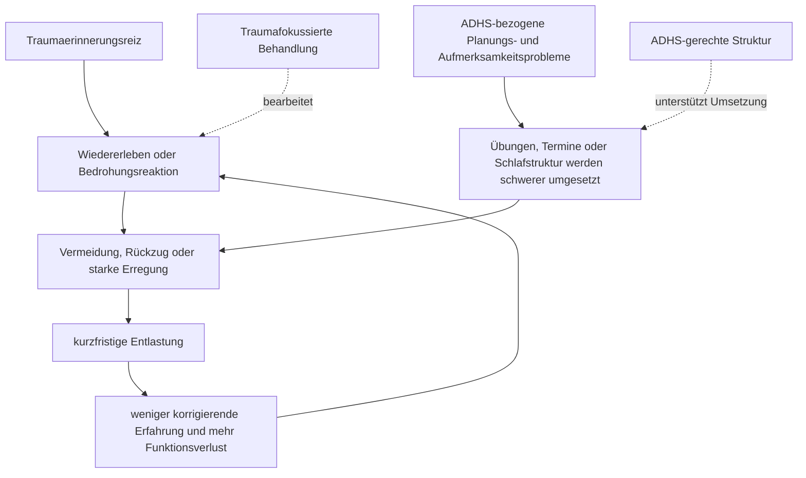

# Einheit 18 – Trauma, PTBS und komplexe Traumafolgen bei ADHS: Zeitachsen, Überlappung und Koexistenz

## Lernziel

Du kannst eine traumatische Erfahrung von einer posttraumatischen Belastungsstörung unterscheiden und erkennst, warum Unruhe, Konzentrationsprobleme, Schlafstörungen oder emotionale Übererregung bei ADHS und PTBS ähnlich aussehen können. Du verstehst, wie Beginn, Auslöser, Funktion und Verlauf zur Differentialdiagnostik beitragen, warum beide Störungen koexistieren können und weshalb Gruppenassoziationen weder eine Ursache noch eine individuelle Diagnose beweisen.

## 1. Traumaexposition ist nicht dasselbe wie PTBS

**Trauma** bezeichnet in diesem Kapitel die Konfrontation mit einem extrem bedrohlichen oder entsetzlichen Ereignis beziehungsweise einer Ereignisfolge. Viele Menschen reagieren danach vorübergehend mit Angst, Schlafproblemen, erhöhter Wachsamkeit, aufdringlichen Erinnerungen oder Vermeidung. Eine solche Reaktion ist nicht automatisch eine psychische Störung. Für eine **posttraumatische Belastungsstörung (PTBS)** werden ein charakteristisches, an das Ereignis gebundenes Symptommuster, eine bestimmte Dauer und relevante Beeinträchtigung geprüft.

Je nach Klassifikationssystem werden die Merkmale etwas unterschiedlich geordnet. Wiederkehrende Kernelemente sind:

- ungewolltes Wiedererleben, etwa belastende Erinnerungen, Albträume oder das Gefühl, das Ereignis geschehe erneut;
- Vermeidung innerer oder äußerer Erinnerungsreize;
- anhaltendes Gefühl gegenwärtiger Bedrohung beziehungsweise Übererregung;
- Veränderungen von Stimmung, Gedanken und Reaktionen;
- klinisch relevante Beeinträchtigung.

Nicht jedes lebhafte Erinnern ist ein Flashback, nicht jede Nervosität Hyperarousal und nicht jede unangenehme Kindheitserfahrung erfüllt das Traumakriterium. Umgekehrt kann eine betroffene Person äußerlich ruhig wirken, während sie intensive innere Intrusionen, Vermeidung oder Dissoziation erlebt.

> [!evidence] Evidenz: Leitlinien / hoch
> Die NICE-Leitlinie NG116 wurde 2018 veröffentlicht und im April 2025 erneut überwacht. NICE fand keine neue Evidenz, die ihre Empfehlungen verändert. Die Leitlinie verlangt eine gezielte, sensible Prüfung von Traumaexposition, traumaspezifischen Symptomen, Dauer und Funktionsbeeinträchtigung; ein unspezifischer Konzentrationswert genügt nicht.

Die ICD-11 unterscheidet zusätzlich die **komplexe PTBS**. Sie umfasst die PTBS-Kernsymptome und anhaltende Störungen der Selbstorganisation: Schwierigkeiten der Affektregulation, ein dauerhaft negatives Selbstkonzept und Beziehungsprobleme. „Komplex“ bedeutet nicht einfach besonders schwer, viele Diagnosen oder eine lange Liste unspezifischer Beschwerden. Die Abgrenzung und standardisierte Erfassung sind noch weniger etabliert als bei klassischer PTBS.

## 2. Ähnliche Oberfläche, unterschiedliche diagnostische Hinweise

ADHS und PTBS können sichtbare Merkmale teilen, ohne dass dieselben Prozesse vorliegen. Beide können mit Ablenkbarkeit, motorischer Unruhe, Reizbarkeit, Schlafproblemen, Vergesslichkeit oder Schwierigkeiten bei Planung und Emotionsregulation einhergehen. Das Verhalten allein entscheidet deshalb nicht.

| Beobachtung | ADHS-bezogene Erklärung möglich | PTBS-bezogene Erklärung möglich |
|---|---|---|
| Konzentration bricht ab | Zielaktivierung ist instabil, Ablenkreize gewinnen rasch Gewicht | ein Traumaerinnerungsreiz bindet Aufmerksamkeit oder löst Wiedererleben aus |
| Unruhe und Schreckhaftigkeit | entwicklungsbezogene Hyperaktivität oder Regulationsproblem | anhaltende Bedrohungsbereitschaft, Hypervigilanz oder Startle-Reaktion |
| Vergesslichkeit | Arbeitsgedächtnis und Handlungsorganisation sind instabil | starke Erregung, Schlafmangel, Vermeidung oder Dissoziation stören Enkodierung und Abruf |
| Aufgaben werden vermieden | Startbarrieren, geringe unmittelbare Rückmeldung oder Überforderung | Aufgabe, Ort, Person oder Körperzustand erinnert an das Trauma |
| „Wegtreten“ | Tagträumen, Unterstimulation oder Aufmerksamkeitswechsel | Dissoziation mit veränderter Gegenwarts- oder Selbstwahrnehmung möglich |
| emotionale Eskalation | rascher Emotionsanstieg und langsame Rückkehr zum Ziel | Reaktion auf erinnerte Gefahr, Scham, Kontrollverlust oder Trigger |

Diese Gegenüberstellung ist keine Selbstdiagnose. Ein Trigger muss nicht offensichtlich sein, und eine Person kann beide Mechanismen gleichzeitig erleben. **Dissoziation** ist zudem kein Synonym für Unaufmerksamkeit: Sie kann Entfremdungsgefühle, Erinnerungslücken oder ein verändertes Erleben von Körper, Selbst und Umgebung umfassen und verlangt eine eigene sorgfältige Prüfung.

## 3. Zeitachsen schützen vor vorschnellen Erklärungen

ADHS ist eine Neuroentwicklungsstörung. Für die Diagnose wird ein früh beginnendes, über mehrere Situationen erkennbares Muster geprüft. PTBS entsteht dagegen in zeitlichem Bezug zu einer Traumaexposition; Symptome können unmittelbar oder verzögert auftreten und sind häufig durch Erinnerungsreize, Vermeidung und veränderte Bedrohungsbewertung organisiert.

Eine getrennte Zeitachse stellt deshalb Fragen wie:

1. Welche Aufmerksamkeits-, Aktivitäts- oder Impulsivitätsmerkmale waren bereits vor dem traumatischen Ereignis vorhanden?
2. In welchen Lebensbereichen traten sie auf, und welche Fremdinformationen gibt es?
3. Welche Beschwerden begannen neu oder veränderten sich qualitativ nach dem Ereignis?
4. Sind Einbrüche an Erinnerungsreize, bestimmte Orte, Gerüche, Körperzustände oder Beziehungssituationen gekoppelt?
5. Welche Rolle spielen Schlaf, Depression, Angst, Schmerz, Substanzen, Medikamente oder aktuelle Unsicherheit?
6. Bestehen Intrusionen, traumaspezifische Vermeidung oder ein anhaltendes Gefühl gegenwärtiger Bedrohung?

Die Regel „vorher vorhanden“ ist hilfreich, aber nicht mechanisch. Frühere ADHS-Merkmale können durch hohe äußere Struktur verdeckt gewesen sein. Traumatische Erfahrungen können früh beginnen und die Entwicklungsanamnese erschweren. Fremdberichte können fehlen, widersprüchlich oder selbst belastet sein. Eine gute Diagnostik hält diese Unsicherheit aus, statt jede Beschwerde nachträglich nur einer Ursache zuzuschreiben.

Zwei verbreitete Fehlschlüsse sind gleichermaßen falsch:

- „Trauma erklärt jede ADHS-Diagnose.“
- „Bekanntes ADHS erklärt jede spätere Konzentrations- oder Erregungsveränderung.“

Diagnostisches Überschatten funktioniert in beide Richtungen. Neue Albträume, Vermeidung, ausgeprägte Schreckhaftigkeit oder qualitative Erinnerungslücken verdienen eine eigene Prüfung. Gleichzeitig beweist eine Traumaerfahrung nicht, dass ein lebenslanges ADHS-Muster falsch war.

## 4. Was die Forschung zur Koexistenz zeigt – und was nicht

Die Meta-Analyse von Spencer und Kolleg:innen fasste 28 Studien zusammen. Der statistische Zusammenhang hing deutlich von der Vergleichsgruppe ab: Gegenüber gesunden Kontrollen waren die relativen Unterschiede größer als gegenüber traumatisierten oder psychiatrischen Vergleichsgruppen. Das spricht für eine Assoziation, zeigt aber zugleich, wie stark Auswahl, Traumaexposition, weitere Störungen und diagnostische Verfahren den Schätzwert beeinflussen.

Ein systematischer Review von Magdi und Kolleg:innen aus dem Jahr 2025 schloss 21 Erwachsenenstudien ein. Wegen erheblicher Unterschiede in Design, Population und Messung wurde keine Meta-Analyse durchgeführt. Viele Studien stammten aus militärischen, klinischen oder substanzbezogenen Stichproben. Die berichteten Koexistenzraten dürfen deshalb nicht als allgemeine Bevölkerungsprävalenz gelesen werden. Die Behandlungsdaten waren klein, heterogen und für eine pauschale Reihenfolge oder Medikamentenempfehlung unzureichend.

> [!evidence] Evidenz: systematische Reviews / moderat
> ADHS und PTBS können gemeinsam vorkommen und sind in untersuchten Gruppen häufiger miteinander verbunden als zufällig zu erwarten wäre. Ungeklärt bleiben jedoch Richtung und Ursachen des Zusammenhangs. Mögliche Beiträge sind unterschiedliche Traumaexposition, Risikosituationen, gemeinsame Komorbiditäten, Symptomüberlappung, Auswahl klinischer Stichproben und diagnostische Fehlklassifikation.

Ein relatives Risiko oder eine Odds Ratio beschreibt Gruppenunterschiede. Es sagt nicht, ob eine bestimmte Person nach einer Erfahrung PTBS entwickelt, ob ADHS die Ursache war oder ob eine aktuelle Konzentrationsstörung traumabedingt ist. Ebenso ist „Selbstmedikation“, genetische Überlappung oder eine gemeinsame Stressbiologie kein universeller Erklärungsmechanismus.

## 5. Wie sich beide Problembereiche gegenseitig verstärken können

Traumaspezifische Symptome können Aufmerksamkeit und Alltag stark beanspruchen. Intrusionen konkurrieren mit Arbeitsgedächtnis, Vermeidung begrenzt Lern- und Arbeitssituationen, Hyperarousal stört Schlaf und Erholung. ADHS kann gleichzeitig die Umsetzung einer Behandlung erschweren: Termine, Übungspläne, Tagesstruktur oder das rechtzeitige Erkennen von Überforderung können zusätzliche Unterstützung benötigen.

Das Diagramm ist ein Lernmodell, keine vollständige Kausalkette. Vermeidung kann kurzfristig Schutz bieten und in akut unsicheren Situationen angemessen sein. Traumafokussierte Behandlung setzt deshalb voraus, dass aktuelle Sicherheit, Stabilität, Einwilligung und Behandlungsrahmen berücksichtigt werden. „Konfrontiere dich einfach“ ist weder leitliniengerecht noch sicher.

## 6. Diagnostik: traumasensibel, aber nicht trauma-automatisch

Traumasensible Diagnostik bedeutet, Wahlmöglichkeiten, Tempo, Privatsphäre und aktuelle Sicherheit zu beachten. Sie bedeutet nicht, dass jede Person detailliert erzählen muss oder dass jede Beschwerde als Traumafolge etikettiert wird. Für eine erste Einordnung können Fachpersonen nach Symptomgruppen und Auswirkungen fragen, ohne unnötig in belastende Ereignisdetails zu drängen.

Wichtige Bestandteile sind:

- getrennte Prüfung der vollständigen Kriterien von ADHS und PTBS;
- Entwicklungs-, Trauma- und Symptomzeitachse;
- mehrere Lebenskontexte und, sofern möglich, frühere Berichte;
- aktuelle Gefährdung, Suizidalität, Selbstverletzung und Substanzgebrauch;
- Schlaf, körperliche Erkrankungen, Schmerz und Medikamenteneffekte;
- Depression, Angst, Zwang, Autismus, bipolare oder psychotische Symptome als weitere Koexistenz- oder Alternativerklärungen;
- Funktionsbeeinträchtigung statt bloßer Symptomzählung.

Screeningfragebögen können Hinweise liefern, aber keine der Diagnosen allein bestätigen. Bei komplexer PTBS fehlen weiterhin vollständig standardisierte Goldstandard-Empfehlungen über Altersgruppen und Kulturen hinweg. Besonders bei Erinnerungslücken, Dissoziation, Gewalt in der Gegenwart oder akuter Selbstgefährdung ist fachliche und sicherheitsorientierte Abklärung wichtiger als eine schnelle Etikettierung.

## 7. Behandlung: traumafokussiert und umsetzbar

Aktuelle Leitlinien empfehlen für PTBS vor allem manualisierte traumafokussierte Psychotherapien. Dazu gehören je nach Leitlinie und Population insbesondere traumafokussierte kognitive Verhaltenstherapien, Cognitive Processing Therapy, Prolonged Exposure und EMDR. Auswahl, Vorbereitung und Durchführung gehören in qualifizierte Behandlung. Psychologisches Debriefing als routinemäßige einmalige Intervention nach einem Trauma wird nicht empfohlen.

Bei koexistierendem ADHS können Anpassungen die Umsetzung verbessern:

- kurze schriftliche Zusammenfassungen;
- sichtbare, begrenzte Übungsschritte;
- Erinnerungen und Terminstruktur;
- regelmäßige Rückmeldung zu Belastung und Funktion;
- klare Unterscheidung zwischen hilfreicher Organisation und Vermeidung;
- gemeinsame Entscheidungsfindung über Prioritäten.

Es gibt keine belastbare allgemeine Regel, dass stets zuerst ADHS oder stets zuerst PTBS behandelt werden muss. Akute Sicherheit und schwere Symptome haben Vorrang; danach werden Ziele, Präferenzen, Zugänglichkeit, Wechselwirkungen und Funktionsbeeinträchtigung gemeinsam abgewogen. Die vorhandenen Daten rechtfertigen weder das pauschale Absetzen noch das pauschale Beginnen eines ADHS-Medikaments wegen PTBS. Änderungen an Medikamenten gehören in fachliche Hände.

## 8. Mini-Übung: Muster beobachten, ohne das Trauma nachzuerzählen

Wähle eine aktuelle Alltagssituation, nicht das traumatische Ereignis selbst. Notiere:

1. Was geschah unmittelbar vor dem Konzentrations- oder Erregungseinbruch?
2. War ein äußerer oder innerer Erinnerungsreiz erkennbar?
3. Trat eher Ablenkbarkeit, Wiedererleben, Vermeidung, Dissoziation oder eine Mischung auf?
4. Wie lange dauerte die Reaktion?
5. Was half praktisch, ohne die Situation gefährlicher zu machen?
6. Bestand dieses Muster schon vor der Traumaexposition oder ist es neu?

Die Übung dient der strukturierten Beobachtung, nicht der Selbstdiagnose oder eigenständigen Exposition. Bei akuter Gefahr, starker Destabilisierung oder Suizidgedanken ist unmittelbare professionelle beziehungsweise notfallmedizinische Hilfe wichtiger als weiteres Protokollieren.

## Review-Frage

**Warum reicht Konzentrationsschwäche nach einer Traumaerfahrung weder für die Diagnose PTBS noch für die Widerlegung einer ADHS aus?**

Antwort

Konzentrationsprobleme sind unspezifisch. Bei PTBS können Intrusionen, Hyperarousal, Vermeidung, Schlafmangel oder Dissoziation Aufmerksamkeit beeinträchtigen; für die Diagnose werden aber Traumaexposition, traumaspezifische Symptomgruppen, Dauer und Beeinträchtigung geprüft. ADHS erfordert dagegen ein früh beginnendes, situationsübergreifendes Neuroentwicklungsmuster. Beide Störungen können koexistieren, weshalb Zeitachsen und vollständige Kriterien getrennt geprüft werden müssen.

## Wissenschaftliche Quellen

- [[references/NICEPTSD2018|NICE NG116]] – klinische Leitlinie zu Erkennung, Diagnostik und Behandlung von PTBS, im April 2025 ohne ändernde neue Evidenz bestätigt.
- [[references/Spencer2016|Spencer et al. 2016]] – systematischer Review und Meta-Analyse zur kontrollgruppenabhängigen Assoziation zwischen ADHS und PTBS.
- [[references/Magdi2025|Magdi et al. 2025]] – aktueller systematischer Review zu erwachsener ADHS-PTBS-Koexistenz, hoher Heterogenität und begrenzter Behandlungsevidenz.
- [[references/Faraone2021|Faraone et al. 2021]], [[references/NICE2018|NICE NG87]] und [[references/AADPA2022|AADPA-Leitlinie]] – Grundlagen für entwicklungsbezogene ADHS-Diagnostik und die Prüfung von Komorbiditäten.

## Merksatz

> Ähnliche Symptome werden nicht durch ihre Oberfläche erklärt: ADHS verlangt eine Entwicklungszeitachse, PTBS einen traumabezogenen Symptomzusammenhang – und beides kann gleichzeitig bestehen.

## Navigation

- Zurück: [[02-Vertiefung/05-Zwangssymptome-und-Zwangsstoerung|Zwangssymptome, Zwangsstörung und ADHS: Funktion, Abgrenzung und Koexistenz]]
- Weiter: [[ROADMAP#A2 · Angst, Zwang, Trauma und episodische Störungen — P0|Bipolare Störungen, Psychosen und episodische Veränderungen]]
- [[Glossar]] · [[Literatur]] · [[knowledge-graph/README|Wissensgraph]]
