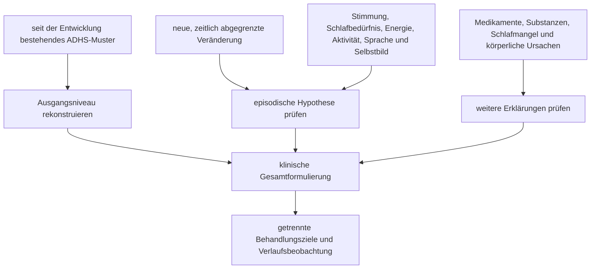

# Einheit 19 – Bipolare Störungen, Psychosen und ADHS: Episoden, Abgrenzung und Sicherheit

## Lernziel

Du kannst ein entwicklungsbezogenes ADHS-Muster von manischen, hypomanischen und psychotischen Episoden unterscheiden. Du erkennst, weshalb Reizbarkeit, schnelles Sprechen, wenig Schlaf, Ablenkbarkeit oder riskantes Verhalten allein keine bipolare Störung beweisen und warum eine **qualitative Veränderung gegenüber dem persönlichen Ausgangszustand** besonders wichtig ist. Außerdem kannst du echte Koexistenz und medikamentenbezogene Sicherheitsfragen einordnen, ohne aus Gruppenbefunden eine persönliche Diagnose oder eine Anweisung zum Beginn, Wechsel oder Absetzen einer Behandlung abzuleiten.

## 1. Ähnliche Wörter beschreiben nicht automatisch denselben Zustand

ADHS ist eine heterogene Neuroentwicklungsstörung. Diagnostisch wird ein seit der Entwicklung bestehendes, in mehreren Lebensbereichen relevantes Muster von Unaufmerksamkeit und/oder Hyperaktivität-Impulsivität geprüft. Die sichtbare Stärke kann mit Anforderungen, Schlaf, Stress, Interesse, Unterstützung und Behandlung schwanken. Das Grundmuster ist jedoch nicht dadurch definiert, dass es nur für einige Tage als klar abgrenzbare Episode auftritt.

Bipolare Störungen verlaufen dagegen typischerweise mit **Episoden**, in denen Stimmung, Energie und Aktivität gegenüber dem üblichen Zustand deutlich verändert sind. Bei einer Manie kann die Stimmung ungewöhnlich gehoben, expansiv oder stark reizbar sein. Häufig kommen mehrere weitere Veränderungen hinzu, etwa deutlich gesteigerter Antrieb, vermindertes Schlafbedürfnis, beschleunigtes Denken oder Sprechen, überhöhtes Selbstvertrauen, stärkere Ablenkbarkeit und riskantes oder enthemmtes Verhalten. Eine Hypomanie umfasst ein ähnliches, aber weniger schweres Muster; psychotische Symptome schließen eine Hypomanie als Episodenklassifikation aus. Dann müssen unter anderem eine manische Episode sowie andere psychotische, substanz- oder medikamentenbezogene Ursachen geprüft werden.

> [!evidence] Evidenz: diagnostischer und leitlinienbasierter Konsens / hoch
> ADHS und bipolare Störungen sind unterscheidbare Erkrankungen und können gleichzeitig vorliegen. Für die Abgrenzung sind Entwicklungsgeschichte, Episodencharakter, deutliche Veränderung vom Ausgangsniveau, Dauer, Funktionsfolgen und Begleitsymptome wichtiger als einzelne überlappende Merkmale.

Eine Person mit ADHS kann seit Jahren schnell sprechen, Ideen wechseln oder impulsiv handeln. Eine andere Person spricht nur während einer klaren Phase ungewöhnlich schnell, schläft wesentlich weniger, fühlt sich dabei nicht müde, beginnt zahlreiche Projekte und trifft Entscheidungen, die deutlich außerhalb ihres sonstigen Verhaltens liegen. Die Oberfläche kann ähnlich wirken; die **zeitliche Organisation des gesamten Syndroms** ist verschieden.

## 2. Vermindertes Schlafbedürfnis ist nicht dasselbe wie Schlafmangel

„Wenig geschlafen“ ist diagnostisch mehrdeutig. Mindestens drei Situationen müssen getrennt werden:

- **Schlafmangel:** Eine Person schläft wegen Verpflichtungen, Aufschieben, Mediennutzung oder ungünstiger Bedingungen zu wenig und ist anschließend müde.
- **Insomnie oder Angst:** Die Person möchte schlafen, kann es aber nicht ausreichend und leidet unter Erschöpfung, Sorgen oder körperlicher Aktivierung.
- **Vermindertes Schlafbedürfnis:** Während einer möglichen manischen oder hypomanischen Episode schläft die Person deutlich weniger als üblich und erlebt dennoch ungewöhnlich viel Energie oder wenig Müdigkeit.

Das letzte Muster ist klinisch besonders auffällig, aber auch allein kein Diagnosetest. Stimulanzien, andere Medikamente, Substanzen, Entzug, Schichtarbeit, körperliche Erkrankungen und akuter Stress können Schlaf und Aktivität ebenfalls verändern. Entscheidend ist die Kombination mit weiteren Symptomen und einer klaren Abweichung vom persönlichen Ausgangszustand.

| Beobachtung | Bei ADHS möglich | Bei Manie/Hypomanie besonders zu prüfen |
|---|---|---|
| Ablenkbarkeit | seit der Entwicklung, kontextabhängig und wiederkehrend | neu oder deutlich verstärkt innerhalb einer Episode |
| schnelles Sprechen | gewohnter Kommunikationsstil oder Impulsivität | ungewöhnlicher Rededrang, schwer unterbrechbar, zusammen mit beschleunigtem Denken |
| viele Ideen | interesse- oder reizgetrieben, häufig mit Startproblemen | ungewöhnlich gesteigerte zielgerichtete Aktivität und Selbstüberschätzung |
| wenig Schlaf | später Rhythmus, Aufschieben, Schlafstörung; meist Müdigkeit | deutlich vermindertes Schlafbedürfnis ohne erwartete Erschöpfung |
| riskantes Verhalten | chronische Impulsivität | qualitative Enthemmung, Größenideen oder ungewöhnliche Risikobereitschaft |
| Reizbarkeit | emotionale Reaktivität, Überforderung, Frustration | anhaltende episodische Veränderung mit weiteren manischen Merkmalen |

Die Tabelle ist kein Selbsttest. Sie zeigt, welche zusätzlichen Fragen aus einer unspezifischen Beobachtung eine klinisch brauchbare Verlaufsinformation machen.

## 3. Episode bedeutet mehr als einen „guten“ oder „schlechten“ Tag

Stimmung und Leistung schwanken bei allen Menschen. Auch ADHS-bezogene Funktionsfähigkeit kann sich von Stunde zu Stunde verändern. Eine bipolare Episode ist jedoch keine Bezeichnung für jede kurze Hochstimmung, jeden produktiven Abend oder jede gereizte Phase. Fachlich wird ein zusammenhängendes Syndrom beurteilt: mehrere gleichzeitig auftretende Veränderungen, eine bestimmte Dauer, eine erkennbare Abweichung vom früheren Zustand und relevante Folgen.

Hilfreich sind vier getrennte Achsen:

1. **Entwicklungsachse:** Welche Aufmerksamkeits-, Aktivitäts- und Impulskontrollprobleme bestanden bereits in Kindheit und Jugend?
2. **Episodenachse:** Gab es klar begrenzte Phasen mit gemeinsam veränderter Stimmung, Energie, Aktivität, Schlafbedarf und Verhalten?
3. **Psychoseachse:** Traten Halluzinationen, Wahnüberzeugungen, schwere Desorganisation oder ein deutlicher Realitätsverlust auf?
4. **Expositionsachse:** Welche Medikamente, Dosisänderungen, Substanzen, Entzugssituationen, Schlafverluste oder körperlichen Erkrankungen gingen der Veränderung voraus?

Ein Symptomkalender kann die Erinnerung unterstützen, ersetzt aber keine fachliche Diagnostik. Gerade rückblickend können normale Hochphasen, ADHS-bedingte Interessenwechsel oder depressive Erholung fälschlich zu Hypomanien umgedeutet werden. Umgekehrt kann eine echte Episode übersehen werden, wenn sämtliche Veränderungen der bekannten ADHS zugeschrieben werden.

## 4. Psychotische Symptome sind keine ADHS-Kernmerkmale

**Psychose** ist ein Oberbegriff für Zustände, in denen Wahrnehmung, Denken, Überzeugungen und Realitätsprüfung deutlich verändert sein können. Dazu gehören beispielsweise Halluzinationen, festgehaltene Wahnüberzeugungen und ausgeprägte Desorganisation. Psychotische Symptome können bei verschiedenen Erkrankungen auftreten, darunter Schizophreniespektrumstörungen, schwere bipolare oder depressive Episoden, substanz- oder medikamenteninduzierte Zustände sowie manche neurologischen oder körperlichen Erkrankungen.

Nicht jede ungewöhnliche Wahrnehmung ist eine Psychose. Einschlaf- oder Aufwachphänomene, intrusive Gedanken, lebhafte Vorstellungen, Dissoziation, kulturell eingebettete Erfahrungen und Wahrnehmungen bei Schlafentzug müssen differenziert beurteilt werden. Umgekehrt dürfen neu auftretende Stimmen, ausgeprägte Verfolgungsüberzeugungen, schwere Verwirrtheit oder ein deutlicher Verlust der Realitätsprüfung nicht als „starke ADHS“ verharmlost werden.

> [!warning] Neue qualitative Veränderung
> Neu auftretende psychotische Symptome, eine mögliche Manie, schwere Desorganisation, gefährliche Enthemmung, akute Suizidalität oder fehlende Fähigkeit, die eigene Sicherheit zu gewährleisten, erfordern eine rasche fachpsychiatrische beziehungsweise notfallmedizinische Beurteilung. Bei unmittelbarer Gefahr gilt in Deutschland **112**; außerhalb Deutschlands der örtliche Notruf.

Psychose ist zudem nicht gleich Schizophrenie. Eine einzelne psychotische Episode kann unterschiedliche Ursachen und Verläufe haben. Die Diagnose entsteht aus Symptomstruktur, Dauer, Affektbezug, Substanzen, Medikamenten, körperlicher Untersuchung und Verlauf – nicht aus einem einzelnen Erlebnis.

## 5. Koexistenz ist real, Häufigkeitszahlen bleiben kontextabhängig

Die systematische Übersicht und Meta-Analyse von Schiweck und Kolleg:innen bündelte 71 Studien mit 646.766 Erwachsenen aus 18 Ländern. Im Mittel hatten 7,95 Prozent der Erwachsenen mit ADHS auch eine bipolare Diagnose; bei Erwachsenen mit bipolarer Störung lag die gepoolte ADHS-Häufigkeit bei 17,11 Prozent. Die Heterogenität war erheblich und wurde teilweise durch Diagnosesystem, Stichprobengröße und Region erklärt.

Diese Zahlen sind **keine persönliche Wahrscheinlichkeit**. Klinische Spezialambulanzen, retrospektive Diagnosen, unterschiedliche Altersgruppen und variierende Kriterien können Schätzungen stark verändern. Symptomüberlappung kann sowohl zu Über- als auch zu Unterdiagnosen führen. Eine echte Doppeldiagnose setzt voraus, dass die Kriterien beider Störungen unabhängig voneinander erfüllt sind.

## 6. Medikamentenbezogene Veränderungen: überwachen statt selbst experimentieren

ADHS-Medikamente können sehr wirksam sein, benötigen aber wie jede Pharmakotherapie eine fachliche Nutzen-Risiko-Abwägung. Bei einer bekannten oder vermuteten bipolaren Störung ist die Behandlungsplanung besonders anspruchsvoll. Ein systematischer Review der International Society for Bipolar Disorders fand nur begrenzte und heterogene Evidenz zu etablierten oder nicht zugelassenen ADHS-Medikamenten bei bipolarer Störung. Daraus folgt keine universelle Reihenfolge und kein privates Dosierschema.

Eine 2025 veröffentlichte systematische Übersicht und Meta-Analyse schloss 16 Studien mit 391.043 stimulantienbehandelten Menschen mit ADHS ein. Psychotische Symptome, psychotische Störungen und bipolare Diagnosen wurden in einem kleinen, aber klinisch relevanten Anteil dokumentiert; die Schätzungen schwankten mit einer Heterogenität von über 95 Prozent. In drei Vergleichsstudien war die dokumentierte Psychosehäufigkeit unter Amphetaminen höher als unter Methylphenidat. Die eingeschlossenen Designs können jedoch **keine Kausalität beweisen**: Ausgangsrisiko, Indikation, Dosis, Nachbeobachtung, Komorbiditäten und diagnostische Erfassung unterschieden sich.

Eine im März 2026 veröffentlichte systematische Übersicht und Meta-Analyse von Jangra und Kolleg:innen verglich 77 Studien mit insgesamt 687.912 Personen; nur neun Studien betrafen therapeutische Anwendung, 68 dagegen nichtmedizinischen Konsum. Für therapeutische Exposition wurde eine gepoolte Psychoseinzidenz von 0,6 Prozent (95-Prozent-Konfidenzintervall 0,3 bis 0,9) und eine Prävalenz von 0,2 Prozent berichtet, während die gepoolte Prävalenz in den überwiegend hoch dosierten, häufig methamphetaminbezogenen nichtmedizinischen Kontexten 32,8 Prozent betrug. **Inzidenz und Prävalenz sind unterschiedliche Maße**, und die beiden Expositionsgruppen waren weder hinsichtlich Dosis, Applikationsweg, Substanz noch Ausgangsrisiko direkt vergleichbar. Die Zahlen dürfen deshalb weder als kausaler Wirkstoffvergleich noch als persönliche Risikoprognose gelesen werden. Der Review stärkt vor allem die bereits wichtige Trennung zwischen ärztlich überwachter Behandlung, Fehlgebrauch und illegalem Stimulanzienkonsum.

Drei Regeln sind deshalb wissenschaftlich und praktisch sauber:

1. Ein Gruppenbefund bedeutet nicht, dass ein verordnetes Medikament bei einer bestimmten Person eine Episode verursachen wird.
2. Neu auftretende deutliche Stimmungs-, Schlaf-, Aktivitäts- oder Wahrnehmungsveränderungen sollen zeitnah mit der behandelnden Fachperson besprochen werden.
3. Medikamente sollen nicht eigenständig begonnen, hoch- oder herunterdosiert, gewechselt oder abrupt abgesetzt werden; akute Gefahrenlagen erfordern sofortige Hilfe.

Auch Substanzen und nichtmedizinische Stimulanziennutzung müssen getrennt betrachtet werden. Therapeutische orale Dosierungen, hochdosierter Fehlgebrauch und illegale Stimulanzien sind keine austauschbaren Expositionen.

## 7. Behandlung plant mehrere Ziele und Prioritäten

Wenn ADHS und eine bipolare Störung oder Psychose gleichzeitig bestehen, müssen Sicherheit, aktuelle Episode, Funktionsbeeinträchtigung und langfristige ADHS-Ziele gemeinsam geplant werden. Eine akute Manie oder Psychose kann Entscheidungsfähigkeit, Schlaf, Finanzen, Beziehungen und körperliche Sicherheit erheblich beeinträchtigen. Dann steht die Stabilisierung des akuten Zustands im Vordergrund. Das bedeutet nicht, dass eine bestehende ADHS „verschwindet“.

Nach Stabilisierung können ADHS-bezogene Barrieren weiter relevant sein: Termine werden vergessen, komplexe Einnahmepläne sind schwer umzusetzen, Warnzeichen werden nicht dokumentiert oder eine Versorgungskette bricht an organisatorischen Hürden ab. Sichtbare Pläne, kurze nächste Schritte, Einbezug vertrauter Personen mit Zustimmung und getrennte Verlaufsmaße können die Versorgung erleichtern.

Die NICE-Leitlinie zu bipolarer Störung, zuletzt im September 2025 aktualisiert, verlangt eine umfassende Beurteilung einschließlich Differentialdiagnosen wie ADHS, Schizophreniespektrumstörungen, Substanzgebrauch und körperliche Ursachen. Sie betont außerdem die gemeinsame Behandlungsplanung und eine Risikobeurteilung, unter anderem zu Selbstvernachlässigung, Suizidalität, Risiken für andere, Geldausgaben, Ausbeutung und enthemmtem Verhalten.

## 8. Mini-Übung: Ausgangsniveau und Episode trennen

Wähle eine auffällige Phase, ohne eine Diagnose zu vergeben. Notiere:

1. Wie waren Aufmerksamkeit, Schlaf, Stimmung, Energie und Aktivität in den Monaten davor?
2. Welche Merkmale waren seit Kindheit oder Jugend wiederholt vorhanden?
3. Was änderte sich in der fraglichen Phase **qualitativ**?
4. Wie lange bestand die gemeinsame Veränderung?
5. Wurde deutlich weniger geschlafen – und bestand Müdigkeit oder ungewöhnlich wenig Schlafbedarf?
6. Gab es Größenideen, ungewöhnliche Risiken, Halluzinationen, Wahnüberzeugungen oder schwere Desorganisation?
7. Welche Medikamente, Dosisänderungen, Substanzen, Entzugssituationen oder körperlichen Beschwerden waren zeitlich relevant?
8. Welche Folgen entstanden in Arbeit, Beziehungen, Finanzen, Gesundheit oder Sicherheit?

Die Übung ist kein Instrument zur Selbstdiagnose. Sie erzeugt eine strukturierte Zeitleiste, die eine fachliche Beurteilung präziser machen kann. Bei aktuellen Warnzeichen darf Dokumentation die Hilfe nicht verzögern.

## 9. Wissenschaftliche Einordnung und Grenzen

**Konsens:** ADHS ist entwicklungsbezogen; Manie und Hypomanie sind episodische Syndrome mit einer deutlichen Veränderung von Stimmung, Energie und Aktivität. Psychotische Symptome gehören nicht zu den ADHS-Kernmerkmalen. Beide Störungsgruppen können gleichzeitig bestehen und müssen unabhängig geprüft werden.

**Wahrscheinlich:** Koexistenz ist häufiger als zufällige Unabhängigkeit erwarten ließe und mit höherer psychosozialer Belastung verbunden. Verlauf, Schlafbedarf und qualitative Veränderung vom Ausgangsniveau sind für die Abgrenzung besonders informativ.

**Umstritten oder begrenzt:** Wie stark einzelne Medikamente bei welchen Risikokonstellationen zur Entstehung manischer oder psychotischer Symptome beitragen. Viele Daten sind beobachtend, heterogen und durch Indikation sowie Ausgangsrisiken konfundiert.

**Offen:** Welche Biomarker oder digitalen Verlaufsdaten eine individuelle Episode zuverlässig vorhersagen. Derzeit ersetzen weder Aktivitätsdaten noch Sprachmuster, Fragebögen, Genetik oder neuropsychologische Tests die klinische Verlaufsdiagnostik.

## Review-Frage

**Warum beweisen Reizbarkeit, schnelles Sprechen und wenig Schlaf bei einer Person mit ADHS nicht automatisch eine bipolare Störung?**

Antwort

Weil diese Merkmale unspezifisch sind. Für eine manische oder hypomanische Episode wird ein zeitlich zusammenhängendes Syndrom mit deutlicher Veränderung gegenüber dem persönlichen Ausgangsniveau geprüft, einschließlich Stimmung, Energie, Aktivität, Schlafbedürfnis, Selbstbild, Risiken und Funktionsfolgen. Medikamente, Substanzen, Schlafmangel, körperliche Ursachen und andere psychische Störungen müssen ebenfalls berücksichtigt werden.

## Wissenschaftliche Quellen

- [[references/NICEBipolar2025|NICE 2025]] – aktuelle Leitlinie zur Beurteilung und Behandlung bipolarer Störungen einschließlich Differentialdiagnosen und Risikobeurteilung.
- [[references/WHO2024|World Health Organization 2024]] – ICD-11-CDDR zur diagnostischen Einordnung psychischer, Verhaltens- und Neuroentwicklungsstörungen.
- [[references/Schiweck2021|Schiweck et al. 2021]] – systematische Übersicht und Meta-Analyse zur Koexistenz von ADHS und bipolarer Störung bei Erwachsenen.
- [[references/Miskowiak2024|Miskowiak et al. 2024]] – systematischer Review zu Wirksamkeit und Sicherheit ADHS-bezogener Arzneimittel bei bipolarer Störung.
- [[references/SalazarDePablo2025|Salazar de Pablo et al. 2025]] – systematische Übersicht und Meta-Analyse zu dokumentierten psychotischen und bipolaren Ereignissen unter Stimulanzien bei ADHS.
- [[references/Jangra2026|Jangra et al. 2026]] – systematische Übersicht und Meta-Analyse, die therapeutische und nichtmedizinische Stimulanzienexposition ausdrücklich getrennt einordnet.

## Merksatz

> Chronische Ablenkbarkeit ist keine Manie: Entscheidend sind Episoden, eine qualitative Veränderung des gesamten Zustands und neue Warnzeichen, die fachlich beurteilt werden müssen.

## Navigation

- Zurück: [[02-Vertiefung/06-Trauma-PTBS-und-komplexe-Traumafolgen|Trauma, PTBS und komplexe Traumafolgen]]
- Weiter: [[02-Vertiefung/08-Substanzgebrauch-Abhaengigkeit-und-ADHS|Substanzgebrauch, Abhängigkeit und ADHS]]
- [[Glossar]] · [[Literatur]] · [[knowledge-graph/README|Wissensgraph]]
