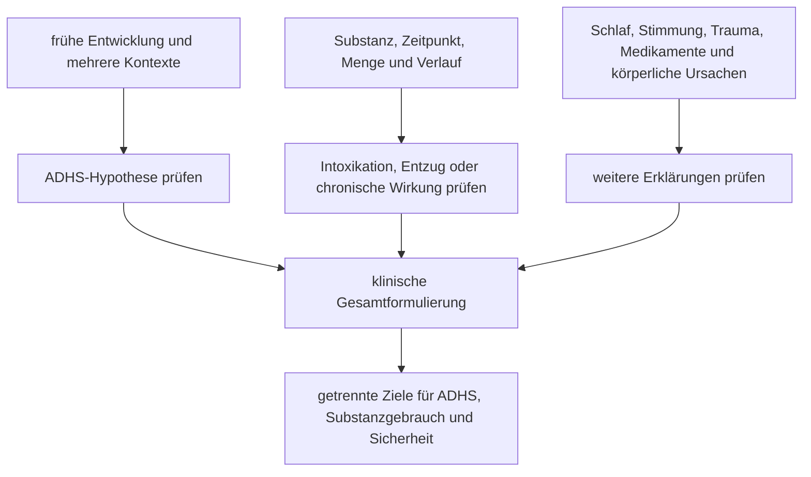

# Einheit 20 – Substanzgebrauch, Abhängigkeit und ADHS: Abgrenzung, Risiken und sichere Versorgung

## Lernziel

Du kannst gelegentlichen Substanzgebrauch, riskanten Gebrauch, Intoxikation, Entzug und eine Substanzgebrauchsstörung voneinander unterscheiden. Du verstehst, weshalb ADHS und Substanzprobleme häufiger gemeinsam vorkommen, ohne daraus eine einfache Ursache oder persönliche Prognose abzuleiten. Außerdem kannst du verordnete ADHS-Behandlung, Fehlgebrauch, nichtmedizinische Nutzung und Weitergabe klar trennen und erklären, warum Diagnostik und Versorgung beide Problembereiche koordiniert berücksichtigen müssen.

## 1. Substanzgebrauch ist nicht automatisch eine Abhängigkeit

Der Begriff **Substanzgebrauch** beschreibt zunächst nur, dass eine psychoaktive Substanz verwendet wurde. Daraus folgt noch keine Diagnose. Klinisch werden unter anderem Häufigkeit, Menge, Kontrollverlust, Priorisierung, Risiken, Folgen und der Verlauf betrachtet. Eine **Substanzgebrauchsstörung** liegt nicht deshalb vor, weil eine Person Alkohol trinkt, Nikotin nutzt oder einmal Cannabis konsumiert hat. Entscheidend ist ein anhaltendes Muster, bei dem Kontrolle, Gesundheit, Verpflichtungen, Beziehungen oder Sicherheit relevant beeinträchtigt sind.

Auch **Abhängigkeit** ist kein moralisches Urteil. Biologische Anpassung, Lernen, psychische Belastung, soziale Bedingungen, Verfügbarkeit und individuelle Vulnerabilität können zusammenwirken. Scham und pauschale Schuldzuweisung erschweren häufig eine offene Anamnese und damit eine sichere Behandlung.

> [!evidence] Evidenz: Leitlinien- und Expert:innenkonsens / hoch
> ADHS und Substanzgebrauchsstörungen sind unterscheidbare Bedingungen, die gleichzeitig bestehen können. Eine fachliche Beurteilung prüft beide eigenständig und trennt Gebrauch, Intoxikation, Entzug, Fehlgebrauch und eine anhaltende Störung.

Mindestens fünf Zustände sollten nicht vermischt werden:

- **bestimmungsgemäße Behandlung:** ein Medikament wird für die betreffende Person in der vereinbarten Form fachlich verordnet und überwacht;
- **nichtmedizinische Nutzung:** eine Substanz oder ein Medikament wird außerhalb dieses Behandlungsrahmens verwendet;
- **Fehlgebrauch:** die Nutzung weicht in Zweck, Menge oder Anwendung vom vereinbarten beziehungsweise vorgesehenen Gebrauch ab;
- **Intoxikation:** vorübergehende Veränderungen während oder kurz nach einer Substanzwirkung;
- **Entzug:** Beschwerden nach deutlicher Verringerung oder Beendigung eines zuvor regelmäßigen oder abhängigen Konsums.

Diese Kategorien können sich überschneiden, sind aber nicht gleichbedeutend.

## 2. Häufige Koexistenz ist ein Gruppenbefund, kein persönlicher Fahrplan

Menschen mit ADHS sind in vielen Studien unter Personen mit Substanzgebrauchsstörungen überrepräsentiert. Die Richtung der Forschung variiert jedoch: Manche Studien fragen nach Substanzproblemen bei Menschen mit ADHS, andere nach ADHS in Suchthilfe- oder Klinikpopulationen. Diese Prozentwerte sind nicht austauschbar.

Eine 2026 veröffentlichte systematische Übersicht und Meta-Analyse von Comiskey und Kolleg:innen bündelte 84 Studien mit 99 Schätzungen und 34.036 Erwachsenen aus Akutversorgung, gemeindenahen Angeboten und Gefängnisgesundheitsdiensten. In diesen **behandlungs- und hilfesuchenden Substanzpopulationen** lag die gepoolte ADHS-Prävalenz bei 22 Prozent, das 95-Prozent-Konfidenzintervall bei 19 bis 25 Prozent. Zwischen den Studien bestand erhebliche Heterogenität. Für cannabisbezogene Gruppen wurde eine höhere Schätzung berichtet; einzelne geschlechts- und substanzbezogene Untergruppen waren jedoch unterschiedlich groß und teils unsicher.

Der Wert von 22 Prozent bedeutet nicht, dass 22 Prozent aller Menschen, die irgendwann eine psychoaktive Substanz nutzen, ADHS haben. Die Stichproben stammen aus Versorgungssystemen und häufig aus hoch belasteten Gruppen. Diagnostische Verfahren, Substanzmuster, Länder und Rekrutierung unterschieden sich.

Eine zweite Meta-Analyse von Shanbhag und Kolleg:innen schloss 20 Studien ein. Bei Erwachsenen mit Substanzgebrauchsstörung wurde eine Vorgeschichte kindlicher ADHS mit 9,9 Prozent geschätzt. Personen mit kindlicher ADHS berichteten im Mittel einen etwa ein bis eineinhalb Jahre früheren Beginn von Tabak-, Alkohol- oder Cannabiskonsum. Auch das ist kein Kausalbeweis: Ein Teil der ADHS-Erfassung erfolgte rückblickend, und soziale, familiäre sowie weitere psychische Faktoren können beide Verläufe beeinflussen.

> [!important] Relative und gepoolte Gruppenwerte sind keine Individualprognose
> Eine Diagnose, ein früher Konsumbeginn oder eine einzelne Substanz erlaubt keine sichere Aussage darüber, wie eine bestimmte Person sich entwickeln wird. Ausgangsrisiko, Alter, Umfeld, Komorbiditäten, Konsummuster und Zugang zu Hilfe verändern die Bedeutung eines Gruppenbefunds.

## 3. Die Zeitachse trennt Entwicklungsmerkmale von Substanzwirkungen

ADHS ist definitionsgemäß neuroentwicklungsbezogen. Relevante Merkmale beginnen früh und zeigen sich über mehr als einen Lebensbereich. Substanzwirkungen besitzen dagegen einen Bezug zu Exposition, Dosis, Zeitpunkt, Intoxikation, Entzug und chronischem Verlauf.

Konzentrationsprobleme, Unruhe, Schlafstörungen, Reizbarkeit oder impulsives Verhalten können in beiden Zusammenhängen auftreten. Eine Momentaufnahme während Intoxikation oder Entzug eignet sich deshalb schlecht, um ein lebenslanges ADHS-Muster zu beurteilen.

Hilfreich sind vier getrennte Fragen:

1. Welche Aufmerksamkeits-, Aktivitäts- und Impulskontrollprobleme bestanden bereits **vor** relevantem Substanzgebrauch?
2. Welche Beschwerden treten nur während Konsum, Schlafentzug, Nachwirkung oder Entzug auf?
3. Welche Veränderungen bleiben über längere substanzarme oder abstinente Phasen bestehen, soweit solche Phasen vorhanden und sicher beurteilbar sind?
4. Welche weiteren Bedingungen erklären einen Teil des Bildes, etwa Depression, Angst, Trauma, Bipolarität, Psychose, Schmerzen oder Medikamente?

Eine vollständige Abstinenz ist nicht in jeder Versorgungssituation sofort erreichbar und darf nicht als Vorwand dienen, jede Diagnostik oder Hilfe unbegrenzt aufzuschieben. Gleichzeitig sollte Unsicherheit transparent bleiben, wenn der aktuelle Zustand eine zuverlässige Entwicklungsbeurteilung erschwert.

## 4. Verschiedene Substanzen erzeugen verschiedene Muster

„Drogen“ ist klinisch eine zu grobe Kategorie. Substanzen unterscheiden sich in Wirkung, Entzug, Risiken und sozialem Kontext.

| Kategorie | Mögliche akute oder entzugsbezogene Veränderungen | Wichtige Grenze |
|---|---|---|
| Alkohol | Enthemmung, verlangsamte Reaktion, Gedächtnislücken; im Entzug Unruhe, Schlaf- und Angstbeschwerden | Alkoholprobleme sind nicht durch ADHS allein erklärt |
| Nikotin | kurzfristige Aktivierung; im Entzug Reizbarkeit und Konzentrationsprobleme | subjektive kurzfristige Wirkung hebt Gesundheits- und Abhängigkeitsrisiken nicht auf |
| Cannabis | veränderte Aufmerksamkeit, Zeitwahrnehmung und Gedächtnis; teils Angst oder psychotische Symptome | ein Zusammenhang mit ADHS beweist weder Selbstmedikation noch eine einheitliche Wirkung |
| sedierende Medikamente oder Substanzen | Müdigkeit, verlangsamtes Denken, Gedächtnisprobleme; Entzug kann medizinisch gefährlich sein | verordnete Anwendung, Fehlgebrauch und Abhängigkeit müssen getrennt werden |
| stimulierende Substanzen | Wachheit und Aktivierung, aber auch Schlafverlust, Kreislaufbelastung, Angst oder psychotische Symptome | therapeutische Einnahme ist nicht mit hoch dosiertem nichtmedizinischem Konsum gleichzusetzen |
| Mischkonsum | Wirkungen können sich verstärken, verdecken oder unvorhersehbar verändern | aus einer einzelnen Substanz lässt sich das Gesamtrisiko nicht ableiten |

Die Tabelle ist keine Anleitung zum Konsum und kein privates Entzugsschema. Besonders bei regelmäßigem Alkohol-, sedierendem Medikamenten- oder Mischkonsum kann abruptes eigenständiges Absetzen gefährlich sein. Eine sichere Veränderung gehört in medizinische beziehungsweise suchtmedizinische Begleitung.

Die Meta-Analyse von Jangra und Kolleg:innen aus dem Jahr 2026 verdeutlicht eine wichtige methodische Grenze: Die in Studien beobachteten psychotischen Ereignisse unterschieden sich massiv zwischen ärztlich überwachten therapeutischen und überwiegend hoch dosierten nichtmedizinischen Stimulanzienkontexten. Die Gruppen waren bezüglich Substanz, Dosis, Applikation und Ausgangsrisiko nicht direkt vergleichbar. Nichtmedizinische Daten dürfen daher nicht auf eine verordnete orale ADHS-Behandlung übertragen werden.

## 5. „Selbstmedikation“ ist eine mögliche Motivation, keine Gesamterklärung

Manche Menschen berichten, Substanzen zu verwenden, um innere Unruhe, Schlafprobleme, soziale Angst, belastende Erinnerungen oder Konzentrationsschwierigkeiten kurzfristig zu beeinflussen. Diese subjektive Funktion kann real und diagnostisch wichtig sein. Der Begriff **Selbstmedikation** darf jedoch nicht zur universellen Ursache werden.

Drei Ebenen müssen getrennt bleiben:

- **Motiv:** Was erhofft sich die Person unmittelbar von der Nutzung?
- **kurzfristige Wirkung:** Welche Veränderung wird tatsächlich erlebt?
- **langfristiger Verlauf:** Welche gesundheitlichen, psychischen, sozialen oder funktionellen Folgen entstehen?

Eine Substanz kann kurzfristig beruhigen und langfristig Schlaf, Stimmung oder Gedächtnis verschlechtern. Nikotinentzug kann Konzentrationsprobleme erzeugen, die durch erneute Nutzung kurzfristig verschwinden; dies beweist keine Behandlung der ADHS. Alkohol kann soziale Anspannung reduzieren und gleichzeitig Enthemmung, Konflikte und depressive Symptome verstärken.

Die Aussage „Ich nutze es, um besser zu funktionieren“ verdient respektvolle Untersuchung. Sie rechtfertigt aber weder eine Diagnose noch die Annahme, die gewählte Substanz sei wirksam oder sicher.

## 6. Verordnete Stimulanzien sind nicht dasselbe wie Fehlgebrauch oder Weitergabe

Stimulanzien gehören zu den wirksamen ADHS-Medikamenten. Gleichzeitig können verschreibungspflichtige Präparate missbräuchlich genutzt oder an andere Personen weitergegeben werden. Beides muss offen besprochen werden, ohne jede behandelte Person unter Generalverdacht zu stellen.

Der systematische Review von Forrest und Kolleg:innen aus dem Jahr 2025 schloss zwölf Querschnittsbefragungen ein. Unter Personen mit einer Stimulanzienverordnung wurden gepoolt 22,6 Prozent nicht bestimmungsgemäße Nutzung im vergangenen Jahr, 18,2 Prozent Weitergabe im vergangenen Jahr und 17,9 Prozent Weitergabe über die Lebenszeit berichtet. Diese Schätzungen beruhen auf Selbstberichten und sehr unterschiedlichen Populationen; sie sind keine allgemeine Rate für jede Altersgruppe oder jedes Versorgungssystem.

Als mögliche Risikofaktoren wurden unter anderem leicht verfügbare Restbestände, ein Umfeld mit nichtmedizinischer Nutzung und geringe Risikowahrnehmung beschrieben. Daraus folgen praktische Schutzprinzipien:

- Medikamente nur wie vereinbart verwenden;
- keine Weitergabe an andere Personen;
- sichere, nicht frei zugängliche Aufbewahrung;
- nicht benötigte Bestände nach lokalen fachlichen Vorgaben zurückgeben oder entsorgen;
- Veränderungen von Druck, Nachfrage, Nutzungsmotiv oder Kontrollverlust offen ansprechen;
- Risiko und Nutzen im Verlauf erneut bewerten.

NICE empfiehlt, das Risiko von Fehlgebrauch und Weitergabe vor und während der Behandlung zu berücksichtigen und bei erhöhtem Risiko Präparate zu vermeiden, die sich leicht nicht bestimmungsgemäß verwenden lassen. Das ist eine fachliche Verschreibungsentscheidung und keine Anleitung zur Auswahl oder Manipulation eines Präparats.

## 7. Koexistenz braucht koordinierte statt fragmentierte Versorgung

Eine Substanzgebrauchsstörung ist kein automatischer Beweis gegen ADHS. Umgekehrt erklärt eine ADHS-Diagnose nicht jeden Konsum und ersetzt keine suchtmedizinische Beurteilung. Das Expert:innenkonsensuspapier von Young und Kolleg:innen aus dem Jahr 2023 betont deshalb einen multimodalen und einrichtungsübergreifenden Ansatz.

Eine sinnvolle Versorgung kann umfassen:

- getrennte, aber koordinierte Diagnostik beider Bedingungen;
- Motivationsarbeit und schadensmindernde beziehungsweise abstinenzorientierte Ziele entsprechend Situation und Präferenz;
- psychologische und soziale Unterstützung;
- Behandlung von Schlaf, Depression, Angst, Trauma oder anderen Komorbiditäten;
- ADHS-gerechte Termin-, Erinnerungs- und Organisationshilfen;
- fachlich überwachte Medikamentenentscheidungen mit Verlaufskontrolle;
- klare Zuständigkeiten zwischen ADHS-, psychiatrischer, hausärztlicher und Suchthilfeversorgung.

Direkte Wirksamkeitsdaten für jede Kombination sind begrenzt. Ein Konsensuspapier ersetzt keine randomisierte Studie. Es adressiert jedoch ein reales Versorgungsproblem: Werden Menschen wegen Substanzgebrauchs aus der ADHS-Versorgung ausgeschlossen und wegen ADHS aus Suchthilfeangeboten weiterverwiesen, bleibt häufig beides unzureichend behandelt.

## 8. Akute Sicherheit geht vor der langfristigen Diagnostik

> [!warning] Sofortige Hilfe
> Bewusstlosigkeit, nicht normale Atmung, Krampfanfälle, starke Brustschmerzen, ausgeprägte Überhitzung, unmittelbare Lebensgefahr, schwere körperliche Beeinträchtigung, schwere Verwirrtheit mit nicht gewährleisteter Sicherheit, ein unmittelbar gefährlicher Entzug oder eine konkrete Suizidgefahr erfordern **112** beziehungsweise den örtlichen Notruf. Eine betroffene Person sollte bei akuter Gefahr nicht allein gelassen werden.

Neue psychotische oder manische Symptome ohne unmittelbare Gefährdung erfordern eine dringende psychiatrische beziehungsweise suchtmedizinische Abklärung. Bei nicht akutem, aber riskantem Konsum ist eine zeitnahe ärztliche, psychiatrische oder suchtmedizinische Abklärung sinnvoll. Das gilt besonders bei Kontrollverlust, wiederholten Entzügen, Mischkonsum, Schwangerschaft, schweren psychischen Symptomen oder relevanten körperlichen Erkrankungen.

## 9. Mini-Übung: Drei Zeitachsen statt eines Etiketts

Wähle eine konkrete Schwierigkeit, zum Beispiel „Ich verliere morgens den Faden“. Notiere ohne Selbstdiagnose:

1. **Entwicklungsachse:** Gab es vergleichbare Probleme bereits vor relevantem Substanzgebrauch?
2. **Expositionsachse:** Was wurde wann genutzt, und wie veränderte sich der Zustand davor, währenddessen und danach?
3. **Funktionsachse:** Welche Folgen entstehen für Gesundheit, Termine, Beziehungen, Arbeit oder Sicherheit?
4. **Kontext:** Welche Rolle spielen Schlaf, Stimmung, Stress, Medikamente und soziale Umgebung?
5. **Hilfe:** Welche Fachperson oder Beratungsstelle könnte beide Themen gemeinsam betrachten?

Ziel ist keine private Diagnose. Die Übung macht sichtbar, welche Informationen für eine sichere Beurteilung fehlen.

## 10. Wissenschaftliche Einordnung und Grenzen

**Konsens:** ADHS und Substanzgebrauchsstörungen sind unterscheidbare, häufig koexistierende Bedingungen. Diagnostik muss Entwicklung, Substanzzeitachse, Intoxikation, Entzug, Komorbiditäten und Beeinträchtigung berücksichtigen. Verordnete Behandlung, Fehlgebrauch und nichtmedizinische Nutzung sind getrennte Expositionen.

**Wahrscheinlich:** ADHS ist in Suchthilfe- und SUD-Populationen deutlich häufiger als in der Allgemeinbevölkerung. Eine frühe und fortbestehende ADHS kann mit früherem Substanzbeginn und ungünstigeren Verläufen zusammenhängen. Integrierte, multimodale Versorgung dürfte Fragmentierung verringern.

**Umstritten oder begrenzt:** Wie viel der Assoziation kausal auf ADHS selbst, geteilte Risiken, soziale Belastung, Verhaltensstörungen oder andere Komorbiditäten zurückgeht. Prävalenzschätzungen variieren stark nach Population, Substanz und Messmethode. Für viele kombinierte Behandlungsfragen fehlen große direkte Vergleichsstudien.

**Experimentell:** präzise individuelle Risikomodelle, digitale Früherkennung und algorithmische Behandlungswahl. Derzeit kann kein Test aus Diagnose, Genetik oder Konsummuster zuverlässig den persönlichen Verlauf vorhersagen.

## Review-Frage

**Warum dürfen verordnete ADHS-Stimulanzien, Fehlgebrauch und nichtmedizinischer Stimulanzienkonsum nicht als dieselbe Exposition behandelt werden?**

Antwort

Weil Person, Zweck, Dosis, Formulierung, Überwachung, Begleiterkrankungen und Konsumkontext unterschiedlich sind. Risiken aus hoch dosierten oder nichtmedizinischen Populationen lassen sich nicht direkt auf eine fachlich überwachte Behandlung übertragen; Fehlgebrauch und Weitergabe bleiben dennoch eigene Sicherheitsfragen.

## Wissenschaftliche Quellen

- [[references/Comiskey2026|Comiskey et al. 2026]] – aktuelle systematische Übersicht und Meta-Analyse zur ADHS-Prävalenz in behandlungs- und hilfesuchenden Substanzpopulationen.
- [[references/Shanbhag2026|Shanbhag et al. 2026]] – systematische Übersicht und Meta-Analyse zu kindlicher ADHS bei Erwachsenen mit Substanzgebrauchsstörung und dem Alter des Konsumbeginns.
- [[references/Forrest2025|Forrest et al. 2025]] – systematischer Review zu Fehlgebrauch und Weitergabe verordneter Stimulanzien.
- [[references/Young2023|Young et al. 2023]] – Expert:innenkonsensus zur Diagnostik und koordinierten Behandlung bei ADHS und Substanzgebrauchsstörung.
- [[references/NICE2018|NICE NG87]] – Leitlinie zu ADHS-Diagnostik, Behandlung, Risikoabschätzung, sicherer Verschreibung und Monitoring.
- [[references/Jangra2026|Jangra et al. 2026]] – Meta-Analyse zur strikten Trennung therapeutischer und nichtmedizinischer Stimulanzienexposition.

## Merksatz

> Substanzgebrauch erklärt ADHS nicht automatisch, ADHS rechtfertigt keinen Konsum – entscheidend sind getrennte Zeitachsen, konkrete Folgen und eine Versorgung, die beides gemeinsam behandelt.

## Navigation

- Zurück: [[02-Vertiefung/07-Bipolare-Stoerungen-Psychosen-und-episodische-Veraenderungen|Bipolare Störungen, Psychosen und episodische Veränderungen]]
- Weiter: [[ROADMAP#A4 · Weitere neuroentwicklungsbezogene und verhaltensbezogene Komorbiditäten — P0|Weitere neuroentwicklungsbezogene und verhaltensbezogene Komorbiditäten]] *(geplant)*
- [[Glossar]] · [[Literatur]] · [[knowledge-graph/README|Wissensgraph]]
