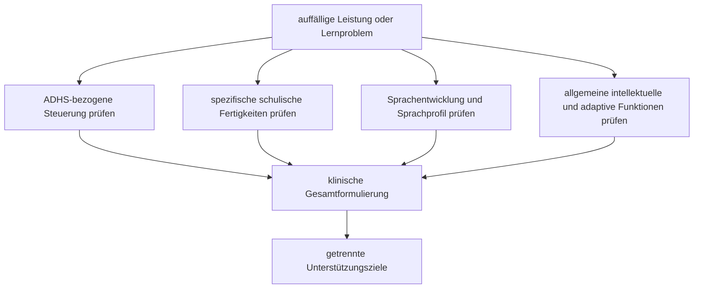

# Einheit 21 – Lernstörungen, Sprachentwicklungsstörungen und intellektuelle Beeinträchtigung bei ADHS

## Lernziel

Du kannst schlechte Schulleistung, eine umschriebene Entwicklungsstörung schulischer Fertigkeiten, eine Sprachentwicklungsstörung und eine intellektuelle Beeinträchtigung voneinander unterscheiden. Du verstehst, warum ADHS mit diesen Bedingungen häufiger gemeinsam vorkommen kann, ohne dass eine Diagnose die andere erklärt. Außerdem kannst du beschreiben, weshalb Entwicklungsgeschichte, Leistungsprofil, Sprache, allgemeines kognitives und adaptives Funktionsniveau sowie mehrere Lebensbereiche getrennt geprüft werden müssen.

## 1. Schlechte Schulleistung ist ein Ergebnis, keine Diagnose

„Schlecht in der Schule“ kann sehr verschiedene Ursachen haben. Eine Person kann den Unterrichtsstoff verstehen, aber Aufgaben wegen Ablenkbarkeit, Zeitproblemen oder vergessener Materialien nicht zuverlässig bearbeiten. Eine andere liest trotz angemessener Beschulung dauerhaft deutlich ungenauer oder langsamer als erwartet. Eine dritte versteht sprachlich komplexe Anweisungen nicht sicher. Wieder eine andere benötigt in vielen Bereichen des Lernens und der Alltagsbewältigung deutlich mehr Unterstützung.

Diese Profile können ähnlich aussehen: Aufgaben bleiben unvollständig, Noten fallen ab, Hausaufgaben dauern lange oder das Kind vermeidet bestimmte Fächer. Die Oberfläche entscheidet deshalb nicht, welche Erklärung zutrifft.

> [!evidence] Evidenz: diagnostischer und leitlinienbasierter Konsens / hoch
> ADHS, Entwicklungsstörungen schulischer Fertigkeiten, Sprachentwicklungsstörungen und Störungen der intellektuellen Entwicklung sind unterscheidbare neuroentwicklungsbezogene Bedingungen. Sie können gemeinsam auftreten. Eine fachliche Beurteilung muss ihre jeweiligen Merkmale und Funktionsfolgen getrennt prüfen.

Ein häufiger Fehlschluss lautet: „Wenn die Aufmerksamkeit behandelt wird, müsste das Lesen automatisch normal werden.“ Der umgekehrte Fehlschluss lautet: „Wenn eine Lernstörung festgestellt wurde, erklärt sie alle Konzentrationsprobleme.“ Beides kann falsch sein. Unterstützung muss dort ansetzen, wo die konkrete Beeinträchtigung entsteht.

## 2. Lernstörungen betreffen den Erwerb bestimmter schulischer Fertigkeiten

Die ICD-11 beschreibt Entwicklungsstörungen schulischer Fertigkeiten als anhaltende und deutliche Schwierigkeiten beim Erwerb von Lesen, Schreiben oder Mathematik, die nicht allein durch mangelnde Lerngelegenheit, unzureichende Beschulung, eine Sinnesbeeinträchtigung oder eine andere naheliegende Erklärung verstanden werden können.

ADHS kann schulisches Lernen auf andere Weise erschweren: Aufmerksamkeit wird nicht stabil gehalten, Arbeitsschritte gehen verloren, Aufgaben werden nicht begonnen oder beendet, Rückmeldung wird übersehen und Übungszeit schwankt. Solche Schwierigkeiten können die gemessene Leistung verschlechtern. Sie sind aber nicht automatisch eine spezifische Lernstörung.

Die aktuelle ICD-11-Grenze ist deshalb besonders nützlich: Bei gemeinsamem ADHS und einer Entwicklungsstörung schulischer Fertigkeiten sollen die Lernprobleme **nicht ausschließlich** durch Aufmerksamkeits- oder Aktivitätsprobleme erklärbar sein. Beide Diagnosen können vergeben werden, wenn die Anforderungen für beide unabhängig erfüllt sind.

Eine große niederländische Zwillings- und Geschwisterstudie von van Bergen und Kolleg:innen untersuchte ADHS, Dyslexie und Dyskalkulie. Die Bedingungen traten häufiger gemeinsam auf, als bei vollständiger Unabhängigkeit zu erwarten wäre. Kinder mit einer der Bedingungen hatten etwa zwei- bis dreimal häufiger eine zweite. Dennoch hatten die meisten betroffenen Kinder nur eine der drei Bedingungen. Modellierungen sprachen für teilweise gemeinsame genetische Einflüsse, aber nicht für eine einfache Kausalkette, nach der ADHS Dyslexie oder Dyskalkulie erzeugt.

> [!important] Koexistenz ist keine Kausalrichtung
> Ein erhöhtes gemeinsames Auftreten zeigt, dass bei auffälligem Leistungsprofil genauer hingesehen werden sollte. Es beweist weder, dass ADHS die Lernstörung verursacht, noch dass eine Lernstörung ADHS verursacht.

## 3. Sprachprobleme können Aufmerksamkeit imitieren oder zusätzlich belasten

Sprache ist für fast jede schulische Aufgabe relevant. Wer lange mündliche Anweisungen, grammatisch komplexe Sätze oder neue Wörter nicht sicher versteht, kann im Unterricht scheinbar „nicht zuhören“. Wer Schwierigkeiten hat, Gedanken sprachlich zu strukturieren, braucht möglicherweise länger für Antworten oder schriftliche Aufgaben. Umgekehrt können ADHS-bezogene Unterbrechungen und Arbeitsgedächtnisprobleme die sprachliche Leistung in einer Testsituation verschlechtern.

Eine **Sprachentwicklungsstörung** wird deshalb nicht aus dem Eindruck „spricht wenig“ oder „versteht Anweisungen schlecht“ abgeleitet. Beurteilt werden Entwicklung, verschiedene Sprachkomponenten, Funktionsfolgen und mögliche erklärende Bedingungen. Die ICD-11 erkennt ausdrücklich an, dass Sprachentwicklungsstörungen häufig mit anderen Neuroentwicklungsstörungen einschließlich ADHS gemeinsam vorkommen.

Der deutschsprachige interdisziplinäre Konsens von Lüke und Kolleg:innen unterstreicht, dass eine gemeinsame Terminologie und eine funktionsbezogene Beurteilung wichtig sind. Internationale und deutschsprachige Begriffssysteme sind nicht in jedem Detail identisch; deshalb sollte in Befunden transparent stehen, welche Kriterien und Begriffe verwendet wurden.

Eine systematische Übersichtsarbeit von Méndez-Freije und Kolleg:innen wertete 15 Studien zu Sprachleistungen bei Kindern und Jugendlichen mit ADHS und/oder Entwicklungsstörung der Sprache aus. Die Ergebnisse waren heterogen und teilweise widersprüchlich. Es zeigten sich überlappende Schwierigkeiten in einzelnen Sprach- und Exekutivbereichen, aber kein einfaches Profil, mit dem sich eine Diagnose aus der anderen ableiten ließe. Gerade diese Heterogenität spricht für spezifische Sprachdiagnostik statt für Vermutungen aus der ADHS-Diagnose.

## 4. Intellektuelle Beeinträchtigung betrifft mehr als einen einzelnen Testwert

Eine Störung der intellektuellen Entwicklung wird nicht durch eine schlechte Note und auch nicht durch einen einzelnen niedrigen IQ-Wert definiert. Relevant sind Einschränkungen allgemeiner intellektueller Funktionen **und** des adaptiven Verhaltens, also der praktischen, sozialen und konzeptuellen Bewältigung des Alltags, mit Beginn in der Entwicklungsperiode.

Das ist für ADHS diagnostisch wichtig. Eine Person mit intellektueller Beeinträchtigung kann zusätzlich ADHS haben. Dann müssen Unaufmerksamkeit, Hyperaktivität oder Impulsivität aber im Verhältnis zum Entwicklungsniveau beurteilt werden. Verhalten, das bei einem bestimmten Entwicklungsstand erwartbar ist, darf nicht allein wegen des chronologischen Alters als ADHS gewertet werden.

Umgekehrt darf eine ADHS-Diagnose globale Lern- und Alltagsprobleme nicht verdecken. Wenn Schwierigkeiten über viele kognitive Bereiche, schulische Fertigkeiten und adaptive Anforderungen hinweg bestehen, reicht die Erklärung „kann sich eben nicht konzentrieren“ nicht aus.

Der Kern des Diagramms ist nicht „mehr Tests sind immer besser“. Die Auswahl richtet sich nach der konkreten Fragestellung. Eine umfassende interprofessionelle Beurteilung ist besonders sinnvoll, wenn mehrere Entwicklungsbereiche auffällig sind oder frühere Befunde das aktuelle Funktionsprofil nicht erklären.

## 5. Gute Diagnostik zerlegt die Frage in mehrere Datenquellen

Leitlinien für komplexe ADHS betonen eine multimodale Beurteilung über mehrere Lebensbereiche. Bei Lern-, Sprach- oder intellektuellen Fragen kommen spezifische Verfahren hinzu. Sinnvoll ist eine Trennung von mindestens fünf Ebenen:

1. **Entwicklung:** Wann begannen Aufmerksamkeits-, Sprach- und Lernprobleme?
2. **Kontexte:** Was zeigt sich zu Hause, in Schule, Ausbildung und Alltag?
3. **Leistungsprofil:** Sind Lesen, Rechtschreiben oder Mathematik spezifisch auffällig oder ist Lernen breiter betroffen?
4. **Sprache:** Wie funktionieren Sprachverständnis, Ausdruck und weitere relevante Sprachbereiche?
5. **Adaptives Funktionsniveau:** Welche alters- und entwicklungsbezogenen Alltagsanforderungen gelingen selbstständig?

Standardisierte Tests liefern dabei wichtige Vergleichsdaten, sind aber keine automatische Diagnoseschleuse. Tagesform, Sprache des Testverfahrens, Bildungszugang, Sinnesfunktionen, motorische Anforderungen, kultureller Kontext und Testmotivation können Ergebnisse beeinflussen. Auch ein uneinheitliches Profil ist nicht automatisch ADHS.

Besonders problematisch ist diagnostisches Überschatten. Nach einer bekannten ADHS können Lern- oder Sprachprobleme als bloße Folge von Ablenkbarkeit abgetan werden. Nach einer Lern- oder intellektuellen Diagnose können wiederum zusätzliche ADHS-Merkmale übersehen werden. Die bessere Frage lautet: **Welche Erklärung trägt welchen beobachteten Teil des Profils?**

## 6. Unterstützung muss nach Funktion aufgeteilt werden

Wenn mehrere Bedingungen gemeinsam bestehen, sollte Behandlung nicht um das „wichtigste Etikett“ konkurrieren. ADHS-Behandlung kann Aufmerksamkeit, Impulsivität und Handlungssteuerung verbessern. Eine spezifische Lesestörung benötigt weiterhin gezielte Förderung des Lesens. Eine Sprachentwicklungsstörung benötigt sprachbezogene Unterstützung. Bei intellektueller Beeinträchtigung müssen Anforderungen, Lernschritte, Kommunikation und Alltagsunterstützung dem individuellen Entwicklungs- und Funktionsniveau angepasst werden.

Das bedeutet auch: Eine verbesserte Medikamentenwirkung ist kein Beweis gegen eine Lernstörung. Umgekehrt widerlegt eine fortbestehende Leseschwierigkeit nicht die Wirksamkeit einer ADHS-Behandlung auf ihrem eigentlichen Ziel. Erfolg sollte für jede Ebene separat beobachtet werden.

Die SDBP-Leitlinie zu komplexer ADHS empfiehlt bei koexistierenden neuroentwicklungsbezogenen Bedingungen eine umfassende, interprofessionelle und auf mehrere Lebensbereiche bezogene Beurteilung. Welche Berufsgruppen beteiligt sind, hängt von Fragestellung und Versorgungssystem ab. Entscheidend ist, dass Befunde zusammengeführt werden, statt dass Schule, Sprachdiagnostik, Psychologie und Medizin jeweils nur ihren Ausschnitt betrachten.

## 7. Mini-Übung: Ein Problem in Hypothesen zerlegen

Nimm eine Beobachtung wie: „Hausaufgaben dauern zwei Stunden.“

Notiere vier mögliche Hypothesen, ohne eine Diagnose zu vergeben:

- **Steuerung:** Wird die Aufgabe häufig unterbrochen oder der nächste Schritt verloren?
- **Fertigkeit:** Ist Lesen, Schreiben oder Rechnen selbst ungewöhnlich langsam oder fehleranfällig?
- **Sprache:** Wird die Aufgabenstellung sicher verstanden und kann die Antwort sprachlich geplant werden?
- **Entwicklungsniveau:** Passt die gesamte Anforderung zum allgemeinen kognitiven und adaptiven Funktionsniveau?

Notiere anschließend, welche Information die Hypothesen unterscheiden würde: Beobachtung in einem zweiten Kontext, Schulunterlagen, gezielte Leistungsdiagnostik, Sprachdiagnostik oder eine breitere Entwicklungsbeurteilung. Ziel ist nicht, möglichst viele Diagnosen zu sammeln, sondern die Ursache einer konkreten Barriere genauer zu verstehen.

## 8. Wissenschaftliche Einordnung und Grenzen

**Konsens:** ADHS, Entwicklungsstörungen schulischer Fertigkeiten, Sprachentwicklungsstörungen und intellektuelle Entwicklungsstörungen sind unterscheidbare Bedingungen und können gemeinsam auftreten. Schlechte Schulleistung allein beweist keine von ihnen. Diagnostik muss Entwicklung, Funktion und störungsspezifische Merkmale trennen.

**Wahrscheinlich:** ADHS tritt mit Dyslexie und Dyskalkulie häufiger gemeinsam auf, als bei unabhängigen Bedingungen zu erwarten wäre. Teilweise gemeinsame genetische und kognitive Einflüsse können beitragen. Sprachschwierigkeiten sind bei ADHS-Gruppen ebenfalls relevant und verdienen bei klinischem Verdacht eine eigene Beurteilung.

**Umstritten oder begrenzt:** Exakte Koexistenzraten hängen stark von Alter, Stichprobe, Diagnosekriterien, Sprache und Testverfahren ab. Für einzelne Sprachkomponenten sind Studien heterogen. Aus überlappenden kognitiven Profilen lässt sich keine zuverlässige Individualdiagnose ableiten.

**Experimentell:** Genetische, kognitive oder digitale Modelle versuchen, gemeinsame Entwicklungswege genauer zu trennen oder vorherzusagen. Sie ersetzen derzeit weder Entwicklungsanamnese noch standardisierte störungsspezifische Diagnostik und adaptive Funktionsbeurteilung.

## 9. Verbindung zu Autismus

Autismus kann ebenfalls mit Sprach-, Lern- und intellektuellen Beeinträchtigungen sowie mit ADHS koexistieren. Ein Sprachproblem ist aber kein Autismusnachweis, und eine intellektuelle Beeinträchtigung ist kein notwendiger Bestandteil von Autismus. Bei komplexen Profilen müssen soziale Kommunikation, restriktive oder repetitive Merkmale, Sprache, ADHS-Kernmerkmale und kognitives beziehungsweise adaptives Funktionsniveau als getrennte Dimensionen geprüft werden.

Eine Parkinson-Verbindung wird in dieser Einheit bewusst nicht konstruiert: Die hier behandelten Störungen sind entwicklungsbezogen; ein neu erworbener Verlust zuvor vorhandener Sprache oder schulischer Fertigkeiten verlangt eine andere medizinische beziehungsweise neurologische Abklärung.

## Review-Frage

**Warum reicht die Aussage „Das Kind ist wegen ADHS schlecht in Mathe“ wissenschaftlich nicht aus?**

Antwort

Weil schlechte Mathematikleistung mehrere Ursachen haben kann. ADHS kann Übung, Arbeitsablauf und Aufmerksamkeit beeinträchtigen; zusätzlich oder alternativ kann eine spezifische Mathematik-Lernstörung, ein Sprachproblem, eine breitere intellektuelle Beeinträchtigung oder eine andere Bedingung vorliegen. Entscheidend sind Entwicklung, Leistungsprofil, Funktionsniveau und spezifische Diagnostik.

## Wissenschaftliche Quellen

- [[references/WHO2024|World Health Organization 2024]] – ICD-11-CDDR zur diagnostischen Trennung und möglichen Koexistenz von Neuroentwicklungsstörungen.
- [[references/NICE2018|NICE NG87]] – ADHS-Leitlinie zur Prüfung koexistierender neuroentwicklungsbezogener Bedingungen und zur Anpassung von Information und Versorgung an Sprache und kognitives Niveau.
- [[references/Barbaresi2020|Barbaresi et al. 2020]] – Leitlinie zur umfassenden Beurteilung komplexer ADHS mit koexistierenden Entwicklungs- und Lernbedingungen.
- [[references/vanBergen2025|van Bergen et al. 2025]] – große Zwillings- und Geschwisterstudie zu Koexistenz und möglichen gemeinsamen Einflüssen von ADHS, Dyslexie und Dyskalkulie.
- [[references/MendezFreije2024|Méndez-Freije et al. 2024]] – systematische Übersicht zu Sprachleistungen bei ADHS und Entwicklungsstörung der Sprache.
- [[references/Lueke2023|Lüke et al. 2023]] – deutschsprachiger interdisziplinärer Konsens zu Definition und Terminologie von Sprachentwicklungsstörungen.

## Merksatz

> Schulleistung ist kein Diagnosetest: ADHS, spezifische Lern- und Sprachstörungen sowie intellektuelle Beeinträchtigung müssen nach ihrem eigenen Entwicklungs- und Funktionsprofil geprüft und bei Koexistenz gemeinsam unterstützt werden.

## Navigation

- Zurück: [[02-Vertiefung/08-Substanzgebrauch-Abhaengigkeit-und-ADHS|Substanzgebrauch, Abhängigkeit und ADHS]]
- Weiter: [[ROADMAP#A4 · Weitere neuroentwicklungsbezogene und verhaltensbezogene Komorbiditäten — P0|Motorische Entwicklungsstörungen und Koordinationsprobleme]] *(geplant)*
- [[Glossar]] · [[Literatur]] · [[knowledge-graph/README|Wissensgraph]]
