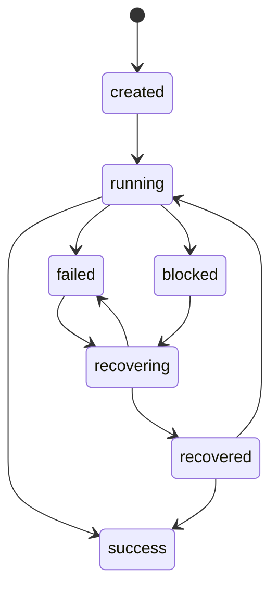

# Automationsstatus, Recovery und Laufpersistenz

Der Statusmechanismus verhindert, dass ein transienter Fehler unbemerkt einen
zweiten Branch, eine zweite Lerneinheit oder einen verwaisten Pull Request
erzeugt. Generator, Reparaturwächter, Mergewächter und GitHub Actions verwenden
dasselbe strikte Datenmodell.

## Kanonische Dateien

Das JSON Schema liegt unter:

```text
automation/run-status.schema.json
```

Persistente Läufe befinden sich ausschließlich auf dem orphan Branch
`automation-status`:

```text
automation/status/<workflow>/<run_id>.json
automation/status/<workflow>/<run_id>.md
automation/status/<workflow>/latest.json
automation/status/<workflow>/latest.md
```

`latest.json` wird erst nach vollständiger Schema- und Invariantenprüfung
atomar ersetzt. Statusdateien sind auf `main` ignoriert. Ein Lauf auf einem
Inhaltsbranch darf sie nicht versehentlich committen.

Bei einem getrennten Statusbranch-Worktree zeigt die CLI über eine
Umgebungsvariable dorthin:

```bash
export AUTOMATION_STATUS_ROOT="$STATUS_WORKTREE/automation/status"
```

Alternativ akzeptiert jeder Unterbefehl `--root`.

Builds verwenden zusätzlich die kurzlebige Datei:

```text
build/runtime-status.json
```

Sie folgt demselben Schema, wird als Diagnoseartefakt hochgeladen und vom
vertrauenswürdigen `workflow_run`-Workflow auf den Statusbranch übertragen.

## Strikter Vertrag

Schema-Version `3.0.0` definiert:

- portable, eindeutige `run_id`;
- enumerierte Workflows, Zustände, Phasen, Fehlerklassen und Recovery-Level;
- monotone `revision` und `previous_status`;
- abgeschlossene Phasen;
- Repository-, Branch-, Commit-, PR-, Workflow-Run- und Job-Kontext;
- strukturierte Artefakte mit Typ, Pfad/URL, SHA-256 und
  Wiederverwendbarkeit;
- strukturierte, redigierte Fehler;
- konkreten Recovery-Schritt und Duplikatblocker;
- UTC-Zeitstempel, Laufzeit und Retention.

Alle kontrollierten Objekte verbieten unbekannte Eigenschaften mit
`additionalProperties: false`.

## Zustandsautomat



`success` ist terminal. `failed`, `blocked` und `recovering` blockieren einen
neuen Generatorlauf, solange die Recovery nicht abgeschlossen oder bewusst
quittiert wurde. `recovered` kann in dieselbe fachliche Ausführung
zurückkehren; Branch, Commit und PR bleiben erhalten.

## Gemeinsame Phasen

Generator und Wächter verwenden insbesondere:

1. `initialize`
2. `load_main`
3. `check_previous_run`
4. `check_existing_pr`
5. `read_prompts`
6. `research`
7. `create_branch`
8. `create_content`
9. `generate_outputs`
10. `validate`
11. `commit`
12. `push`
13. `create_pr`
14. `verify_pr`
15. `wait_review`
16. `repair`
17. `ready_for_review`
18. `verify_second_ci`
19. `merge`
20. `cleanup`
21. `complete`

Graph- und Exportbuilds ergänzen `load_content`, `build_nodes`, `build_edges`,
`validate_graph`, `export` und `persist_status`.

## CLI

### Lauf starten und Vorgänger blockieren

```bash
RUN_ID="${GITHUB_RUN_ID}-${GITHUB_RUN_ATTEMPT}"

python scripts/automation_status.py start \
  --workflow generator \
  --run-id "$RUN_ID"
```

`start` prüft standardmäßig `latest.json`. Ein ungeklärter Vorgängerlauf führt
zum Exitcode `20` und erzeugt keinen zweiten Status. `--allow-unresolved` ist
nur für kontrollierte Migrationen und Tests vorgesehen.
Außerhalb von GitHub Actions wird eine UUIDv4 verwendet. Ein geplanter
Zeitpunkt ist nur Metadatum und keine kollisionssichere Lauf-ID.

### Phase aktualisieren

```bash
python scripts/automation_status.py phase \
  --workflow generator \
  --run-id "$RUN_ID" \
  --phase validate \
  --expected-revision 8
```

Die erwartete Revision verhindert verlorene parallele Updates. Scheduler lesen
sie vor jedem Schreibbefehl frisch ein, verwenden sie genau einmal und brechen
bei einem CAS-Konflikt mit Exitcode `20` ab.

### Wiederverwendbares Artefakt registrieren

```bash
python scripts/automation_status.py artifact \
  --workflow generator \
  --run-id "$RUN_ID" \
  --type branch \
  --value "agent/einheit-15-kurztitel" \
  --reusable
```

Entsprechende Typen existieren für Commit, Pull Request, Workflow-Run, CI-Job,
Bericht, Graph, Export und Site.

### Fehler erfassen

```bash
python scripts/automation_status.py fail \
  --workflow generator \
  --run-id "$RUN_ID" \
  --class github_api_transient \
  --code create_pr_failed \
  --message "PR-Erstellung temporär fehlgeschlagen" \
  --recovery resume_from_artifact \
  --retryable
```

Wenn ein wiederverwendbarer Pull Request, Commit oder Branch vorhanden ist,
wählt die Bibliothek ohne explizite Vorgabe automatisch
`resume_from_artifact`. Neuer Inhalt ist dabei nicht erforderlich.

### Wiederaufnahme und Abschluss

```bash
python scripts/automation_status.py recover \
  --workflow generator \
  --run-id "$RUN_ID" \
  --phase create_pr

python scripts/automation_status.py recover \
  --workflow generator \
  --run-id "$RUN_ID" \
  --phase create_pr \
  --completed

python scripts/automation_status.py phase \
  --workflow generator \
  --run-id "$RUN_ID" \
  --phase verify_pr

python scripts/automation_status.py finish \
  --workflow generator \
  --run-id "$RUN_ID" \
  --phase complete
```

### Inspizieren, prüfen und aufräumen

```bash
python scripts/automation_status.py inspect \
  --workflow generator \
  --latest

python scripts/automation_status.py guard \
  --workflow generator

python scripts/automation_status.py prune \
  --retention-days 30 \
  --max-per-workflow 100
```

Exitcodes:

| Code | Bedeutung |
|---:|---|
| `0` | erfolgreich |
| `10` | Lauf kann fortgesetzt werden |
| `20` | blockiert |
| `30` | manuelle Entscheidung oder terminaler Fehler |

## Schreibsicherheit

`scripts/automation_status.py` verwendet:

- Prozess-Lock neben jeder Statusdatei;
- workflowweit geteilter Lock für `latest.json`, auch wenn verschiedene
  Laufdateien parallel aktualisiert werden;
- monotone optimistische Revision;
- monotone Auswahl des neuesten Laufs nach Erstellzeit und stabilem
  Run-ID-Tie-Break; ein später Abschluss eines älteren Laufs kann
  `latest.json` und `latest.md` nicht zurücksetzen;
- vollständige Normalisierung vor dem Schreiben;
- Abweisung unzulässiger Zustandsübergänge;
- validierte atomare Wiederherstellung der letzten laufenden Revision, falls
  ein nachgelagerter Dokumentations-, Browser- oder Manifest-Gate nach der
  vorbereiteten Erfolgsdarstellung scheitert;
- temporäre Datei im Zielverzeichnis;
- `flush`, `fsync`, atomaren `os.replace` und Verzeichnis-`fsync`;
- validierte atomare Aktualisierung von Laufdatei und `latest.json`;
- keine partiell lesbaren JSON-Dateien.

Ein abgelaufener Lock darf kontrolliert übernommen werden. Ein aktiver
Parallelwriter führt zu Exitcode `20`, nicht zu einem stillen verlorenen
Update.

## Datenschutz und Redaction

Statusdaten enthalten keine vollständigen Prompts, Lerntexte, medizinischen
Inhalte, E-Mail-Adressen oder Zugangsdaten. Der Writer entfernt insbesondere:

- GitHub- und OpenAI-Tokenmuster;
- Bearer-Header;
- `token`, `password`, `secret` und API-Key-Zuweisungen;
- E-Mail-Adressen;
- sensible Zeichenketten auch in verschachtelten Metriken;
- Querystrings und Fragmente aus persistierten URLs;
- überlange Fehlermeldungen.

Temporär signierte Artefakt-URLs werden ohne Signatur persistiert.

## GitHub-Actions-Integration

Die regulären Workflows schreiben realen Status vor kritischen Buildphasen.
Fehler-Traps erfassen die fachliche Ursache, dürfen den ursprünglichen
Exitstatus aber nicht verdecken.

Nach jedem abgeschlossenen Quellworkflow startet
`.github/workflows/persist-automation-status.yml`:

1. vertrauenswürdigen Code ausschließlich von `main` auschecken;
2. Diagnoseartefakt des konkreten Workflow-Runs herunterladen, aber niemals
   ausführen;
3. Status zunächst ohne Drittanbieterabhängigkeit gegen alle Laufzeitinvarianten
   und anschließend mit dem fest gepinnten Draft-2020-12-Validator gegen JSON
   Schema validieren;
4. nur JSON und redigierten Markdown-Diagnoseblock vorbereiten;
5. append-orientierten orphan Branch `automation-status` aktualisieren;
   verspätet eintreffende `workflow_run`-Ereignisse dürfen dabei weder eine
   höhere Laufrevision noch den zeitlich neueren `latest`-Zeiger zurücksetzen;
6. Retention anwenden;
7. bei fehlender Schreibberechtigung denselben vollständigen Status als
   90-Tage-Workflow-Artefakt und Step Summary erhalten.

Der Persistenzworkflow ist getrennt von fachlicher CI. Ein Fehler beim
Statuspush kann einen echten Validierungsfehler daher weder überschreiben noch
in einen Erfolg verwandeln.

## PR-Kommentar und öffentliche Darstellung

Der getrennte, vertrauenswürdige `workflow_run`-Persistenzworkflow aktualisiert
nach dem Validierungslauf genau einen idempotenten Kommentar mit den Markern:

```text
<!-- adhs-graph-ci-summary -->
<!-- adhs-automation-recovery-status -->
```

Die Zusammenfassung nennt Lauf, Phase, Revision, Branch, Commit, PR,
Graphkennzahlen, Fehlerklasse, Fehlercode, Recovery-Level, nächsten Schritt und
Duplikatblocker.

Wissensgraph- und Wartungsseite zeigen denselben validierten Status. Eine
statische textuelle Darstellung bleibt ohne JavaScript verfügbar.

## Retention

- erfolgreiche und wiederhergestellte Läufe: 30 Tage;
- fehlgeschlagene und blockierte Läufe: 90 Tage;
- konfigurierbares Maximum: standardmäßig 100 Läufe je Workflow;
- `latest.json` und `latest.md`: dauerhaft;
- beschädigte Dateien: keine automatische Löschung, damit eine forensische
  Prüfung möglich bleibt.

## Prompt-Schutz

`automation/prompt-baselines.json` schützt den vollständigen Inhalt der
Generator-, Reparatur- und Mergeprompts vor der Recovery-Erweiterung als
Golden Prefix. `scripts/validate_prompt_baselines.py` verhindert, dass eine
spätere Änderung bestehende Wissenschafts-, Quellen-, CNAME-, CI-, PR- oder
Infrastrukturregeln still kürzt. Der Validator akzeptiert ausschließlich die
festgelegte Manifestversion und genau diese drei eindeutigen,
repository-relativen Promptpfade; fehlende, doppelte, umbenannte, absolute oder
pfadtraversierende Einträge sind Fehler. Additive Erweiterungen bleiben
möglich.

## Testabdeckung

Die Tests decken unter anderem ab:

- gültige und ungültige Statusdokumente;
- Zustandsmatrix und verbotene Übergänge;
- atomare Aktualisierung;
- Revision-Konflikte und parallele Writer;
- workflowweite Sperre und Schutz des `latest`-Zeigers vor verspäteten Läufen;
- Secret-, E-Mail- und URL-Redaction;
- Retention;
- vollständigen Diagnosebericht;
- Wiederaufnahme vorhandener Branches, Commits und PRs;
- Blockierung eines zweiten Generatorlaufs;
- Reparatur auf derselben `run_id`;
- Persistenzsnapshot, reihenfolgeunabhängiger Merge und
  Schreibberechtigungs-Fallback;
- Prompt-Golden-Prefixe;
- Graph-, Export-, Browser- und No-JavaScript-Integration.
