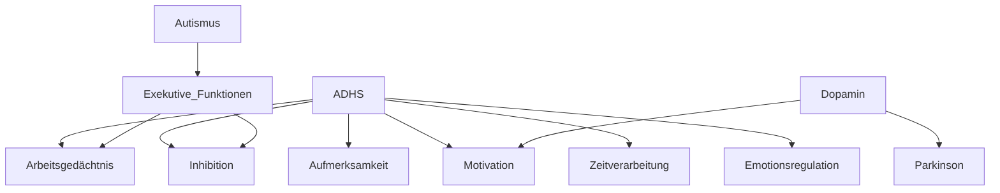

# Wissensgraph

Der Graph entsteht aus YAML-Metadaten und Wikilinks. Obsidian kann ihn direkt darstellen; `scripts/build_graph.py` erzeugt zusätzlich Mermaid- und JSON-Ausgaben.

```mermaid
flowchart TD
  ADHS --> Aufmerksamkeit
  ADHS --> Arbeitsgedächtnis
  ADHS --> Inhibition
  ADHS --> Motivation
  ADHS --> Zeitverarbeitung
  ADHS --> Emotionsregulation
  Dopamin --> Motivation
  Dopamin --> Parkinson
  Exekutive_Funktionen --> Arbeitsgedächtnis
  Exekutive_Funktionen --> Inhibition
  Autismus --> Exekutive_Funktionen
```
