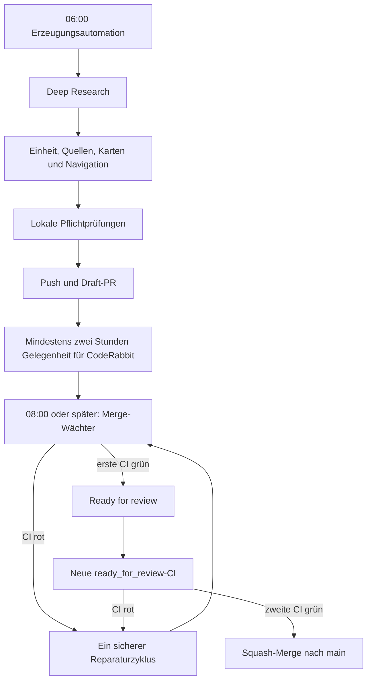

# Prompts und tägliche Automationspipeline

Dieser Ordner ist die zentrale Quelle für sämtliche Agentenprompts des ADHS-Lernpfads.

## Dateien

- `DEEP-RESEARCH-PROMPT.md`: wissenschaftliche Recherche, Evidenzhierarchie und Ergebnissynthese.
- `AUTOMATION-PROMPT.md`: tägliche Erzeugung genau einer neuen Lerneinheit um 06:00 Uhr Europe/Berlin; endet mit einem Draft-Pull-Request.
- `MERGE-AUTOMATION-PROMPT.md`: gestufte Prüfung frühestens zwei Stunden nach PR-Erstellung; repariert fehlgeschlagene CI, macht einen grünen Draft zunächst „Ready for review“ und merged erst nach erneut grüner CI.
- `PR-REPAIR-PROMPT.md`: eng begrenzter Reparaturzyklus auf dem bestehenden Einheiten-Branch.

## Ablauf

CodeRabbit ist kein Pflicht-Gate. Sichtbare, nachvollziehbare Hinweise werden berücksichtigt; ein fehlendes Review oder ausgeschöpftes Kontingent blockiert nach Ablauf der Zweistundenfrist nicht.

## Sicherheitsprinzipien

- Keine direkte Bearbeitung von `main` durch die Erzeugungsautomation.
- Kein Merge eines Draft-Pull-Requests.
- Kein Merge bei ausstehender, fehlender oder roter CI.
- Kein automatischer Merge bei Änderungen an `.github/`, `prompts/`, `.coderabbit.yaml`, `CNAME`, Validatoren, Requirements, Build-, Veröffentlichungs-, Sicherheits- oder Synchronisationsinfrastruktur.
- Erwartbare Inhalts- und Navigationsdateien wie Kapitel, Quellen, Karten, `README.md`, `index.json`, `Glossar.md`, `Literatur.md` und `mkdocs.yml` dürfen im Einheiten-PR geändert werden.
- Keine Umgehung von Branchschutz, Reviews oder Konflikten.
- Ein offener täglicher Einheiten-PR blockiert die Erzeugung eines weiteren PR.
- Jeder Nicht-`main`-Branch muss einem Pull Request oder einer ausdrücklich dokumentierten Aufräumaktion zugeordnet sein.
- Nach Merge oder partieller Übernahme wird geprüft, ob auf dem Quellbranch noch einzigartige Änderungen verbleiben. Solche Änderungen dürfen nicht still liegen bleiben.

Die Automationen selbst enthalten nur einen kurzen Startauftrag. Die ausführlichen Regeln werden bei jedem Lauf frisch aus diesen Dateien gelesen.