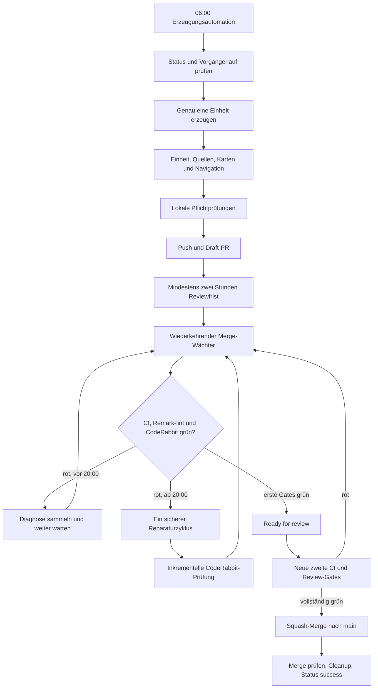

# Prompts und tägliche Automationspipeline

Dieser Ordner ist die zentrale Quelle für sämtliche Agentenprompts des ADHS-Lernpfads.

## Dateien

- `DEEP-RESEARCH-PROMPT.md`: wissenschaftliche Recherche, Evidenzhierarchie und Ergebnissynthese.
- `AUTOMATION-PROMPT.md`: tägliche Erzeugung genau einer neuen Lerneinheit um 06:00 Uhr Europe/Berlin; endet mit einem Draft-Pull-Request.
- `MERGE-AUTOMATION-PROMPT.md`: prüft den Draft wiederholt, erzwingt CodeRabbit und Remark-lint als harte Gates, wartet mit Reparaturen bis 20:00 Uhr Europe/Berlin am Erstellungstag und merged erst nach erneut grüner zweiter CI.
- `PR-REPAIR-PROMPT.md`: sicherer Reparaturzyklus auf dem bestehenden Einheiten-Branch mit Evidenzaktualisierung, Thread-Matrix, Remark-lint und inkrementeller CodeRabbit-Prüfung.

Die technische Referenz steht unter [[automation/MERGE-REPAIR-POLICY|Merge- und Reparaturpolicy]].

## Ablauf

```mermaid
flowchart TD
  A[06:00 Erzeugungsautomation] --> S[Status und Vorgängerlauf prüfen]
  S --> B[Genau eine Einheit erzeugen]
  B --> C[Einheit, Quellen, Karten und Navigation]
  C --> D[Lokale Pflichtprüfungen]
  D --> E[Push und Draft-PR]
  E --> F[Mindestens zwei Stunden Reviewfrist]
  F --> G[Wiederkehrender Merge-Wächter]
  G --> Q{CI, Remark-lint und CodeRabbit grün?}
  Q -->|rot, vor 20:00| W[Diagnose sammeln und weiter warten]
  W --> G
  Q -->|rot, ab 20:00| R[Ein sicherer Reparaturzyklus]
  R --> CR[Inkrementelle CodeRabbit-Prüfung]
  CR --> G
  Q -->|erste Gates grün| H[Ready for review]
  H --> I[Neue zweite CI und Review-Gates]
  I -->|rot| G
  I -->|vollständig grün| J[Squash-Merge nach main]
  J --> K[Merge prüfen, Cleanup, Status success]
```

CodeRabbit ist ein verpflichtendes hartes Gate. Ein fehlendes, ausstehendes oder fehlgeschlagenes Signal, ein ungelöster Thread oder ein ungeklärter Dissens blockiert Ready for review und Merge. Veraltete Threads müssen entweder am aktuellen Code behoben oder mit überprüfbarer Obsoleszenzbegründung abgeschlossen werden.

Der Reparaturzyklus startet frühestens zu `max(PR-Erstellung + 2 Stunden, 20:00 Uhr Europe/Berlin am Erstellungstag)`. Bis dahin bleibt der Wächter aktiv und prüft erneut; es gibt keinen Abbruch nach dem zweiten roten CI-Lauf.

## Sicherheitsprinzipien

- Keine direkte Bearbeitung von `main` durch die Erzeugungsautomation.
- Kein Merge eines Draft-Pull-Requests.
- Kein Merge bei ausstehender, fehlender oder roter CI.
- Kein Merge ohne erfolgreichen Check `Remark lint (blocking)`.
- Kein Merge ohne erfolgreichen Check `CodeRabbit review gate (blocking)` und vollständig gelöste CodeRabbit-Threads.
- Kein automatischer Merge bei Änderungen an `.github/`, `prompts/`, `.coderabbit.yaml`, `CNAME`, Validatoren, Requirements, Build-, Veröffentlichungs-, Sicherheits- oder Synchronisationsinfrastruktur.
- Erwartbare Inhalts- und Navigationsdateien wie Kapitel, Quellen, Karten, `README.md`, `index.json`, `Glossar.md`, `Literatur.md` und `mkdocs.yml` dürfen im Einheiten-PR geändert werden.
- Keine Umgehung von Branchschutz, Reviews oder Konflikten.
- Ein offener täglicher Einheiten-PR blockiert die Erzeugung eines weiteren PR.
- Ein ungeklärter persistenter Laufstatus blockiert ebenfalls eine zweite Einheit; vorhandene Branches, Commits und PRs werden wiederverwendet.
- Alle Statusrevisionen verwenden dieselbe `run_id`; Fehlerausgaben nennen Phase, Artefakte, Ursache und konkreten Recovery-Schritt.
- Der Statusbranch enthält keine Prompts, medizinischen Inhalte, E-Mail-Adressen oder Zugangsdaten.
- Jeder Nicht-`main`-Branch muss einem Pull Request oder einer ausdrücklich dokumentierten Aufräumaktion zugeordnet sein.
- Nach Merge oder partieller Übernahme wird geprüft, ob auf dem Quellbranch noch einzigartige Änderungen verbleiben.

Die Automationen selbst enthalten nur einen kurzen Startauftrag. Die ausführlichen Regeln werden bei jedem Lauf frisch aus diesen Dateien gelesen.

Die vollständigen Generator-, Reparatur- und Mergeprompts werden als kryptografisch geprüfte Präfixe unter `automation/prompt-baselines.json` geschützt. Der Baseline-Validator prüft Manifestversion, exakte Pfade, Länge und SHA-256. Bewusste Policyänderungen müssen Prompts, Tests und Baseline gemeinsam aktualisieren; stilles Kürzen oder Zurücksetzen bleibt verboten.
